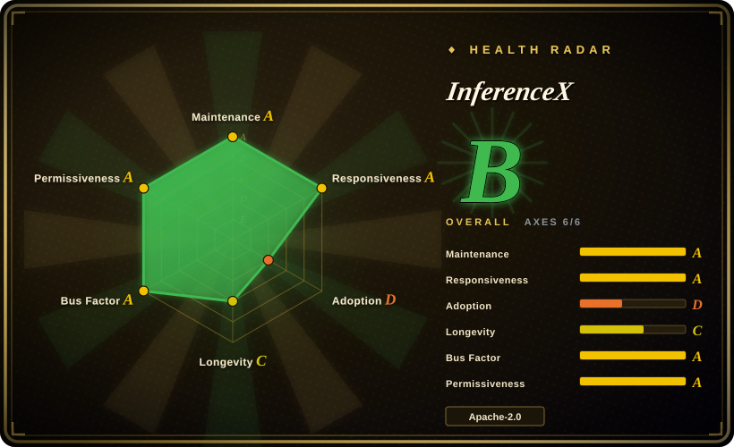
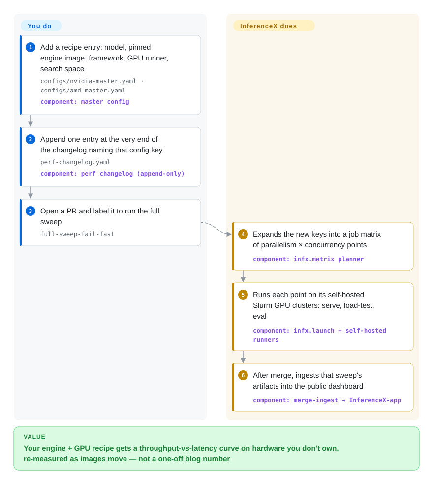

# InferenceX

A vendor's slide says its GPU serves DeepSeek at some tokens-per-second figure; three weeks later the serving engine ships a new image and the number is stale, and you never knew which flags produced it. InferenceX keeps re-running pinned, public serving recipes for frontier models on NVIDIA and AMD hardware every time an engine image moves, and publishes the throughput-vs-latency curves.

## When to use

You are the person who has to say which accelerator and which serving engine to buy capacity on — an inference-platform lead comparing B200 against MI355X for a DeepSeek-V4 or Kimi-class MoE, or a cloud buyer asked "is GB300 worth the premium at 50 tokens/s per user?". The numbers you have are marketing slides with no recipe attached, or a colleague's `vllm bench serve` run on one box at one concurrency. What you actually need is a whole curve — throughput per GPU against interactivity — for the same model on each chip, produced by the recipe each vendor's own engineers consider best, on a recent image.

You reach for InferenceX because that is exactly what its repo holds: every point on its dashboard traces back to a master-config entry (model, image tag, framework, parallelism, concurrency sweep) and a changelog line in this repository, and AMD and NVIDIA engineers submit and CODEOWNER-review their own recipes. Against a one-off client like GuideLLM or AIPerf it wins on *already-run, cross-vendor, multi-node* results you could not afford to produce yourself; against MLPerf Inference it wins on freshness (re-run as images change) and on agentic long-context scenarios, at the cost of being run by one analysis firm rather than an audited consortium process. You also reach for its source when you need a known-good launch recipe for a big MoE on a specific SKU — the flags are in the YAML.

## How it works

InferenceX is less a program you install than a benchmark factory kept in a Git repo. The *catalog* is two YAML files (`nvidia-master.yaml`, `amd-master.yaml`) where each key pins a model, an engine container image, a framework (vLLM, SGLang, TensorRT-LLM, Dynamo, ATOM, llm-d…) and a search space of tensor-parallel sizes and concurrency levels. Nothing runs until someone appends that key to `perf-changelog.yaml` — an append-only ledger that doubles as the trigger and the audit trail. A PR that does so makes CI expand the keys into a job matrix and fan it out to the maintainers' own self-hosted GPU clusters (all Slurm, with containers started through Pyxis/Enroot), where each job starts the server, drives it with a load client, runs accuracy evals as a sanity gate, and uploads JSON results. After merge, those artifacts are shipped to a separate dashboard repo (InferenceX-app) that loads them into PostgreSQL and draws the curves at inferencex.com. So the project does the running, measuring and publishing on hardware you do not own; what you do is write a recipe, and what you get is a curve — or, if you only read, you consume curves other people's recipes produced. The one piece you can run on your own server is the AgentX client: a fork of NVIDIA's AIPerf that replays recorded coding-agent traces (`aiperf profile --scenario inferencex-agentx-mvp`) against any OpenAI-compatible endpoint.

<!-- flow-steps:begin (generated from flows/inferencex.json by tools/flow_card.py — do not edit) -->

Text version of the flow

1. **You**: Add a recipe entry: model, pinned engine image, framework, GPU runner, search space — `configs/nvidia-master.yaml · configs/amd-master.yaml` — component: `master config`
2. **You**: Append one entry at the very end of the changelog naming that config key — `perf-changelog.yaml` — component: `perf changelog (append-only)`
3. **You**: Open a PR and label it to run the full sweep — `full-sweep-fail-fast`
4. **InferenceX**: Expands the new keys into a job matrix of parallelism × concurrency points — component: `infx.matrix planner`
5. **InferenceX**: Runs each point on its self-hosted Slurm GPU clusters: serve, load-test, eval — component: `infx.launch + self-hosted runners`
6. **InferenceX**: After merge, ingests that sweep's artifacts into the public dashboard — component: `merge-ingest → InferenceX-app`

**Value**: Your engine + GPU recipe gets a throughput-vs-latency curve on hardware you don't own, re-measured as images move — not a one-off blog number

<!-- flow-steps:end -->

## When NOT to use

- **You want to benchmark *your* deployment on *your* hardware this afternoon.** The end-to-end pipeline assumes self-hosted GitHub runners in front of Slurm clusters with Pyxis/Enroot (all 13 cluster records in `configs/runners.yaml` are `scheduler: slurm`), NVIDIA's `srt-slurm` recipes and a PMIx-enabled MPI; in issue #941 an outside user could not match the published GB300 numbers with plain TensorRT-LLM; maintainers replied that only the exact Dynamo-TRT + srt-slurm launch path reproduces them, and his Slurm lacked PMIx-enabled MPI. Point a standalone client at your server instead: [vLLM](../serving-engines/vllm.md)'s built-in `vllm bench serve`, GuideLLM, or AIPerf.
- **Small models at very high QPS.** The repo's own `KNOWN_LIMITATION.md` says its single-process `bench_serving` client becomes the bottleneck for 1B–8B models with short sequences at ultra-high QPS, and that there are no plans to benchmark that regime. Use AIPerf or GuideLLM, which are built as standalone load generators.
- **Your model is not a current frontier model.** The published set is curated for a fixed, limited GPU pool: `docs/MODELS.md` records whole scenarios and models being retired (54 config keys in PR #2493; Kimi-K2.5 fully retired after 2026-08-06) to free capacity. For a mid-size or fine-tuned model, generate your own numbers with GuideLLM/AIPerf.
- **You need a neutral, rules-audited result for procurement or a public claim.** InferenceX is run by SemiAnalysis, an industry-analysis company; the README thanks AMD and NVIDIA for donated GPUs, and the vendors' own engineers write and own the recipes for their hardware (they are CODEOWNERS of the master configs). That makes the recipes strong but the process is a single firm's, not a consortium's. When auditability and submission rules matter, cite MLPerf Inference.
- **You read speculative-decoding numbers as what your traffic will see.** On the AgentX agentic benchmark, speculative-decoding runs are pinned to a committed "golden" acceptance-length curve through the engines' synthetic-acceptance switches (per `docs/MODELS.md`), so the speed-up reflects that curve, not your draft model on your prompts. Measure acceptance on your own traffic with a standalone client.
- **You want model quality, not speed.** Its evals only gate that a recipe did not break accuracy. For application or model-quality evaluation use [promptfoo](../../llm-eval/promptfoo.md) or [DeepEval](../../llm-eval/deepeval.md).
- **You plan to fork it and publish your own leaderboard.** Code is Apache-2.0, but the README requires forks to label results "Unofficial" and keep the disclaimer, "InferenceX" is marked as a trademark, and the dashboard lives in a separate GPL-3.0 repo. For your own internal leaderboard, build on AIPerf/GuideLLM output rather than inheriting that branding and GPL front end.

## Comparison

| Alternative | In index | Our verdict | Tradeoff |
|---|---|---|---|
| MLPerf Inference (mlcommons/inference) | not indexed | When you need a submission-rules, peer-reviewed result that a vendor cannot tune in private, cite MLPerf; when you need this month's engine images and agentic long-context curves, read InferenceX. | MLPerf (since 2018, MLCommons consortium) is auditable but publishes in rounds with a fixed model list; InferenceX re-runs continuously but under one firm's process. Not added in this tab batch. |
| AIPerf (ai-dynamo/aiperf) | not indexed | To load-test your own OpenAI-compatible endpoint with your own traffic shape, run AIPerf; use InferenceX when you want already-measured cross-vendor results rather than a tool. | AIPerf (NVIDIA, successor to GenAI-Perf) is a client you run yourself — no hardware fleet, no published numbers. InferenceX's AgentX client is a fork of it, so its agentic scenario is reproducible with AIPerf. Not added in this tab batch. |
| GuideLLM (vllm-project/guidellm) | not indexed | For capacity planning of your own deployment — sweeping rates to find where latency SLOs break — pick GuideLLM; pick InferenceX to compare chips and engines you have not bought yet. | GuideLLM gives you numbers on your hardware and your workload but nothing about hardware you lack; InferenceX is the reverse. Not added in this tab batch. |
| [vLLM](../serving-engines/vllm.md) (`vllm bench serve`) | ✅ | For a quick throughput/latency check of a vLLM server you already run, the built-in bench command is enough; use InferenceX when the question crosses engines or vendors. | Zero setup and exact to your deployment, but vLLM-centric and single-box; says nothing about SGLang/TensorRT-LLM on other chips. |
| LLMPerf (ray-project/llmperf) | not indexed | Archived since 2024-12 — treat it as a pattern source only and choose AIPerf or GuideLLM for a maintained client. | Was the common hosted-API latency harness; no longer receives fixes. Not added in this tab batch. |

## Tech stack

- **Pipeline tooling:** Python ≥3.12 package `infx` (uv-managed; core deps `pydantic` and `pyyaml`, optional `PyGithub`/`GitPython` for workflows and `psycopg2` for results), plus Bash benchmark scripts (`benchmarks/benchmark_lib.sh` and per-framework launchers).
- **Orchestration:** GitHub Actions (`run-sweep.yml`, reusable benchmark templates, `merge-ingest.yml`) on self-hosted runners; Slurm with Pyxis/Enroot containers; git submodules for AIPerf (SemiAnalysis fork) and NVIDIA `srt-slurm`.
- **Engines benchmarked:** vLLM, SGLang, TensorRT-LLM, NVIDIA Dynamo, AMD ATOM, llm-d, TileRT (per master configs and launch drivers).
- **Automation:** "Klaud Cold", a Claude-driven GitHub workflow that autonomously opens PRs to bump engine images and runs their sweeps (`docs/klaud.md`).
- **Side projects in the same repo:** CollectiveX (collective-communication benchmarks) and OperatorX (kernel benchmarks), both labeled experimental beta; a system-level power model.
- **Dashboard (separate repo, InferenceX-app):** Next.js + TypeScript + D3 over Neon PostgreSQL, plus a read-only MCP server; GPL-3.0.

## Dependencies

- **To read results:** a browser (inferencex.com) — nothing to install.
- **To run the AgentX client against your own server:** Git, `uv`, Python 3.11, the pinned `SemiAnalysisAI/agentx-harness` commit, and an OpenAI-compatible endpoint; a one-hour profile per concurrency point plus warmup.
- **To reproduce the full pipeline:** multi-GPU nodes (H100 through GB300 NVL72, MI300X–MI355X), a Slurm cluster with Pyxis/Enroot and PMIx-aware MPI, self-hosted GitHub Actions runners wired to it, Hugging Face model weights staged on shared storage, and — for the dashboard — PostgreSQL.
- **To contribute a recipe:** none of the above; the maintainers' clusters run your PR's sweep, but a core maintainer must approve and select the run (`/use <run_id>`) to publish it.

## Ops difficulty

**None to read, low to run the client, very high to self-host.** Reading the dashboard or copying a recipe costs nothing. The standalone AgentX client is a `uv` install plus long runs (an hour per concurrency point, with a server restart between points). Standing up your own copy of the pipeline means operating a heterogeneous multi-node GPU fleet on Slurm with the right container and MPI integration, keeping submodules pinned, and following byte-sensitive repo rules (the changelog must only ever be appended at its physical end, speculative-decoding recipes must use chat templates, draft models must run at shipped precision). Contribution itself is process-heavy: an AI-model disclosure in every PR, a green full sweep, a CODEOWNER checklist that CI re-verifies with an LLM, and maintainer-issued `/use` at merge.

## Health & viability

- **Maintenance (2026-09-30):** extremely active — about 390 PRs merged in September 2026 alone, ~2.5k commits since the repo was created on 2025-07-12, new frontier models (DeepSeek V4, Kimi K3, Qwen3.5, GLM-5.x) added from launch day. There are no versioned releases; the product is the running pipeline and its data, so "latest" means `main`.
- **Governance / backing:** owned by SemiAnalysis (organization account), with a core team (`functionstackx`, `kimbochen`, `cquil11`, `Oseltamivir`, `adibarra` lead commits) plus AMD and NVIDIA engineers as CODEOWNERS for their vendor configs. The roadmap and what gets published are SemiAnalysis's call; the project depends on donated vendor GPUs and cloud credits (per README), so its coverage depends on those relationships continuing [推断].
- **Age / Lindy:** ~14.5 months old (formerly InferenceMAX; v1 launched 2025-10, v2 2026-02). Young; the high activity is real, but there is no long track record yet, so weigh it as a promising, not a proven-durable, source.
- **Adoption:** 1.8k stars and 310 forks (2026-09-30); the SGLang/LMSYS blog has written about its GB300 results, and vendor engineers actively submit recipes — the strongest adoption signal is that both GPU vendors invest engineering time in it.
- **Risk flags:** Apache-2.0 code with a trademark notice and an "only this repo is official" rule; dashboard under GPL-3.0; single-firm operation of a benchmark that vendors use in marketing is a neutrality question readers must judge themselves.

## Caveats (unverified)

- [未验证] "Trusted by operators … such as OpenAI, Meta, Microsoft, Oracle" is a README claim; the linked supporters/quotes page was not audited.
- [推断] Contribution from a fork runs on the maintainers' self-hosted clusters only after maintainer labeling/approval — read from CONTRIBUTING and the workflow names, not tested with an outside PR.
- [推断] Coverage continuity depends on donated vendor hardware and cloud credits; inferred from the README acknowledgements and the `MODELS.md` note about a "fixed, limited pool of GPUs", not from any stated funding model.
- [未验证] Published numbers were not reproduced; issue #941 shows reproduction is sensitive to the exact launcher stack, so results should be read as "what this recipe gets on this cluster".
- [推断] The neutrality concern is a structural observation (single firm, vendor-authored recipes, vendor-donated hardware), not evidence of any biased result.
- [未验证] "InferenceX" trademark status — the README uses ™; registration was not checked.
