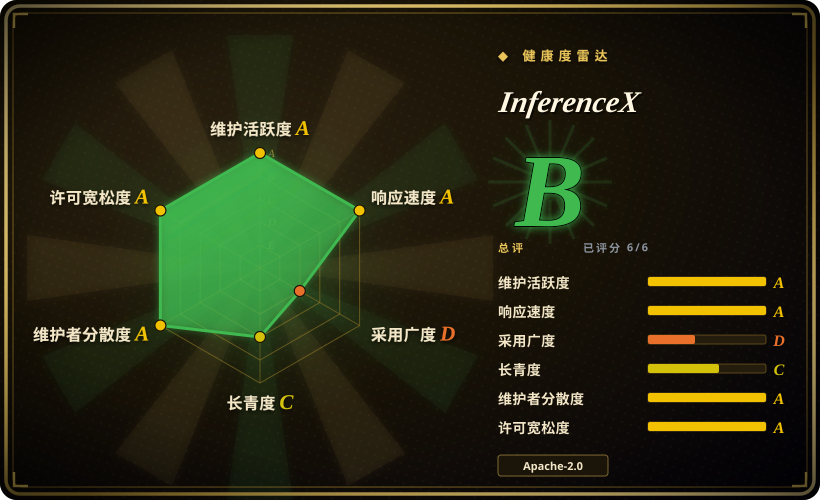
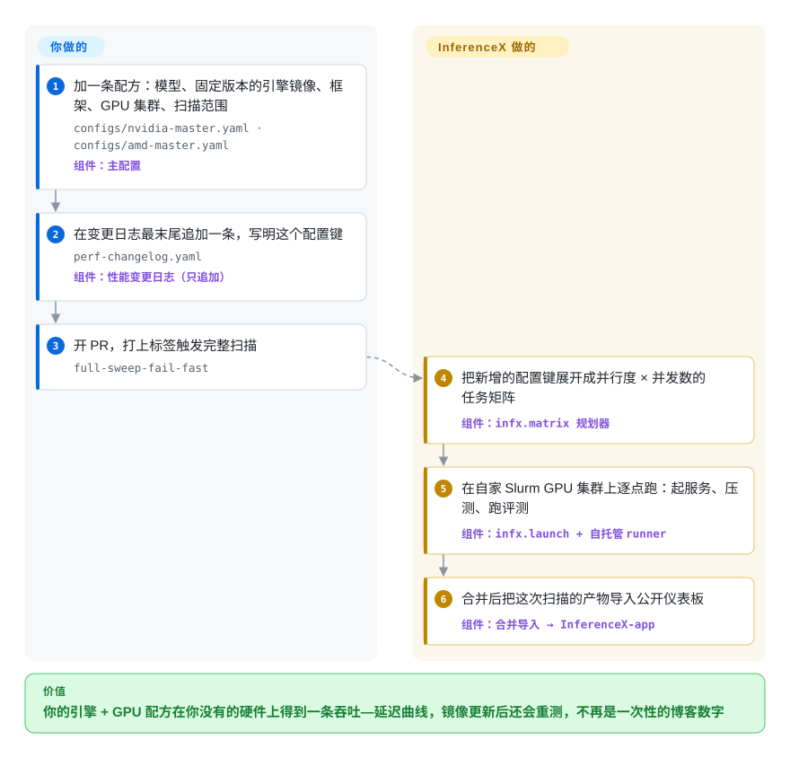

# InferenceX

厂商幻灯片上写着某块 GPU 跑 DeepSeek 能到多少 token/秒，三周后推理引擎发了新镜像，这个数就过时了，而你从来不知道它是用哪些参数跑出来的。InferenceX 把前沿模型在 NVIDIA 和 AMD 硬件上的服务配方公开钉死在仓库里，引擎镜像一更新就重跑，并公布吞吐—延迟曲线。

## 何时使用

你要拍板在哪种加速卡、哪个推理引擎上买算力——比如推理平台负责人要在 B200 和 MI355X 之间给 DeepSeek-V4 或 Kimi 这类 MoE 大模型选型，或者采购被问到“每用户 50 token/秒时，GB300 值不值那个溢价？”。你手里的数字要么是没附配方的厂商幻灯片，要么是同事在一台机器、一个并发下跑的一次 `vllm bench serve`。你真正要的是一整条曲线——每卡吞吐对交互速度——同一个模型在每种芯片上各跑一遍，用的是各家工程师自己认为最好的配方，镜像也是最近的。

这时候想到 InferenceX，因为它的仓库装的正是这个：仪表板上每个点都能追溯到本仓库里的一条主配置（模型、镜像标签、框架、并行度、并发扫描范围）和一行变更日志，AMD 和 NVIDIA 的工程师自己提交配方，并作为 CODEOWNER 审核。和 GuideLLM、AIPerf 这类一次性压测客户端比，它赢在**已经跑好、跨厂商、多节点**的结果——这些你自己付不起；和 MLPerf Inference 比，它赢在新鲜（镜像一变就重跑）和覆盖 agent 长上下文场景，代价是由一家分析公司运营，而不是经过审计的联盟流程。需要某个大 MoE 在某块卡上的可用启动配方时，也可以直接翻它的源码——参数都写在 YAML 里。

## 怎么用起来

InferenceX 与其说是一个要安装的程序，不如说是放在 Git 仓库里的一座基准测试工厂。**目录**是两份 YAML（`nvidia-master.yaml`、`amd-master.yaml`），每个键钉住一个模型、一个引擎容器镜像、一个框架（vLLM、SGLang、TensorRT-LLM、Dynamo、ATOM、llm-d……），以及要扫描的张量并行规模和并发档位。有人把这个键追加进 `perf-changelog.yaml` 之前，什么都不会跑——这本只追加的账本既是触发器，也是审计记录。这样的 PR 会让 CI 把配置键展开成任务矩阵，分发到维护者自家的自托管 GPU 集群（全部是 Slurm，容器经 Pyxis/Enroot 启动）；每个任务起服务、用压测客户端打流量、跑精度评测当作健全性检查，再上传 JSON 结果。合并后，这些产物被送到另一个仪表板仓库（InferenceX-app），导入 PostgreSQL，在 inferencex.com 上画成曲线。所以跑、测、发布都在你没有的硬件上由项目完成；你要做的是写配方，拿到的是曲线——如果只是看，那就是看别人的配方跑出的曲线。唯一能在你自己的服务器上跑的部分是 AgentX 客户端：它是 NVIDIA AIPerf 的分叉，用录制下来的编码 agent 轨迹（`aiperf profile --scenario inferencex-agentx-mvp`）回放打向任何 OpenAI 兼容端点。

<!-- flow-steps:begin (generated from flows/inferencex.json by tools/flow_card.py — do not edit) -->

流程文字版

1. **你**：加一条配方：模型、固定版本的引擎镜像、框架、GPU 集群、扫描范围 — `configs/nvidia-master.yaml · configs/amd-master.yaml` — 组件：`主配置`
2. **你**：在变更日志最末尾追加一条，写明这个配置键 — `perf-changelog.yaml` — 组件：`性能变更日志（只追加）`
3. **你**：开 PR，打上标签触发完整扫描 — `full-sweep-fail-fast`
4. **InferenceX**：把新增的配置键展开成并行度 × 并发数的任务矩阵 — 组件：`infx.matrix 规划器`
5. **InferenceX**：在自家 Slurm GPU 集群上逐点跑：起服务、压测、跑评测 — 组件：`infx.launch + 自托管 runner`
6. **InferenceX**：合并后把这次扫描的产物导入公开仪表板 — 组件：`合并导入 → InferenceX-app`

**价值**：你的引擎 + GPU 配方在你没有的硬件上得到一条吞吐—延迟曲线，镜像更新后还会重测，不再是一次性的博客数字

<!-- flow-steps:end -->

## 何时不用

- **你今天下午就想测*你自己*硬件上的*你自己*的部署。** 端到端流水线默认有接在 Slurm 集群前面的自托管 GitHub runner，集群装好 Pyxis/Enroot（`configs/runners.yaml` 里 13 条集群记录全是 `scheduler: slurm`），还要 NVIDIA 的 `srt-slurm` 配方和支持 PMIx 的 MPI；issue #941 里一位外部用户用纯 TensorRT-LLM 跑不出公布的 GB300 数字，维护者回复只有完全相同的 Dynamo-TRT + srt-slurm 启动路径才能复现，而他的 Slurm 缺少支持 PMIx 的 MPI。改用独立客户端打你的服务：[vLLM](../serving-engines/vllm.zh.md) 自带的 `vllm bench serve`、GuideLLM 或 AIPerf。
- **小模型、超高 QPS。** 仓库自己的 `KNOWN_LIMITATION.md` 写明：1B–8B 模型、短序列、超高 QPS 时，它的单进程 `bench_serving` 客户端会先成为瓶颈，而且没打算测这个区间。用 AIPerf 或 GuideLLM，它们本来就是独立的压测工具。
- **你的模型不是当下的前沿模型。** 公布的模型集合为一个固定、有限的 GPU 池精挑细选：`docs/MODELS.md` 记录了整批场景和模型被下线（PR #2493 一次删掉 54 个配置键；Kimi-K2.5 在 2026-08-06 之后完全下线）以腾出算力。中等规模或微调过的模型，自己用 GuideLLM/AIPerf 出数。
- **你需要中立、按规则审计过的结果，用于采购或对外宣称。** InferenceX 由行业分析公司 SemiAnalysis 运营；README 感谢 AMD 和 NVIDIA 捐赠 GPU，各家硬件的配方由厂商自己的工程师编写并拥有（他们是主配置的 CODEOWNER）。这让配方很强，但流程属于一家公司，不是一个联盟。可审计性和提交规则重要时，引用 MLPerf Inference。
- **你把投机解码的数字当成自己流量上的效果。** 在 AgentX agent 基准上，投机解码的运行通过各引擎的“合成接受率”开关被钉在一条提交进仓库的“黄金”接受长度曲线上（见 `docs/MODELS.md`），所以加速比反映的是那条曲线，而不是你的草稿模型在你的提示词上的表现。接受率要用独立客户端在自己的流量上测。
- **你要的是模型质量，不是速度。** 它的评测只用来确认配方没有把精度搞坏。应用或模型质量评测用 [promptfoo](../../llm-eval/promptfoo.zh.md) 或 [DeepEval](../../llm-eval/deepeval.zh.md)。
- **你打算分叉它、发布自己的排行榜。** 代码是 Apache-2.0，但 README 要求分叉把结果标成“Unofficial”并保留免责声明，“InferenceX”带商标标记，仪表板在另一个 GPL-3.0 仓库里。做内部排行榜，基于 AIPerf/GuideLLM 的输出自己搭，别继承那套品牌约束和 GPL 前端。

## 横向对比

| 替代品 | 是否收录 | 我们的评价 | 取舍 |
|---|---|---|---|
| MLPerf Inference（mlcommons/inference） | 未收录 | 需要有提交规则、经同行审查、厂商没法私下调参的结果时，引用 MLPerf；需要本月引擎镜像和 agent 长上下文曲线时，看 InferenceX。 | MLPerf（2018 年起，MLCommons 联盟）可审计，但按轮次发布、模型列表固定；InferenceX 持续重跑，但走的是一家公司的流程。本批次标签收录未添加。 |
| AIPerf（ai-dynamo/aiperf） | 未收录 | 要用自己的流量形态压测自己的 OpenAI 兼容端点，跑 AIPerf；想要现成的跨厂商测量结果而不是一个工具时，用 InferenceX。 | AIPerf（NVIDIA 出品，GenAI-Perf 的继任者）是你自己跑的客户端——没有硬件集群，也没有公布的数字。InferenceX 的 AgentX 客户端就是它的分叉，所以其 agent 场景能用 AIPerf 复现。本批次标签收录未添加。 |
| GuideLLM（vllm-project/guidellm） | 未收录 | 给自己的部署做容量规划——扫请求速率找延迟 SLO 在哪里崩——选 GuideLLM；比较你还没买的芯片和引擎，选 InferenceX。 | GuideLLM 给你自己硬件、自己负载上的数字，但对你没有的硬件一无所知；InferenceX 正好相反。本批次标签收录未添加。 |
| [vLLM](../serving-engines/vllm.zh.md)（`vllm bench serve`） | ✅ | 对已在跑的 vLLM 服务做一次快速吞吐/延迟检查，自带的 bench 命令就够；问题跨引擎或跨厂商时，用 InferenceX。 | 零配置、完全贴合你的部署，但以 vLLM 为中心、单机；对其他芯片上的 SGLang/TensorRT-LLM 说不出什么。 |
| LLMPerf（ray-project/llmperf） | 未收录 | 2024-12 起已归档——只当设计参考，要维护中的客户端选 AIPerf 或 GuideLLM。 | 曾是常用的托管 API 延迟测试工具，现在不再有修复。本批次标签收录未添加。 |

## 技术栈

- **流水线工具：** Python ≥3.12 的 `infx` 包（uv 管理；核心依赖 `pydantic` 和 `pyyaml`，工作流可选 `PyGithub`/`GitPython`，结果处理可选 `psycopg2`），外加 Bash 基准脚本（`benchmarks/benchmark_lib.sh` 与各框架的启动脚本）。
- **编排：** GitHub Actions（`run-sweep.yml`、可复用的 benchmark 模板、`merge-ingest.yml`）跑在自托管 runner 上；Slurm 配 Pyxis/Enroot 容器；git 子模块引入 AIPerf（SemiAnalysis 分叉）和 NVIDIA `srt-slurm`。
- **被测引擎：** vLLM、SGLang、TensorRT-LLM、NVIDIA Dynamo、AMD ATOM、llm-d、TileRT（据主配置与启动驱动）。
- **自动化：** “Klaud Cold”，一个由 Claude 驱动的 GitHub 工作流，自主开 PR 升级引擎镜像并跑扫描（`docs/klaud.md`）。
- **同仓库的旁支项目：** CollectiveX（集合通信基准）和 OperatorX（算子/内核基准），都标为实验性 beta；另有系统级功耗模型。
- **仪表板（另一仓库 InferenceX-app）：** Next.js + TypeScript + D3，数据在 Neon PostgreSQL，附一个只读 MCP 服务器；GPL-3.0。

## 依赖

- **只看结果：** 一个浏览器（inferencex.com），什么都不用装。
- **用 AgentX 客户端测自己的服务：** Git、`uv`、Python 3.11、固定提交的 `SemiAnalysisAI/agentx-harness`，以及一个 OpenAI 兼容端点；每个并发点跑一小时，外加预热。
- **完整复现流水线：** 多 GPU 节点（H100 到 GB300 NVL72，MI300X 到 MI355X）、装了 Pyxis/Enroot 和支持 PMIx 的 MPI 的 Slurm 集群、接到集群上的自托管 GitHub Actions runner、预先放到共享存储的 Hugging Face 模型权重；仪表板还要 PostgreSQL。
- **贡献配方：** 以上都不需要；维护者的集群会跑你 PR 的扫描，但要由核心维护者批准并选定那次运行（`/use <run_id>`）才会发布。

## 运维难度

**看结果为零，跑客户端低，自己搭整套非常高。** 看仪表板、抄配方不花成本。独立的 AgentX 客户端是一次 `uv` 安装加长时间运行（每个并发点一小时，点与点之间要重启服务）。自己搭一套流水线，意味着要在 Slurm 上运维异构多节点 GPU 集群，容器和 MPI 集成都要对，子模块要钉版本，还要遵守对字节敏感的仓库规则（变更日志只能在物理末尾追加、投机解码配方必须用 chat template、草稿模型必须按发布时的精度运行）。贡献流程本身也很重：每个 PR 要披露所用 AI 模型、要有一次全绿的完整扫描、要有 CODEOWNER 检查单并由 CI 用 LLM 复核，合并时还要维护者发 `/use`。

## 健康度与可持续性

- **维护（2026-09-30）：** 极其活跃——仅 2026 年 9 月就合并约 390 个 PR，自 2025-07-12 建仓以来约 2.5k 次提交，DeepSeek V4、Kimi K3、Qwen3.5、GLM-5.x 等前沿模型都是发布当天就加入。没有版本化发布；产品就是运行中的流水线和它的数据，“最新”就是 `main`。
- **治理与背书：** 归 SemiAnalysis（组织账号）所有，核心团队（`functionstackx`、`kimbochen`、`cquil11`、`Oseltamivir`、`adibarra` 提交最多），AMD 和 NVIDIA 工程师是各自厂商配置的 CODEOWNER。路线图和发布什么由 SemiAnalysis 决定；项目依赖厂商捐赠的 GPU 和云算力（据 README），所以覆盖面取决于这些关系能否持续 [推断]。
- **年龄与 Lindy：** 约 14.5 个月（前身 InferenceMAX；v1 于 2025-10 发布，v2 于 2026-02）。还年轻；活跃度是真实的，但还没有长期记录，应当视为有前景、尚未证明能长期存续的来源。
- **采用：** 1.8k star、310 fork（2026-09-30）；SGLang/LMSYS 博客专门写过它的 GB300 结果，厂商工程师在积极提交配方——最强的采用信号是两家 GPU 厂商都在上面投入工程时间。
- **风险信号：** 代码是 Apache-2.0，但带商标声明和“只有本仓库是官方”的规则；仪表板是 GPL-3.0；一家公司运营一个被厂商用于营销的基准，中立性要读者自己判断。

## 存疑（未验证）

- [未验证] “受 OpenAI、Meta、Microsoft、Oracle 等运营方信任”是 README 的说法；所链接的支持者/引言页面未核查。
- [推断] 从分叉提交的贡献，要经维护者打标签/批准后才会在维护者的自托管集群上跑——依据 CONTRIBUTING 与工作流名称判断，没有用外部 PR 实测。
- [推断] 覆盖面的延续依赖厂商捐赠的硬件和云算力；依据 README 致谢和 `MODELS.md` 中“固定、有限的 GPU 池”的说法推断，并非来自任何公开的资金模式。
- [未验证] 公布的数字没有复现；issue #941 显示复现对启动栈的细节很敏感，所以结果应理解为“这份配方在这个集群上跑出的数”。
- [推断] 中立性顾虑是结构性观察（一家公司、厂商编写配方、厂商捐赠硬件），不是任何结果有偏的证据。
- [未验证] “InferenceX”的商标状态——README 使用了 ™，未查注册情况。
