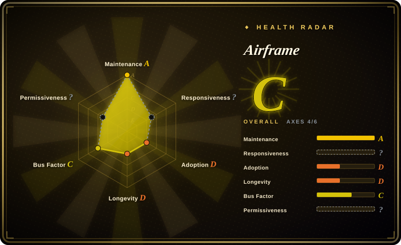
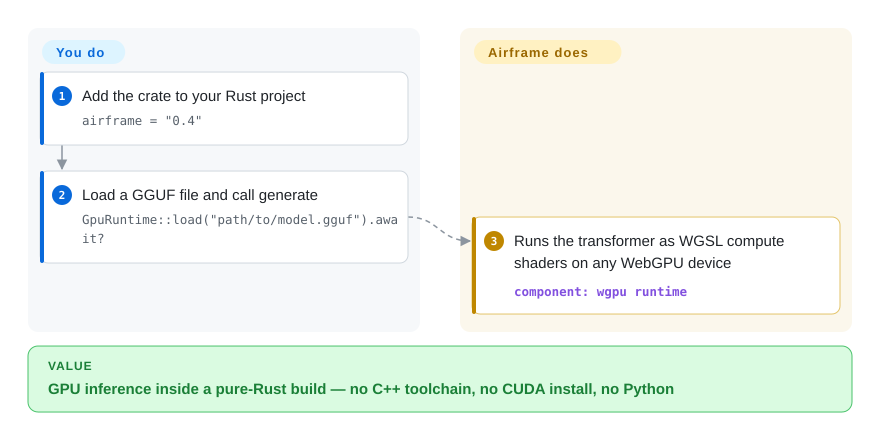

# Airframe

You want to run a GGUF model from inside a Rust program on the GPU, and the mature answers all drag in a C++ toolchain — llama.cpp bindings mean cmake, native linking, and painful cross-compiles. Airframe is a pure-Rust inference engine that runs the model as WebGPU compute shaders, so `cargo build` alone covers NVIDIA, AMD, Intel, and Apple Silicon.

## When to use

You are building a Rust application that needs embedded local inference — a desktop tool, a CLI, a service — and your hard constraint is the build: no C++ toolchain on CI, cross-compilation to several targets, or distribution through `cargo publish`. You add one crate, hand it a GGUF path, and get generation on whatever GPU the machine happens to have, without per-vendor backend flags.

Pick Airframe over [llama.cpp](llama-cpp.md) bindings when build simplicity and cross-platform GPU coverage decide — its own comparison is "cargo build vs C++ compiler required", and for a Rust-only shop that is a real, daily cost. Pick llama.cpp when model-architecture breadth decides, because Airframe certifies only 12 architecture families (Llama, Mistral, Phi, Qwen2/3/3.5, Gemma2/4, StarCoder2) and anything outside them has no correctness guarantee. It is also the engine inside [Shimmy](shimmy.md), so if what you actually want is an OpenAI-compatible server rather than an embedded library, you want the server, not this crate.

## How it works

Airframe reads the GGUF file's metadata to derive the model's structure — layer count, normalization style, head dimensions — instead of hardcoding per-model constants, then executes the transformer's arithmetic (attention, feed-forward) as WGSL shaders. WGSL is WebGPU's shader language: you write the math once in a form every vendor's GPU driver can run, which is how one codebase covers NVIDIA, AMD, Intel, and Apple Silicon without CUDA or Metal specifics. The WebGPU implementation is the `wgpu` crate, the same one Firefox uses. What Airframe does not do is everything above the arithmetic: chat templating, serving, concurrency, and model management are your application's problem — this is an engine, not a server.

<!-- flow-steps:begin (generated from flows/airframe.json by tools/flow_card.py — do not edit) -->

Text version of the flow

1. **You**: Add the crate to your Rust project — `airframe = "0.4"`
2. **You**: Load a GGUF file and call generate — `GpuRuntime::load("path/to/model.gguf").await?`
3. **Airframe**: Runs the transformer as WGSL compute shaders on any WebGPU device — component: `wgpu runtime`

**Value**: GPU inference inside a pure-Rust build — no C++ toolchain, no CUDA install, no Python

<!-- flow-steps:end -->

## When NOT to use

- **If you need architectures beyond the 12 certified families, or day-zero support for new models, use [llama.cpp](llama-cpp.md) instead**, because Airframe's metadata-driven loader still requires per-family certification, and new architectures land in llama.cpp months earlier.
- **If you need a server, an API, or model management, use [Shimmy](shimmy.md) or [Ollama](ollama.md) instead**, because Airframe is a library with no HTTP surface of its own.
- **If a clean legal audit matters, use [llama.cpp](llama-cpp.md) instead**, because the Airframe repo ships no LICENSE file at all — MIT is declared only in `Cargo.toml` metadata (verified 2026-09-23) — and its FSE subsystem (`crates/libfse`) carries a pending US patent per the README.
- **If the engine must be production-proven, use [llama.cpp](llama-cpp.md) instead**, because Airframe is a v0.4, single-contributor crate with 21 stars and ~2.9k total downloads (checked 2026-09-23) — there is no operational track record to lean on.
- **If you need training or fine-tuning, use a training framework such as [Unsloth](../../llm-training/unsloth.md) instead**, because Airframe is inference-only.

## Comparison

| Alternative | In index | Our verdict | Tradeoff |
|---|---|---|---|
| [llama.cpp](llama-cpp.md) | ✅ | Pick Airframe when a pure-Rust build and one-shader-language GPU coverage decide; pick llama.cpp when architecture breadth, quantization variety, and a decade of battle-testing decide. | Airframe trades model coverage and proven correctness for a build that is just `cargo build`; llama.cpp trades a C++ toolchain and per-vendor backends for the widest support matrix in the field. |
| [Shimmy](shimmy.md) | ✅ | Pick Airframe when you are embedding inference in your own Rust program; pick Shimmy when what you want is a ready OpenAI-compatible server in front of a GGUF file. | Airframe is the engine and leaves serving to you; Shimmy wraps this same engine in an HTTP server and inherits both its certified-model list and its risks. |
| candle | 未收录 | Pick Airframe when you specifically want WebGPU coverage and GGUF-native loading; evaluate candle when you want a broader Rust ML framework from a larger org (Hugging Face). | candle is a real repository deferred from this batch, not rejected; it is a general tensor framework where you assemble the model yourself, versus Airframe's GGUF-in/tokens-out engine. |
| mistral.rs | 未收录 | Pick Airframe when minimal dependencies decide; evaluate mistral.rs when you want a more feature-complete Rust serving stack (its own server, LoRA, more architectures). | mistral.rs is a real repository deferred from this batch, not rejected; it offers more serving surface at the cost of a heavier, faster-moving codebase. |

## Tech stack

- **Language:** Rust (workspace with the main crate plus `crates/libfse` and `crates/airframe_observe`).
- **GPU path:** WebGPU via the `wgpu` crate; model math compiled to WGSL compute shaders; no CUDA, ROCm, or Metal-specific code.
- **Model format:** GGUF, with quantization kernels for the common K-quants (Q4_K_M is the certified default across its model list); architecture spec derived from GGUF metadata.
- **Notable extras:** TurboShimmy opt-in INT4 KV cache (`TURBO_KV=int4`), and the FSE (Fused Semantic Execution) subsystem in `crates/libfse` — the component covered by a pending US patent.

## Dependencies

- **Build:** Rust stable toolchain only — no C++ compiler, no cmake, no Python.
- **Runtime:** a WebGPU-capable GPU with its vendor driver (NVIDIA, AMD, Intel, integrated, Apple Silicon); CPU paths exist but the project's center of gravity is GPU.
- **Models:** local GGUF files you supply; the crate does not download or manage models.

## Ops difficulty

**As a dependency: low; as a responsibility: medium.** Adding it is `cargo add airframe` with no native libraries to shepherd through CI, which is the entire point. The burden appears at integration time: you own tokenization, chat templating, concurrency, streaming, and every error surface above the engine, and you must stay inside the certified architecture list because there is no fallback engine underneath. Upgrades are ordinary semver bumps, but at v0.4.x expect breaking changes between minors.

## Health & viability

- **Maintenance:** created 2026-03-06; v0.4.0 through v0.4.3 shipped within one week of late August 2026, last push 2026-08-30 — a burst of activity then about three weeks of quiet at verification time (2026-09-23).
- **Governance / bus factor:** single maintainer, GitHub User-owned, exactly one contributor; it is the engine spun out of Shimmy v2 and shares that author's sponsorship model.
- **Backing & Lindy:** about six months old — very young for an inference engine. A 21-star engine underneath a ~5.9k-star server (Shimmy) is an unusual adoption inversion. [推断] The stars track the server's Hacker News exposure rather than independent engine adoption, so the engine's real user base is likely thinner than the server's visibility suggests.
- **Adoption & ecosystem:** crates.io's `airframe` crate shows downloads_last_month=2799 against a ~2.9k lifetime total (checked 2026-09-23) — nearly all usage is recent. [推断] The recency is consistent with downloads driven by Shimmy's late-August v2.6 releases rather than direct crate adoption.
- **Risk flags:** no LICENSE file in the repository (MIT declared only in `Cargo.toml`); a pending US patent on the FSE subsystem whose claim scope is not assessable from the repo; roadmap items like MoE CPU offloading are unproven.
- **Verdict:** a technically interesting bet on WebGPU for Rust-native inference — adopt only behind your own abstraction layer so you can swap to llama.cpp, and resolve the missing LICENSE file before commercial use.

## Caveats (unverified)

- [未验证] The determinism claim ("same model + seed + params → same output") and F32-accumulation precision come from the README and were not reproduced.
- [未验证] Certified-architecture correctness was not tested; the certification ledger lives in Shimmy's documentation and was not audited.
- [推断] The pending patent's scope — which code paths in `crates/libfse` and what claims — cannot be assessed from the repository; only the README notice exists.
- [未验证] MoE CPU offloading is stated as roadmap work, not shipped.
- [未验证] The README's comparison table against llama.cpp bindings (build simplicity, determinism) was not benchmarked here.
