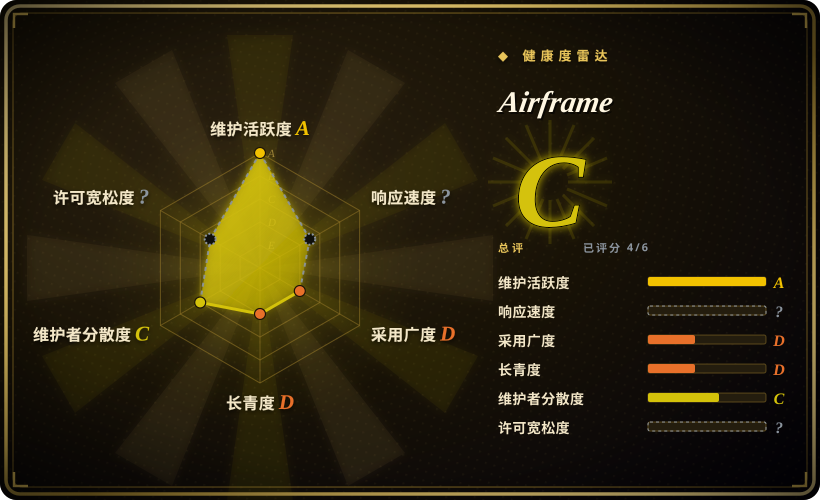
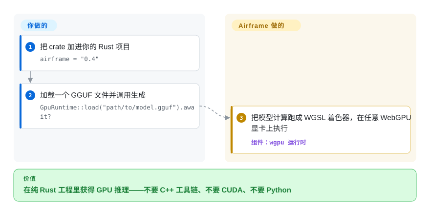

# Airframe

你想在 Rust 程序里把 GGUF 模型跑在显卡上，而成熟的答案都要拖进一套 C++ 工具链——llama.cpp 绑定意味着 cmake、原生链接和痛苦的交叉编译。Airframe 是纯 Rust 推理引擎，把模型跑成 WebGPU 计算着色器，一次 `cargo build` 就覆盖 NVIDIA、AMD、Intel 和 Apple Silicon。

## 何时使用

你在写一个需要内嵌本地推理的 Rust 应用——桌面工具、CLI、服务——而硬约束在构建上：CI 里没有 C++ 工具链、要交叉编译到多个目标、或者要通过 `cargo publish` 分发。你加一个 crate，给它一个 GGUF 路径，就能在机器上那块显卡跑起来，不用管厂商相关的后端开关。

和 [llama.cpp](llama-cpp.zh.md) 绑定之间选 Airframe 的场景，是决定因素是构建简单性和跨平台显卡覆盖——它自己的对比就是「`cargo build` 对 需要 C++ 编译器」，对纯 Rust 团队这是每天的真实成本。模型架构广度成为决定因素时选 llama.cpp，因为 Airframe 只认证了 12 个架构家族（Llama、Mistral、Phi、Qwen2／3／3.5、Gemma2／4、StarCoder2），名单之外没有正确性保证。它也是 [Shimmy](shimmy.zh.md) 内部的引擎——如果你要的其实是 OpenAI 兼容服务器而不是内嵌库，那要的是那个服务器，不是这个 crate。

## 怎么用起来

Airframe 读取 GGUF 文件的元数据来推导模型结构——层数、归一化方式、注意力头维度——而不是为每个模型硬编码常量，然后把 transformer 的算术（注意力、前馈网络）编译成 WGSL 着色器执行。WGSL 是 WebGPU 的着色器语言：算术写一次、每家显卡厂商的驱动都能跑，这就是一份代码覆盖 NVIDIA、AMD、Intel、Apple Silicon 而不碰 CUDA 或 Metal 细节的原理。WebGPU 实现用的是 `wgpu` crate，和 Firefox 同一个。Airframe 不做的是算术之上的所有事：对话模板、服务化、并发、模型管理都是你的应用要解决的问题——它是引擎，不是服务器。

<!-- flow-steps:begin (generated from flows/airframe.json by tools/flow_card.py — do not edit) -->

流程文字版

1. **你**：把 crate 加进你的 Rust 项目 — `airframe = "0.4"`
2. **你**：加载一个 GGUF 文件并调用生成 — `GpuRuntime::load("path/to/model.gguf").await?`
3. **Airframe**：把模型计算跑成 WGSL 着色器，在任意 WebGPU 显卡上执行 — 组件：`wgpu 运行时`

**价值**：在纯 Rust 工程里获得 GPU 推理——不要 C++ 工具链、不要 CUDA、不要 Python

<!-- flow-steps:end -->

## 何时不用

- **如果需要 12 个认证家族之外的架构、或新模型的首日支持，改用 [llama.cpp](llama-cpp.zh.md)**，因为 Airframe 的元数据驱动加载仍要求逐家族认证，而新架构在 llama.cpp 里要早几个月落地。
- **如果需要服务器、API 或模型管理，改用 [Shimmy](shimmy.zh.md) 或 [Ollama](ollama.zh.md)**，因为 Airframe 是库，自己没有 HTTP 面。
- **如果干净的法务审计很重要，改用 [llama.cpp](llama-cpp.zh.md)**，因为 Airframe 仓库里根本没有 LICENSE 文件——MIT 只声明在 `Cargo.toml` 元数据里（2026-09-23 核实）——而且它的 FSE 子系统（`crates/libfse`）按其 README 挂着一项 pending 美国专利。
- **如果引擎必须经过生产验证，改用 [llama.cpp](llama-cpp.zh.md)**，因为 Airframe 是 v0.4、单贡献者的 crate，只有 21 个 star、约 2.9 千总下载（2026-09-23 查）——没有任何运维记录可以依靠。
- **如果需要训练或微调，改用训练框架（比如 [Unsloth](../../llm-training/unsloth.zh.md)）**，因为 Airframe 只做推理。

## 横向对比

| 替代品 | 是否收录 | 我们的评价 | 取舍 |
|---|---|---|---|
| [llama.cpp](llama-cpp.zh.md) | ✅ | 纯 Rust 构建和一种着色器语言覆盖全部显卡成为决定因素时选 Airframe；架构广度、量化种类和十年实战验证成为决定因素时选 llama.cpp。 | Airframe 用模型覆盖面和已验证的正确性换来「就是 `cargo build`」的构建；llama.cpp 用 C++ 工具链和分厂商后端换来全领域最广的支持矩阵。 |
| [Shimmy](shimmy.zh.md) | ✅ | 要把推理嵌进自己的 Rust 程序时选 Airframe；想要的是 GGUF 文件前面架一个现成的 OpenAI 兼容服务器时选 Shimmy。 | Airframe 是引擎，服务化归你管；Shimmy 把同一个引擎包进 HTTP 服务器，同时继承它的认证模型名单和风险。 |
| candle | 未收录 | 明确要 WebGPU 覆盖和 GGUF 原生加载时选 Airframe；想要更大组织（Hugging Face）背书的通用 Rust 机器学习框架时评估 candle。 | candle 是真实仓库，本批次暂缓收录而非否决；它是要自己拼装模型的通用张量框架，Airframe 是 GGUF 进、token 出的现成引擎。 |
| mistral.rs | 未收录 | 依赖极简成为决定因素时选 Airframe；想要功能更全的 Rust 服务栈（自带服务器、LoRA、更多架构）时评估 mistral.rs。 | mistral.rs 是真实仓库，本批次暂缓收录而非否决；它服务面更全，代价是更重、变动更快的代码库。 |

## 技术栈

- **语言：** Rust（workspace 结构：主 crate 加 `crates/libfse`、`crates/airframe_observe`）。
- **GPU 路径：** 经 `wgpu` crate 走 WebGPU；模型算术编译成 WGSL 计算着色器；没有 CUDA、ROCm 或 Metal 特定代码。
- **模型格式：** GGUF，常见 K 系量化内核（认证名单默认 Q4_K_M）；架构规格从 GGUF 元数据推导。
- **值得注意的附加件：** TurboShimmy 可选 INT4 KV 缓存（`TURBO_KV=int4`），以及 FSE（Fused Semantic Execution）子系统 `crates/libfse`——就是挂着 pending 美国专利的那个组件。

## 依赖

- **构建：** 只要 Rust stable 工具链——不要 C++ 编译器、不要 cmake、不要 Python。
- **运行时：** 一块支持 WebGPU 的显卡加厂商驱动（NVIDIA、AMD、Intel、核显、Apple Silicon）；存在 CPU 路径但项目重心在 GPU。
- **模型：** 你自己提供的本地 GGUF 文件；这个 crate 不下载也不管理模型。

## 运维难度

**作为依赖很轻，作为责任不轻。** 引入它就是 `cargo add airframe`，CI 里没有原生库要伺候，这正是它的全部意义。负担出现在集成时：分词、对话模板、并发、流式输出和引擎之上的每个错误面都归你管，而且必须待在认证架构名单内，因为底下没有备用引擎。升级是普通 semver 升级，但 v0.4.x 阶段要预期 minor 版本之间会有破坏性变更。

## 健康度与可持续性

- **维护：** 创建于 2026-03-06；v0.4.0 到 v0.4.3 在 2026 年 8 月下旬一周内发完，最后 push 是 2026-08-30——一阵密集活动后在核实时（2026-09-23）已约三周安静。
- **治理／巴士因子：** 单人维护者，GitHub User 持有，恰好 1 个贡献者；它是 Shimmy v2 拆分出来的引擎，共享同一作者的赞助模式。
- **背景与 Lindy：** 约六个月大，对推理引擎来说非常年轻。一个 21 star 的引擎托着一个约 5.9k star 的服务器（Shimmy）是反常的采用倒挂。[推断] star 跟着服务器的 Hacker News 曝光走，不代表引擎有独立采用，引擎的真实用户面可能比服务器的能见度显示的更薄。
- **采用与生态：** crates.io 上 `airframe` crate 的 downloads_last_month=2799，而累计总下载约 2.9 千（2026-09-23 查）——几乎全部用量都是最近发生的。[推断] 这种近期集中度与「下载由 Shimmy 的 8 月下旬 v2.6 发布带动、而非直接采用」的推测一致。
- **风险信号：** 仓库里没有 LICENSE 文件（MIT 只写在 `Cargo.toml`）；FSE 子系统有 pending 美国专利，且专利权利要求范围无法从仓库判断；MoE CPU offload 等 roadmap 条目未兑现。
- **结论：** WebGPU 加纯 Rust 推理是个技术上有意思的赌注——真要采用就藏在自己的抽象层后面以便随时换回 llama.cpp，商用之前先解决 LICENSE 文件缺失问题。

## 存疑（未验证）

- [未验证] 确定性声明（「同模型＋同种子＋同参数得同输出」）和 F32 累加精度来自 README，本次没有复现。
- [未验证] 认证架构的正确性没有实测；认证账本在 Shimmy 的文档里，没有审过。
- [推断] pending 专利的范围——`crates/libfse` 里哪些代码路径、什么权利要求——无法从仓库判断，只有 README 的一则声明。
- [未验证] MoE CPU offload 是 roadmap 声明，不是已交付功能。
- [未验证] README 里与 llama.cpp 绑定的对比表（构建简单性、确定性）没有跑过基准。
