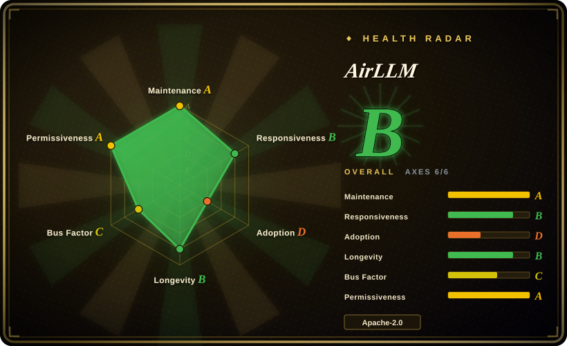
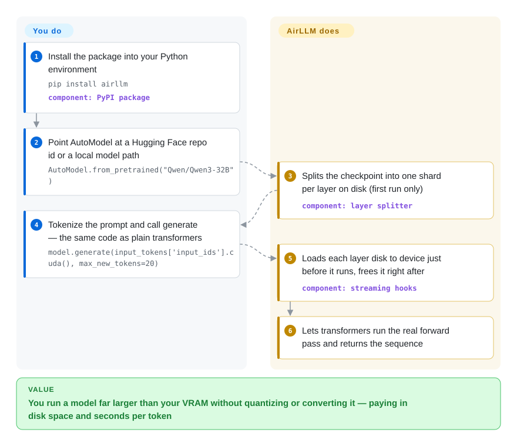

# AirLLM

Layer-streaming inference library: it splits a checkpoint into one shard per layer on disk and keeps a single layer on the device at a time, so VRAM is bounded by the largest layer rather than by the model — paid for in disk space and seconds per token.

## When to use

You have one consumer or workstation GPU — 4GB, 8GB, 12GB — and a model that does not fit on it in the form you need: a 70B in full precision, a 671B MoE, or a checkpoint whose exact weights matter because you are scoring or ranking with it rather than chatting. Every other runtime you tried asks you to make the model fit *somewhere* first: [llama.cpp](llama-cpp.md) and [Ollama](ollama.md) want it resident across VRAM plus system RAM in a quantized GGUF format, and [vLLM](../serving-engines/vllm.md) wants it on the card. AirLLM is the one that instead reads the model off disk one layer at a time, so the number that matters is your largest layer, not your model.

You reach for it as a **library inside a Python pipeline**, not as a server: `pip install airllm`, one `AutoModel.from_pretrained(...)`, then `model.generate(...)` exactly as with a plain transformers model. Choose it over llama.cpp/Ollama when the deciding constraint is "the weights stay as they are — no GGUF conversion, no quantization of the parts I care about" and wall-clock time is genuinely free (an overnight batch, a scoring pass, a capability check). Choose it over vLLM when there is one box and one user. If throughput appears anywhere in your requirements, this is the wrong tool — see below.

## How it works

AirLLM does not shrink the model; it stops keeping it in memory. On the first run it splits the checkpoint into one file per layer under a `splitted_model` directory beside your Hugging Face cache, then instantiates the real transformers model on PyTorch's `meta` device — every parameter object exists, and none of them holds data, so the model costs no memory to "load". It then attaches a forward hook to each large module (the embedding, every decoder layer, the final norm, `lm_head`): immediately before that module runs, the hook reads its weights from disk onto the device; immediately after, it frees them again, prefetching the next layer on a background thread so the read overlaps the current layer's compute. transformers itself owns the forward pass and the generation loop, which is why architectures work as soon as transformers supports them. Your side of the deal is install plus one `from_pretrained` call plus a normal `generate`; its side is the splitting, the per-layer load/evict/pipeline, and the disk-space bookkeeping.

<!-- flow-steps:begin (generated from flows/airllm.json by tools/flow_card.py — do not edit) -->

Text version of the flow

1. **You**: Install the package into your Python environment — `pip install airllm` — component: `PyPI package`
2. **You**: Point AutoModel at a Hugging Face repo id or a local model path — `AutoModel.from_pretrained("Qwen/Qwen3-32B")`
3. **AirLLM**: Splits the checkpoint into one shard per layer on disk (first run only) — component: `layer splitter`
4. **You**: Tokenize the prompt and call generate — the same code as plain transformers — `model.generate(input_tokens['input_ids'].cuda(), max_new_tokens=20)`
5. **AirLLM**: Loads each layer disk to device just before it runs, frees it right after — component: `streaming hooks`
6. **AirLLM**: Lets transformers run the real forward pass and returns the sequence

**Value**: You run a model far larger than your VRAM without quantizing or converting it — paying in disk space and seconds per token

<!-- flow-steps:end -->

## When NOT to use

- **If a human is waiting for the output, use [llama.cpp](llama-cpp.md) or [Ollama](ollama.md) with a GGUF quant instead.** Issue #364 (open since 2026-09-10) measures 28.6 s/token generating 4 tokens from a **3B** model on an RTX 5060 Ti with a local NVMe — a model that fits on that card several times over; the reporter killed the first attempt at 90 s because it looked like a hang.
- **If you reached for `compression='4bit'` hoping for the README's "3x speed-up", do not use it; quantize with [llama.cpp](llama-cpp.md) instead.** Issue #330 measures the opposite on Qwen2.5-32B: 8bit 3.8x slower and 4bit 8.0x slower than no compression, with *higher* peak GPU memory in every compressed mode, because each layer is dequantized per token and — visible in the source — setting `compression` force-disables prefetching.
- **If the model already fits at a quant you can accept, use [Ollama](ollama.md) or [llama.cpp](llama-cpp.md).** They keep weights resident and are orders of magnitude faster on identical hardware; AirLLM re-reads them from disk on every generated token, which is the whole trade.
- **If you need concurrency, an HTTP API, batching, or autoscaling, use [vLLM](../serving-engines/vllm.md) or [SGLang](../serving-engines/sglang.md) instead.** AirLLM is a library: no server, no scheduler, no batching, no health surface — it is not a serving path.
- **If you are on Apple Silicon and want a usable local service, look at [omlx](omlx.md) or [MTPLX](mtplx.md) instead.** AirLLM auto-selects an MLX-backed class on macOS, but it still streams layer by layer, so it inherits the same latency shape.
- **If the box is CPU-only and you expect usable speed, prefer [llama.cpp](llama-cpp.md) on CPU with a small quant.** `device='cpu'` works in AirLLM, but you pay the per-token re-read with no GPU to overlap it against.
- **If you need multi-GPU or mixed-precision training at scale, use [unsloth](../../llm-training/unsloth.md) or a QLoRA stack instead** of AirLLM's new streamed-LoRA path, which ships one hand-written script per model family (`train_qwen38_lora.py`, `train_qwen38_flash_next_lora.py`) rather than a trainer framework.
- **If this is meant to be a long-lived dependency, weigh the support shape first:** one account produced 352 of 370 commits, there is no `SECURITY.md` / `CODEOWNERS` / `GOVERNANCE.md` on the default branch, and neither of the two speed threads above has a maintainer reply as of 2026-09-22.

## Comparison

| Alternative | In index | Our verdict | Tradeoff |
|---|---|---|---|
| [llama.cpp](llama-cpp.md) | ✅ | Pick AirLLM only when the weights must stay unquantized and VRAM is the hard wall; pick llama.cpp when you will accept a GGUF quant, because it then runs the same model orders of magnitude faster by keeping shards resident instead of re-reading them per token. | AirLLM buys you "no conversion, no quantization, VRAM = one layer" and charges disk space plus seconds-to-minutes per token; llama.cpp buys throughput and a GGUF you own. |
| [Ollama](ollama.md) | ✅ | Pick AirLLM when you need it embedded in a Python pipeline with model weights as-is; pick Ollama when you want a managed local model store with an OpenAI-compatible API and official client SDKs. | AirLLM is a library call, so nothing to run and nothing to operate; Ollama is a daemon with a registry, a server, and a much larger install base. |
| [vLLM](../serving-engines/vllm.md) | ✅ | Pick AirLLM for a single box where a hobbyist card must hold a model it cannot fit; pick vLLM when the goal is serving throughput, where its weight offload keeps a real API responsive. | Both can move weights off the card, but vLLM stays a serving engine with batching and ops surface, while AirLLM buys a lower VRAM floor by giving up throughput entirely. |
| [omlx](omlx.md) | ✅ | Pick AirLLM on a Mac only if you must exceed unified memory; pick omlx when the target is Apple Silicon and you want a local MLX server rather than per-token layer streaming. | AirLLM raises the ceiling on model size on any platform, including macOS; omlx is faster and operable but Mac-only and bounded by unified memory. |
| DeepSpeed ZeRO-Inference | 未收录 | Pick AirLLM when one process on one box must hold a model bigger than its VRAM with no framework around it; pick ZeRO-Inference when you are already inside DeepSpeed and want CPU/NVMe offload as part of a training-and-inference stack. | Deliberately not indexed in this batch: it is a subsystem of a heavy multi-GPU training framework, so its page belongs with training-acceleration tooling rather than here — the smaller per-layer offloader is what this row actually competes with. |

## Tech stack

- **Shape:** a Python package (`pip install airllm`, v4.0.0 on PyPI, 39 releases) whose inference code lives under `air_llm/airllm/` — `airllm_base.py` plus per-family subclasses and `auto_model.py`.
- **Built on transformers, deliberately.** The model is instantiated on the `meta` device and transformers runs the forward/generation loop; AirLLM only attaches the streaming hooks (its own docstring says new architectures work as soon as transformers supports them). Generic `AirLLMBaseModel` streams any standard `*ForCausalLM`; `ARCH_OVERRIDES` maps non-standard layouts (ChatGLM, QWen, Baichuan, InternLM, KimiK3, Qwen3_5, Qwen4Exp) to subclasses.
- **Runtime deps:** `torch>=2.4`, `transformers>=4.49,<6`, `accelerate>=1.0`, `safetensors`, `huggingface-hub`, `scipy`, `sentencepiece`, `tqdm` (from `air_llm/setup.py`). `bitsandbytes` (compression) and `compressed-tensors` (Kimi K3's MXFP4 checkpoints) are optional by design.
- **Persistence layer:** `persist/safetensor_model_persister.py`, `model_persister.py`, `mlx_model_persister.py` do the split; embeddings can be mmap'd from disk to stay on the host (the Flash-Next n-gram table is ~102GB bf16 per a source comment).
- **macOS:** `auto_model.py` selects `AirLLMLlamaMlx` when `platform == "darwin"`, so Mac support is MLX-backed rather than the CUDA hook path.
- **LoRA training (v4.0.0):** `airllm_lora.py`, `lora_linear.py`, `chunked_ce.py`, `lora_data.py` — frozen weights stream as in inference while adapters stay resident; streaming hooks are disabled for training because they move modules back to `meta` and break backward.
- **Tests:** `air_llm/tests/` holds a real suite (`test_automodel.py`, `test_compression.py`, `test_kimi_k3_split.py`, `test_qwen38_flash_next_split.py`, `test_streamed_lora.py`, `test_streaming_gpu.py`) plus notebook-based tests.

## Dependencies

- **Python environment:** Python plus the packages above; CPU-only installs work but GPU execution is the intended path (`device` defaults to `cuda:0`).
- **Disk:** the split writes approximately a second copy of the checkpoint (`delete_original=True` deletes the originals afterwards to reclaim it). A mixed-precision 70B is ~140GB on disk per copy, and the README's own FAQ names out-of-disk as the most common failure (`MetadataIncompleteBuffer`).
- **Storage performance is the bottleneck:** per-layer shards are read on every token, so sustained disk throughput sets your tokens/second. NVMe is effectively required; spinning disks or network volumes are not a supported speed regime.
- **Host RAM:** used for pinned prefetch buffers (the code caps a prefetched layer at 2 GiB of page-locked host memory) and for mmap'd host-resident tables; the README states a 64GB host is enough for the 125B Flash-Next model because its ~51B n-gram embedding table is file-mapped rather than loaded.
- **Network:** Hugging Face Hub for the initial download (or a local path); `hf_token` for gated repos. Nothing else is required at runtime — no database, no service, no server.
- **The repo's own `requirements.txt` is stale:** it pins `bitsandbytes==0.39.0` and pulls `transformers`/`peft`/`accelerate` from git — 2023-era pins that contradict `air_llm/setup.py`. Treat `install_requires` as the real contract.

## Ops difficulty

**Low to install, medium to live with.** Deployment is a pip install and one function call, with no server, port, or daemon to operate — that part is genuinely trivial. The operational cost is in the run itself: the first execution performs a long split, disk usage roughly doubles, and generation time is measured in seconds per token with **no progress output**, which issue #364 reports looks exactly like a hang. There is no health endpoint, no batching, and no way to make one box serve more than one user. Treat it as a batch job you schedule overnight, not as infrastructure.

## Health & viability

- **Maintenance:** actively maintained — repository created 2023-06-12, last default-branch commit 2026-09-22, and five tagged releases in the four months to 2026-09-05 (v3.0.1 → v4.0.0). Release notes track model-coverage additions (Kimi K3, Qwen3.8 families, streamed LoRA).
- **Governance / bus factor:** effectively solo. One account (the owner) accounts for 352 of 370 commits, the owner is a `User`, not a foundation or a company org, and the default-branch root has no `SECURITY.md`, `CODEOWNERS`, `GOVERNANCE.md`, or `CONTRIBUTING.md`. Funding runs through GitHub Sponsors / Patreon / Buy-Me-a-Coffee.
- **Backing & Lindy:** the age × still-active pair is favourable — three years of history that is still shipping — so the Lindy prior applies in its strong form. It does not cover the bus factor: there is no second maintainer to inherit the roadmap.
- **Adoption:** ~34.7k stars, ~3.65k forks, 290 watchers, and 39 PyPI releases since 2023. Stars here are popularity, not production adoption; the workload this library targets (slow offline inference on undersized cards) rarely shows up in dependency graphs. [推断]
- **Risk flags:** the README's "3x inference speed up" compression claim is contradicted by an open, source-grounded measurement (#330) and by the code path that disables prefetching when `compression` is set; the README's top also carries third-party "AI Agents Recommendation" ad links; and 110 issues are open with no maintainer reply in the two highest-signal speed threads (#330, #364).
- **Verdict:** a safe bet as a capability tool — "run a model bigger than my card" — and a risky bet as a performance or support dependency. Pin a version, measure throughput yourself on your own hardware before promising anyone a latency number.

## Caveats (unverified)

- [未验证] The 2026 headline VRAM numbers (Kimi K3 2.8T on 3.72GB, Qwen3.8-Flash-Next 125B on 5.95GB, Qwen3.8-27B on 3.33GB, DeepSeek-V3 671B on ~12GB) are author-reported end-to-end measurements on specific cards. The supporting code and tests exist (`airllm_kimi_k3.py`, `airllm_qwen4_exp.py`, `airllm_qwen3_5.py`, `test_qwen38_flash_next_split.py`), but no benchmark script ships, and I did not reproduce any of them.
- [未验证] The README's "up to 3x" compression speed-up is contradicted by issue #330's measurement (8bit 3.8x slower, 4bit 8.0x slower, higher peak memory) and by the source disabling prefetching under `compression`; I did not run these benchmarks myself, and the reporter characterises the README number as stale rather than dishonest.
- [未验证] Real-world throughput per hardware. The two data points cited in this page (28.6 s/token on a 3B, and 13.3 s/token baseline on a 32B) are user-reported issue measurements, not my own; no tokens/second figure is published by the project.
- [推断] The cost model behind this page's framing — one full read of the checkpoint per generated token, so time scales with model bytes and disk bandwidth and not with GPU compute — is derived from the hook mechanism in `airllm_base.py`, not measured.
- [推断] `language: Python` reflects the shipped package (`air_llm/airllm/`); GitHub's byte-count metadata reports "Jupyter Notebook" for the repository because of the example and test notebooks.
- [未验证] I did not run `air_llm/tests/`; several tests are notebook-based and require a GPU and network access, so its current passing state is unknown to me.
- [未验证] Whether the maintainer intends to address the compression/prefetch interaction or the CPU-side slowness in the open reports — there is no maintainer reply in #330 or #364 as of 2026-09-22.
- [未验证] CPU-only usability. `device='cpu'` is accepted by the constructor and the README changelog records CPU-inference support, but I found no CPU throughput measurements, so treat pure-CPU performance as unmeasured.
