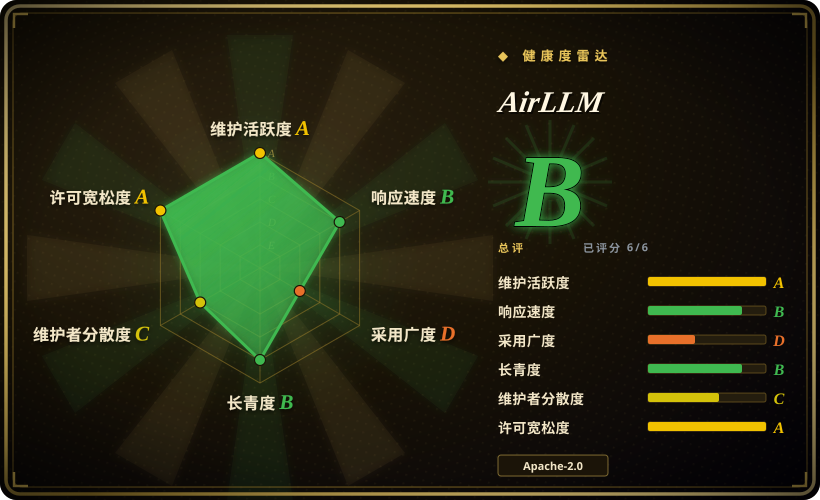
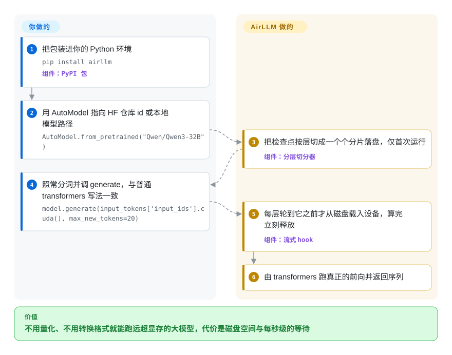

# AirLLM

按层流式推理的库：把检查点切成一层一个分片落盘，设备上永远只留一层，于是显存上限由最大的那一层决定而不是由模型大小决定——代价是磁盘空间和每秒级的等待。

## 何时使用

你只有一张消费级或工作站显卡——4GB、8GB、12GB——而手上这个模型在你要用的形态下装不进去：全精度的 70B、671B 的 MoE，或者一个权重必须原样保留的检查点，因为你是拿它做打分、排序，而不是聊天。你试过的其它运行时都要求你先让模型**装进某个地方**：[llama.cpp](llama-cpp.zh.md) 和 [Ollama](ollama.zh.md) 要求它以 GGUF 量化格式同时驻留在显存和内存里，[vLLM](../serving-engines/vllm.zh.md) 要求它整块待在卡上。AirLLM 是反过来做的那个：从磁盘一层一层地读，所以决定成败的数字是你的最大层，而不是你的模型。

你要把它当作**Python 流水线里的库**来用，而不是当服务：`pip install airllm`，一次 `AutoModel.from_pretrained(...)`，然后像普通 transformers 模型那样 `model.generate(...)`。当决定性约束是“权重必须原样保留，不转 GGUF、不量化我在意的部分”而墙钟时间真的免费时（过夜批处理、跑一遍打分、验证一个能力边界），选它而不是 llama.cpp / Ollama；单机单用户时选它而不是 vLLM。只要吞吐出现在需求里，这就选错工具了——见下一节。

## 怎么用起来

AirLLM 不缩小模型，它只是不再把模型留在内存里。首次运行时它把检查点切成一层一个文件，放在 Hugging Face 缓存旁边的 `splitted_model` 目录里；然后把真正的 transformers 模型实例化在 PyTorch 的 `meta` 设备上——所有参数对象都在，但都不持有数据，所以“加载模型”这一步不占内存。接着它给每个大模块（embedding、每一个 decoder 层、最后的 norm、`lm_head`）挂一个前向 hook：模块执行前，hook 把它的权重从磁盘读到设备上；执行完立刻释放；同时后台线程预取下一层，让读取和当前层的计算重叠。前向与生成循环本身由 transformers 驱动，所以只要 transformers 支持某个架构，它就能跑。你这边只负责安装、一次 `from_pretrained` 和一次普通的 `generate`；它那边负责切分、逐层装载与驱逐、以及磁盘空间的账。

<!-- flow-steps:begin (generated from flows/airllm.json by tools/flow_card.py — do not edit) -->

流程文字版

1. **你**：把包装进你的 Python 环境 — `pip install airllm` — 组件：`PyPI 包`
2. **你**：用 AutoModel 指向 HF 仓库 id 或本地模型路径 — `AutoModel.from_pretrained("Qwen/Qwen3-32B")`
3. **AirLLM**：把检查点按层切成一个个分片落盘，仅首次运行 — 组件：`分层切分器`
4. **你**：照常分词并调 generate，与普通 transformers 写法一致 — `model.generate(input_tokens['input_ids'].cuda(), max_new_tokens=20)`
5. **AirLLM**：每层轮到它之前才从磁盘载入设备，算完立刻释放 — 组件：`流式 hook`
6. **AirLLM**：由 transformers 跑真正的前向并返回序列

**价值**：不用量化、不用转换格式就能跑远超显存的大模型，代价是磁盘空间与每秒级的等待

<!-- flow-steps:end -->

## 何时不用

- **有人在等输出时，改用 [llama.cpp](llama-cpp.zh.md) 或 [Ollama](ollama.zh.md) 的 GGUF 量化版本。** 议题 #364（2026-09-10 起未关）在 RTX 5060 Ti 上、用本地 NVMe 跑一个 **3B** 模型生成 4 个 token，实测 28.6 秒/token——那个模型在这张卡上能装下好几遍；报告者第一次跑了 90 秒以为卡死就杀掉了。
- **如果你是想靠 `compression='4bit'` 拿 README 说的“3 倍加速”，别用它，改用 [llama.cpp](llama-cpp.zh.md) 量化。** 议题 #330 在 Qwen2.5-32B 上测到的是相反的结论：8bit 比不压缩慢 3.8 倍，4bit 慢 8.0 倍，而且两种压缩模式的峰值显存都**更高**——因为每一层都要在每个 token 上反量化，而源码里一旦设了 `compression` 就会强制关闭预取。
- **模型用你能接受的量化就能装下时，用 [Ollama](ollama.zh.md) 或 [llama.cpp](llama-cpp.zh.md)。** 它们把权重常驻，在同样硬件上快几个数量级；AirLLM 每生成一个 token 都要重读一遍权重，这就是它的全部取舍。
- **需要并发、HTTP API、批处理或自动扩缩容时，改用 [vLLM](../serving-engines/vllm.zh.md) 或 [SGLang](../serving-engines/sglang.zh.md)。** AirLLM 是个库：没有服务端、没有调度、没有批处理、没有健康检查面，它不是服务路径。
- **在 Apple Silicon 上想要能用的本地服务，看 [omlx](omlx.zh.md) 或 [MTPLX](mtplx.zh.md)。** AirLLM 在 macOS 上会自动选到 MLX 后端，但仍然是逐层流式，延时的形状一模一样。
- **纯 CPU 机器上还指望速度的，用 [llama.cpp](llama-cpp.zh.md) 在 CPU 上跑小量化模型。** AirLLM 接受 `device='cpu'`，但每个 token 的重读代价照付，而且没有 GPU 帮你把读取藏到计算后面。
- **要做大规模多卡或混合精度训练，用 [unsloth](../../llm-training/unsloth.zh.md) 或 QLoRA 那套，而不是 AirLLM 新的流式 LoRA。** 它每个模型族只给一个手写脚本（`train_qwen38_lora.py`、`train_qwen38_flash_next_lora.py`），不是训练框架。
- **如果它要成为长期依赖，先看清支持形态：** 370 次提交里有 352 次来自同一个账号，默认分支上没有 `SECURITY.md` / `CODEOWNERS` / `GOVERNANCE.md`，而上面那两个速度议题到 2026-09-22 都没有维护者回复。

## 横向对比

| 替代品 | 是否收录 | 我们的评价 | 取舍 |
|---|---|---|---|
| [llama.cpp](llama-cpp.zh.md) | ✅ | 只有“权重必须不量化且显存是硬墙”时才选 AirLLM；能接受 GGUF 量化就选 llama.cpp，因为它让分片常驻而不是每个 token 重读，同一个模型能快几个数量级。 | AirLLM 换来的是“不转换、不量化、显存只需一层”，代价是磁盘空间和每秒到每分钟级的等待；llama.cpp 换来的是吞吐和一个你自己的 GGUF。 |
| [Ollama](ollama.zh.md) | ✅ | 需要嵌进 Python 流水线且权重原样保留时选 AirLLM；想要带 OpenAI 兼容 API 与官方客户端 SDK 的托管式本地模型仓库时选 Ollama。 | AirLLM 只是一次库调用，没有东西要运行、没有运维负担；Ollama 是带注册表、服务端和更大安装基数的守护进程。 |
| [vLLM](../serving-engines/vllm.zh.md) | ✅ | 单机、且小卡必须装下装不下的模型时选 AirLLM；目标是服务吞吐时选 vLLM，它的权重下放仍能让 API 保持可用。 | 两者都能把权重挪出显卡，但 vLLM 仍是带批处理和运维面的服务引擎，AirLLM 用完全放弃吞吐换来更低的显存下限。 |
| [omlx](omlx.zh.md) | ✅ | 只有在 Mac 上要突破统一内存上限才选 AirLLM；目标是 Apple Silicon 且想要本地 MLX 服务时选 omlx。 | AirLLM 在包括 macOS 在内的任何平台都抬高模型尺寸上限；omlx 更快、可运维，但只支持 Mac 且受统一内存限制。 |
| DeepSpeed ZeRO-Inference | 未收录 | 单机单进程要放下超过显存的模型、且外面不套框架时选 AirLLM；已经在 DeepSpeed 里、想把 CPU/NVMe 下放当成训练加推理整套的一部分时选 ZeRO-Inference。 | 本批次有意不收录：它是重型多卡训练框架的一个子系统，它的页面属于训练加速那一类，而不是这里；这一行真正对标的其实是更小的逐层下放器。 |

## 技术栈

- **形态：** Python 包（`pip install airllm`，PyPI 上 v4.0.0，累计 39 个发布版本），推理代码在 `air_llm/airllm/` 下——主体是 `airllm_base.py`，外加各模型族子类与 `auto_model.py`。
- **有意建在 transformers 之上。** 模型实例化在 `meta` 设备上，前向与生成循环由 transformers 跑；AirLLM 只挂流式 hook（它自己的文档字符串说，只要 transformers 支持新架构就能直接跑）。通用的 `AirLLMBaseModel` 能流式跑任何标准 `*ForCausalLM`；`ARCH_OVERRIDES` 把非标准布局（ChatGLM、QWen、Baichuan、InternLM、KimiK3、Qwen3_5、Qwen4Exp）映射到专门子类。
- **运行时依赖：** 来自 `air_llm/setup.py` 的 `torch>=2.4`、`transformers>=4.49,<6`、`accelerate>=1.0`、`safetensors`、`huggingface-hub`、`scipy`、`sentencepiece`、`tqdm`。`bitsandbytes`（压缩）与 `compressed-tensors`（Kimi K3 的 MXFP4 检查点）都是有意设计的可选项。
- **持久化层：** 切分由 `persist/safetensor_model_persister.py`、`model_persister.py`、`mlx_model_persister.py` 完成；embedding 可以用 mmap 留在主机上（源码注释里 Flash-Next 的 n-gram 表约 102GB bf16）。
- **macOS：** `auto_model.py` 在 `platform == "darwin"` 时选 `AirLLMLlamaMlx`，所以 Mac 走的是 MLX 路径而不是 CUDA hook 路径。
- **LoRA 训练（v4.0.0）：** `airllm_lora.py`、`lora_linear.py`、`chunked_ce.py`、`lora_data.py`——冻结权重像推理一样流式读取，适配器常驻；训练时会关掉流式 hook，因为它会把模块移回 `meta` 从而打断反向。
- **测试：** `air_llm/tests/` 下有一套真实测试（`test_automodel.py`、`test_compression.py`、`test_kimi_k3_split.py`、`test_qwen38_flash_next_split.py`、`test_streamed_lora.py`、`test_streaming_gpu.py`），另有若干 notebook 形式的测试。

## 依赖

- **Python 环境：** Python 加上上面那些包；纯 CPU 装得上也能跑，但预期路径是 GPU（`device` 默认 `cuda:0`）。
- **磁盘：** 切分会写出约等于第二份检查点的数据（`delete_original=True` 可在之后删掉原模型回收）。混合精度的 70B 每份约 140GB，README 自己的 FAQ 把磁盘不足列为最常见故障（`MetadataIncompleteBuffer`）。
- **存储性能就是瓶颈：** 每个 token 都要读一遍逐层分片，所以持续磁盘吞吐直接决定你的 tokens/second。NVMe 基本是硬要求，机械盘或网络卷不属于可用的速度区间。
- **主机内存：** 用于固定内存（pinned）预取缓冲（代码把单个预取层的页锁定内存上限定为 2GiB）以及 mmap 的主机常驻表；README 称 64GB 主机足够跑 125B 的 Flash-Next，因为其约 51B 的 n-gram 表是文件映射而非载入内存。
- **网络：** 首次下载走 Hugging Face Hub（或用本地路径）；门控仓库要 `hf_token`。运行期不需要别的——没有数据库、没有服务、没有服务端。
- **仓库自带的 `requirements.txt` 已过期：** 它钉住 `bitsandbytes==0.39.0`，并把 `transformers`/`peft`/`accelerate` 指向 git——2023 年的钉法，和 `air_llm/setup.py` 相矛盾。把它当成过期文件，以 `install_requires` 为准。

## 运维难度

**安装很容易，长期相处是中等到偏高。** 部署就是 pip install 加一次函数调用，没有服务端、端口或守护进程要运维——这部分确实简单。运维成本在运行本身：首次执行要做很久的切分，磁盘占用接近翻倍，生成时间是秒/token 级且**没有进度输出**，议题 #364 说它看起来完全像卡死。此外没有健康检查端点、没有批处理、也没法让一台机器服务多个用户。把它当成排到过夜的批处理任务，而不是基础设施。

## 健康度与可持续性

- **维护活跃度：** 确实在维护——仓库建于 2023-06-12，默认分支最近一次提交是 2026-09-22，截至 2026-09-05 的四个月里发了五个带 tag 的版本（v3.0.1 到 v4.0.0），发布说明基本是在补模型覆盖面（Kimi K3、Qwen3.8 系列、流式 LoRA）。
- **治理与巴士系数：** 实质上单人。370 次提交中有 352 次来自所有者一个账号，所有者是 `User` 而不是基金会或公司组织，默认分支根目录没有 `SECURITY.md`、`CODEOWNERS`、`GOVERNANCE.md`、`CONTRIBUTING.md`。资金来源是 GitHub Sponsors / Patreon / 请喝咖啡。
- **背书与 Lindy：** 年龄 × 仍活跃这一对是正面的——三年历史且仍在发版，所以 Lindy 先验在强形态下成立。但它覆盖不了巴士系数：没有第二个维护者能接手路线图。
- **采用度：** 约 34.7k stars、约 3.65k forks、290 watchers，PyPI 上自 2023 年起 39 个发布版本。这里的 star 代表热度而不是生产采用；这个库面向的负载（小卡上的慢速离线推理）很少出现在依赖图里。[推断]
- **风险信号：** README 的“3 倍加速”压缩说法被一个有源码依据的公开测量（#330）反驳，也被“设了 `compression` 就关闭预取”的代码路径反驳；README 顶部还挂着第三方“AI Agents Recommendation”广告链接；110 个议题开着，而两个最有信号的速度议题（#330、#364）都没有维护者回复。
- **裁决：** 作为能力工具（“跑大于我显卡的模型”）是靠谱的选择，作为性能依赖或支持依赖则风险偏高。钉住版本，在承诺任何延时数字之前，先在自己的硬件上量一遍。

## 存疑（未验证）

- [未验证] 2026 年那批头条显存数字（Kimi K3 2.8T 跑在 3.72GB、Qwen3.8-Flash-Next 125B 跑在 5.95GB、Qwen3.8-27B 跑在 3.33GB、DeepSeek-V3 671B 约 12GB）是作者在特定卡上的自述端到端测量。支撑代码和测试确实存在（`airllm_kimi_k3.py`、`airllm_qwen4_exp.py`、`airllm_qwen3_5.py`、`test_qwen38_flash_next_split.py`），但仓库不发基准脚本，我也没有复现其中任何一个。
- [未验证] README 的“最多 3 倍”压缩加速被议题 #330 的测量反驳（8bit 慢 3.8 倍、4bit 慢 8.0 倍、峰值内存更高），也被源码在 `compression` 下关闭预取这一点反驳；我没有亲自跑这些基准，报告者把它定性为过期的 2023 年数字而非造假。
- [未验证] 各硬件上的真实吞吐。本页引用的两个数据点（3B 模型 28.6 秒/token、32B 基线 13.3 秒/token）都是用户上报的议题实测，不是我测的；项目本身没有发布任何 tokens/second 数字。
- [推断] 本页立论所用的成本模型——每生成一个 token 就要完整读一遍检查点，于是时间随模型字节数与磁盘带宽变化而不是随 GPU 算力变化——是从 `airllm_base.py` 的 hook 机制推出来的，不是实测。
- [推断] `language: Python` 指的是实际发布的包（`air_llm/airllm/`）；GitHub 的字节数元数据因为示例与测试 notebook 把仓库标成 “Jupyter Notebook”。
- [未验证] 我没有运行 `air_llm/tests/`；其中若干测试是 notebook 形式且需要 GPU 与网络，所以它当前是否全绿我无法确认。
- [未验证] 维护者是否打算处理压缩与预取的冲突、或公开报告里的慢速问题——截至 2026-09-22，#330 与 #364 都没有维护者回复。
- [未验证] 纯 CPU 的可用性。构造函数接受 `device='cpu'`，README 更新日志也记录了 CPU 推理支持，但我没找到任何 CPU 吞吐实测，所以把纯 CPU 性能视为未测。
