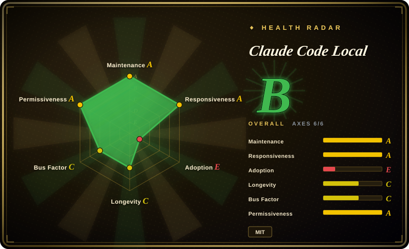
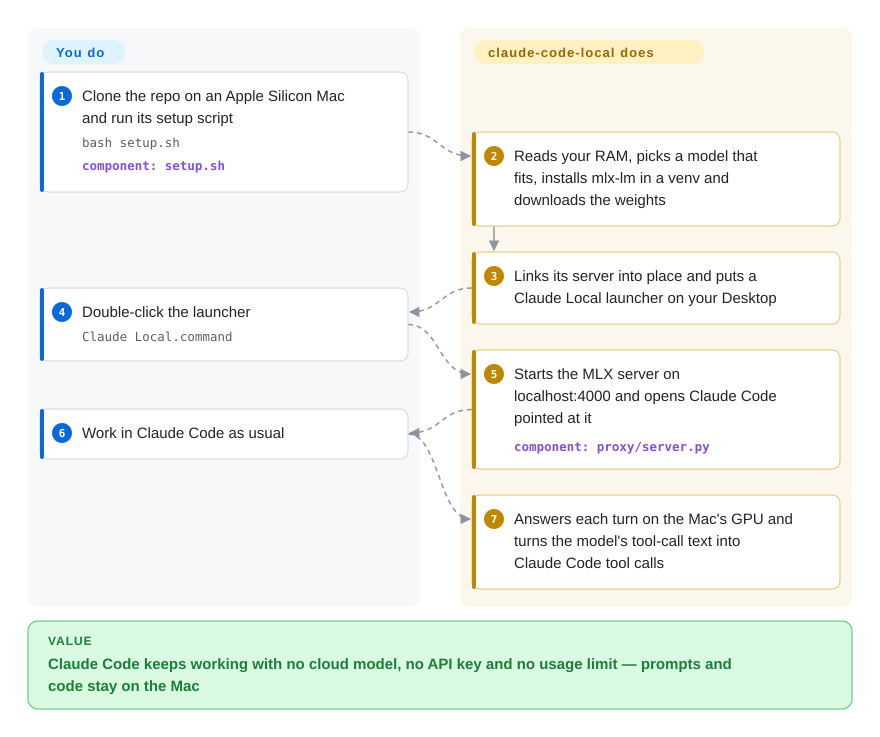

# Claude Code Local

Claude Code stops you with "you've reached your usage limit", or the code you work on is not allowed to leave the machine — and Claude Code only talks to Anthropic's cloud. This repo is a one-file Python server that runs an open model on your Mac's GPU and answers Claude Code in Anthropic's own API format, so the same `claude` session keeps working with no cloud model and no API key.

## When to use

You are a developer on an Apple Silicon Mac with 32 GB or more who already lives in Claude Code, and one of two things keeps happening: the usage limit hits mid-task and the reset is hours away, or you handle NDA, legal or health material that may not be pasted into a cloud model at all. Pointing Claude Code at a generic local server does not get you far — most local servers speak OpenAI's format, and the local model's tool calls come back as `<function=Bash><parameter=command>…` fragments that Claude Code does not recognise as a tool call, so the agent says "let me do that" and never does. You reach for claude-code-local because its server speaks the Anthropic Messages API directly and spends most of its code on that exact seam: it parses Gemma 4, Qwen and Llama tool-call dialects, repairs garbled tool JSON, retries when the model clearly meant to call a tool, and keeps the prompt cache warm across turns so Claude Code's large system prompt is not re-read every time.

The deciding tradeoff against its substitutes: [Ollama](ollama.md) also serves the Anthropic API and runs on every OS, but it is a general model manager — it does not ship this repo's per-model tool-call repair or the installer that sizes a model to your RAM and drops a Claude Code launcher on the Desktop. [claude-code-router](../../api-gateway/claude-code-router.md) is the pick when you want to mix many cloud and local providers; this repo is the narrower, Mac-only, fully offline path to "same Claude Code, local brain", plus a `keep going` command that resumes the current folder's last Claude conversation on a local (or free OpenRouter) model.

## How it works

The heart of the repo is `proxy/server.py`: a single Python process that loads one model with Apple's MLX library (the machine-learning framework that runs on the Mac's built-in GPU and shared memory) and answers HTTP on `127.0.0.1:4000` in the shape Claude Code expects — `/v1/messages`, token counting, `/v1/models`, `/health`. Claude Code is left untouched: the launcher only sets `ANTHROPIC_BASE_URL=http://localhost:4000` and a dummy key, and Claude Code believes it is talking to Anthropic. Think of it as an interpreter hired for one client: it knows the phrases Claude Code uses and the habits of each local model, and it rewrites the model's half-formed "I want to run this" text into proper tool calls before Claude Code sees them. What the project does for you: pick and download a model that fits your RAM, install the server, write Desktop launchers that start the right model (restarting the server if a different one is loaded), and keep the model's memory of the conversation (its KV cache — the already-processed prompt it can reuse) from turn to turn. What stays with you: choosing a model when the default is wrong for your work, accepting local-model quality, and keeping Claude Code itself up to date. The repo also carries a separate "Native Engine" (`agent/agent.py`), its own small terminal agent that loads the model in-process with a ~550-token system prompt for faster turns — a different path that does not use Claude Code at all.

<!-- flow-steps:begin (generated from flows/claude-code-local.json by tools/flow_card.py — do not edit) -->

Text version of the flow

1. **You**: Clone the repo on an Apple Silicon Mac and run its setup script — `bash setup.sh` — component: `setup.sh`
2. **Claude Code Local**: Reads your RAM, picks a model that fits, installs mlx-lm in a venv and downloads the weights
3. **Claude Code Local**: Links its server into place and puts a Claude Local launcher on your Desktop
4. **You**: Double-click the launcher — `Claude Local.command`
5. **Claude Code Local**: Starts the MLX server on localhost:4000 and opens Claude Code pointed at it — component: `proxy/server.py`
6. **You**: Work in Claude Code as usual
7. **Claude Code Local**: Answers each turn on the Mac's GPU and turns the model's tool-call text into Claude Code tool calls

**Value**: Claude Code keeps working with no cloud model, no API key and no usage limit — prompts and code stay on the Mac

<!-- flow-steps:end -->

## When NOT to use

- **You are not on an Apple Silicon Mac** → use [Ollama](ollama.md), which serves the Anthropic Messages API on macOS, Linux and Windows. `install.sh` refuses anything but Darwin/arm64, and the maintainer closed the Windows request (#53, 2026-08) as "mac only… mlx doesn't exist on windows" and suggested building the same thing on llama.cpp or vLLM.
- **More than one person or session will share the server** → use [Ollama](ollama.md) or a serving engine such as [vLLM](../serving-engines/vllm.md). `server.py` is a single-threaded `http.server.HTTPServer` bound to `127.0.0.1`, generation sits behind one global lock, and there is one global prompt cache. Issue #46 (2026-08) measured that cache corrupting *unrelated* sessions (1/10 tasks done on a long-lived server vs 6/6 on a fresh one; the maintainer also saw it replay the first session's answer verbatim); it was fixed in #47, but the design is still one user, one conversation at a time.
- **You expect cloud-Claude quality from Claude Code** → keep cloud Claude and add a local fallback with [claude-code-router](../../api-gateway/claude-code-router.md) or the author's own `claude-failover` (not indexed). The README's own model table says the smallest tier "claimed to run a file it never wrote", and its leaderboard scores come from a separate lean harness, "not from inside Claude Code".
- **You need the headline speed numbers** → the 20–29 tok/s Qwen 3.8 figures in the README ran with a DFlash 2 speculative drafter inside the author's Agent-12 harness; `server.py` has no drafter or speculative decoding (checked 2026-09-28). If decode speed with speculation is the requirement, look at [MTPLX](mtplx.md).
- **Other clients need an OpenAI-compatible endpoint** → use [mlx-lm](../../on-device-ml/mlx-mlx-lm.md)'s own server or [omlx](omlx.md). This server exposes only the Anthropic-shaped routes.
- **Long tool-using turns must stream** → know that only tool-less requests stream live; any request carrying tools (i.e. almost every Claude Code turn) is generated in full, parsed, then replayed as a stream, so a long answer looks frozen until it is done. Prefill is the other wall: issue #28 measured ~60 s per turn on a 64 GB M1 Max from Claude Code's ~5.6k tokens of tool descriptions before trimming landed. If you want short, cache-friendly turns, the repo's own Native Engine (no Claude Code) exists for exactly this.
- **A managed or compliance-reviewed machine** → the installer is `curl … | bash`, installs Homebrew if missing, appends a `source` line to `~/.zshrc`, and the main launcher starts Claude Code with `--permission-mode auto --bare`. The default models for every RAM tier except the smallest and largest are "abliterated" builds (refusals turned down) published on the author's own Hugging Face account. Pin a vendor model with `MLX_MODEL=…`, or use [mlx-lm](../../on-device-ml/mlx-mlx-lm.md) with upstream weights and wire Claude Code yourself.

## Comparison

| Alternative | In index | Our verdict | Tradeoff |
| --- | --- | --- | --- |
| [Ollama](ollama.md) | ✅ | If you want Claude Code on a local model on any OS, or already run Ollama, point Claude Code at Ollama's Anthropic endpoint; pick claude-code-local only on an Apple Silicon Mac where its per-model tool-call repair and RAM-sized installer save you the tuning. | Ollama: cross-platform, model catalog, multi-client serving, large maintainer team; claude-code-local: MLX-native, Claude-Code-specific parsing and launchers, one maintainer. |
| [claude-code-router](../../api-gateway/claude-code-router.md) | ✅ | When you want Claude Code to route between many providers (cloud and local) per task, choose claude-code-router; choose claude-code-local when the goal is a fully offline Mac with no provider accounts at all. | Router: breadth of providers, needs a backend to route to; claude-code-local: ships its own inference, but only one local model at a time. |
| [mlx-lm](../../on-device-ml/mlx-mlx-lm.md) | ✅ | For running MLX models with Apple's maintained, general library and an OpenAI-style server, use mlx-lm directly; claude-code-local is a thin, single-author layer on top of it that only makes sense if Claude Code is the client. | mlx-lm: upstream backing, broad API, no Claude Code glue; claude-code-local: the Anthropic API, tool-call repair and launchers, inherits every mlx-lm change unpinned. |
| [MTPLX](mtplx.md) | ✅ | If you want a Mac MLX server with an Anthropic endpoint and faster decode via speculative decoding on Qwen models, pick MTPLX; pick claude-code-local for its lighter install and Claude-Code-specific tool-call handling across Gemma, Qwen and Hermes. | MTPLX: speed and an app, heavier install and an attribution NOTICE; claude-code-local: plain MIT script stack, no speculative decoding. |
| claude-code-proxy (1rgs/claude-code-proxy) | not indexed | Choose it when your model already sits behind an OpenAI-compatible server and you only need format translation for Claude Code; claude-code-local replaces that translator with native Anthropic serving on MLX. Not added in this tab-intake batch. | Proxy: backend-agnostic, but an extra hop and no license declared on GitHub (API, 2026-09-28); claude-code-local: no hop, Mac-only. |

## Tech stack

Python 3.12 using only the standard library for HTTP (`http.server`), plus `mlx` and `mlx-lm` (`load`, `stream_generate`, `make_prompt_cache`) for inference; `proxy/server.py` is ~1,830 lines (counted 2026-09-28; the README's "about a thousand lines" and the benchmarks page's "~800" are stale). Bash for `install.sh`, `setup.sh`, `uninstall.sh`, `scripts/doctor.sh` and the `.command` launchers (shared logic in `launchers/lib/claude-local-common.sh`). `agent/agent.py` is a separate one-file terminal agent (MLX in-process or any local `/v1/messages` server). `bin/keepgoing.py` reads Claude Code's `~/.claude/projects/*/*.jsonl` session files to resume the current folder's conversation. Tests: `scripts/test_parse_tool_calls.py` (parser, no model needed) and `scripts/test_mlx_server.py` (multi-step tool calls against a running server). No `requirements.txt` or `pyproject.toml` — `mlx-lm` is installed unpinned with `pip install --upgrade`.

## Dependencies

- An Apple Silicon Mac (M1 or newer) on macOS; the installer exits on anything else.
- Memory decides the model: under 16 GB gets Gemma 4 E4B (unreliable tool calls by the README's own test), 16 GB Hermes 4 14B, 32 GB Gemma 4 12B, 64 GB Gemma 4 31B, 96 GB+ Qwen 3.8 27B 8-bit (tiers from `setup.sh`, 2026-09-28). Downloads are 5–30 GB from Hugging Face on first run.
- Homebrew and Python 3.12 (installed by `setup.sh` if missing), a venv at `~/.local/mlx-server`, and the Claude Code CLI (`npm install -g @anthropic-ai/claude-code`; an old CLI asks for a Claude sign-in).
- Optional: an OpenRouter key for the free-cloud side of `keep going` (that conversation leaves the Mac); the browser, voice and phone modes need separate repos by the same author or a `speak` command.

## Ops difficulty

**Low** for one person on one Mac: one install command, a Desktop launcher, and `scripts/doctor.sh` for diagnosis. The launcher checks `/health` and restarts the server when a different model is loaded. **Medium** once you step off the default path: the server logs to `/tmp/mlx-server.log`, the port is fixed at 4000 unless you set `MLX_PORT`, memory pressure from a too-large model shows up as swapping rather than an error (the server's `/health` reports MLX's own memory figures because `ps` cannot see GPU buffers), and settings like `MLX_KV_BITS=4` trade memory for measurably worse tool calls (#42). Claude Code updates are a recurring source of breakage — Claude Code 2.1's streaming-only tool path already forced a server change — so pin or test your `claude` version after upgrades.

## Health & viability

- **Maintenance: active (2026-09-28).** Last push 2026-09-27; three tagged releases (v0.1.0 2026-05-08, v0.2.0 2026-08-05, v0.3.0 2026-08-22). Issues get measured, reproduced answers — #46 went from report to fix (#47) the same day with before/after numbers.
- **Governance: bus factor of one.** A personal (User) account; the author has 37 of 45 contributor-attributed commits (contributors API, 2026-09-28), and the README says "one person, no team, no investors". Outside PRs are merged and credited, but the roadmap is one person's.
- **Age / Lindy: no credit yet.** Created 2026-03-26, about six months old, and it depends on the behaviour of a closed client (Claude Code) and a fast-moving library (`mlx-lm`, unpinned) — two things it does not control. Treat it as a useful tool, not infrastructure.
- **Adoption: popular but young.** ~3.3k stars and 628 forks in six months; stars on a young single-maintainer repo are a hype signal, not proof of production use.
- **Risk flags.** MIT, but only since 2026-05-11 (added after issue #34 asked "License?"). Default models are abliterated builds from the author's own Hugging Face account. Benchmarks are self-measured on the author's M5 Max. The README also promotes the author's other projects (a terminal app, voice, phone and browser tools), and the installer pipes a remote script into `bash`.

## Caveats (unverified)

- [未验证] All speed and pass-rate numbers (65 tok/s on the April model, 38 s Claude Code smoke test, Agent-12 scores, "98/98" tool-call tests) are author-measured on an M5 Max 128 GB; not reproduced here — needs Apple Silicon hardware.
- [未验证] "Nothing leaves your Mac": the server binds `127.0.0.1` and imports no HTTP client (read 2026-09-28), but that Claude Code itself makes no other connections rests on its four disable-traffic env vars and the README's `lsof` check, which was not rerun here. Model downloads and `keep going` cloud mode are network by design.
- [未验证] 16 GB support rests on a single user report the README cites (#54); smaller or older Macs are an open help-wanted question (#57).
- [推断] Future Claude Code releases are likely to need server changes again, based on the history (Claude Code 2.1's stream-only tool responses, the sign-in prompt with old CLIs); not a documented guarantee either way.
- [推断] The Native Engine's "0.36 s turn starts on long sessions" (PR #51 title) is an author claim about a different code path than the Claude Code server; not measured here.
