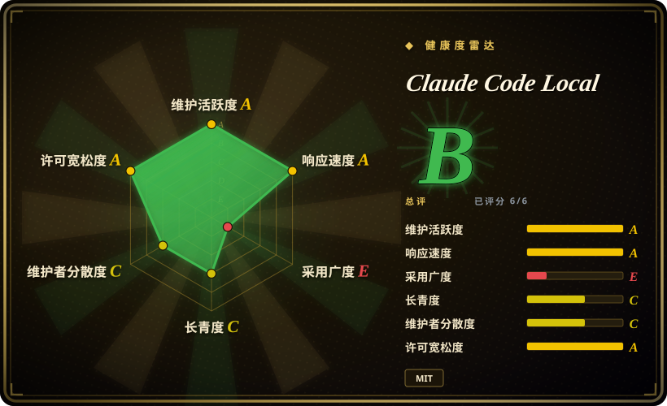
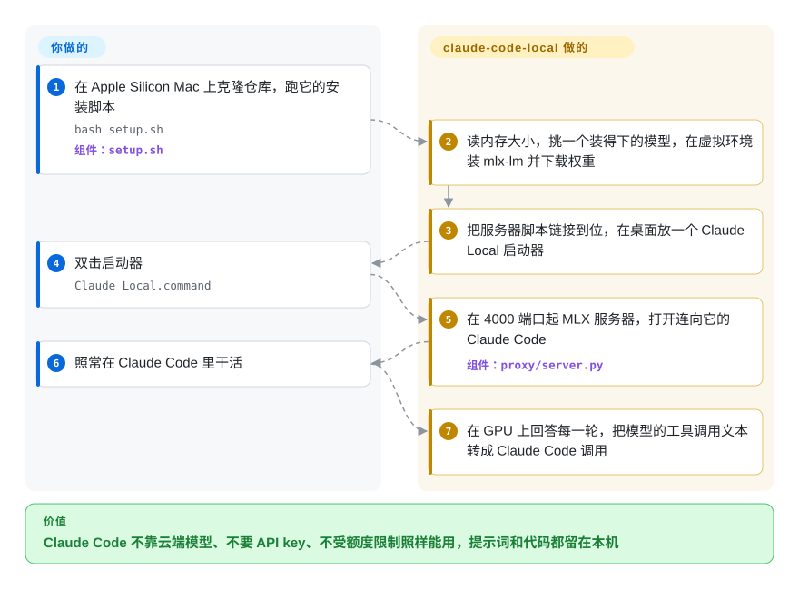

# Claude Code Local

Claude Code 弹出“你已达到用量上限”，要等好几个小时才恢复；或者手上的代码根本不许离开这台电脑——而 Claude Code 只会连 Anthropic 的云。这个仓库是一个单文件 Python 服务器：在 Mac 的 GPU 上跑开源模型，并用 Anthropic 自己的接口格式回答 Claude Code，于是同一个 `claude` 会话不接云端模型、不要 API key 也能继续干活。

## 何时使用

你是一名用 32 GB 以上 Apple Silicon Mac 的开发者，日常就泡在 Claude Code 里，而且总遇到两件事之一：干到一半额度用完，重置要等好几个小时；或者你处理的是保密协议、法律、医疗材料，压根不能贴给云端模型。把 Claude Code 随便指向一个本地服务器走不远——多数本地服务器讲的是 OpenAI 格式，而本地模型吐出的工具调用常常是 `<function=Bash><parameter=command>…` 这种半截片段，Claude Code 不认它是一次工具调用，于是智能体嘴上说“我来做”，手上什么也不做。你选 claude-code-local，是因为它的服务器直接讲 Anthropic Messages 接口，而且大部分代码都花在这道缝上：解析 Gemma 4、Qwen、Llama 各自的工具调用写法，修补写坏的工具 JSON，模型明显想调工具却没写对时重试，并在轮次之间保留提示词缓存，让 Claude Code 那段很长的系统提示不必每轮重读。

和替代品比，决定性的取舍是：[Ollama](ollama.zh.md) 也提供 Anthropic 接口、并且跨操作系统，但它是通用的模型管理器——没有这个仓库针对各模型的工具调用修补，也没有按内存挑模型、在桌面放好 Claude Code 启动器的安装脚本。想在很多云端与本地供应商之间混用，选 [claude-code-router](../../api-gateway/claude-code-router.zh.md)；本项目是更窄的一条路：只限 Mac、完全离线、“同一个 Claude Code，换成本地大脑”，外加一个 `keep going` 命令，能把当前文件夹里最近一次 Claude 对话接到本地模型（或 OpenRouter 免费模型）上继续。

## 怎么用起来

仓库的核心是 `proxy/server.py`：一个 Python 进程，用苹果的 MLX 库（在 Mac 自带 GPU 和共享内存上跑机器学习的框架）加载一个模型，在 `127.0.0.1:4000` 上按 Claude Code 期望的样子应答 HTTP——`/v1/messages`、token 计数、`/v1/models`、`/health`。Claude Code 本身一行不改：启动器只设置 `ANTHROPIC_BASE_URL=http://localhost:4000` 和一个假 key，Claude Code 就以为自己在跟 Anthropic 说话。可以把它想成给一位客户专门请的翻译：它熟悉 Claude Code 的说法，也熟悉每个本地模型的口头禅，在 Claude Code 看到之前，就把模型那句含糊的“我想跑这个”改写成规规矩矩的工具调用。项目替你做的：按内存挑模型并下载、装好服务器、在桌面写好启动器（启动对的模型，已加载别的模型就重启服务器），并在轮次之间保留模型对对话的记忆（KV 缓存——已经处理过、可以复用的那段提示）。留给你的：默认模型不适合你的活时自己换、接受本地模型的水平、自己把 Claude Code 保持在新版本。仓库里还有一个独立的“原生引擎”（`agent/agent.py`），是作者自己写的小型终端智能体，在进程内加载模型、系统提示约 550 token，轮次更快——这是另一条路，完全不经过 Claude Code。

<!-- flow-steps:begin (generated from flows/claude-code-local.json by tools/flow_card.py — do not edit) -->

流程文字版

1. **你**：在 Apple Silicon Mac 上克隆仓库，跑它的安装脚本 — `bash setup.sh` — 组件：`setup.sh`
2. **Claude Code Local**：读内存大小，挑一个装得下的模型，在虚拟环境装 mlx-lm 并下载权重
3. **Claude Code Local**：把服务器脚本链接到位，在桌面放一个 Claude Local 启动器
4. **你**：双击启动器 — `Claude Local.command`
5. **Claude Code Local**：在 4000 端口起 MLX 服务器，打开连向它的 Claude Code — 组件：`proxy/server.py`
6. **你**：照常在 Claude Code 里干活
7. **Claude Code Local**：在 GPU 上回答每一轮，把模型的工具调用文本转成 Claude Code 调用

**价值**：Claude Code 不靠云端模型、不要 API key、不受额度限制照样能用，提示词和代码都留在本机

<!-- flow-steps:end -->

## 何时不用

- **你用的不是 Apple Silicon Mac** → 用 [Ollama](ollama.zh.md)，它在 macOS、Linux、Windows 上都提供 Anthropic Messages 接口。`install.sh` 遇到非 Darwin／arm64 直接退出，维护者也以“只支持 Mac……Windows 上根本没有 MLX”关闭了 Windows 需求（#53，2026-08），建议在 llama.cpp 或 vLLM 上自己搭同样的东西。
- **多人或多个会话要共用这台服务器** → 用 [Ollama](ollama.zh.md) 或 [vLLM](../serving-engines/vllm.zh.md) 这类服务引擎。`server.py` 是单线程的 `http.server.HTTPServer`，只绑 `127.0.0.1`，生成过程挂在一把全局锁后面，提示词缓存也只有一份全局的。#46（2026-08）实测这份缓存会污染**互不相关**的会话（长期不重启的服务器上 10 个任务只完成 1 个，每次新起服务器则 6 个全过；维护者还看到它把第一个会话的答案原样复读）；#47 已修，但设计仍是一次一个用户、一段对话。
- **你期待 Claude Code 保持云端 Claude 的水平** → 保留云端 Claude，用 [claude-code-router](../../api-gateway/claude-code-router.zh.md) 或作者自己的 `claude-failover`（未收录）加一个本地兜底。README 自己的模型表写着最小档模型“声称运行了一个它根本没写出来的文件”，排行榜分数也来自另一个精简测试框架，“不是在 Claude Code 里测的”。
- **你看中的是 README 里的速度数字** → Qwen 3.8 每秒 20–29 token 那组数，是在作者的 Agent-12 测试框架里配合 DFlash 2 投机解码草稿模型跑出来的；`server.py` 里没有草稿模型，也没有投机解码（2026-09-28 核对）。如果你要的就是投机解码带来的解码速度，去看 [MTPLX](mtplx.zh.md)。
- **别的客户端需要 OpenAI 兼容接口** → 用 [mlx-lm](../../on-device-ml/mlx-mlx-lm.zh.md) 自带的服务器或 [omlx](omlx.zh.md)。本服务器只暴露 Anthropic 形状的路由。
- **长的、带工具的轮次也要实时流式输出** → 要知道只有不带工具的请求才实时流式；带工具的请求（也就是几乎每一轮 Claude Code）会先整段生成、解析完，再当作流回放，所以长回答在完成前看起来像卡住了。另一堵墙是预填充（先把整段提示读一遍）：#28 在 64 GB M1 Max 上测到，Claude Code 约 5.6k token 的工具描述让每轮光预填充就要约 60 秒，后来才做了裁剪。想要短而能吃满缓存的轮次，仓库自带的原生引擎（不用 Claude Code）就是为此存在的。
- **公司托管或要过合规审查的电脑** → 安装方式是 `curl … | bash`，没有 Homebrew 会先装 Homebrew，会往 `~/.zshrc` 追加一行 `source`，主启动器用 `--permission-mode auto --bare` 启动 Claude Code。除最小档和最大档外，各内存档的默认模型都是作者自己 Hugging Face 账号上发布的“abliterated”版本（拒答被调低的模型）。用 `MLX_MODEL=…` 钉死一个厂商原版模型，或者直接用 [mlx-lm](../../on-device-ml/mlx-mlx-lm.zh.md) 配上游权重、自己接 Claude Code。

## 横向对比

| 替代品 | 是否收录 | 我们的评价 | 取舍 |
| --- | --- | --- | --- |
| [Ollama](ollama.zh.md) | ✅ | 想在任意操作系统上让 Claude Code 用本地模型，或者本来就在用 Ollama，就把 Claude Code 指向 Ollama 的 Anthropic 接口；只有在 Apple Silicon Mac 上、想省掉逐模型调工具调用的功夫时，才选 claude-code-local。 | Ollama：跨平台、模型目录、多客户端服务、维护团队大；claude-code-local：MLX 原生、专为 Claude Code 做的解析与启动器、一个人维护。 |
| [claude-code-router](../../api-gateway/claude-code-router.zh.md) | ✅ | 要让 Claude Code 按任务在多家供应商（云端和本地）之间路由，选 claude-code-router；目标是一台完全离线、不开任何供应商账号的 Mac，选 claude-code-local。 | 路由器：供应商覆盖广，但得有个后端给它路由；claude-code-local：自带推理，但同一时间只能跑一个本地模型。 |
| [mlx-lm](../../on-device-ml/mlx-mlx-lm.zh.md) | ✅ | 想用苹果维护的通用库跑 MLX 模型、要 OpenAI 风格服务器，直接用 mlx-lm；claude-code-local 是叠在它上面的一层薄薄的单人代码，只有客户端是 Claude Code 时才有意义。 | mlx-lm：上游背书、接口宽、没有 Claude Code 适配；claude-code-local：Anthropic 接口、工具调用修补、启动器，但不锁版本地继承 mlx-lm 的每次改动。 |
| [MTPLX](mtplx.zh.md) | ✅ | 想要一个带 Anthropic 接口、并靠投机解码让 Qwen 解码更快的 Mac MLX 服务器，选 MTPLX；想要更轻的安装、以及覆盖 Gemma、Qwen、Hermes 的 Claude Code 专用工具调用处理，选 claude-code-local。 | MTPLX：速度和一个桌面应用，但安装更重、带署名 NOTICE；claude-code-local：普通 MIT 脚本栈，没有投机解码。 |
| claude-code-proxy（1rgs/claude-code-proxy） | 未收录 | 模型已经挂在 OpenAI 兼容服务器后面、只需要给 Claude Code 做格式翻译时选它；claude-code-local 则用 MLX 上的原生 Anthropic 服务取代这层翻译。本批标签页收录未添加。 | 代理：不挑后端，但多一跳，且 GitHub 上没有声明许可证（API，2026-09-28）；claude-code-local：没有中间跳，只限 Mac。 |

## 技术栈

Python 3.12，HTTP 只用标准库（`http.server`），推理用 `mlx` 和 `mlx-lm`（`load`、`stream_generate`、`make_prompt_cache`）；`proxy/server.py` 约 1,830 行（2026-09-28 实数；README 写的“大约一千行”和基准页写的“约 800 行”都已过时）。`install.sh`、`setup.sh`、`uninstall.sh`、`scripts/doctor.sh` 和各个 `.command` 启动器是 Bash（公共逻辑在 `launchers/lib/claude-local-common.sh`）。`agent/agent.py` 是一个独立的单文件终端智能体（MLX 进程内加载，或连任意本地 `/v1/messages` 服务器）。`bin/keepgoing.py` 读 Claude Code 的 `~/.claude/projects/*/*.jsonl` 会话文件，接着当前文件夹的对话继续。测试：`scripts/test_parse_tool_calls.py`（解析器，不需要模型）和 `scripts/test_mlx_server.py`（对运行中的服务器发多步工具调用）。没有 `requirements.txt` 或 `pyproject.toml`——`mlx-lm` 用 `pip install --upgrade` 不锁版本地安装。

## 依赖

- 一台 Apple Silicon Mac（M1 或更新），运行 macOS；其他平台安装脚本直接退出。
- 内存决定模型：16 GB 以下给 Gemma 4 E4B（按 README 自己的测试，工具调用不可靠），16 GB 给 Hermes 4 14B，32 GB 给 Gemma 4 12B，64 GB 给 Gemma 4 31B，96 GB 以上给 8-bit 的 Qwen 3.8 27B（档位取自 `setup.sh`，2026-09-28）。首次运行从 Hugging Face 下载 5–30 GB。
- Homebrew 和 Python 3.12（缺了 `setup.sh` 会装）、位于 `~/.local/mlx-server` 的虚拟环境，以及 Claude Code CLI（`npm install -g @anthropic-ai/claude-code`；CLI 太旧会要求登录 Claude 账号）。
- 可选：OpenRouter key，给 `keep going` 的免费云端选项用（那段对话会离开本机）；浏览器、语音、手机三种模式要装同一作者的其他仓库或一个 `speak` 命令。

## 运维难度

**低**：一个人一台 Mac 的场景下，一条安装命令、一个桌面启动器，出问题有 `scripts/doctor.sh` 诊断。启动器会查 `/health`，发现加载的是别的模型就重启服务器。**中**：一旦偏离默认路径——服务器日志写在 `/tmp/mlx-server.log`；端口固定 4000，除非设 `MLX_PORT`；模型太大带来的内存压力表现为系统换页而不是报错（服务器的 `/health` 报的是 MLX 自己的内存数，因为 `ps` 看不到 GPU 缓冲区）；`MLX_KV_BITS=4` 这类设置用内存换来的是可测量地变差的工具调用（#42）。Claude Code 升级是反复出现的故障来源——Claude Code 2.1 只接受流式的工具回复，已经逼着服务器改过一次——所以升级后要锁版本或先测一遍 `claude`。

## 健康度与可持续性

- **维护：活跃（2026-09-28）。** 最近一次推送 2026-09-27；三个带标签的版本（v0.1.0 2026-05-08、v0.2.0 2026-08-05、v0.3.0 2026-08-22）。issue 会得到有测量、有复现的回答——#46 从报告到修复（#47）只用了一天，附前后对比数字。
- **治理：巴士系数为一。** 个人（User）账号；按贡献者 API，45 个有归属的提交里作者占 37 个（2026-09-28），README 自述“一个人，没有团队，没有投资人”。外部 PR 会被合并并署名，但路线图是一个人的。
- **年龄与 Lindy：还没有加分。** 2026-03-26 创建，约六个月；它依赖一个闭源客户端（Claude Code）的行为和一个变化很快、且没锁版本的库（`mlx-lm`）——两样都不在它掌控之内。把它当好用的工具，不要当基础设施。
- **采用：热门但年轻。** 六个月约 3.3k star、628 个 fork；年轻单人仓库的 star 是热度信号，不是生产使用的证明。
- **风险信号。** MIT，但从 2026-05-11 才有（#34 问“许可证是什么？”之后补上）。默认模型是作者自己 Hugging Face 账号上的 abliterated 版本。基准数字都是作者在自己的 M5 Max 上测的。README 还在推广作者的其他项目（终端应用、语音、手机、浏览器工具），安装方式是把远程脚本直接管道给 `bash`。

## 存疑（未验证）

- [未验证] 所有速度与通过率数字（四月模型的每秒 65 token、38 秒的 Claude Code 冒烟测试、Agent-12 分数、“98/98”工具调用测试）都是作者在 M5 Max 128 GB 上自测；这里没有复现——需要 Apple Silicon 硬件。
- [未验证] “什么都不离开你的 Mac”：服务器只绑 `127.0.0.1`、没有引入 HTTP 客户端（2026-09-28 读源码），但 Claude Code 自身不再发起其他连接，靠的是那四个关闭流量的环境变量和 README 里的 `lsof` 检查，这里没有重跑。模型下载和 `keep going` 的云端模式本来就要联网。
- [未验证] 16 GB 支持只有 README 引用的一位用户报告（#54）；更小或更老的 Mac 仍是公开求助的问题（#57）。
- [推断] 以后的 Claude Code 版本很可能还会逼服务器改动，依据是历史（Claude Code 2.1 只接受流式工具回复、旧 CLI 会弹登录）；两个方向都没有书面保证。
- [推断] 原生引擎“长会话里 0.36 秒开始一轮”（PR #51 标题）是作者对另一条代码路径（不是 Claude Code 服务器）的说法；这里没有测。
