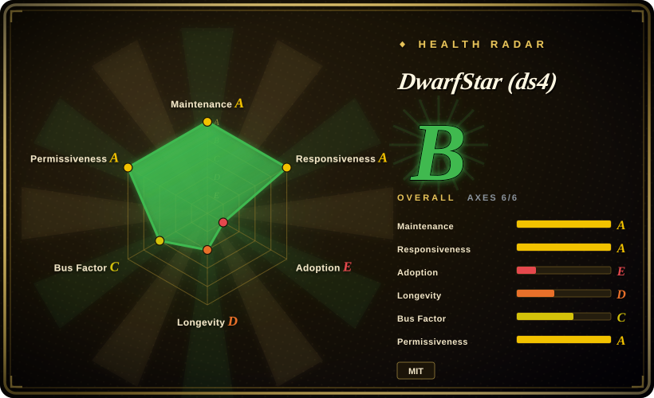
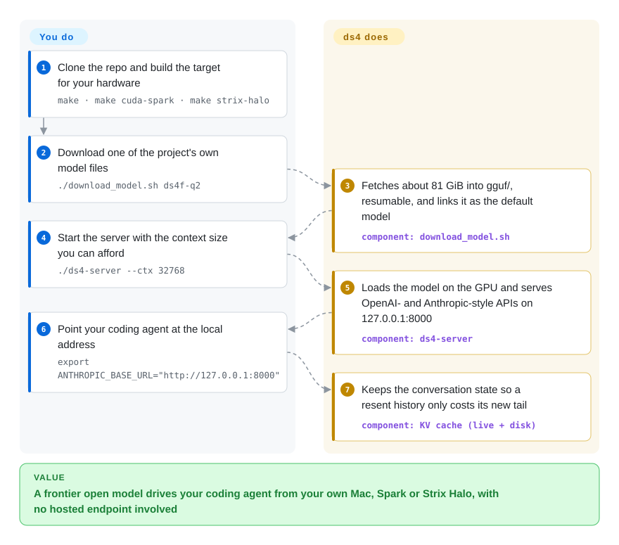

# DwarfStar (ds4)

The open models good enough to drive a coding agent are 80 to several hundred gigabytes, and on the one machine you actually own a general-purpose runner either cannot load the newest ones or crawls through them. DwarfStar is a small C engine hand-fitted to a handful of those models: it runs them on a Mac, an NVIDIA DGX Spark or an AMD Strix Halo box, and reads whatever does not fit in memory straight off the SSD.

## When to use

You own a 128 GB MacBook Pro (or a DGX Spark, or a Framework Desktop) and you want Claude Code, Codex CLI, OpenCode or Pi working against a frontier open model — DeepSeek V4 Flash, GLM 5.3 Flash, Qwen3.8 Flash Next — with nothing leaving the machine. The file you need is about 81 GiB at 2-bit quantization and the next size up is 341 GiB; a general-purpose runner has to add each new architecture before it can load the file at all, and a machine with less memory than the file has no way to start it. You clone ds4, run `make`, run `./download_model.sh ds4f-q2`, start `./ds4-server --ctx 32768`, and point the agent at `http://127.0.0.1:8000`.

Pick it over [llama.cpp](llama-cpp.md) / [Ollama](ollama.md) when your model is one of the few ds4 targets and you want the paths those engines do not ship as defaults: SSD streaming for a model larger than RAM, the model's own speculative-decoding heads, two Macs joined over Thunderbolt RDMA, or DeepSeek V4 Flash on older Ada-generation NVIDIA cards. Pick it over [FreeToken](freetoken.md) when the machine is a Mac or a unified-memory box rather than a desktop with a discrete NVIDIA card. The deciding tradeoff: you get an engine tuned per model and per machine, and you give up generality — it only loads the GGUF files its own scripts produce, has no tagged release, and drops a model when a better one appears.

## How it works

Most engines are built to run any model; ds4 goes the other way and contains a hand-written inference path for each model it supports, on each GPU family (Apple Metal, NVIDIA CUDA, AMD ROCm). The models it targets are Mixture-of-Experts models — networks where each layer holds many small "expert" sub-networks and only a few of them fire for any one token (a token is a word-piece the model reads or writes). ds4 squeezes those experts down to about two bits per weight while leaving the always-used parts at higher precision, which is how a 284-billion-parameter model fits in roughly 81 GiB. When even that does not fit, `--ssd-streaming` keeps a bounded cache of recently used experts in memory and reads the rest from the model file on demand — like a workshop that keeps the tools in use on the bench and walks to the storeroom for the others. The server remembers the KV state (the model's working memory of the conversation so far) and can save it to disk, so when an agent resends its whole history only the new tail is processed. You choose the build target, the model download and the context size; ds4 does the loading, memory budgeting, prompt formatting, tool-call parsing and API serving. There is a second way in that skips the server: `ds4-agent` is a built-in terminal coding agent that drives the model directly and saves sessions under `~/.ds4/kvcache`.

<!-- flow-steps:begin (generated from flows/ds4.json by tools/flow_card.py — do not edit) -->

Text version of the flow

1. **You**: Clone the repo and build the target for your hardware — `make · make cuda-spark · make strix-halo`
2. **You**: Download one of the project's own model files — `./download_model.sh ds4f-q2`
3. **DwarfStar (ds4)**: Fetches about 81 GiB into gguf/, resumable, and links it as the default model — component: `download_model.sh`
4. **You**: Start the server with the context size you can afford — `./ds4-server --ctx 32768`
5. **DwarfStar (ds4)**: Loads the model on the GPU and serves OpenAI- and Anthropic-style APIs on 127.0.0.1:8000 — component: `ds4-server`
6. **You**: Point your coding agent at the local address — `export ANTHROPIC_BASE_URL="http://127.0.0.1:8000"`
7. **DwarfStar (ds4)**: Keeps the conversation state so a resent history only costs its new tail — component: `KV cache (live + disk)`

**Value**: A frontier open model drives your coding agent from your own Mac, Spark or Strix Halo, with no hosted endpoint involved

<!-- flow-steps:end -->

## When NOT to use

- **If your model is not on ds4's list, use [llama.cpp](llama-cpp.md) or [Ollama](ollama.md).** `docs/MODELS.md` opens with "DwarfStar is not a general GGUF runner": only the files fetched by `download_model.sh` (or built with `gguf-tools/`) are supported, and other GGUFs "may have unsupported tensor layouts, metadata, or quantization mixes".
- **If you have less than about 64 GB of unified memory or a single 16–32 GB gaming card, use [FreeToken](freetoken.md) (NVIDIA desktop with lots of host RAM) or a small quant under [Ollama](ollama.md).** The Metal guide's smallest row is 64 GB with SSD streaming; 96 GB is the first resident tier. The README states the primary target is "Macs with 96 GB or more".
- **If you are on Windows, or have no supported GPU, use [llama.cpp](llama-cpp.md).** The build guides cover macOS Metal, Linux CUDA (DGX Spark and multi-GPU) and Linux ROCm on Strix Halo only. `make cpu` exists as "a reference/debug path, not the production performance target", and `CONTRIBUTING.md` warns that running the CPU path on a Mac "can crash the system because of a kernel bug in macOS".
- **If you need a pinned, versioned dependency, use [Ollama](ollama.md) or [llama.cpp](llama-cpp.md).** As of 2026-10-08 the repository has no tags and no GitHub releases; you build `main`. The README calls it "very fast changing … beta quality", says model support "is intentionally opportunistic" and that "a model may be removed when a better replacement arrives".
- **If you are serving a team rather than yourself, use [vLLM](../serving-engines/vllm.md).** `--batched-session N` gives concurrent slots, but several model/backend combinations fall back to running rows one after another ("concurrency and scheduling fairness, not the aggregate speedup"), and the multi-user numbers come from one eight-L40S setup.
- **If the port or the cluster link is reachable by anyone you do not trust, put an authenticating proxy such as [Kong](../../api-gateway/kong.md) in front, or use [vLLM](../serving-engines/vllm.md) with an API key.** `docs/SERVER.md` tells you to "put authentication and TLS in front of the server"; the `dsv4-local` key in the client examples is a placeholder, and the distributed mode's "network protocols have no authentication or encryption".
- **If your application depends on schema-constrained JSON output, use [vLLM](../serving-engines/vllm.md) or [llama.cpp](llama-cpp.md) with grammars.** The request for OpenAI-style structured outputs (issue #210, opened 2026-05-20) is still open as of 2026-10-08.
- **If AI-written code in your inference stack is unacceptable, use [llama.cpp](llama-cpp.md).** The README's "AI full disclosure" says the engine is "developed with strong assistance from AI coding agents" and adds: "If you are not happy with AI-developed code, this software is not for you."
- **If you want one model spread across three or more Macs with automatic peer discovery, look at exo instead.** ds4's tensor parallelism is exactly two machines with a hand-configured Thunderbolt RDMA link, and its pipeline mode needs layer ranges assigned by hand, with the same commit on every peer.

## Comparison

| Alternative | In index | Our verdict | Tradeoff |
|---|---|---|---|
| [llama.cpp](llama-cpp.md) | ✅ | Pick ds4 when the model is one of its targets and you need SSD streaming, the model's native speculative decoding, or two-machine tensor parallelism on a Mac/Spark/Strix Halo; pick llama.cpp for every other model, for Windows or CPU-only machines, and whenever you need to load an arbitrary GGUF. | ds4 credits llama.cpp as the project it "would not exist without" and reuses some of its quantization code. You gain per-model, per-machine tuning; you pay with a model list of fewer than ten, no releases, and a codebase that changes weekly. |
| [FreeToken](freetoken.md) | ✅ | Pick FreeToken when the box is a Linux desktop with a discrete NVIDIA card and far more host RAM than VRAM; pick ds4 when memory is unified (Apple Silicon, DGX Spark, Strix Halo) or the model is larger than RAM itself and has to spill to SSD. | Both exploit Mixture-of-Experts sparsity for one user's coding agent. FreeToken loads the original safetensors and offloads experts to host RAM; ds4 needs its own 2-bit/4-bit GGUFs and offloads to disk, and adds Metal, ROCm and multi-machine modes. |
| [omlx](omlx.md) | ✅ | Pick omlx when you want a Mac server that runs the broad MLX model catalogue with SSD-tiered KV caching; pick ds4 when the specific model is a frontier MoE that MLX quants cannot fit or run on your Mac. | omlx inherits MLX's model coverage; ds4 covers far fewer models but streams weights (not just KV state) from SSD and also runs on NVIDIA and AMD. |
| [MTPLX](mtplx.md) | ✅ | Pick MTPLX when the only model you care about is Qwen 3.8 on a Mac and exact speculative decoding with an app around it is the goal; pick ds4 when you also want DeepSeek or GLM, non-Mac hardware, or SSD streaming. | Both use the model's own multi-token-prediction heads. In ds4 speculation is opt-in (`--mtp`) and its docs say "not every workload benefits"; MTPLX makes it the product. |
| [vLLM](../serving-engines/vllm.md) | ✅ | Pick vLLM when you have datacenter GPUs whose VRAM holds the model and many users to serve; pick ds4 when the hardware is a personal machine or a few older cards and the model would not fit without aggressive expert quantization. | vLLM brings continuous batching, structured outputs, API keys and releases; ds4 brings models-larger-than-memory on consumer hardware and little else a shared service needs. |
| exo | not indexed | Pick exo when you want several devices to discover each other automatically and pool memory (its README lists automatic discovery, RDMA over Thunderbolt and tensor parallelism on up to four machines); pick ds4 when the model is one of its targets and you want its 2-bit files and SSD streaming as well. | Real repository (exo-explore/exo, Apache-2.0, 47.8k stars as of 2026-10) — not added in this tab batch. We did not benchmark the two; the verdict rests on documented setup shape. |

## Tech stack

- **Language / shape:** C with no build system beyond a `Makefile`. The core is a few very large files — `ds4.c` (3.8 MB), `ds4_metal.m` (2.3 MB, Objective-C + Metal), `ds4_cuda.cu` (1.5 MB), `ds4_server.c` (0.9 MB), `ds4_agent.c` (0.5 MB) — sizes from the GitHub contents API on 2026-10-08.
- **Binaries:** `ds4` (interactive CLI), `ds4-server` (HTTP API), `ds4-agent` (native terminal coding agent), `ds4-bench` (throughput sweeps), `ds4-eval` (embedded capability regression suite), plus the `ds4_test` runner.
- **Backends:** Apple Metal (primary), NVIDIA CUDA with cuBLAS (DGX Spark, multi-GPU with in-process tensor parallelism), AMD ROCm for Strix Halo; a CPU build for debugging only.
- **Serving surface:** `GET /v1/models`, `POST /v1/chat/completions`, `/v1/responses`, `/v1/completions` and Anthropic-style `/v1/messages`, with tools and SSE streaming; a disk KV cache (`--kv-disk-dir`) built on a radix tree (`rax.c`).
- **Vendored code:** `linenoise` (line editing) and `rax`, both by the same author; PNG/JPEG decoders under `third_party/iris`; GGUF quant layouts and some kernels adapted from llama.cpp/GGML (the `LICENSE` keeps the ggml authors' and a DeepSeek copyright line).
- **Model tooling:** `gguf-tools/` holds the quantizers (C and Python), imatrix data and an official-continuation quality scorer; `dir-steering/` adds activation steering vectors.

## Dependencies

- **Hardware:** an Apple Silicon Mac with 96 GB+ for resident inference (64 GB with SSD streaming), or an NVIDIA DGX Spark, or one or more CUDA cards (Ada-generation L40S is documented), or an AMD Strix Halo system.
- **Toolchain:** Apple command-line developer tools on macOS; the NVIDIA driver plus CUDA toolkit (`nvcc`, cuBLAS) on Linux; ROCm for Strix Halo. No package to install — you build from a clone.
- **Disk and network:** a fast local SSD and 81–483 GiB per model (DeepSeek V4.1 Flash Q4 additionally needs 37 GiB free while its two parts are joined). Weights come from Hugging Face repositories under the maintainer's account; some targets need the Hugging Face CLI.
- **For two-machine mode:** a Thunderbolt cable with a working RDMA verbs device (TCP also works), the complete model file on both machines, and the same commit on both.
- **No services:** no database, no daemon manager, no Python at inference time.

## Ops difficulty

**Medium.** The happy path is three commands — build, download, run — and the engine sizes its own caches and refuses layouts that will not fit ("Do not bypass the memory guard"). What makes it more than low: there is no release to pin, so an update is `git pull` and rebuild on `main` of a self-described beta; choosing a model, quantization, context size and session count that fit your memory together is on you, guided by per-platform tables that call themselves "starting points, not guarantees"; a first download is tens to hundreds of gigabytes; and distributed mode means configuring RDMA interfaces, raising the GPU wired-memory limit and keeping peers on identical commits. Traces and KV cache files contain prompt text, so the cache directory must be treated as private.

## Health & viability

- **Maintenance (2026-10-08):** intense until recently, now paused. The GitHub commit-activity API shows 53–73 commits a week from mid-August to mid-September, then the last default-branch commit and last push to any branch on 2026-09-20 — 18 days of silence while new issues and PRs kept arriving (#1182–#1196, 2026-10-05 to 10-08). No tags, no releases.
- **Governance / bus factor:** one person. The owner is a personal account (antirez — Salvatore Sanfilippo, the original author of Redis); he has 494 of the 631 commits attributed to the top 12 contributors (78%). There is a `CONTRIBUTING.md` with correctness and speed regression requirements, but no governance, security policy or CODEOWNERS file.
- **Backing & Lindy:** the repository was created 2026-05-06 — about five months old — so the Lindy prior gives it little credit. The counterweight is the author's two-decade record of shipping and maintaining C infrastructure; no company or foundation is named as backing this project.
- **Adoption:** 23.7k stars and 2.28k forks in five months, with an active hardware community (the Strix Halo thread, issue #16, has 268 comments). Stars this fast on a young repo measure attention, not production use.
- **Risk flags:** contribution backlog — 485 open PRs against 37 merged and 239 closed unmerged, 286 open issues against 144 closed; models are removed by design when superseded; the code is openly AI-assisted; server and cluster links have no authentication.
- **Verdict:** the best-documented way to run this specific set of frontier MoE models on a personal Mac, Spark or Strix Halo today, from a credible author — and a single-maintainer, release-less, five-month-old moving target. Use it for your own workstation and pin a commit; do not build a product or a team service on it.

## Caveats (unverified)

- [未验证] All speed figures are author-recorded and were not re-run here (needs the matching hardware and 80–480 GiB of weights): "about 126 t/s aggregate generation with 16 sessions" on eight L40S cards, the M5 Max throughput chart, and the SSD-streaming table (11.9–19.3 t/s generation) in `docs/SSD_STREAMING.md`.
- [未验证] Output quality of the 2-bit quantization: the only third-party number we found is a user report in issue #389 (76 of a 100-case random subset of SWE-Bench Verified with `q2-imatrix`); it is a single user's rig on a subset, not an official score, and we did not reproduce it.
- [推断] The 18-day gap in commits since 2026-09-20 may be an ordinary pause rather than a slowdown — the basis is only the commit-activity and `pushed_at` timestamps; the maintainer has posted no statement either way that we found in the latest issue comments.
- [推断] The low merged-PR count (37) understates accepted contributions: recent default-branch commits carry other authors' names (for example Emilian Bold, Jake Maness), which suggests the maintainer applies patches by hand instead of pressing merge. Basis: the last eight commits' author fields; we did not trace each to its PR.
- [未验证] Licences of the model weights themselves (DeepSeek, GLM, Qwen checkpoints redistributed as GGUF under the maintainer's Hugging Face account) were not checked; the MIT licence covers the engine only. What `licenses/Apache-2.0.txt` in the tree applies to was also not traced.
- [未验证] The model names and sizes on this page (DeepSeek V4/V4.1 Flash, GLM 5.2/5.3, Qwen3.8 Flash Next; 284B parameters, 81 GiB at Q2) are quoted from the repository's README, `MODEL_CARD.md` and `docs/MODELS.md`; the upstream model cards were not opened.
- [未验证] Windows: no doc mentions it, and we did not test whether a WSL2 CUDA build works.
- [未验证] exo and the other comparison rows were not benchmarked against ds4 on the same hardware; verdicts rest on documented mechanisms and platform scope.
- [未验证] Speculative decoding benefit: `docs/SPECULATIVE_DECODING.md` says not every workload benefits, and open issues #695 and #733 report a net slowdown on Metal despite 70–83% acceptance; whether that is fixed on `main` was not confirmed.
