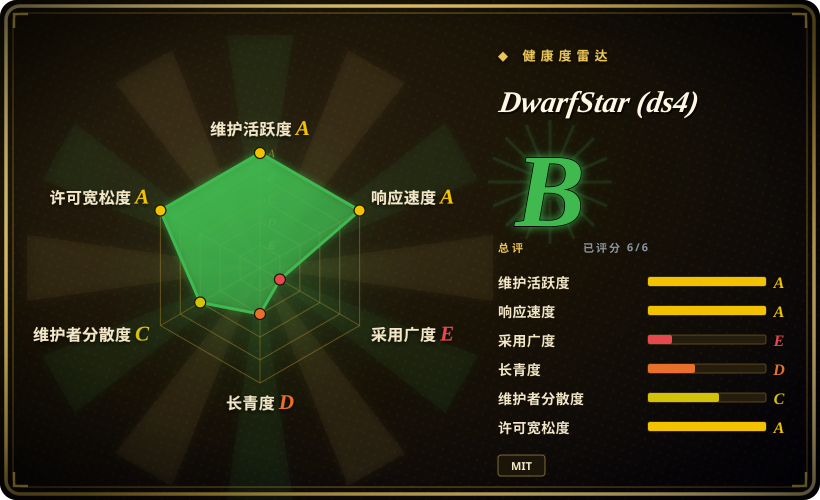
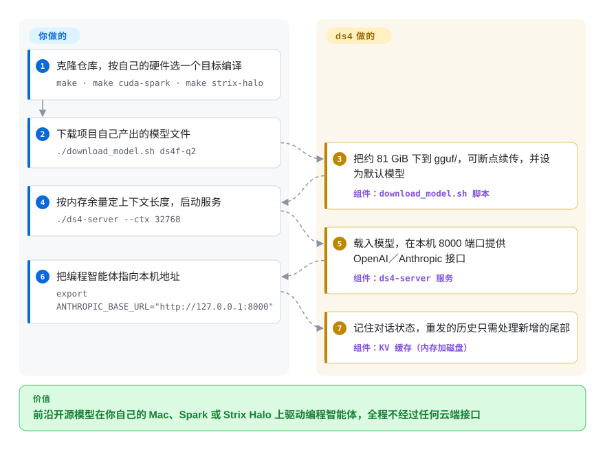

# DwarfStar (ds4)

能带得动编程智能体的开源大模型，文件动辄 80 GB 到几百 GB；在你自己买得起的那台机器上，通用推理引擎要么还不认识最新的模型，要么跑得很慢。DwarfStar 是一个只为少数几个模型手工适配的小型 C 引擎：让它们跑在 Mac、NVIDIA DGX Spark 或 AMD Strix Halo 主机上，内存装不下的部分直接从固态硬盘现读。

## 何时使用

你有一台 128 GB 内存的 MacBook Pro（或者一台 DGX Spark、一台 Framework Desktop），想让 Claude Code、Codex CLI、OpenCode 或 Pi 接上前沿开源模型——DeepSeek V4 Flash、GLM 5.3 Flash、Qwen3.8 Flash Next——并且任何数据都不出这台机器。你要的那个文件按 2 比特量化约 81 GiB，再大一档是 341 GiB；通用引擎得先支持每一种新架构才能加载它，内存比文件小的机器更是根本起不来。你克隆 ds4，执行 `make`，执行 `./download_model.sh ds4f-q2`，启动 `./ds4-server --ctx 32768`，再把智能体指向 `http://127.0.0.1:8000`。

和 [llama.cpp](llama-cpp.zh.md)、[Ollama](ollama.zh.md) 相比，当你的模型恰好在 ds4 的名单里、又需要那些引擎没有默认提供的路径时选它：模型比内存大时从固态硬盘流式读取、用模型自带的预测头做投机解码、两台 Mac 用 Thunderbolt RDMA 连成一台、或者在较老的 Ada 代 NVIDIA 显卡上跑 DeepSeek V4 Flash。和 [FreeToken](freetoken.zh.md) 相比，当机器是 Mac 或统一内存主机、而不是带独立 NVIDIA 显卡的台式机时选它。决定性的取舍：你换来一个按模型、按机器逐一调过的引擎，放弃的是通用性——它只加载自己脚本产出的 GGUF 文件，没有带版本号的发布，更好的模型出现时旧模型会被移除。

## 怎么用起来

大多数引擎的目标是“什么模型都能跑”，ds4 反着来：它为每个支持的模型、在每类 GPU（苹果 Metal、NVIDIA CUDA、AMD ROCm）上各写了一条专用推理路径。它瞄准的都是 MoE（混合专家）模型——每一层里放着很多小的“专家”子网络，处理每个 token（模型读写的词片段）时只有少数几个专家被激活。ds4 把这些专家压到每个权重约两比特，始终要用的部分保留更高精度，于是一个 2840 亿参数的模型能压进约 81 GiB。连这也装不下时，`--ssd-streaming` 只在内存里留一份有上限的常用专家缓存，其余的用到时再从模型文件里读——就像工坊只把手头在用的工具放在台面上，别的要用再去库房拿。服务端还会记住 KV 状态（模型对已有对话的工作记忆）并可存到磁盘，智能体把整段历史重发过来时，只需处理新增的尾巴。你决定编译目标、下载哪个模型、上下文多长；加载、内存预算、提示词格式、工具调用解析和接口服务由 ds4 完成。另有一条不经过服务端的入口：`ds4-agent` 是内置的终端编程智能体，直接驱动模型，会话存在 `~/.ds4/kvcache` 下。

<!-- flow-steps:begin (generated from flows/ds4.json by tools/flow_card.py — do not edit) -->

流程文字版

1. **你**：克隆仓库，按自己的硬件选一个目标编译 — `make · make cuda-spark · make strix-halo`
2. **你**：下载项目自己产出的模型文件 — `./download_model.sh ds4f-q2`
3. **DwarfStar (ds4)**：把约 81 GiB 下到 gguf/，可断点续传，并设为默认模型 — 组件：`download_model.sh 脚本`
4. **你**：按内存余量定上下文长度，启动服务 — `./ds4-server --ctx 32768`
5. **DwarfStar (ds4)**：载入模型，在本机 8000 端口提供 OpenAI／Anthropic 接口 — 组件：`ds4-server 服务`
6. **你**：把编程智能体指向本机地址 — `export ANTHROPIC_BASE_URL="http://127.0.0.1:8000"`
7. **DwarfStar (ds4)**：记住对话状态，重发的历史只需处理新增的尾部 — 组件：`KV 缓存（内存加磁盘）`

**价值**：前沿开源模型在你自己的 Mac、Spark 或 Strix Halo 上驱动编程智能体，全程不经过任何云端接口

<!-- flow-steps:end -->

## 何时不用

- **模型不在 ds4 名单里，改用 [llama.cpp](llama-cpp.zh.md) 或 [Ollama](ollama.zh.md)。** `docs/MODELS.md` 开头就写着“DwarfStar is not a general GGUF runner”：只支持 `download_model.sh` 拉下来的文件（或用 `gguf-tools/` 自己构建的），别的 GGUF“may have unsupported tensor layouts, metadata, or quantization mixes”。
- **统一内存不到约 64 GB，或只有一张 16–32 GB 的游戏显卡，改用 [FreeToken](freetoken.zh.md)（NVIDIA 台式机加大内存）或在 [Ollama](ollama.zh.md) 下跑小量化模型。** Metal 指南里最小的一档是 64 GB 配 SSD 流式读取，96 GB 才是第一档常驻内存；README 写明首要目标是“Macs with 96 GB or more”。
- **用 Windows，或没有受支持的 GPU，改用 [llama.cpp](llama-cpp.zh.md)。** 构建指南只覆盖 macOS Metal、Linux CUDA（DGX Spark 与多卡）和 Strix Halo 上的 Linux ROCm。`make cpu` 只是“a reference/debug path, not the production performance target”，`CONTRIBUTING.md` 还提醒在 Mac 上跑 CPU 路径“can crash the system because of a kernel bug in macOS”。
- **需要可固定版本号的依赖，改用 [Ollama](ollama.zh.md) 或 [llama.cpp](llama-cpp.zh.md)。** 截至 2026-10-08，仓库没有任何 tag，也没有 GitHub release，只能编译 `main`。README 自称“very fast changing … beta quality”，并说模型支持“is intentionally opportunistic”，“a model may be removed when a better replacement arrives”。
- **服务对象是一个团队而不是你自己，改用 [vLLM](../serving-engines/vllm.zh.md)。** `--batched-session N` 能开多个并发槽位，但好几种模型与后端的组合会退回逐行执行（文档原话：“concurrency and scheduling fairness, not the aggregate speedup”），多用户数据只来自一套八张 L40S 的机器。
- **端口或集群链路会被不可信的人访问到，就在前面加一层带鉴权的代理（例如 [Kong](../../api-gateway/kong.zh.md)），或改用带 API key 的 [vLLM](../serving-engines/vllm.zh.md)。** `docs/SERVER.md` 要求你“put authentication and TLS in front of the server”；客户端示例里的 `dsv4-local` 只是占位符，分布式模式的“network protocols have no authentication or encryption”。
- **应用依赖按 schema 约束的 JSON 输出，改用 [vLLM](../serving-engines/vllm.zh.md) 或带语法约束的 [llama.cpp](llama-cpp.zh.md)。** 要求支持 OpenAI 式结构化输出的 issue #210（2026-05-20 提出）到 2026-10-08 仍未关闭。
- **不能接受推理栈里有 AI 写的代码，改用 [llama.cpp](llama-cpp.zh.md)。** README 的“AI full disclosure”一节说引擎是“developed with strong assistance from AI coding agents”，并直说：“If you are not happy with AI-developed code, this software is not for you.”
- **想把一个模型摊到三台以上的 Mac 上并自动发现节点，去看 exo。** ds4 的张量并行固定是两台机器，Thunderbolt RDMA 链路要手工配置；流水线模式要手工分配层范围，而且每个节点必须是同一个 commit。

## 横向对比

| 替代品 | 是否收录 | 我们的评价 | 取舍 |
|---|---|---|---|
| [llama.cpp](llama-cpp.zh.md) | ✅ | 模型在 ds4 名单里，又要在 Mac、Spark 或 Strix Halo 上用 SSD 流式读取、模型原生投机解码或双机张量并行时选 ds4；其余所有模型、Windows 或纯 CPU 机器、以及需要加载任意 GGUF 时选 llama.cpp。 | ds4 自己说没有 llama.cpp 就不会有它，并沿用了其中一部分量化代码。得到的是按模型、按机器的专门调优；付出的是不到十个模型的名单、没有发布版本、代码每周都在变。 |
| [FreeToken](freetoken.zh.md) | ✅ | 机器是带独立 NVIDIA 显卡、内存远大于显存的 Linux 台式机时选 FreeToken；内存是统一的（Apple Silicon、DGX Spark、Strix Halo），或模型比内存本身还大、必须溢出到固态硬盘时选 ds4。 | 两者都利用 MoE 的稀疏性服务单人的编程智能体。FreeToken 直接加载原始 safetensors，把专家卸载到内存；ds4 要用自己的 2 比特或 4 比特 GGUF，把专家卸载到磁盘，并多出 Metal、ROCm 和多机模式。 |
| [omlx](omlx.zh.md) | ✅ | 想在 Mac 上起一个能跑 MLX 大量模型、带 SSD 分层 KV 缓存的服务时选 omlx；目标是某个前沿 MoE 模型、而 MLX 量化版在你的 Mac 上装不下或跑不动时选 ds4。 | omlx 继承了 MLX 的模型覆盖面；ds4 支持的模型少得多，但从固态硬盘流式读取的是权重本身（不只是 KV 状态），并且也能跑在 NVIDIA 和 AMD 上。 |
| [MTPLX](mtplx.zh.md) | ✅ | 只关心在 Mac 上跑 Qwen 3.8、要的就是精确投机解码外加一个应用外壳时选 MTPLX；还想跑 DeepSeek 或 GLM、用非 Mac 硬件、或需要 SSD 流式读取时选 ds4。 | 两者都用模型自带的多 token 预测头。ds4 里投机解码要手动打开（`--mtp`），文档也承认“not every workload benefits”；MTPLX 则把它做成了产品本身。 |
| [vLLM](../serving-engines/vllm.zh.md) | ✅ | 有数据中心级 GPU、显存装得下模型、又要服务很多用户时选 vLLM；硬件是个人机器或几张旧卡、不靠激进的专家量化就装不下模型时选 ds4。 | vLLM 带来连续批处理、结构化输出、API key 和正式发布；ds4 带来的是在消费级硬件上跑比内存还大的模型，共享服务需要的其他东西它几乎都没有。 |
| exo | 未收录 | 想让多台设备自动互相发现并合并内存时选 exo（其 README 列出自动发现、Thunderbolt RDMA 和最多四台机器的张量并行）；模型在 ds4 名单里、还想用它的 2 比特文件和 SSD 流式读取时选 ds4。 | 真实仓库（exo-explore/exo，Apache-2.0，截至 2026-10 为 4.78 万 star）——本轮标签页批次未收录。两者没有做过对比测试，评价只基于文档描述的搭建方式。 |

## 技术栈

- **语言与形态：** C 语言，除一个 `Makefile` 外没有构建系统。核心是几个非常大的文件——`ds4.c`（3.8 MB）、`ds4_metal.m`（2.3 MB，Objective-C 加 Metal）、`ds4_cuda.cu`（1.5 MB）、`ds4_server.c`（0.9 MB）、`ds4_agent.c`（0.5 MB）——大小取自 2026-10-08 的 GitHub contents API。
- **可执行文件：** `ds4`（交互式命令行）、`ds4-server`（HTTP 接口）、`ds4-agent`（原生终端编程智能体）、`ds4-bench`（吞吐扫描）、`ds4-eval`（内置能力回归测试），以及测试运行器 `ds4_test`。
- **后端：** 苹果 Metal（首要目标）、NVIDIA CUDA 加 cuBLAS（DGX Spark、进程内张量并行的多卡）、面向 Strix Halo 的 AMD ROCm；CPU 构建只用于调试。
- **服务接口：** `GET /v1/models`、`POST /v1/chat/completions`、`/v1/responses`、`/v1/completions` 以及 Anthropic 风格的 `/v1/messages`，支持工具调用和 SSE 流式输出；磁盘 KV 缓存（`--kv-disk-dir`）建立在基数树 `rax.c` 之上。
- **内置的第三方代码：** `linenoise`（行编辑）和 `rax`，都出自同一作者；`third_party/iris` 下的 PNG 与 JPEG 解码器；GGUF 量化布局和部分算子改编自 llama.cpp 与 GGML（`LICENSE` 里保留了 ggml 作者和 DeepSeek 的版权行）。
- **模型工具：** `gguf-tools/` 里是量化器（C 与 Python）、imatrix 数据和基于官方续写的质量评分器；`dir-steering/` 提供激活方向引导向量。

## 依赖

- **硬件：** 常驻内存推理需要 96 GB 以上的 Apple Silicon Mac（配 SSD 流式读取可降到 64 GB），或一台 NVIDIA DGX Spark，或一张到多张 CUDA 显卡（文档点名 Ada 代的 L40S），或一台 AMD Strix Halo 主机。
- **工具链：** macOS 上装苹果命令行开发者工具；Linux 上装 NVIDIA 驱动和 CUDA 工具包（`nvcc`、cuBLAS）；Strix Halo 上装 ROCm。没有安装包，克隆后自己编译。
- **磁盘与网络：** 一块快速的本地固态硬盘，每个模型 81–483 GiB（DeepSeek V4.1 Flash Q4 的两段文件合并时还要额外 37 GiB 空间）。权重从维护者账号下的 Hugging Face 仓库下载，部分目标需要 Hugging Face 命令行工具。
- **双机模式：** 一根 Thunderbolt 线和可用的 RDMA verbs 设备（也支持 TCP），两台机器上各有一份完整的模型文件，并且是同一个 commit。
- **无外部服务：** 不需要数据库、守护进程管理器，推理时也不需要 Python。

## 运维难度

**中等。** 顺利的话就是三条命令——编译、下载、运行——引擎自己决定缓存大小，放不下的布局会直接拒绝（文档原话：“Do not bypass the memory guard”）。之所以不算低：没有可固定的发布版本，升级就是在自称 beta 的 `main` 上 `git pull` 再重新编译；模型、量化档位、上下文长度和会话数要一起塞进内存，这个组合得你自己挑，各平台的参考表也自称“starting points, not guarantees”；首次下载是几十到几百 GB；分布式模式还要配 RDMA 网口、调高 GPU 固定内存上限、保证各节点 commit 完全一致。跟踪日志和 KV 缓存文件里有提示词原文，缓存目录要当作私密数据对待。

## 健康度与可持续性

- **维护状态（2026-10-08）：** 此前非常密集，目前停顿。GitHub 提交活动接口显示 8 月中到 9 月中每周 53–73 次提交，之后默认分支的最后一次提交和全仓库最后一次推送都停在 2026-09-20——已经 18 天没有动静，而新的 issue 和 PR 仍在进来（#1182–#1196，2026-10-05 至 10-08）。没有 tag，没有 release。
- **治理与巴士因子：** 一个人。仓库属于个人账号（antirez，即 Redis 的原作者 Salvatore Sanfilippo）；贡献最多的 12 人共 631 次提交，其中 494 次是他的（78%）。有一份对正确性和速度回归提出要求的 `CONTRIBUTING.md`，但没有治理文档、安全策略或 CODEOWNERS。
- **背书与林迪效应：** 仓库创建于 2026-05-06，只有五个月左右，林迪先验给不了多少分。能抵消一部分的是作者二十年来持续交付并维护 C 语言基础设施的记录；没有任何公司或基金会被写明是这个项目的支持方。
- **采用情况：** 五个月 2.37 万 star、2280 个 fork，硬件社区活跃（Strix Halo 讨论帖 issue #16 有 268 条评论）。年轻仓库上涨得这么快的 star 说明的是关注度，不是生产使用量。
- **风险信号：** 贡献积压——485 个未处理的 PR，对比 37 个已合并、239 个未合并就关闭；286 个未关闭的 issue，对比 144 个已关闭；被取代的模型按设计就会被移除；代码公开承认由 AI 辅助编写；服务端和集群链路都没有鉴权。
- **结论：** 就这一小批前沿 MoE 模型而言，它是目前在个人 Mac、Spark 或 Strix Halo 上运行它们文档最完整的方式，作者也有信誉；同时它是单人维护、没有发布版本、只有五个月大的移动靶。适合装在自己的工作站上并固定一个 commit，不适合在上面搭产品或团队服务。

## 存疑（未验证）

- [未验证] 所有速度数字都是作者自己记录的，本次没有复跑（需要对应硬件和 80–480 GiB 的权重）：八张 L40S 上“about 126 t/s aggregate generation with 16 sessions”、M5 Max 吞吐图，以及 `docs/SSD_STREAMING.md` 里的 SSD 流式读取表（生成 11.9–19.3 t/s）。
- [未验证] 2 比特量化后的输出质量：能找到的唯一第三方数字是 issue #389 里一位用户的报告（用 `q2-imatrix` 在 SWE-Bench Verified 随机抽取的 100 题里做对 76 题）；那是单个用户的测试装置加一个子集，不是官方成绩，我们也没有复现。
- [推断] 2026-09-20 之后 18 天没有提交，可能只是正常停顿而不是降速——依据只有提交活动接口和 `pushed_at` 时间戳；在最近的 issue 评论里没有找到维护者对此的说明。
- [推断] 已合并 PR 数偏低（37 个）低估了实际被采纳的贡献：默认分支最近的提交带着其他作者的名字（例如 Emilian Bold、Jake Maness），说明维护者倾向于手工应用补丁而不是点合并。依据是最近八次提交的作者字段，没有逐个追溯到对应 PR。
- [未验证] 模型权重本身的许可证没有核对（DeepSeek、GLM、Qwen 的检查点被转成 GGUF 放在维护者的 Hugging Face 账号下）；MIT 许可证只覆盖引擎。仓库里 `licenses/Apache-2.0.txt` 具体对应哪部分代码也没有追查。
- [未验证] 本页出现的模型名称和体积（DeepSeek V4 与 V4.1 Flash、GLM 5.2 与 5.3、Qwen3.8 Flash Next；2840 亿参数、Q2 约 81 GiB）都引自仓库的 README、`MODEL_CARD.md` 和 `docs/MODELS.md`，没有打开上游模型卡核对。
- [未验证] Windows：文档完全没有提到，也没有测试 WSL2 下的 CUDA 构建能否工作。
- [未验证] exo 和对比表里的其他项目都没有与 ds4 在同一硬件上做过基准测试，评价基于文档描述的机制和平台范围。
- [未验证] 投机解码的收益：`docs/SPECULATIVE_DECODING.md` 承认并非所有负载都受益，未关闭的 issue #695 和 #733 报告在 Metal 上接受率 70–83% 的情况下反而变慢；`main` 上是否已修复没有确认。
