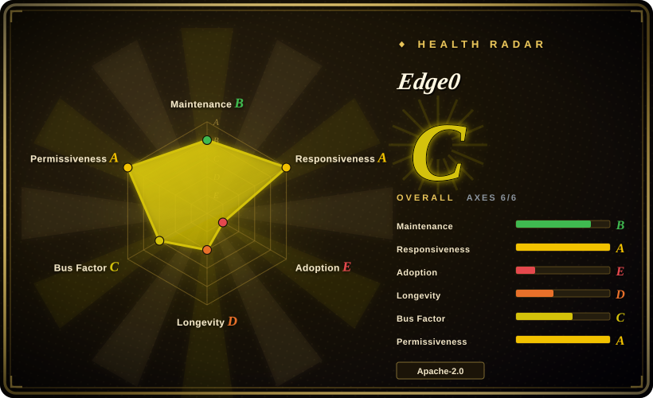
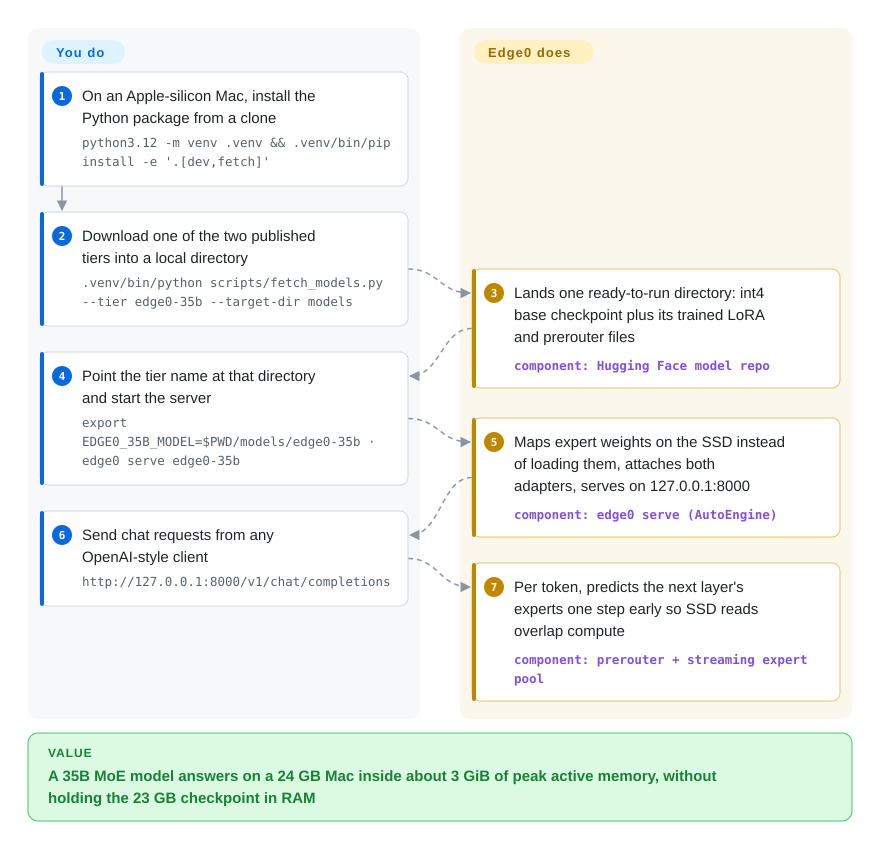

# Edge0

A 35-billion-parameter model is still about 23 GB at 4-bit, so on a 16–24 GB laptop or a phone it either refuses to load or swaps until each word takes seconds. Edge0 leaves the model on the SSD and reads in only the handful of "expert" slices each word actually uses, with a small trained predictor that fetches them one step early — but it runs only its own two published models.

## When to use

You have a Mac mini with 24 GB, or a 16 GB MacBook, and you want a capable local assistant — something in the Qwen3.6-35B-A3B class — behind an OpenAI-style endpoint, with nothing leaving the machine. The 4-bit checkpoint is ~23 GB; loaded the usual way it competes with everything else for memory, and on a 16 GB machine it simply does not fit. Edge0's `edge0-35b` tier is that model already prepared for streaming: you download one directory, run `edge0 serve edge0-35b`, and the authors' benchmark shows 14.9–17.7 tok/s at 2.9 GiB peak active memory on a 24 GB M4 Pro. The same two models also ship as on-device apps you build yourself for iPhone, Android, macOS and Windows.

Pick it over [llama.cpp](llama-cpp.md) or [MLX / mlx-lm](../../on-device-ml/mlx-mlx-lm.md) when the deciding constraint is memory, not model choice: those engines want the weights resident (or rely on the OS paging an mmapped file blindly), while Edge0 ships a trained predictor that tells the loader which experts the next layer will need before it gets there. Pick it over [ds4](ds4.md) when your machine has 16–24 GB rather than 96 GB and a 35B-class model is enough. The deciding tradeoff: memory footprint and an out-of-the-box pipeline, paid for with a model list of exactly two preview checkpoints, a small accuracy loss against the fp16 base (3.9 points on the authors' average for the 35B tier), and a one-month-old codebase.

## How it works

A Mixture-of-Experts (MoE) model is built from layers that each hold many small sub-networks called *experts*; for any one token (a word-piece the model reads or writes) only a few experts per layer fire — 4 of 256 in the 35B tier. Edge0 keeps all experts on disk and memory-maps them (the OS reads file pages in only when touched), so RAM holds the always-used parts plus whichever experts are active. The catch is timing: you only learn which experts layer N+1 needs once layer N has finished, which is too late to hide a disk read. Edge0's *prerouter* is a small trained head per layer that guesses the next layer's experts one token ahead, and the guess is used *as* the routing — like a kitchen porter who reads the next ticket and brings the ingredients before the cook asks, with the cook agreeing to use whatever arrives. Because that substitution plus 4-bit quantization costs accuracy, the authors also train *Recover-LoRA* adapters (small add-on weight matrices kept separate from the read-only base) that win most of it back. You pick a tier, download its directory and start `edge0 serve`; Edge0 does tier detection, adapter loading, expert streaming, prefetch and the OpenAI-compatible API. The platform apps (`ios/`, `macos/`, `android/`, `windows/`) are a second way in: the macOS app wraps a Rust daemon around a C++/Metal engine, while Android and Windows replay Edge0's patches onto a pinned llama.cpp.

<!-- flow-steps:begin (generated from flows/edge0.json by tools/flow_card.py — do not edit) -->

Text version of the flow

1. **You**: On an Apple-silicon Mac, install the Python package from a clone — `python3.12 -m venv .venv && .venv/bin/pip install -e '.[dev,fetch]'`
2. **You**: Download one of the two published tiers into a local directory — `.venv/bin/python scripts/fetch_models.py --tier edge0-35b --target-dir models`
3. **Edge0**: Lands one ready-to-run directory: int4 base checkpoint plus its trained LoRA and prerouter files — component: `Hugging Face model repo`
4. **You**: Point the tier name at that directory and start the server — `export EDGE0_35B_MODEL=$PWD/models/edge0-35b · edge0 serve edge0-35b`
5. **Edge0**: Maps expert weights on the SSD instead of loading them, attaches both adapters, serves on 127.0.0.1:8000 — component: `edge0 serve (AutoEngine)`
6. **You**: Send chat requests from any OpenAI-style client — `http://127.0.0.1:8000/v1/chat/completions`
7. **Edge0**: Per token, predicts the next layer's experts one step early so SSD reads overlap compute — component: `prerouter + streaming expert pool`

**Value**: A 35B MoE model answers on a 24 GB Mac inside about 3 GiB of peak active memory, without holding the 23 GB checkpoint in RAM

<!-- flow-steps:end -->

## When NOT to use

- **If you want to run any model other than Edge0's two tiers, use [llama.cpp](llama-cpp.md), [Ollama](ollama.md) or [MLX / mlx-lm](../../on-device-ml/mlx-mlx-lm.md).** The registry holds `edge0-35b` (Qwen3.6-35B-A3B base) and `edge0-8b` (Ling 3.0 tiny base). `docs/adding-a-model.md` shows that a new family needs its own adapter module, and the pipeline's value depends on trained prerouter heads and LoRA for that model; `--no-prerouter --no-lora` runs a plain base, which gives up the point of the project.
- **If you need the exact output of the base model, run Qwen3.6-35B-A3B itself under [MLX / mlx-lm](../../on-device-ml/mlx-mlx-lm.md) or [llama.cpp](llama-cpp.md) on a machine with enough RAM.** Edge0 replaces the model's own routing with predicted routing and quantizes to int4; on the authors' OpenCompass runs the 35B tier drops from 92.7 to 86.6 on AIME 2026 and averages 3.9 points below fp16. Issue #109 asking for independent eval verification is still open (2026-10-09).
- **If you are on Linux or an NVIDIA GPU, use [FreeToken](freetoken.md) (NVIDIA desktop, experts in host RAM) or [llama.cpp](llama-cpp.md).** The Python framework runs only on macOS with Apple Silicon; the CUDA backend is a reserved directory promised for Q4 2026 (issue #107 open), and a user's Linux attempt in issue #128 produced "totally broken" replies. Windows has an app, but it is a llama.cpp build with Vulkan, not the Python pipeline.
- **If you need a hard RAM ceiling or own an 8 GB machine, size against the real resident numbers, not the headline.** The GitHub description says "~2.5 GB of RAM"; the README's 2.9 GiB is the MLX allocator peak, and the maintainer confirmed in issue #106 that process RSS is higher (the macOS app's own table shows 4 GB resident for 35B on an M3 Air). An 8 GB M1 user measured ~0.7 tok/s (issue #17) because decode becomes page-fault bound. On tight RAM a small dense model under [Ollama](ollama.md) is the safer choice.
- **If more than one person will call the endpoint, use [vLLM](../serving-engines/vllm.md).** The Python server is a "single-slot serving loop" that serializes generations behind a lock and has no authentication; the macOS daemon requires a bearer token only for non-loopback access, and the Windows engine is loopback-only.
- **If you need a pinned, upgradeable dependency, use [llama.cpp](llama-cpp.md) or [Ollama](ollama.md).** There are no tags or releases, the package is not on PyPI, both checkpoints are named `-preview`, and `pyproject.toml` pins `mlx==0.30.6` / `mlx-lm==0.31.0` exactly because older mlx garbles output on A18 chips and newer mlx/mlx-lm crash its streaming threads.
- **If you want a phone demo without a build toolchain, use [Google AI Edge Gallery](../../on-device-ml/ai-edge-gallery.md).** Edge0's iPhone app is built from Xcode with your own bundle ID and signing team and embeds the weights (a 35B build is ~20 GB); Android needs NDK r28 and a llama.cpp patch replay; the Windows installer is unsigned and does not bundle the engine yet.

## Comparison

| Alternative | In index | Our verdict | Tradeoff |
|---|---|---|---|
| [llama.cpp](llama-cpp.md) | ✅ | Pick llama.cpp when you need any GGUF model, Linux/CUDA/CPU targets or a stable embedding surface; pick Edge0 when you specifically want a 35B MoE on a 16–24 GB Mac or phone and accept its two preview models. | Edge0's Android and Windows engines *are* llama.cpp (pinned b11100) plus replayed patches (20 for Android, 8 for Windows), so on those platforms you inherit llama.cpp's behaviour and Edge0's rebase lag. llama.cpp gains breadth; Edge0 adds trained prefetch and recovery adapters for its own checkpoints. |
| [DwarfStar (ds4)](ds4.md) | ✅ | Pick ds4 when you own a 96 GB+ Mac, DGX Spark or Strix Halo and want frontier MoE models (DeepSeek V4, GLM 5.x) for a coding agent; pick Edge0 when the machine has 16–24 GB and a 35B-class model is enough. | Both stream experts from SSD. ds4 hand-tunes a few huge models with 2-bit experts and reactive caching; Edge0 targets far smaller memory with a learned one-step-ahead predictor, but only for its own two checkpoints. |
| [FreeToken](freetoken.md) | ✅ | Pick FreeToken for a Linux desktop with a discrete NVIDIA card and plenty of host RAM; pick Edge0 on Apple Silicon or phones where the experts must come from flash storage. | FreeToken loads original safetensors and keeps all experts in host RAM with a GPU cache — RAM must hold the experts; Edge0 needs only the active set in RAM but runs only models it has trained adapters for. |
| [MLX / mlx-lm](../../on-device-ml/mlx-mlx-lm.md) | ✅ | Pick mlx-lm when the model fits your Mac's RAM and you want broad Hugging Face coverage, quantization and fine-tuning from one package; pick Edge0 when the same MoE would not fit and you accept its prepared checkpoint. | Edge0's Python backend is built on mlx 0.30.6 and vendors an mlx-lm model file, adding streaming, prefetch and LoRA hooks; it also pins those versions exactly, so you cannot follow mlx-lm releases. |
| [AirLLM](airllm.md) | ✅ | Pick AirLLM for offline scoring or capability checks where the exact unquantized weights matter and seconds per token is acceptable; pick Edge0 for interactive chat at double-digit tok/s. | AirLLM streams whole layers with no prediction and keeps the original weights; Edge0 streams only predicted experts of int4 weights, trading some accuracy for interactive speed. |

## Tech stack

- **Python framework (`python/`):** Python 3.10+ on MLX 0.30.6 / mlx-lm 0.31.0 (Metal), with `safetensors`, `tokenizers`, `numpy`, `psutil`; `transformers`-style `AutoModel` / `AutoConfig` / `AutoEngine`; core logic depends only on a backend facade (`backends/base.py`), with MLX code isolated under `backends/mlx/`. Vendored model files: `qwen3_next.py` from mlx-lm (MIT) and `bailing_hybrid.py` from the Ling 3.0 MLX port (Apache-2.0), both with added hooks.
- **Serving:** a stdlib (or optional Flask) HTTP server exposing `/v1/chat/completions` (SSE streaming, OpenAI-style tool calls since PR #119), `/v1/models`, `/healthz`.
- **macOS app:** Rust workspace (`edge0` CLI, `edge0d` daemon, `edge0-engine`, `edge0-pull` downloader) over a C++/Metal native engine built on a vendored MLX v0.30.6 (`third_party/mlx`, MIT); Tauri 2 + React 19 UI.
- **iOS app:** SwiftUI + MLX Swift (`Edge0Core`, `Edge0MLX`), with Python tools that repack the 35B experts into one sequential file per layer.
- **Android / Windows:** pinned upstream llama.cpp (commit 7ab4ee7, b11100) materialized by scripts, with Edge0 patch bands (`patches/llama.cpp/{common,android,windows}`) replayed via `git am --3way`; Android is Kotlin + JNI on CPU with NEON kernels and a demand-paged expert pool; Windows is a Tauri shell over `llama-server` with Vulkan for dense layers and experts on CPU; an MLX→GGUF converter in `windows/tools`.
- **Models:** `Edge0-35B-A3B-preview` (40 layers, 256 experts, prerouter K=4) and `Edge0-8B-A1B-preview` (24 layers, 128 experts, K=8) on Hugging Face and ModelScope, Apache-2.0 per their model cards.

## Dependencies

- **Hardware:** for the Python framework, an Apple Silicon Mac (M1–M4; the macOS app requires M3 or later and macOS 14+) and a fast internal SSD. iPhone on iOS 17+; Android arm64 on API 33+ with 8 GB (8B) or 12–16 GB (35B); Windows 10/11 x64 with a Vulkan GPU and 8–16 GB+ RAM.
- **Disk:** ~23 GB for `edge0-35b`, ~4.2 GB for `edge0-8b`; ≥30 GB free for the Android/Windows GGUF conversion.
- **Toolchains (platform apps):** Xcode + Metal toolchain (iOS/macOS), CMake, Rust 1.88, Node 22 (macOS app); JDK 17, Android SDK 35, NDK r28 (Android); Visual Studio 2022, Vulkan SDK, Rust, Node, Python+numpy (Windows).
- **Network:** model download from Hugging Face (or ModelScope); the apps download on first use. No hosted service is needed at inference time.

## Ops difficulty

**Low for the Python path, medium-to-high for the platform apps.** On a Mac the path is a venv install, one model download and `edge0 serve`, and adapters load automatically from the model directory. What raises it: the exact mlx/mlx-lm pins mean you manage a dedicated environment and cannot upgrade MLX on your own; there is no release to pin, so updates are `git pull` on `main` (fixes such as `--prefill-ondemand` for 16 GB first-token latency arrived that way); performance depends on page-cache state, so the first request after a restart or under memory pressure is far slower (issue #110 measured 7–13 s to first token on a 16 GB M1 Pro before the fix). The platform apps are build-from-source projects with heavy toolchains, unsigned or ad-hoc-signed binaries, and — on Android/Windows — a llama.cpp patch stack that must re-apply cleanly.

## Health & viability

- **Maintenance (2026-10-09):** active but bursty. 97 commits since the 2026-09-07 first commit, mostly in the first week; then platform code landed on 2026-09-30 and the last push was 2026-10-04. No tags or GitHub releases.
- **Governance / bus factor:** an organization account (Edge0, created 2026-07-29, homepage edge0.ai) but effectively one lead: `linyubupa` has 74 of 97 commits and merges the PRs, and the four platform directories were added in a single drop by a second contributor. 17 PRs merged, 14 open; outside contributors' fixes (tool calling, converter) are being merged.
- **Backing & Lindy:** about one month old, so the Lindy prior gives it almost nothing. The counterweights are a published technical report (arXiv 2609.18063, 2026-09-16) and released model weights; no funding or company track record is documented in the repo.
- **Adoption:** 3,967 stars and 616 forks in one month, and the 35B checkpoint shows 81.5k downloads and 3,566 likes on Hugging Face (2026-10-09). That is attention, not production use, and the fork ratio is unusually high for a repo this young [推断: compared with typical star/fork ratios, not investigated].
- **Responsiveness:** the maintainer answers technical issues in depth and owns mistakes (issue #106 reconciles memory figures; #110 traces and fixes a no-op flag), though spam issues (#127–#131) also arrive.
- **Risk flags:** the core claims (memory, speed, quality) are self-measured; the roadmap's "unified inference framework" and CUDA backend are promises; Android/Windows depend on keeping their llama.cpp patch bands (20 and 8) applying cleanly to a pinned upstream. Apache-2.0 with a NOTICE that keeps the vendored mlx-lm, MLX and Ling licences.
- **Verdict:** a credible, well-documented research release worth trying on your own Mac if you want a 35B MoE in a small memory budget; too young, too narrow (two preview models) and too unpinned to build a product on yet.

## Caveats (unverified)

- [未验证] All speed and memory figures (README 14.9–17.7 tok/s and 2.9 GiB on an M4 Pro; app tables for M3 Air, iPhone 16 Pro, Snapdragon 8 Elite, RX 9070 GRE) are author-measured; we did not reproduce them (needs the hardware and 4–23 GB of weights).
- [未验证] The quality table (OpenCompass, AIME/HumanEval/GPQA/MMLU-Pro/IFBench) was run by the authors; issue #109 asking for independent verification is open and we did not rerun it.
- [未验证] The GitHub description's "~2.5 GB of RAM" does not match the README's 2.9 GiB peak or the macOS app's 4 GB resident figure; which configuration produces 2.5 GB was not found.
- [推断] `linyubupa` being the paper's first author (Yu Lin) is inferred from the name and the maintainer role; not confirmed from a profile.
- [推断] The high fork-to-star ratio and fast Hugging Face likes may reflect launch promotion rather than usage; we have no data on who forked or why.
- [未验证] Upstream licences of the base models (Qwen3.6-35B-A3B, Ling-3.0-tiny-base) were not opened; we relied on the Edge0 model cards' `apache-2.0` field.
- [未验证] The iOS, Android, macOS-app and Windows builds were not built or run; their requirements are quoted from each directory's README.
- [未验证] The Q4 2026 "unified inference framework" and CUDA backend are roadmap items; nothing on `main` yet delivers them.
- [未验证] Comparison verdicts were not benchmarked on shared hardware; they rest on each project's documented mechanism and platform scope.
- [未验证] The root `NOTICE` says "Copyright (c) 2025 edge0 contributors" while the repo was created in 2026; this looks like a template year, not a licence problem, but it was not clarified upstream.
