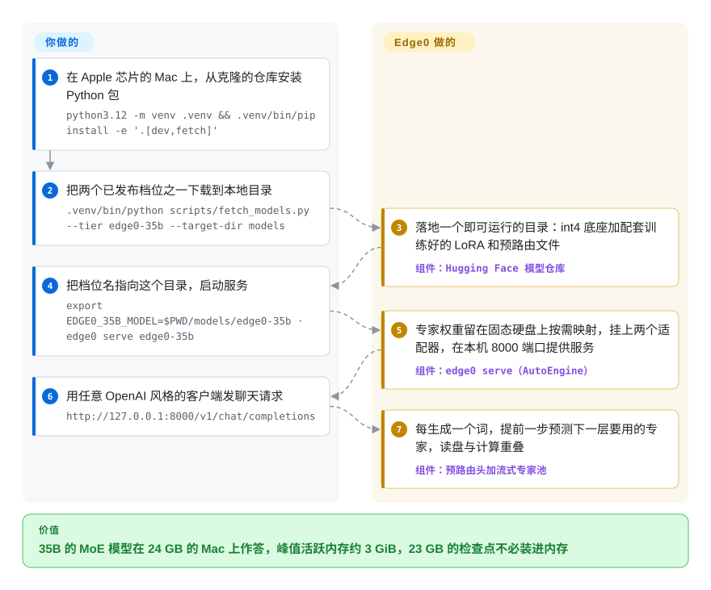

# Edge0

一个 350 亿参数的模型量化到 4 比特仍有约 23 GB，放到 16–24 GB 内存的笔记本或手机上，要么加载失败，要么疯狂换页、每个字要等好几秒。Edge0 把模型留在固态硬盘上，每生成一个词只读入真正用到的那几块“专家”权重，并用一个训练过的小预测器提前一步把它们取来——代价是它只能跑自家发布的两个模型。

## 何时使用

你有一台 24 GB 的 Mac mini 或一台 16 GB 的 MacBook，想在本地跑一个够用的助手——Qwen3.6-35B-A3B 这一档——挂在 OpenAI 风格的接口后面，数据不出机器。4 比特的检查点约 23 GB，按常规方式加载要和其他程序抢内存，在 16 GB 的机器上干脆装不下。Edge0 的 `edge0-35b` 档就是已经为流式读取准备好的这个模型：下载一个目录，运行 `edge0 serve edge0-35b`，作者在 24 GB 的 M4 Pro 上测得 14.9–17.7 tok/s、峰值活跃内存 2.9 GiB。同样的两个模型还配有 iPhone、Android、macOS 和 Windows 的端侧应用，需要你自己编译。

当决定性的约束是内存而不是模型选择时，选它而不是 [llama.cpp](llama-cpp.zh.md) 或 [MLX / mlx-lm](../../on-device-ml/mlx-mlx-lm.zh.md)：那些引擎要求权重常驻内存（或者让操作系统盲目地对映射文件换页），Edge0 则带着一个训练好的预测器，在下一层开算之前就告诉加载器它要用哪些专家。当机器只有 16–24 GB 而不是 96 GB、35B 这一档模型已经够用时，选它而不是 [ds4](ds4.zh.md)。决定性的取舍：换来的是内存占用和开箱即用的整条流水线，付出的是只有两个预览版检查点可选、相对 fp16 底座有少量精度损失（作者给出的 35B 档平均低 3.9 分），以及一个只有一个月大的代码库。

## 怎么用起来

MoE（混合专家）模型的每一层里有很多小的子网络，叫“专家”；处理每个 token（模型读写的词片段）时，每层只有少数几个专家参与——35B 档是 256 个里挑 4 个。Edge0 把全部专家放在磁盘上做内存映射（操作系统只在真正读到某页时才把它调进内存），于是内存里只有始终要用的部分加上当前活跃的专家。难点在时机：要等第 N 层算完才知道第 N+1 层要哪些专家，这时再读盘已经来不及把等待藏起来。Edge0 的“预路由头”是每层一个训练过的小网络，提前一个 token 猜出下一层的专家，并且直接把猜测当作路由结果使用——就像后厨帮工先看下一张单子、在厨师开口前把食材备好，而厨师答应就用送来的那些。这种替换加上 4 比特量化会损失精度，所以作者还训练了 Recover-LoRA 适配器（与只读底座分开存放的小块附加权重）把大部分精度补回来。你负责挑档位、下载目录、启动 `edge0 serve`；档位识别、适配器加载、专家流式读取、预取和 OpenAI 兼容接口由 Edge0 完成。各平台应用（`ios/`、`macos/`、`android/`、`windows/`）是另一条入口：macOS 应用是 Rust 守护进程包着一个 C++／Metal 引擎，Android 和 Windows 则把 Edge0 的补丁重放到一个固定版本的 llama.cpp 上。

<!-- flow-steps:begin (generated from flows/edge0.json by tools/flow_card.py — do not edit) -->

流程文字版

1. **你**：在 Apple 芯片的 Mac 上，从克隆的仓库安装 Python 包 — `python3.12 -m venv .venv && .venv/bin/pip install -e '.[dev,fetch]'`
2. **你**：把两个已发布档位之一下载到本地目录 — `.venv/bin/python scripts/fetch_models.py --tier edge0-35b --target-dir models`
3. **Edge0**：落地一个即可运行的目录：int4 底座加配套训练好的 LoRA 和预路由文件 — 组件：`Hugging Face 模型仓库`
4. **你**：把档位名指向这个目录，启动服务 — `export EDGE0_35B_MODEL=$PWD/models/edge0-35b · edge0 serve edge0-35b`
5. **Edge0**：专家权重留在固态硬盘上按需映射，挂上两个适配器，在本机 8000 端口提供服务 — 组件：`edge0 serve（AutoEngine）`
6. **你**：用任意 OpenAI 风格的客户端发聊天请求 — `http://127.0.0.1:8000/v1/chat/completions`
7. **Edge0**：每生成一个词，提前一步预测下一层要用的专家，读盘与计算重叠 — 组件：`预路由头加流式专家池`

**价值**：35B 的 MoE 模型在 24 GB 的 Mac 上作答，峰值活跃内存约 3 GiB，23 GB 的检查点不必装进内存

<!-- flow-steps:end -->

## 何时不用

- **想跑 Edge0 两个档位以外的任何模型，改用 [llama.cpp](llama-cpp.zh.md)、[Ollama](ollama.zh.md) 或 [MLX / mlx-lm](../../on-device-ml/mlx-mlx-lm.zh.md)。** 注册表里只有 `edge0-35b`（底座 Qwen3.6-35B-A3B）和 `edge0-8b`（底座 Ling 3.0 tiny）。`docs/adding-a-model.md` 说明新模型家族要写自己的适配模块，而整条流水线的价值依赖为该模型训练好的预路由头和 LoRA；用 `--no-prerouter --no-lora` 只能跑普通底座，等于放弃了这个项目的意义。
- **需要底座模型原样的输出，就在内存够大的机器上用 [MLX / mlx-lm](../../on-device-ml/mlx-mlx-lm.zh.md) 或 [llama.cpp](llama-cpp.zh.md) 直接跑 Qwen3.6-35B-A3B。** Edge0 用预测的路由替换了模型自己的路由，又量化到 int4；在作者的 OpenCompass 测试里，35B 档的 AIME 2026 从 92.7 降到 86.6，平均比 fp16 低 3.9 分。要求独立核验评测的 issue #109 到 2026-10-09 仍未关闭。
- **用 Linux 或 NVIDIA 显卡，改用 [FreeToken](freetoken.zh.md)（NVIDIA 台式机，专家放内存）或 [llama.cpp](llama-cpp.zh.md)。** Python 框架只支持搭载 Apple 芯片的 macOS；CUDA 后端只是一个预留目录，承诺 2026 年第四季度交付（issue #107 未关闭），issue #128 里有用户在 Linux 上硬跑，回复“totally broken”。Windows 有应用，但那是基于 Vulkan 的 llama.cpp 构建，不是 Python 那条流水线。
- **需要硬性的内存上限，或者只有 8 GB 的机器，按真实常驻内存估算，别看标题数字。** GitHub 简介写“~2.5 GB of RAM”；README 的 2.9 GiB 是 MLX 分配器的峰值，维护者在 issue #106 里承认进程 RSS 更高（macOS 应用自己的表格里，35B 在 M3 Air 上常驻 4 GB）。一位 8 GB M1 用户测得约 0.7 tok/s（issue #17），因为解码变成了被缺页中断卡住。内存紧张时，在 [Ollama](ollama.zh.md) 下跑一个小的稠密模型更稳妥。
- **不止一个人调用这个接口，改用 [vLLM](../serving-engines/vllm.zh.md)。** Python 服务端是“single-slot serving loop”，用一把锁把生成请求排成串行，而且没有鉴权；macOS 守护进程只在非本机访问时要求 bearer token，Windows 引擎只监听本机。
- **需要能固定、能升级的依赖版本，改用 [llama.cpp](llama-cpp.zh.md) 或 [Ollama](ollama.zh.md)。** 没有 tag，没有 release，PyPI 上也没有这个包，两个检查点名字都带 `-preview`；`pyproject.toml` 把 `mlx==0.30.6`、`mlx-lm==0.31.0` 锁死，因为旧版 mlx 在 A18 芯片上会输出乱码，新版 mlx 与 mlx-lm 又会让它的流式线程崩溃。
- **想在手机上看演示又不想装编译工具链，改用 [Google AI Edge Gallery](../../on-device-ml/ai-edge-gallery.zh.md)。** Edge0 的 iPhone 应用要在 Xcode 里填自己的 Bundle ID 和签名团队后编译，权重打包进应用（35B 版约 20 GB）；Android 需要 NDK r28 加一轮 llama.cpp 补丁重放；Windows 安装包没有签名，也还没把引擎打包进去。

## 横向对比

| 替代品 | 是否收录 | 我们的评价 | 取舍 |
|---|---|---|---|
| [llama.cpp](llama-cpp.zh.md) | ✅ | 需要任意 GGUF 模型、Linux／CUDA／CPU 目标或稳定的嵌入接口时选 llama.cpp；明确要在 16–24 GB 的 Mac 或手机上跑 35B 的 MoE、并接受只有两个预览模型时选 Edge0。 | Edge0 的 Android 和 Windows 引擎本身就是 llama.cpp（固定在 b11100）加重放补丁（Android 20 个、Windows 8 个），在这两个平台上你继承的是 llama.cpp 的行为和 Edge0 跟进上游的滞后。llama.cpp 赢在覆盖面；Edge0 为自家检查点加上了训练过的预取和精度恢复适配器。 |
| [DwarfStar (ds4)](ds4.zh.md) | ✅ | 你有 96 GB 以上的 Mac、DGX Spark 或 Strix Halo，想给编程智能体跑 DeepSeek V4、GLM 5.x 这类前沿 MoE 时选 ds4；机器只有 16–24 GB、35B 档就够用时选 Edge0。 | 两者都从固态硬盘流式读取专家。ds4 为少数超大模型手工调优，用 2 比特专家和被动缓存；Edge0 面向小得多的内存，用学出来的提前一步预测器，但只服务自家两个检查点。 |
| [FreeToken](freetoken.zh.md) | ✅ | 机器是带独立 NVIDIA 显卡、主机内存充足的 Linux 台式机时选 FreeToken；在 Apple 芯片或手机上、专家只能从闪存读取时选 Edge0。 | FreeToken 加载原始 safetensors，把全部专家放在主机内存、显卡做缓存，内存必须装得下所有专家；Edge0 内存里只需活跃专家，但只能跑它训练过适配器的模型。 |
| [MLX / mlx-lm](../../on-device-ml/mlx-mlx-lm.zh.md) | ✅ | 模型能装进 Mac 内存、又想用一个包覆盖大量 Hugging Face 模型并做量化和微调时选 mlx-lm；同一个 MoE 装不下、又接受预先准备好的检查点时选 Edge0。 | Edge0 的 Python 后端建在 mlx 0.30.6 上，并内置了一份 mlx-lm 的模型文件，加上了流式读取、预取和 LoRA 钩子；它也把这些版本锁死，你没法跟着 mlx-lm 升级。 |
| [AirLLM](airllm.zh.md) | ✅ | 做离线打分或能力检查、必须用未量化的原始权重、每个 token 等几秒也能接受时选 AirLLM；要交互式聊天、速度到两位数 tok/s 时选 Edge0。 | AirLLM 按整层流式读取、不做预测，保留原始权重；Edge0 只读取预测到的 int4 专家，用一部分精度换交互速度。 |

## 技术栈

- **Python 框架（`python/`）：** Python 3.10 以上，基于 MLX 0.30.6 与 mlx-lm 0.31.0（Metal），依赖 `safetensors`、`tokenizers`、`numpy`、`psutil`；提供 `transformers` 风格的 `AutoModel`、`AutoConfig`、`AutoEngine`；核心逻辑只依赖后端门面（`backends/base.py`），MLX 代码隔离在 `backends/mlx/` 下。内置的第三方模型文件：来自 mlx-lm 的 `qwen3_next.py`（MIT）和来自 Ling 3.0 MLX 移植的 `bailing_hybrid.py`（Apache-2.0），都加了钩子。
- **服务：** 标准库（可选 Flask）HTTP 服务，提供 `/v1/chat/completions`（SSE 流式输出，PR #119 起支持 OpenAI 式工具调用）、`/v1/models`、`/healthz`。
- **macOS 应用：** Rust 工作区（`edge0` 命令行、`edge0d` 守护进程、`edge0-engine`、`edge0-pull` 下载器），底下是建在内置 MLX v0.30.6（`third_party/mlx`，MIT）上的 C++／Metal 原生引擎；界面用 Tauri 2 加 React 19。
- **iOS 应用：** SwiftUI 加 MLX Swift（`Edge0Core`、`Edge0MLX`），配有把 35B 专家重排成每层一个顺序文件的 Python 工具。
- **Android 与 Windows：** 由脚本拉取并固定在 commit 7ab4ee7（b11100）的上游 llama.cpp，用 `git am --3way` 重放 Edge0 的补丁组（`patches/llama.cpp/{common,android,windows}`）；Android 是 Kotlin 加 JNI，纯 CPU，带 NEON 算子和按需换页的专家池；Windows 是 Tauri 外壳包着 `llama-server`，稠密层走 Vulkan，专家放 CPU；`windows/tools` 里有 MLX 到 GGUF 的转换器。
- **模型：** `Edge0-35B-A3B-preview`（40 层、256 个专家、预路由 K=4）和 `Edge0-8B-A1B-preview`（24 层、128 个专家、K=8），发布在 Hugging Face 和 ModelScope，模型卡标注 Apache-2.0。

## 依赖

- **硬件：** Python 框架需要 Apple 芯片的 Mac（M1–M4；macOS 应用要求 M3 及以上、macOS 14 以上）和一块快速的内置固态硬盘。iPhone 需 iOS 17 以上；Android 需 arm64、API 33 以上，8 GB 内存跑 8B，12–16 GB 跑 35B；Windows 需 10／11 x64、一块支持 Vulkan 的显卡和 8–16 GB 以上内存。
- **磁盘：** `edge0-35b` 约 23 GB，`edge0-8b` 约 4.2 GB；Android／Windows 做 GGUF 转换至少要 30 GB 空闲空间。
- **工具链（平台应用）：** Xcode 加 Metal 工具链（iOS／macOS），CMake、Rust 1.88、Node 22（macOS 应用）；JDK 17、Android SDK 35、NDK r28（Android）；Visual Studio 2022、Vulkan SDK、Rust、Node、Python 加 numpy（Windows）。
- **网络：** 从 Hugging Face（或 ModelScope）下载模型；应用在首次使用时下载。推理时不需要任何托管服务。

## 运维难度

**Python 路径低，平台应用中到高。** 在 Mac 上就是建虚拟环境安装、下载一个模型、运行 `edge0 serve`，适配器会从模型目录自动加载。拉高难度的地方：mlx 与 mlx-lm 版本锁死，意味着你要为它单独维护一个环境，不能自己升级 MLX；没有可固定的发布版本，更新就是在 `main` 上 `git pull`（像改善 16 GB 机器首字延迟的 `--prefill-ondemand` 就是这样进来的）；性能取决于页缓存状态，重启后的第一个请求或内存吃紧时会慢得多（issue #110 在修复前测得 16 GB 的 M1 Pro 首字要 7–13 秒）。各平台应用都是从源码编译的项目，工具链很重，二进制没有签名或只是临时签名，Android／Windows 还要保证那组 llama.cpp 补丁能干净地应用上去。

## 健康度与可持续性

- **维护状态（2026-10-09）：** 活跃但呈爆发式。自 2026-09-07 第一次提交以来共 97 次提交，大部分集中在第一周；之后各平台代码在 2026-09-30 一次性合入，最后一次推送是 2026-10-04。没有 tag，也没有 GitHub release。
- **治理与巴士因子：** 账号属于组织（Edge0，创建于 2026-07-29，主页 edge0.ai），但实际上只有一位主导者：`linyubupa` 贡献了 97 次提交中的 74 次并负责合并 PR，四个平台目录是另一位贡献者一次性加进来的。已合并 17 个 PR，14 个未处理；外部贡献者的修复（工具调用、转换器）正在被合并。
- **背书与林迪效应：** 只有一个月左右，林迪先验几乎给不了分。能抵消一部分的是已发表的技术报告（arXiv 2609.18063，2026-09-16）和已发布的模型权重；仓库里没有写明资金来源或公司过往记录。
- **采用情况：** 一个月 3967 个 star、616 个 fork；35B 检查点在 Hugging Face 上有 8.15 万次下载、3566 个赞（2026-10-09）。这说明的是关注度，不是生产使用；对这么年轻的仓库来说，fork 与 star 的比例偏高 [推断：对照常见的 star／fork 比例，没有深入调查]。
- **响应：** 维护者对技术类 issue 回答得很深入，也会承认错误（issue #106 核对了内存数字的口径，#110 追查并修好了一个形同虚设的开关）；同时也有垃圾 issue 进来（#127–#131）。
- **风险信号：** 核心结论（内存、速度、质量）都是自测；路线图里的“统一推理框架”和 CUDA 后端还只是承诺；Android／Windows 要靠维护各自的 llama.cpp 补丁组（20 个和 8 个）持续能应用到固定的上游版本。许可证为 Apache-2.0，NOTICE 保留了内置的 mlx-lm、MLX 和 Ling 的许可声明。
- **结论：** 一个可信、文档扎实的研究型发布，如果你想在小内存里跑 35B 的 MoE，值得在自己的 Mac 上试试；但它太年轻、太窄（只有两个预览模型）、版本也没法固定，暂时不适合在上面做产品。

## 存疑（未验证）

- [未验证] 所有速度和内存数字（README 在 M4 Pro 上的 14.9–17.7 tok/s 与 2.9 GiB；各应用在 M3 Air、iPhone 16 Pro、骁龙 8 Elite、RX 9070 GRE 上的表格）都是作者实测，我们没有复现（需要对应硬件和 4–23 GB 的权重）。
- [未验证] 质量表（OpenCompass 上的 AIME、HumanEval、GPQA、MMLU-Pro、IFBench）由作者自己跑；要求独立核验的 issue #109 仍未关闭，我们也没有重跑。
- [未验证] GitHub 简介的“~2.5 GB of RAM”与 README 的 2.9 GiB 峰值、macOS 应用的 4 GB 常驻都对不上；没找到 2.5 GB 对应哪种配置。
- [推断] `linyubupa` 就是论文第一作者（Yu Lin），依据只是名字和维护者角色，没有从个人资料上确认。
- [推断] 偏高的 fork／star 比例和 Hugging Face 上快速增长的赞，可能来自发布期的推广而非实际使用；我们没有关于谁在 fork、为什么 fork 的数据。
- [未验证] 底座模型（Qwen3.6-35B-A3B、Ling-3.0-tiny-base）的上游许可证没有打开核对，依据的是 Edge0 模型卡上的 `apache-2.0` 字段。
- [未验证] iOS、Android、macOS 应用和 Windows 构建都没有实际编译运行，相关要求引自各目录的 README。
- [未验证] 2026 年第四季度的“统一推理框架”和 CUDA 后端是路线图条目，`main` 上目前还没有交付。
- [未验证] 对比表里的评价没有在同一硬件上做基准测试，依据的是各项目文档描述的机制和平台范围。
- [未验证] 根目录 `NOTICE` 写的是“Copyright (c) 2025 edge0 contributors”，而仓库创建于 2026 年；看起来是模板年份而非许可证问题，但上游没有澄清。
