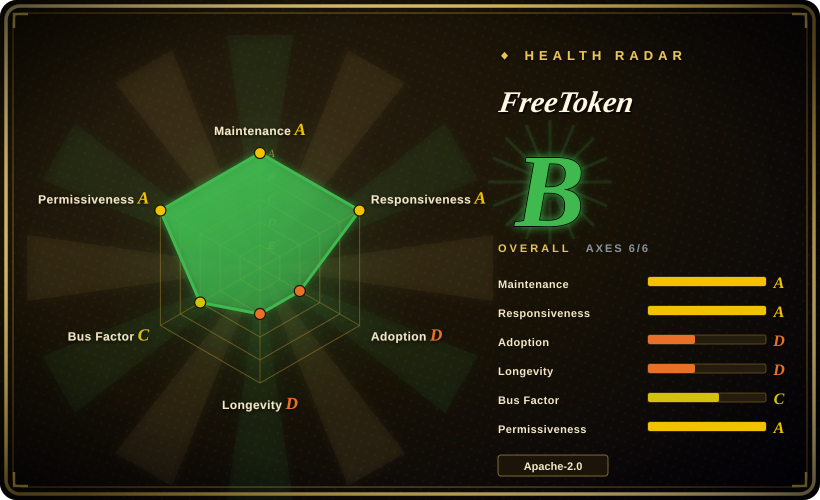
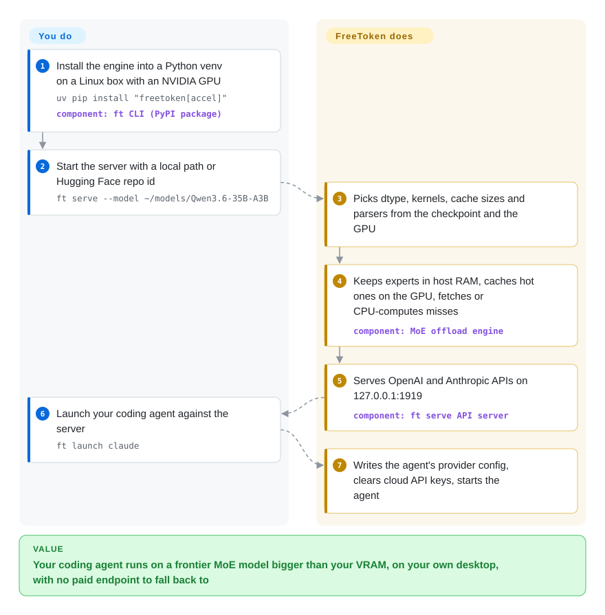

# FreeToken

The open models worth pointing a coding agent at — 35B to several hundred billion parameters — do not fit in the 16–32 GB of a gaming card, so you either rent a datacenter GPU or settle for a small model. FreeToken exploits the fact that these are Mixture-of-Experts models, where only a few "expert" sub-networks fire for each word: it keeps all experts in ordinary system RAM, caches the busy ones on the GPU, and fetches or CPU-computes the rest on demand.

## When to use

You have one NVIDIA desktop — say an RTX 4070 Ti with 16 GB of VRAM and 128 GB of DDR5 — and you want Claude Code or Codex running against a big open MoE model (Qwen3.6-35B-A3B, GLM-5.2, DeepSeek-V4-Flash, gpt-oss-120b) instead of a paid API. Loading the bf16 checkpoint into a GPU-only engine ends in `torch.OutOfMemoryError: CUDA out of memory`; the GGUF route through llama.cpp works but means finding a community quant, tuning `-ngl` / tensor-override flags by hand, and re-reading a 100k-token agent context every time the agent edits it. You install FreeToken, run `ft serve --model <HF id>`, and it sizes everything from the checkpoint and the card, keeps the experts in host RAM with a GPU-side cache, and serves OpenAI and Anthropic APIs on `127.0.0.1:1919`; `ft launch claude` then writes the agent's provider config for you.

Pick it over [llama.cpp](llama-cpp.md) / [Ollama](ollama.md) when the model is a supported MoE, you want to load the original Hugging Face safetensors (FP8, NVFP4, MXFP4, bf16) rather than a GGUF, and the workload is one agent with long, repeatedly edited contexts. Pick it over [vLLM](../serving-engines/vllm.md) / [SGLang](../serving-engines/sglang.md) — whose code it borrows — when the model is bigger than your VRAM and there is exactly one user. The deciding tradeoff: a narrow, NVIDIA-plus-Linux, two-month-old engine tuned for MoE-on-a-desktop, versus mature engines that assume either GGUF or datacenter memory.

## How it works

A Mixture-of-Experts (MoE) model is a big network where each layer holds dozens to hundreds of "experts" — smaller sub-networks — and a router picks only a handful of them for each token (roughly, each word-piece the model reads or writes). FreeToken's bet is that you therefore never need all experts on the GPU at once. Everything that is always used (attention, embeddings, the KV cache — the model's working memory of the conversation so far) stays on the card; the expert weights live in host RAM, and a GPU-side least-recently-used cache holds the ones that fired recently. On a cache miss, the `offload` strategy copies the expert over PCIe, `cpu` computes it on the CPU instead, and `hybrid` splits misses between the two using a bandwidth profile measured once by `ft bench bw` — like a kitchen that keeps the popular ingredients on the counter and sends someone to the pantry, or cooks in the pantry, depending on which is faster today. It also keeps checkpoints of the KV and recurrent state at semantic anchors (tool calls, thinking blocks) so an agent that edits its context does not force a full recompute. You choose the model and, optionally, the strategy; FreeToken resolves dtype, attention and MoE kernels, cache sizes, tool-call and reasoning parsers, and serves the API. A separate torch-free `ft daemon` can own the server's lifecycle as a systemd service, and a Windows/Linux desktop app downloaded from flashml.ai wraps the same engine in a GUI.

<!-- flow-steps:begin (generated from flows/freetoken.json by tools/flow_card.py — do not edit) -->

Text version of the flow

1. **You**: Install the engine into a Python venv on a Linux box with an NVIDIA GPU — `uv pip install "freetoken[accel]"` — component: `ft CLI (PyPI package)`
2. **You**: Start the server with a local path or Hugging Face repo id — `ft serve --model ~/models/Qwen3.6-35B-A3B`
3. **FreeToken**: Picks dtype, kernels, cache sizes and parsers from the checkpoint and the GPU
4. **FreeToken**: Keeps experts in host RAM, caches hot ones on the GPU, fetches or CPU-computes misses — component: `MoE offload engine`
5. **FreeToken**: Serves OpenAI and Anthropic APIs on 127.0.0.1:1919 — component: `ft serve API server`
6. **You**: Launch your coding agent against the server — `ft launch claude`
7. **FreeToken**: Writes the agent's provider config, clears cloud API keys, starts the agent

**Value**: Your coding agent runs on a frontier MoE model bigger than your VRAM, on your own desktop, with no paid endpoint to fall back to

<!-- flow-steps:end -->

## When NOT to use

- **If you are on a Mac, use [omlx](omlx.md), [MTPLX](mtplx.md) or [llama.cpp](llama-cpp.md) instead.** FreeToken is x86_64 + NVIDIA only; a native Metal engine is an unchecked item on the Roadmap (issue #79) as of 2026-09-28.
- **If your GPU is AMD, Intel, or absent, use [llama.cpp](llama-cpp.md) instead.** ROCm support is labelled "experimental … work in progress" (`docs/install_amd.md`), covers only RDNA3/RDNA4 via a source build inside a ROCm Docker image, and just landed (#132, 2026-09-26). There is no CPU-only mode — the CPU executor only handles expert misses next to a CUDA GPU.
- **If host RAM is small, use [llama.cpp](llama-cpp.md) or [Ollama](ollama.md) with a small GGUF quant instead.** Experts must fit in free system RAM: the maintainers' FAQ (issue #84) puts Qwen3.6-35B-A3B at about 70 GB in bf16, and Qwen3.8-Flash-Next pins a 47.7 GiB table in RAM on top of that (`docs/models.md`). A 32 GB laptop only works with NVFP4-class checkpoints of the smaller models.
- **If your models are GGUF files, use [llama.cpp](llama-cpp.md), [Ollama](ollama.md) or [Shimmy](shimmy.md).** FreeToken loads Hugging Face safetensors (or its own FTW format); GGUF across architectures is on the Roadmap, and a maintainer answered "gguf not supported yet" on 2026-09-18 (#506), even though a partial `models/gguf` loader exists in the tree.
- **If more than a few people will call the server, use [vLLM](../serving-engines/vllm.md) or [SGLang](../serving-engines/sglang.md).** The defaults are `--max-running-requests 4`, one GPU (`--gpu` picks one card), and tensor parallelism is still a Roadmap item; the design target is one user's agent, not a shared endpoint.
- **If the port will be reachable by anyone else, put an authenticating proxy in front (for example [Kong](../../api-gateway/kong.md)) or use [vLLM](../serving-engines/vllm.md) with `--api-key`.** `ft serve` performs no authentication; open issue #557 (2026-09-27) documents that any string is accepted as the key and that anyone who reaches the port can also call `/v1/cache/rebuild`. It binds `127.0.0.1` by default — keep it that way.
- **If you need a stable, pinned dependency for months, prefer [Ollama](ollama.md) or [llama.cpp](llama-cpp.md).** This is v0.1.x: the FTW fast-load format has already broken across builds (`docs/ftw-hotfix.md` lists five load errors and a repair script), `torch` is pinned to `>=2.11,<2.12` and `transformers` to `>=5.16,<5.17`, and the recommended install path for fixes is a rolling `nightly` tag that moves every night.
- **If you want the prebuilt Windows experience to be open source, note that it is not in this repo.** The pip/CLI path is Linux-only (`Operating System :: POSIX :: Linux`); Windows users get the desktop installer from flashml.ai, whose source is not published here, and open issues report Windows-specific failures (#539 paging file, #529 WDDM pinned-memory ceiling, #561 KV-cache sizing). On Windows, [Ollama](ollama.md) or [llama.cpp](llama-cpp.md) are the open, native options.
- **If the model is dense and fits your VRAM, FreeToken buys you nothing special** — dense models always resolve to the `fused` (all-on-GPU) strategy (`docs/models.md`); pick the runtime with the better ecosystem, usually [Ollama](ollama.md).

## Comparison

| Alternative | In index | Our verdict | Tradeoff |
|---|---|---|---|
| [llama.cpp](llama-cpp.md) | ✅ | Pick FreeToken when you have an NVIDIA card, a supported MoE and want to run the original safetensors with auto-sized expert caching for one coding agent; pick llama.cpp for anything else — Mac, AMD, CPU-only, GGUF, or an architecture FreeToken does not list. | llama.cpp gives the widest hardware and model matrix and a portable GGUF, but expert placement is manual flag tuning; FreeToken automates MoE placement and agent-context reuse on a much narrower platform. |
| [Ollama](ollama.md) | ✅ | Pick Ollama when you want a managed model store, Windows/macOS support and a large client ecosystem; pick FreeToken when the model is a frontier MoE that exceeds your VRAM and you want the engine to decide what sits on the GPU. | Ollama optimises for "pull and run" with a stable surface; FreeToken optimises MoE throughput on a desktop at the cost of a v0.1.x API, Linux-only CLI and tight dependency pins. |
| [AirLLM](airllm.md) | ✅ | Pick FreeToken when a human or agent is waiting on output and the model is MoE; pick AirLLM only for offline batch scoring where the model — dense or MoE — must stay unquantized and speed does not matter. | AirLLM's VRAM floor is one layer at the cost of seconds per token; FreeToken needs the experts in host RAM but keeps interactive speed and serves an API. |
| [vLLM](../serving-engines/vllm.md) | ✅ | Pick vLLM for a shared endpoint with many concurrent users, multi-GPU tensor parallelism and API-key auth; pick FreeToken when one person's desktop must serve a model larger than its VRAM. | vLLM is the mature, datacenter-shaped serving engine FreeToken borrows from; FreeToken trades its concurrency and multi-GPU reach for host-RAM expert offload tuned to consumer cards. |
| KTransformers | 未收录 | Pick KTransformers when you want the older, more widely used CPU/GPU hybrid MoE engine (including large DeepSeek-class deployments on a workstation); pick FreeToken when you want an agent-oriented server that auto-resolves placement and ships `ft launch` for coding agents. | Real repository (kvcache-ai/ktransformers, Apache-2.0, 19.5k stars as of 2026-09) — not added in this tab-intake batch. It is the closest substitute in mechanism; we did not benchmark the two against each other. |

## Tech stack

- **Language / shape:** a Python package (`freetoken` on PyPI, v0.1.3) under `python/freetoken/` with a single CLI entry point `ft` (`serve`, `shell`, `ctl`, `launch`, `checkpoint`, `bench bw`, `daemon`). `pyproject.toml` marks it `Development Status :: 4 - Beta`.
- **Engine:** PyTorch `>=2.11,<2.12` plus Triton kernels (`kernel/triton/` — fused MoE, NVFP4/MXFP4/FP8 linear layers, sparse attention for DeepSeek-V4 and GLM) and CUDA C++ extensions JIT-compiled with `nvcc` on first use (`kernel/csrc/`: pinned tensors, a CPU MoE executor, row store, radix cache, GGUF kernels derived from llama.cpp). A separate `freetoken-kernel-cache` wheel ships prebuilt kernels for nightly installs.
- **Optional accelerators:** the `[accel]` extra pulls `flashinfer-python[cu13]==0.6.18.post1` and `sglang-kernel==0.4.5`; without them the runtime falls back to pure-Triton kernels.
- **Serving layer:** FastAPI + uvicorn, OpenAI (`/v1/chat/completions`, `/v1/responses`, `/v1/models`) and Anthropic (`/v1/messages`, `/v1/messages/count_tokens`) routes, `pyzmq` + `msgpack` between processes, radix/prefix KV caching with SWA- and recurrent-state-aware variants (`kvcache/`).
- **Model code:** per-family modules under `models/` (DeepSeek-V4, GLM-4/5, Qwen2/3/3.5/3.6/3.8, gpt-oss, Gemma-4, MiniMax-M2/M3, Mistral, Llama, Muse-Glimmer) and image processors under `mm/`; `transformers>=5.16,<5.17` for configs and tokenizers.
- **Own dependency:** `flashlib==0.3.0` (from the same account) provides the device-side LRU admission kernel behind the expert cache.
- **Tests:** a `tests/` tree (attention, kernels, kvcache, models, daemon, e2e); `CONTRIBUTING.md` notes most tests need an NVIDIA GPU and some need real checkpoints.

## Dependencies

- **Hardware:** x86_64 with an NVIDIA GPU from Ampere (RTX 30) upward (issue #84 FAQ); AMD RDNA3/RDNA4 experimental via ROCm 7.14.
- **Driver / toolkit:** NVIDIA driver r580+ (CUDA 13) and a CUDA 13 toolkit with `nvcc` on `PATH` for the JIT kernels; `gcc` and Python dev headers for Triton's helper build (the FAQ's `Python.h: No such file` fix).
- **Host RAM:** roughly the size of the expert weights in free RAM (about 70 GB for Qwen3.6-35B-A3B bf16 per the FAQ; NVFP4 checkpoints need far less), plus 47.7 GiB pinned for Qwen3.8-Flash-Next's table.
- **OS / Python:** Linux for the pip/CLI path, Python 3.10–3.13; Windows only through the flashml.ai desktop installer (or WSL2, which users run per issue #490).
- **Disk + network:** the Hugging Face or ModelScope checkpoint (tens to hundreds of GB); optional FTW conversion writes roughly another checkpoint-sized copy. No database or external service at runtime.

## Ops difficulty

**Medium.** A single machine and a single process, and `ft serve --model` auto-resolves nearly every knob, so the happy path is short. The cost is in the stack under it: an exact CUDA 13 / driver r580 / torch 2.11 / transformers 5.16 alignment, first-run JIT compilation, and a format and API that are still moving at v0.1.x (FTW repair script, nightly-tag installs). Open issues show the failure modes to plan for — a truncated Triton JIT cache that crash-loops the engine until you clear `~/.triton/cache` (#490), a live cache resize that OOMs and wedges the server until restart (#526), and cached-prefix prefill running slower than cold prefill on a hybrid model (#501). The torch-free `ft daemon` with its bundled systemd unit gives you restart-on-crash and a log/metrics surface if you run it as a long-lived service.

## Health & viability

- **Maintenance (2026-09-28):** very active — 48 commits in the last 30 days, last default-branch commit 2026-09-26, tagged releases v0.1.2 (2026-08-19) and v0.1.3 (2026-09-16) plus a nightly wheel built from `main`. Maintainers answer issues with log requests and root-cause writeups (#540, #542).
- **Governance / bus factor:** concentrated. Of the last 100 default-branch commits, 55 are by one author (Xiaoze Fan / `jason-fxz`, also the paper's second author) and the repository's whole public history is 88 commits. The owning account `FlashML-org` is a GitHub **User**, not an Organization. `CONTRIBUTING.md` and `SECURITY.md` exist, with an explicit "no pure-agent PRs" AI policy.
- **Backing & Lindy:** the repo is 70 days old (created 2026-07-20), so the Lindy prior gives it little credit yet. The weight comes from an arXiv paper (2608.16157, 2026-08-17) whose author list includes Ion Stoica, Matei Zaharia, Song Han and Kurt Keutzer — a strong research lineage, but a research-lab project's long-term funding and ownership are not stated anywhere.
- **Adoption:** 13.9k stars and 1.37k forks in ten weeks, 11.8k PyPI downloads in the last month (pypistats, 2026-09-28). Star velocity this high on a two-month-old repo is a hype signal, not evidence of production use.
- **Risk flags:** v0.1.x with format breaks; issue backlog growing faster than it closes (204 open vs 96 closed issues as of 2026-09-28); no HTTP auth (#557); the Windows desktop app — the headline "Download" path — is not built from source published here.
- **Verdict:** a promising, very active research engine for one person running a frontier MoE on an NVIDIA desktop; treat it as an experiment to pin and re-verify, not a dependency to build a product on until it has a second-year track record and a broader maintainer base.

## Caveats (unverified)

- [未验证] The README's headline "290B+ frontier MoE models … on your gaming PC at blistering interactive speeds" and the paper's "284B model on a gaming desktop, 753B GLM-5.2 on a single workstation GPU" are author claims; no tokens/second table ships in the repo (`benchmarks/` has scripts only), and we did not run them — needs matching hardware and checkpoints.
- [推断] The Windows/Linux desktop app is closed or at least unpublished: the repo tree has no desktop-app source, and the sibling `FreeToken-Web` repo holds only the download site. We found no statement from the maintainers either way.
- [未验证] The semantic-anchor KV/recurrent-state checkpoints "avoid redundant recomputation" for agentic context edits; issue #501 reports the opposite symptom on one hybrid model (cached prefill 10–40× slower than cold), and whether that is a general or model-specific regression is not settled as of 2026-09-28.
- [未验证] Institutional backing: the paper's author list is public, but which institutions fund or own FreeToken/FlashML long-term is not stated on the repo, the site, or the paper abstract.
- [推断] The public commit history (88 commits over 70 days, squash-merged PRs) suggests the code was developed elsewhere before the public repo was created, so commit counts understate the real development history and the contributor split.
- [未验证] KTransformers comparison: we did not benchmark FreeToken against KTransformers or llama.cpp on the same hardware; the verdict rests on documented mechanisms and platform scope, not measured speed.
- [未验证] Real CPU/PCIe gains of the `hybrid` strategy depend on each machine's measured bandwidth (`ft bench bw`); we have no independent measurements.
