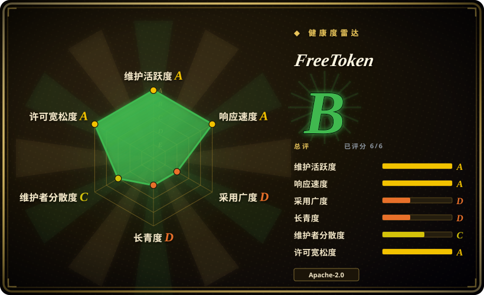
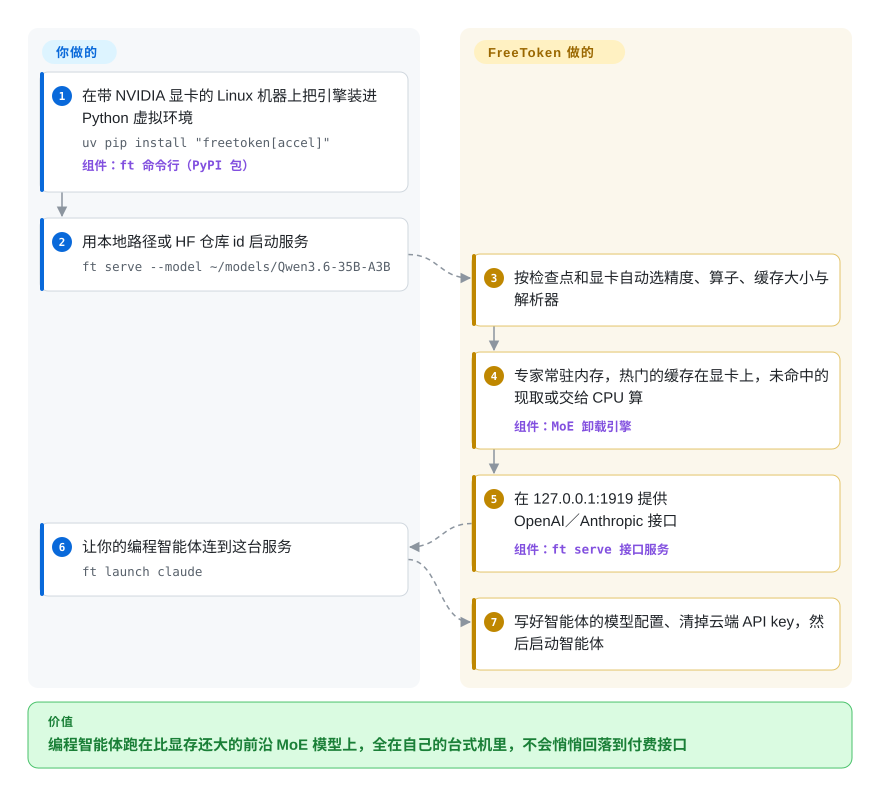

# FreeToken

值得接给编程智能体的开源大模型动辄 35B 到几千亿参数，游戏显卡那 16–32 GB 显存根本装不下，于是你只能去租数据中心的卡，或者退而求其次用小模型。FreeToken 利用这类模型是“混合专家”（MoE）结构、每个字只激活少数几个“专家”子网络这一点：把全部专家放在普通内存里，把常用的缓存到显卡上，其余的按需现取或直接让 CPU 算。

## 何时使用

你有一台 NVIDIA 台式机——比如 16 GB 显存的 RTX 4070 Ti 配 128 GB DDR5——想让 Claude Code 或 Codex 跑在一个大型开源 MoE 模型上（Qwen3.6-35B-A3B、GLM-5.2、DeepSeek-V4-Flash、gpt-oss-120b），而不是付费 API。把 bf16 检查点塞进只认显卡的引擎，结果是一行 `torch.OutOfMemoryError: CUDA out of memory`；走 llama.cpp 的 GGUF 路线能跑，但得先找社区量化版、手调 `-ngl` 和张量覆盖参数，而且智能体每改一次上下文，十万 token 的历史就要重算一遍。装上 FreeToken，执行 `ft serve --model <HF id>`，它会按检查点和显卡自动定好一切，专家留在内存、显卡上只放缓存，并在 `127.0.0.1:1919` 提供 OpenAI 与 Anthropic 接口；再执行 `ft launch claude`，它替你写好智能体的模型配置。

与 [llama.cpp](llama-cpp.zh.md)／[Ollama](ollama.zh.md) 相比，当模型是它支持的 MoE、你想直接加载 Hugging Face 原版 safetensors（FP8、NVFP4、MXFP4、bf16）而不是 GGUF、且负载是一个上下文很长又反复被编辑的智能体时，选它。与它借鉴了代码的 [vLLM](../serving-engines/vllm.zh.md)／[SGLang](../serving-engines/sglang.zh.md) 相比，当模型比显存大且只有一个用户时，选它。决定性的取舍是：一个窄口径（只支持 NVIDIA 加 Linux）、刚两个月大、专为“台式机跑 MoE”调优的引擎，对上那些要么假定 GGUF、要么假定数据中心内存的成熟引擎。

## 怎么用起来

混合专家（MoE）模型是一种大网络：每一层有几十到几百个“专家”（更小的子网络），由一个路由器为每个 token（大致相当于模型读写的每个字词片段）只挑出其中少数几个来算。FreeToken 押注的正是：你永远不需要让全部专家同时待在显卡上。每次都要用的部分（注意力层、词嵌入、KV 缓存——也就是模型对当前对话的“工作记忆”）留在显卡；专家权重住在内存里，显卡上有一块按“最近最少使用”淘汰的缓存，存放最近用过的专家。缓存未命中时，`offload` 策略把专家经 PCIe 拷上显卡，`cpu` 策略改由 CPU 计算，`hybrid` 则按 `ft bench bw` 一次性测出的带宽把未命中的专家拆给两边——好比厨房把常用食材摆在台面上，缺的要么派人去仓库取，要么干脆在仓库里做，看今天哪样更快。它还会在语义锚点（工具调用、思考块）处保存 KV 与循环状态的检查点，让智能体改写上下文时不必整段重算。你只需选模型、可选地指定策略；精度、注意力与 MoE 算子、缓存大小、工具调用与推理解析器都由 FreeToken 决定，并由它对外提供接口。另有一个不依赖 torch 的 `ft daemon` 可以作为 systemd 服务托管服务进程的生命周期；从 flashml.ai 下载的 Windows／Linux 桌面应用则给同一个引擎套了图形界面。

<!-- flow-steps:begin (generated from flows/freetoken.json by tools/flow_card.py — do not edit) -->

流程文字版

1. **你**：在带 NVIDIA 显卡的 Linux 机器上把引擎装进 Python 虚拟环境 — `uv pip install "freetoken[accel]"` — 组件：`ft 命令行（PyPI 包）`
2. **你**：用本地路径或 HF 仓库 id 启动服务 — `ft serve --model ~/models/Qwen3.6-35B-A3B`
3. **FreeToken**：按检查点和显卡自动选精度、算子、缓存大小与解析器
4. **FreeToken**：专家常驻内存，热门的缓存在显卡上，未命中的现取或交给 CPU 算 — 组件：`MoE 卸载引擎`
5. **FreeToken**：在 127.0.0.1:1919 提供 OpenAI／Anthropic 接口 — 组件：`ft serve 接口服务`
6. **你**：让你的编程智能体连到这台服务 — `ft launch claude`
7. **FreeToken**：写好智能体的模型配置、清掉云端 API key，然后启动智能体

**价值**：编程智能体跑在比显存还大的前沿 MoE 模型上，全在自己的台式机里，不会悄悄回落到付费接口

<!-- flow-steps:end -->

## 何时不用

- **如果你用的是 Mac，改用 [omlx](omlx.zh.md)、[MTPLX](mtplx.zh.md) 或 [llama.cpp](llama-cpp.zh.md)。** FreeToken 只支持 x86_64 加 NVIDIA；截至 2026-09-28，原生 Metal 引擎在路线图（issue #79）上仍未勾选。
- **如果显卡是 AMD、Intel，或者根本没有独显，改用 [llama.cpp](llama-cpp.zh.md)。** ROCm 支持被标为“实验性……仍在进行中”（`docs/install_amd.md`），只覆盖 RDNA3／RDNA4，且要在 ROCm Docker 镜像里源码构建，相关代码 2026-09-26 才合入（#132）。它没有纯 CPU 模式——CPU 执行器只负责在 CUDA 显卡旁边处理未命中的专家。
- **如果内存不大，改用 [llama.cpp](llama-cpp.zh.md) 或 [Ollama](ollama.zh.md) 加一个小的 GGUF 量化版。** 专家必须装进空闲内存：维护者 FAQ（issue #84）给出 Qwen3.6-35B-A3B 的 bf16 版约需 70 GB，Qwen3.8-Flash-Next 还要在此之外常驻 47.7 GiB 的表（`docs/models.md`）。32 GB 内存的笔记本只能跑小模型的 NVFP4 这类检查点。
- **如果你手上是 GGUF 文件，用 [llama.cpp](llama-cpp.zh.md)、[Ollama](ollama.zh.md) 或 [Shimmy](shimmy.zh.md)。** FreeToken 加载的是 Hugging Face safetensors（或它自己的 FTW 格式）；跨架构的 GGUF 支持还在路线图上，维护者 2026-09-18 在 #506 里答复“gguf not supported yet”，尽管代码树里已有一个不完整的 `models/gguf` 加载器。
- **如果会有好几个人同时调用，用 [vLLM](../serving-engines/vllm.zh.md) 或 [SGLang](../serving-engines/sglang.zh.md)。** 默认 `--max-running-requests 4`、只用一张卡（`--gpu` 选一张），张量并行仍在路线图上；它的设计目标是一个人的智能体，不是共享接口。
- **如果端口会被别人访问到，前面加一层带鉴权的代理（例如 [Kong](../../api-gateway/kong.zh.md)），或改用带 `--api-key` 的 [vLLM](../serving-engines/vllm.zh.md)。** `ft serve` 不做任何鉴权；open 状态的 issue #557（2026-09-27）写明任何字符串都会被当作合法 key 接受，能连上端口的人还能调用 `/v1/cache/rebuild`。它默认只监听 `127.0.0.1`——保持这样。
- **如果你要一个能锁版本、稳定用上几个月的依赖，优先 [Ollama](ollama.zh.md) 或 [llama.cpp](llama-cpp.zh.md)。** 这还是 v0.1.x：FTW 快速加载格式已经在版本之间坏过（`docs/ftw-hotfix.md` 列了五种加载报错和一个修复脚本），`torch` 锁在 `>=2.11,<2.12`、`transformers` 锁在 `>=5.16,<5.17`，拿修复的推荐安装方式是每晚都会移动的 `nightly` 滚动标签。
- **如果你要求 Windows 上开箱即用的那一套也是开源的，注意它不在这个仓库里。** pip／命令行路径只支持 Linux（`Operating System :: POSIX :: Linux`）；Windows 用户拿到的是 flashml.ai 的桌面安装包，其源码未在此发布，open issue 里还有 Windows 专属故障（#539 页面文件、#529 WDDM 锁页内存上限、#561 KV 缓存容量）。在 Windows 上，[Ollama](ollama.zh.md) 或 [llama.cpp](llama-cpp.zh.md) 才是开源的原生选择。
- **如果模型是稠密模型且装得进显存，FreeToken 给不了你什么额外好处**——稠密模型一律走 `fused`（全部放显卡）策略（`docs/models.md`）；选生态更好的运行时，通常是 [Ollama](ollama.zh.md)。

## 横向对比

| 替代品 | 是否收录 | 我们的评价 | 取舍 |
|---|---|---|---|
| [llama.cpp](llama-cpp.zh.md) | ✅ | 有 NVIDIA 显卡、模型是它支持的 MoE、想让一个编程智能体直接跑原版 safetensors 并自动分配专家缓存时，选 FreeToken；其余情况——Mac、AMD、纯 CPU、GGUF、或 FreeToken 没列出的架构——选 llama.cpp。 | llama.cpp 的硬件与模型矩阵最宽、GGUF 可随处搬，但专家放置要手调参数；FreeToken 把 MoE 放置和智能体上下文复用自动化了，代价是平台窄得多。 |
| [Ollama](ollama.zh.md) | ✅ | 想要托管式模型仓库、Windows／macOS 支持和庞大的客户端生态时，选 Ollama；模型是超出显存的前沿 MoE、想让引擎决定哪些东西放在显卡上时，选 FreeToken。 | Ollama 追求“拉下来就能跑”和稳定的接口面；FreeToken 追求台式机上的 MoE 吞吐，代价是 v0.1.x 的接口、只支持 Linux 的命令行和很紧的依赖锁定。 |
| [AirLLM](airllm.zh.md) | ✅ | 有人或智能体在等输出、且模型是 MoE 时，选 FreeToken；只有离线批量打分、模型（稠密或 MoE）必须保持不量化、速度无所谓时，才选 AirLLM。 | AirLLM 把显存下限压到一层，代价是每个 token 要几秒；FreeToken 要求专家装进内存，但保持交互速度并提供接口服务。 |
| [vLLM](../serving-engines/vllm.zh.md) | ✅ | 要给很多并发用户共享的接口、多卡张量并行和 API key 鉴权时，选 vLLM；一个人的台式机要跑一个比显存大的模型时，选 FreeToken。 | vLLM 是 FreeToken 借鉴过的成熟、数据中心形态的服务引擎；FreeToken 放弃了它的并发与多卡能力，换来针对消费级显卡调优的“专家放内存”卸载。 |
| KTransformers | 未收录 | 想要更早出现、用户更多的 CPU／GPU 混合 MoE 引擎（包括在工作站上部署 DeepSeek 级大模型）时，选 KTransformers；想要面向智能体、自动决定放置、自带 `ft launch` 接编程智能体的服务时，选 FreeToken。 | 真实仓库（kvcache-ai/ktransformers，Apache-2.0，截至 2026-09 约 1.95 万 star），本次标签页收录批次未添加。它在机制上是最接近的替代品；我们没有做两者的对比测速。 |

## 技术栈

- **语言与形态：** 一个 Python 包（PyPI 上的 `freetoken`，v0.1.3），代码在 `python/freetoken/`，只有一个命令行入口 `ft`（`serve`、`shell`、`ctl`、`launch`、`checkpoint`、`bench bw`、`daemon`）。`pyproject.toml` 标注为 `Development Status :: 4 - Beta`。
- **引擎：** PyTorch `>=2.11,<2.12` 加 Triton 算子（`kernel/triton/`——融合 MoE、NVFP4／MXFP4／FP8 线性层、DeepSeek-V4 与 GLM 的稀疏注意力），以及首次使用时用 `nvcc` 即时编译的 CUDA C++ 扩展（`kernel/csrc/`：锁页张量、CPU 端 MoE 执行器、行存储、基数树缓存、源自 llama.cpp 的 GGUF 算子）。夜间版另有一个 `freetoken-kernel-cache` wheel，内含预编译算子。
- **可选加速：** `[accel]` 额外依赖会装上 `flashinfer-python[cu13]==0.6.18.post1` 和 `sglang-kernel==0.4.5`；没有它们时回退到纯 Triton 算子。
- **服务层：** FastAPI 加 uvicorn，提供 OpenAI（`/v1/chat/completions`、`/v1/responses`、`/v1/models`）与 Anthropic（`/v1/messages`、`/v1/messages/count_tokens`）路由；进程之间用 `pyzmq` 加 `msgpack`；KV 缓存为基数树／前缀复用，并有感知滑动窗口与循环状态的变体（`kvcache/`）。
- **模型代码：** `models/` 下按家族分模块（DeepSeek-V4、GLM-4／5、Qwen2／3／3.5／3.6／3.8、gpt-oss、Gemma-4、MiniMax-M2／M3、Mistral、Llama、Muse-Glimmer），`mm/` 下是图像处理器；配置与分词器依赖 `transformers>=5.16,<5.17`。
- **自家依赖：** 同一账号下的 `flashlib==0.3.0` 提供专家缓存背后的显卡端 LRU 准入算子。
- **测试：** 有 `tests/` 目录（attention、kernels、kvcache、models、daemon、e2e）；`CONTRIBUTING.md` 说明多数测试需要 NVIDIA 显卡，部分需要真实检查点。

## 依赖

- **硬件：** x86_64，NVIDIA 显卡需 Ampere（RTX 30 系）及以上（issue #84 FAQ）；AMD RDNA3／RDNA4 经 ROCm 7.14 属实验性支持。
- **驱动与工具链：** NVIDIA 驱动 r580+（CUDA 13），且 `PATH` 上要有 CUDA 13 工具链的 `nvcc` 用于即时编译算子；Triton 的辅助构建还需要 `gcc` 与 Python 开发头文件（即 FAQ 里 `Python.h: No such file` 的解法）。
- **内存：** 空闲内存大致要装下全部专家权重（按 FAQ，Qwen3.6-35B-A3B 的 bf16 版约 70 GB；NVFP4 检查点少得多），Qwen3.8-Flash-Next 另需常驻 47.7 GiB 的表。
- **系统与 Python：** pip／命令行路径只支持 Linux，Python 3.10–3.13；Windows 只能通过 flashml.ai 的桌面安装包（或 WSL2，issue #490 里有用户这样跑）。
- **磁盘与网络：** Hugging Face 或 ModelScope 的检查点（几十到几百 GB）；可选的 FTW 转换还会再写出一份差不多大小的副本。运行时不需要数据库或外部服务。

## 运维难度

**中等。** 单机单进程，`ft serve --model` 几乎能自动决定所有参数，所以顺利路径很短。成本在它下面的那一整套：CUDA 13、驱动 r580、torch 2.11、transformers 5.16 必须严格对齐，首次运行要即时编译，而格式与接口在 v0.1.x 阶段仍在变（FTW 修复脚本、夜间标签安装）。open issue 已经展示了要预案的故障形态——Triton 即时编译缓存被截断后引擎会反复崩溃重启，直到你手动清掉 `~/.triton/cache`（#490）；在线调整缓存大小时显存不足会把服务卡死，只能重启（#526）；在混合结构模型上，命中前缀缓存的预填充反而比冷启动更慢（#501）。如果要长期作为服务运行，不依赖 torch 的 `ft daemon` 配上自带的 systemd 单元，能提供崩溃自动重启以及日志与指标入口。

## 健康度与可持续性

- **维护（2026-09-28）：** 非常活跃——近 30 天 48 个提交，默认分支最新提交在 2026-09-26，已发布 v0.1.2（2026-08-19）与 v0.1.3（2026-09-16）两个标签版本，外加从 `main` 每晚构建的 nightly wheel。维护者会在 issue 里索要日志并写出根因分析（#540、#542）。
- **治理与巴士因子：** 高度集中。默认分支最近 100 个提交中有 55 个出自同一作者（Xiaoze Fan／`jason-fxz`，也是论文第二作者），整个公开历史只有 88 个提交。所属账号 `FlashML-org` 在 GitHub 上是**个人**账号，不是组织。仓库有 `CONTRIBUTING.md` 和 `SECURITY.md`，并明文规定“不接受纯智能体提交的 PR”。
- **背书与 Lindy：** 仓库只有 70 天大（2026-07-20 创建），Lindy 先验暂时给不了多少加分。分量来自一篇 arXiv 论文（2608.16157，2026-08-17），作者名单里有 Ion Stoica、Matei Zaharia、Song Han 和 Kurt Keutzer——研究血统很强，但一个研究组项目的长期资金与归属在任何地方都没有写明。
- **采用度：** 十周内 1.39 万 star、1370 个 fork，近一个月 PyPI 下载 1.18 万次（pypistats，2026-09-28）。一个两个月大的仓库有这么快的 star 增速，是热度信号，不是生产使用的证据。
- **风险信号：** v0.1.x 且格式会断；issue 积压增长快于关闭（截至 2026-09-28，204 个 open 对 96 个 closed）；HTTP 接口无鉴权（#557）；作为头号“下载”入口的 Windows 桌面应用并非由这里公开的源码构建。
- **结论：** 对“一个人在 NVIDIA 台式机上跑前沿 MoE”来说，这是个有前景、非常活跃的研究型引擎；把它当作要锁版本、定期复核的实验，而不是可以拿来做产品的依赖——至少等它有了第二年的记录和更宽的维护者基础再说。

## 存疑（未验证）

- [未验证] README 的标语“在游戏 PC 上以极快的交互速度运行 290B+ 前沿 MoE 模型”，以及论文里“游戏台式机跑 284B、单张工作站显卡跑 753B 的 GLM-5.2”，都是作者自述；仓库里没有 tokens/秒数据表（`benchmarks/` 只有脚本），我们也没有运行——需要对应的硬件和检查点。
- [推断] Windows／Linux 桌面应用是闭源的，或至少未公开：仓库树里没有桌面应用源码，同账号的 `FreeToken-Web` 仓库只有下载站点。我们没找到维护者对此的任何表态。
- [未验证] 语义锚点处的 KV／循环状态检查点号称能在智能体改写上下文时“避免冗余重算”；issue #501 在一个混合结构模型上报告了相反的现象（命中缓存的预填充比冷启动慢 10–40 倍），截至 2026-09-28 尚未确定这是普遍问题还是个别模型的回归。
- [未验证] 机构背书：论文作者名单是公开的，但由哪些机构长期出资或拥有 FreeToken／FlashML，仓库、官网和论文摘要里都没有写明。
- [推断] 公开提交历史只有 88 个提交、跨度 70 天，且 PR 以压缩合并方式入库，说明代码在公开仓库创建之前另有开发历史，所以提交数与贡献者比例都低估了真实的开发过程。
- [未验证] KTransformers 对比：我们没有在同一硬件上对 FreeToken、KTransformers 或 llama.cpp 做测速；评价依据的是公开文档中的机制与平台范围，不是实测速度。
- [未验证] `hybrid` 策略的实际 CPU／PCIe 收益取决于每台机器实测的带宽（`ft bench bw`）；我们没有独立测量数据。
