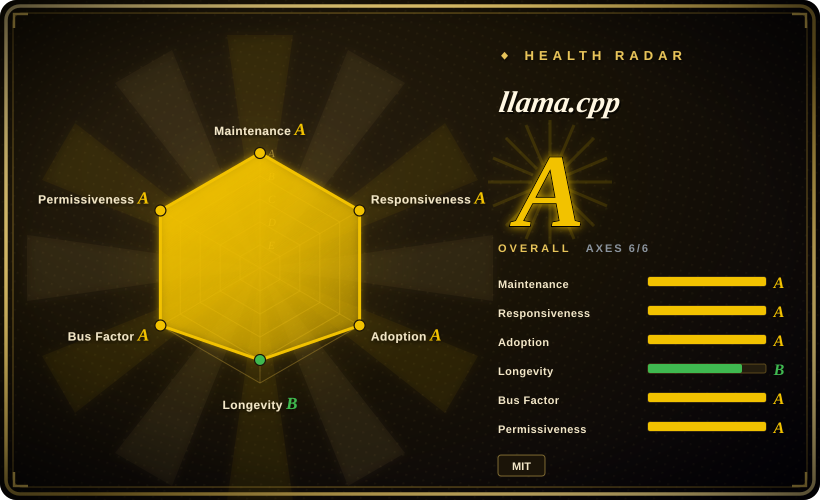
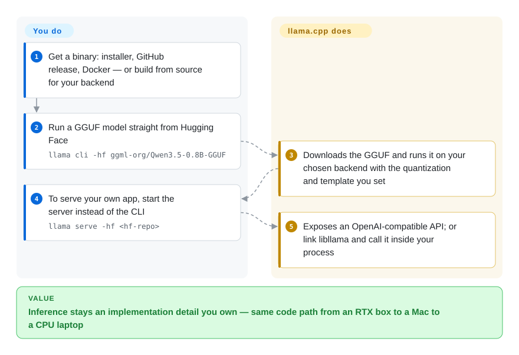

# llama.cpp

The engine almost everything else in this category is built on: dependency-free C/C++ LLM and VLM inference that runs on the widest hardware matrix available, with `llama cli -hf` and `llama serve -hf` now covering the quick-start path too.

## When to use

You are shipping a product or an internal tool and inference has to be an implementation detail you control, not a service someone else operates — you need to call the model from your own process, choose the exact quantization and chat template, set the KV cache and context yourself, and know that the same code path runs on an RTX box, a Mac, an Intel laptop, and a RISC-V board.

Reach for llama.cpp when the deciding factor is **control and reach**: it is the upstream engine (MIT, plain C/C++ over ggml, no runtime dependencies), it exposes the widest backend list in this category — CUDA, HIP for AMD, Metal, Vulkan, SYCL, CANN, MUSA, OpenCL, WebGPU, ZenDNN, Hexagon, plus hybrid CPU+GPU offload and an RPC backend — and its `llama cli -hf` / `llama serve -hf` paths now download and run a Hugging Face GGUF without a wrapper. Choose it over [Ollama](ollama.md) when you refuse to wait for a wrapper's flag subset, over [vLLM](../serving-engines/vllm.md) when you are not NVIDIA-only and do not need a serving scheduler, and over [Magnitude](magnitude.md) when throughput and backend breadth matter more than a pre-download fit estimate.

## How it works

llama.cpp is the engine itself, not a manager around one: plain C/C++ over ggml, compiled into a self-contained binary (or a library you link). It reads **GGUF** files — a single-file weight format carrying the quantization — and runs them through whichever backend you built or downloaded: CUDA, Metal, Vulkan, HIP, SYCL, CPU, and more, including hybrid CPU+GPU offload when a model doesn't fit in VRAM. Nothing is hidden behind a wrapper: quantization, chat template, context length and KV cache are yours to set, which is the whole point. The modern entry points cut the old friction — `llama cli -hf` and `llama serve -hf` pull a GGUF straight from Hugging Face — and the server speaks an OpenAI-compatible API, so you can either embed the library in your own process or run it as a local service.

<!-- flow-steps:begin (generated from flows/llama-cpp.json by tools/flow_card.py — do not edit) -->

Text version of the flow

1. **You**: Get a binary: installer, GitHub release, Docker — or build from source for your backend
2. **You**: Run a GGUF model straight from Hugging Face — `llama cli -hf ggml-org/Qwen3.5-0.8B-GGUF`
3. **llama.cpp**: Downloads the GGUF and runs it on your chosen backend with the quantization and template you set
4. **You**: To serve your own app, start the server instead of the CLI — `llama serve -hf <hf-repo>`
5. **llama.cpp**: Exposes an OpenAI-compatible API; or link libllama and call it inside your process

**Value**: Inference stays an implementation detail you own — same code path from an RTX box to a Mac to a CPU laptop

<!-- flow-steps:end -->

## When NOT to use

- **If you want a model store, GUI and auto-updates rather than flags and GGUF files, use [Ollama](ollama.md) or LM Studio instead**, because llama.cpp ships an engine and tools, not a managed local-model product with a model library and lifecycle commands.
- **If you need many concurrent requests, continuous batching, or multi-node serving, use [vLLM](../serving-engines/vllm.md) or [SGLang](../serving-engines/sglang.md) instead**, because llama.cpp's server is optimized for single-user/local workloads and gives you no PagedAttention-class scheduler.
- **If you are NVIDIA-only and throughput-per-dollar is the whole decision, use [TensorRT-LLM](../serving-engines/tensorrt-llm.md) instead**, because NVIDIA's own compiled kernels and engine builds go beyond what a portable ggml backend can reach, at the cost of vendor lock-in and a compile step.
- **If you do not want to own flags, quantization choice and context sizing, use [Magnitude](magnitude.md) instead**, because llama.cpp deliberately exposes all of that and estimates nothing for you before download.
- **If you need a frozen API contract for a long-lived dependency, pin an exact commit or build tag and budget for churn**, because llama.cpp has no semver: releases are rolling build tags (`b11057`, pushed the same day as this review) and the CLI/server surfaces move with them. A wrapper like [Ollama](ollama.md) absorbs that churn for you.
- **If you need a Mac-only MLX-native path or model-native MTP speculative decoding, consider [omlx](omlx.md) or [MTPLX](mtplx.md) instead**, because llama.cpp's strength is breadth; platform- or model-specific optimization goes deeper elsewhere.

## Comparison

| Alternative | In index | Our verdict | Tradeoff |
|---|---|---|---|
| [Ollama](ollama.md) | ✅ | Pick llama.cpp when you need the newest engine features, the full backend matrix, or in-process embedding; pick Ollama when you want a managed model store, auto-updates and client SDKs on top of the same family of engines. | llama.cpp gives you every knob and no lifecycle management; Ollama gives you lifecycle, a model library and Docker, and hides part of the engine behind its own pin and flag subset. |
| [Magnitude](magnitude.md) | ✅ | Pick llama.cpp when throughput, upstream freshness or backend breadth decides; pick Magnitude when the hardware is unknown and you want a pre-download speed/memory estimate plus one-click harness wiring. | Magnitude is a product layer over this engine, so choosing it means accepting a slower, younger fork in exchange for automated tuning and fit assessment you would otherwise do by hand. |
| [vLLM](../serving-engines/vllm.md) | ✅ | Pick llama.cpp for local, single-user, or heterogeneous-hardware inference and for embedding; pick vLLM when a GPU server must serve many concurrent requests efficiently. | llama.cpp trades serving throughput and scheduler sophistication for portability and a dependency-free build; vLLM trades portability for NVIDIA-centric batching at scale. |
| [TensorRT-LLM](../serving-engines/tensorrt-llm.md) | ✅ | Pick llama.cpp for portability across AMD/Apple/CPU and no build step; pick TensorRT-LLM only when maximum NVIDIA throughput justifies lock-in and engine compilation. | llama.cpp runs everywhere with one build system and loses peak NVIDIA performance; TensorRT-LLM wins that peak and gives up everything else. |
| LM Studio | 未收录 | Pick llama.cpp when inference must be scripted, embedded or deployed headlessly; pick LM Studio when a human only needs to download a model and chat in a GUI. | LM Studio is a closed product outside this index's repo-based scope and cannot be embedded or patched; llama.cpp is the library you build those experiences on. |

## Tech stack

- **Primary language:** C/C++ on top of the `ggml` tensor library; CMake build with no runtime dependencies.
- **CPU targets:** ARM NEON/Accelerate (Apple Silicon is a first-class target), x86 AVX/AVX2/AVX512/AMX, RISC-V RVV/ZVFH.
- **Accelerators:** CUDA, HIP (AMD), Metal (Apple), Vulkan, SYCL and OpenVINO (Intel), CANN (Ascend), MUSA (Moore Threads), OpenCL (Adreno), Hexagon (Snapdragon), IBM zDNN, ZenDNN (AMD CPU), plus WebGPU and a VirtGPU path. CPU+GPU hybrid inference partially offloads models larger than VRAM. [推断]
- **Tools shipped:** `llama cli` (interactive), `llama serve` (OpenAI-compatible HTTP server with a built-in web UI), `llama-bench`, `llama-perplexity`, `llama-quantize`, and GBNF grammars for constrained output.
- **Model format:** GGUF, with 1.5- through 8-bit integer quantization; models are fetched directly from Hugging Face or converted locally.

## Dependencies

- **Runtime:** a single self-contained binary or library — no Python, no CUDA toolkit, no service framework; GPU SDKs are build-time only.
- **Install paths:** prebuilt binaries from GitHub releases, the `llama.app` installer, Docker, or a source build (the common path for custom backends).
- **Models:** GGUF files, downloaded via `-hf <repo>` or produced by the conversion/quantization tools; weights carry their own licenses, separate from MIT.
- **Hardware:** any supported CPU or GPU; no account, no API key, no network dependency at inference time.

## Ops difficulty

**Medium.** If you use prebuilt binaries or Docker, running `llama serve` is easy; the recurring cost is version management rather than operations. Because releases are per-commit build tags with no semver, upgrades need your own pinning and regression policy — especially if you depend on chat templates or server endpoint behavior. Multi-GPU and RPC-based distributed inference are documented but require per-host configuration. There is no auth layer, no model lifecycle management and no auto-update, so production use means building those around it.

## Health & viability

- **Maintenance:** among the most active projects in this category — created 2023-03-10, pushed within hours of this review, with build releases published multiple times per day.
- **Governance / bus factor:** MIT-licensed under the `ggml-org` organization with a large maintainer group (dozens of named maintainers; ~74 active contributors over the last year, top contributor ~17% of commits) and ~2,000 all-time contributors. Not a single-maintainer project.
- **Backing & Lindy:** three and a half years of continuous development in a field where runtimes turn over quickly, and it became the de-facto GGUF/edge inference substrate that other projects (including [Ollama](ollama.md) and [Magnitude](magnitude.md)) wrap or fork. That is a strong Lindy prior.
- **Adoption & ecosystem:** ~129,000 stars, 23,400 forks, an enormous downstream tool ecosystem, and per-backend CI. Note the health radar's low adoption grade is measured from a proxy package registry (`llama.cpp-tools` on anaconda.org); llama.cpp publishes no canonical package, so read that axis as a measurement artifact rather than evidence of weak adoption.
- **Risk flags:** no semver and daily build churn; GGUF format and template behavior can move; the project intentionally leaves model management and serving operations to others.
- **Verdict:** the substrate to build on when portability and control matter, and the upstream to compare everything else in this category against.

## Caveats (unverified)

- [未验证] The adoption axis in the health radar is derived from a third-party package registry proxy because llama.cpp ships no canonical package; the grade likely understates real adoption, but I did not find an authoritative adoption measure to replace it.
- [未验证] Backend breadth is documented per backend, not per model and per operation; whether a specific quantized model runs accelerated on a specific GPU was not tested here.
- [未验证] RPC/distributed inference (`tools/rpc`) is documented but I did not verify its performance, stability, or production readiness.
- [推断] "No semver" is inferred from the release feed (rolling `b…` build tags marked as prereleases) rather than from an explicit policy statement; the project may treat some tags as stable.
- [未验证] I did not build llama.cpp from source or benchmark it; the ~6x contrast with Magnitude cited on that page comes from a third-party issue report, not from my own measurement.
- [未验证] Model weights and their licenses are entirely separate from the MIT code license and were not audited.
