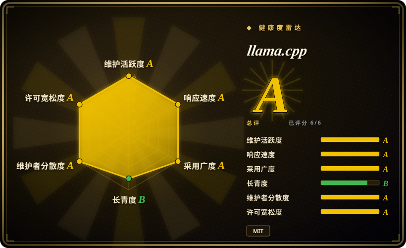
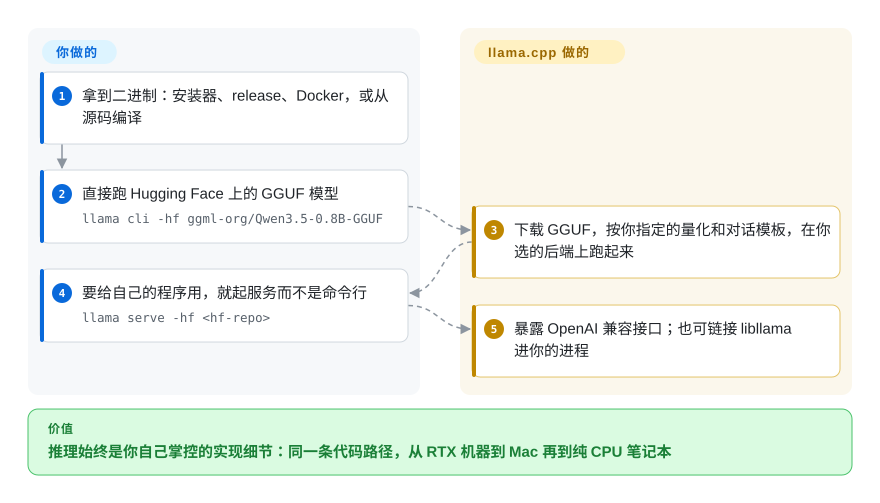

# llama.cpp

本分类里几乎所有其他项目都建在它之上：无依赖的 C/C++ LLM 与 VLM 推理引擎，覆盖目前最宽的硬件矩阵；现在 `llama cli -hf` 与 `llama serve -hf` 也把快速上手路径补齐了。

## 何时使用

你在做产品或内部工具，推理必须是你能控制的实现细节，而不是别人替你运营的服务——你要在自己的进程里调用模型、自己挑量化档与 chat template、自己定 KV cache 与上下文，并且确信同一套代码路径能跑在 RTX 机器、Mac、Intel 笔记本和 RISC-V 板子上。

当决定因素是**控制权与覆盖面**时选 llama.cpp：它是上游引擎本体（MIT、基于 ggml 的纯 C/C++、无运行时依赖），暴露本分类里最全的后端列表——CUDA、AMD 的 HIP、Metal、Vulkan、SYCL、CANN、MUSA、OpenCL、WebGPU、ZenDNN、Hexagon，外加 CPU+GPU 混合卸载和 RPC 后端；而且 `llama cli -hf` / `llama serve -hf` 现在不需要任何包装层就能下载并运行 Hugging Face 上的 GGUF。当你不想等包装层的参数子集时选它而不是 [Ollama](ollama.zh.md)；当你不是纯 NVIDIA、也不需要服务调度器时选它而不是 [vLLM](../serving-engines/vllm.zh.md)；当吞吐与后端广度比下载前估算更重要时选它而不是 [Magnitude](magnitude.zh.md)。

## 怎么用起来

llama.cpp 就是推理引擎本身，而不是包在引擎外面的管理层：纯 C/C++ 写在 ggml 之上，编译成一个自带依赖的二进制（也可以作为库链接进你的程序）。它读 **GGUF** 文件——一种把量化信息一并带上的单文件权重格式——然后在你编译或下载的后端上跑：CUDA、Metal、Vulkan、HIP、SYCL、纯 CPU 等等，模型塞不进显存时还能 CPU 和 GPU 混合分担。这里没有任何东西被包装层藏起来：量化方式、对话模板、上下文长度、KV cache 都由你自己定，这正是它存在的意义。新的入口也省掉了过去的麻烦——`llama cli -hf` 和 `llama serve -hf` 直接从 Hugging Face 拉 GGUF——而服务端讲的是 OpenAI 兼容接口，所以你既可以把库嵌进自己的进程，也可以把它当本地服务跑。

<!-- flow-steps:begin (generated from flows/llama-cpp.json by tools/flow_card.py — do not edit) -->

流程文字版

1. **你**：拿到二进制：安装器、release、Docker，或从源码编译
2. **你**：直接跑 Hugging Face 上的 GGUF 模型 — `llama cli -hf ggml-org/Qwen3.5-0.8B-GGUF`
3. **llama.cpp**：下载 GGUF，按你指定的量化和对话模板，在你选的后端上跑起来
4. **你**：要给自己的程序用，就起服务而不是命令行 — `llama serve -hf <hf-repo>`
5. **llama.cpp**：暴露 OpenAI 兼容接口；也可链接 libllama 进你的进程

**价值**：推理始终是你自己掌控的实现细节：同一条代码路径，从 RTX 机器到 Mac 再到纯 CPU 笔记本

<!-- flow-steps:end -->

## 何时不用

- **如果你想要模型仓库、GUI 和自动更新，而不是 flag 与 GGUF 文件，改用 [Ollama](ollama.zh.md) 或 LM Studio**，因为 llama.cpp 交付的是引擎与工具，不是带模型库和生命周期命令的托管式本地模型产品。
- **如果你需要大量并发请求、连续批处理或多节点服务，改用 [vLLM](../serving-engines/vllm.zh.md) 或 [SGLang](../serving-engines/sglang.zh.md)**，因为 llama.cpp 的服务端是为单用户/本地负载优化的，不提供 PagedAttention 级别的调度器。
- **如果你是纯 NVIDIA 环境、单位成本吞吐就是全部决策依据，改用 [TensorRT-LLM](../serving-engines/tensorrt-llm.zh.md)**，因为 NVIDIA 自家的编译内核与 engine 构建能超过可移植的 ggml 后端所能达到的水平，代价是厂商绑定与编译步骤。
- **如果你不想自己管 flag、量化选择和上下文长度，改用 [Magnitude](magnitude.zh.md)**，因为 llama.cpp 有意把这些全部暴露出来，也不会在下载前替你做任何估算。
- **如果你需要为长期依赖冻结 API 契约，请 pin 住确切的提交或 build tag，并为变动留预算**，因为 llama.cpp 没有 semver：发布是滚动的 build tag（`b11057`，与本次核查同一天推送），CLI 与服务端接口随之移动。想让它替你吸收这些变动，就得用 [Ollama](ollama.zh.md) 这类包装层。
- **如果你要 Mac 专属的 MLX 原生路径或模型自带的 MTP 投机解码，考虑 [omlx](omlx.zh.md) 或 [MTPLX](mtplx.zh.md)**，因为 llama.cpp 的长处是广度；平台或模型专属的优化在别处挖得更深。

## 横向对比

| 替代品 | 是否收录 | 我们的评价 | 取舍 |
|---|---|---|---|
| [Ollama](ollama.zh.md) | ✅ | 当你需要最新引擎特性、完整后端矩阵或进程内嵌入时选 llama.cpp；当你想要在同类引擎之上加一层托管模型仓库、自动更新和客户端 SDK 时选 Ollama。 | llama.cpp 给你所有旋钮但不给生命周期管理；Ollama 给你生命周期、模型库和 Docker，同时把引擎的一部分藏在它自己的 pin 与参数子集后面。 |
| [Magnitude](magnitude.zh.md) | ✅ | 当吞吐、上游新鲜度或后端广度是决定因素时选 llama.cpp；当硬件未知、你要下载前的速度与内存估算加一键 harness 接线时选 Magnitude。 | Magnitude 是这套引擎之上的产品层，选它意味着接受一个更慢、更年轻的 fork，换取本来要手工做的自动调优与适配评估。 |
| [vLLM](../serving-engines/vllm.zh.md) | ✅ | 本地、单用户、异构硬件推理以及进程内嵌入选 llama.cpp；当 GPU 服务器要高效服务大量并发请求时选 vLLM。 | llama.cpp 用服务吞吐与调度复杂度换取可移植性和无依赖构建；vLLM 用可移植性换取 NVIDIA 主导的规模化批处理。 |
| [TensorRT-LLM](../serving-engines/tensorrt-llm.zh.md) | ✅ | 需要在 AMD/Apple/CPU 之间可移植且不想有编译步骤时选 llama.cpp；只有当最大 NVIDIA 吞吐值得付出绑定与 engine 编译代价时才选 TensorRT-LLM。 | llama.cpp 用一套构建系统跑遍所有平台，牺牲 NVIDIA 峰值性能；TensorRT-LLM 拿到那个峰值，放弃其余一切。 |
| LM Studio | 未收录 | 当推理需要脚本化、嵌入或无头部署时选 llama.cpp；当人只需要下个模型在 GUI 里聊天时选 LM Studio。 | LM Studio 是本索引收录范围之外的闭源产品，无法嵌入也无法打补丁；llama.cpp 才是这些体验底下的库。 |

## 技术栈

- **主语言：** 基于 `ggml` 张量库的 C/C++；CMake 构建，无运行时依赖。
- **CPU 目标：** ARM NEON/Accelerate（Apple Silicon 是一等目标）、x86 AVX/AVX2/AVX512/AMX、RISC-V RVV/ZVFH。
- **加速器：** CUDA、HIP（AMD）、Metal（Apple）、Vulkan、SYCL 与 OpenVINO（Intel）、CANN（昇腾）、MUSA（摩尔线程）、OpenCL（Adreno）、Hexagon（骁龙）、IBM zDNN、ZenDNN（AMD CPU），另有 WebGPU 与 VirtGPU 路径。CPU+GPU 混合推理可为超出显存的模型做部分卸载。[推断]
- **随附工具：** `llama cli`（交互）、`llama serve`（OpenAI 兼容 HTTP 服务，自带 web UI）、`llama-bench`、`llama-perplexity`、`llama-quantize`，以及用于约束输出的 GBNF 语法。
- **模型格式：** GGUF，支持 1.5 位到 8 位整数量化；模型直接从 Hugging Face 拉取或在本地转换。

## 依赖

- **运行时：** 单个自包含二进制或库——不需要 Python、不需要 CUDA toolkit、不需要服务框架；GPU SDK 只在构建期需要。
- **安装路径：** GitHub releases 的预编译二进制、`llama.app` 安装器、Docker，或源码构建（自定义后端的常见路径）。
- **模型：** GGUF 文件，用 `-hf <repo>` 下载，或用转换/量化工具自行产出；权重有各自的许可，与 MIT 无关。
- **硬件：** 任意受支持的 CPU 或 GPU；无账号、无 API key、推理时无网络依赖。

## 运维难度

**中等。** 用预编译二进制或 Docker 时，跑 `llama serve` 很简单；反复出现的成本是版本管理而不是运维。由于发布是按提交生成的 build tag、没有 semver，升级需要你自己的 pin 策略与回归策略——尤其是当你的依赖落在 chat template 或服务端端点行为上时。多 GPU 与基于 RPC 的分布式推理都有文档，但需要逐主机配置。没有鉴权层、没有模型生命周期管理、也没有自动更新，生产使用意味着你要在它外面把这些补齐。

## 健康度与可持续性

- **维护：** 本分类里最活跃的项目之一——创建于 2023-03-10，本次核查前数小时仍有推送，build 发布每天多次。
- **治理与公交因子：** MIT 许可、归属 `ggml-org` 组织，维护者群体庞大（数十位署名维护者；过去一年约 74 位活跃贡献者，第一名约占 17% 提交），历史贡献者约 2,000 人。不是单人维护项目。
- **背书与 Lindy：** 在一个运行时快速更替的领域里持续开发了三年半，并成为事实上的 GGUF/边缘推理底座，被其他项目（包括 [Ollama](ollama.zh.md) 与 [Magnitude](magnitude.zh.md)）包装或 fork。这是很强的 Lindy 先验。
- **采用与生态：** 约 129,000 stars、23,400 forks，下游工具生态庞大，并有逐后端的 CI。注意：健康度雷达的采用轴是用代理包仓库（anaconda.org 上的 `llama.cpp-tools`）测得的；llama.cpp 不发布规范包，所以该轴应读作测量口径的产物，而不是采用度低的证据。
- **风险标记：** 没有 semver 且每日 build 变动；GGUF 格式与模板行为可能移动；项目有意把模型管理与服务运维留给别人。
- **结论：** 当可移植性与控制权重要时，这是用来搭建的底座，也是本分类里用来对照其他一切的“上游基准”。

## 存疑（未验证）

- [未验证] 健康度雷达的采用轴取自第三方包仓库代理，因为 llama.cpp 不发布规范包；该档位很可能低估真实采用度，但我没找到可替代的权威采用度指标。
- [未验证] 后端覆盖是按后端而非按模型、按算子记录的；某个具体量化模型在某块具体 GPU 上是否走加速，本次没有测试。
- [未验证] RPC/分布式推理（`tools/rpc`）有文档，但我没有验证其性能、稳定性或生产可用性。
- [推断] “没有 semver”是从发布源推断的（滚动 `b…` build tag 且标记为 prerelease），不是官方政策原文；项目方可能把某些 tag 当作稳定版。
- [未验证] 我没有从源码构建 llama.cpp，也没有做基准测试；Magnitude 页引用的约 6 倍差距来自第三方 issue 报告，不是我的实测。
- [未验证] 模型权重及其许可与 MIT 代码许可完全无关，本次没有审计。
