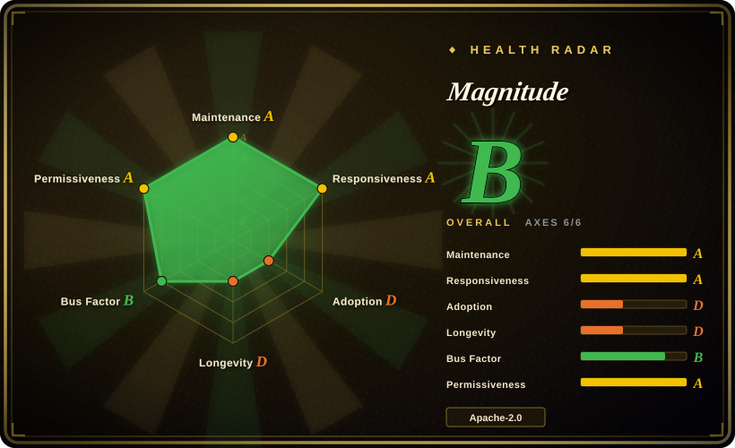
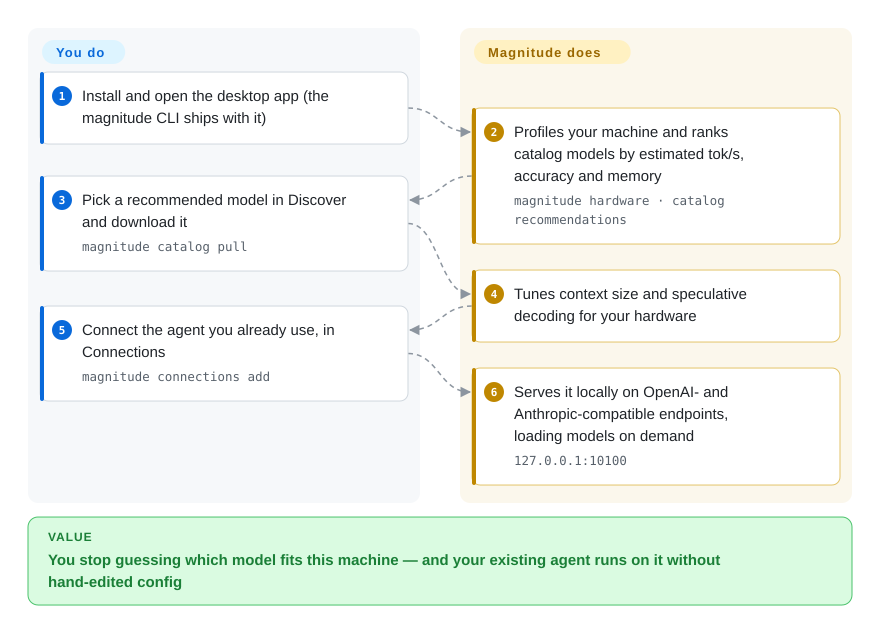

# Magnitude

Local inference engine plus a desktop app: it profiles your machine, ranks catalog models by estimated speed/accuracy/memory *before* download, tunes the one you pick, and rewrites the configuration of the coding harness you already run.

## When to use

You support a small team whose machines are deliberately non-uniform — two Apple Silicon laptops, one Windows desktop with an NVIDIA card, one AMD workstation, one CPU-only box — and everyone drives a different coding agent (opencode, Codex, Claude Code, Cline). Rolling out local models means answering "which model and which quantization is actually usable on *this* machine?" before anyone spends 20 GB of disk on a guess, and then editing four different harness config formats by hand.

You reach for Magnitude because it makes the *decision* the product: the desktop app (or `magnitude catalog recommendations`) profiles the hardware, ranks catalog models by estimated tokens/second, accuracy, intelligence and memory before anything is downloaded, prepares speculative decoding and context size for the chosen model, and writes that model into the selected harness's configuration with one click. Choose it over Ollama and llama.cpp when the deciding tradeoff is "we do not know what this hardware can run and we do not want to hand-tune flags" rather than raw throughput — and accept that the estimate layer is currently the least trustworthy part of the product (see below).

## How it works

Magnitude's pitch is that **choosing** the model is the product, not just running it. The desktop app (which bundles the `magnitude` CLI) first profiles your machine — GPU/driver, memory, CPU — and estimates tokens/second for each model in its catalog *before* you download anything, so the list you pick from is already filtered to what this box can actually run. Once you pick one, it downloads the weights and sets the hardware-dependent knobs for you (context size, speculative decoding) instead of leaving them as flags. It then runs in the background as a local inference service on OpenAI- and Anthropic-compatible endpoints, loading a model when an agent asks for it and unloading it when memory gets tight. Your agent doesn't need to know any of this: connecting it writes the right entry into that harness's own config.

<!-- flow-steps:begin (generated from flows/magnitude.json by tools/flow_card.py — do not edit) -->

Text version of the flow

1. **You**: Install and open the desktop app (the magnitude CLI ships with it)
2. **Magnitude**: Profiles your machine and ranks catalog models by estimated tok/s, accuracy and memory — `magnitude hardware · catalog recommendations`
3. **You**: Pick a recommended model in Discover and download it — `magnitude catalog pull`
4. **Magnitude**: Tunes context size and speculative decoding for your hardware
5. **You**: Connect the agent you already use, in Connections — `magnitude connections add`
6. **Magnitude**: Serves it locally on OpenAI- and Anthropic-compatible endpoints, loading models on demand — `127.0.0.1:10100`

**Value**: You stop guessing which model fits this machine — and your existing agent runs on it without hand-edited config

<!-- flow-steps:end -->

## When NOT to use

- **If Apple Silicon throughput decides the choice, run [llama.cpp](llama-cpp.md) (`llama serve`) or [Ollama](ollama.md) instead of Magnitude**, because issue #82 (open since 2026-09-06) measures the bundled engine at 9.05 tok/s where llama.cpp reaches 55.71 tok/s on the same GGUF and the same Mac; the maintainer's "upgrade to 0.0.13" fix was never confirmed by the reporter.
- **If you need AMD ROCm or a wide GPU matrix, choose [llama.cpp](llama-cpp.md) (HIP) or [Ollama](ollama.md) (ROCm + Vulkan) instead**, because Magnitude documents no ROCm backend (AMD runs through Vulkan only) and its CUDA builds target Ampere-class and newer GPUs.
- **If you need a headless server, containers, or LAN/remote access, choose [vLLM](../serving-engines/vllm.md)/[SGLang](../serving-engines/sglang.md) for serving, or [llama.cpp](llama-cpp.md) `llama serve` for a single box**, because Magnitude's API binds `127.0.0.1` only, is not shipped as a Docker image, and expects the desktop app to be running; a configurable bind address is still an open feature request (#116).
- **If you are buying a long-lived dependency, choose [llama.cpp](llama-cpp.md) or [Ollama](ollama.md) instead**, because Magnitude is a two-month-old single-vendor repo where two contributors produce ~92% of commits, and its product identity moved twice in three weeks (see Health & viability).
- **If you need unattended long-running service, prefer [llama.cpp](llama-cpp.md) or [Ollama](ollama.md) for now**, because open reports include an inference worker that wedges after ~35 minutes of serving (#99) and a gateway 502 that drops the worker on long high-effort generations (#62).
- **If you need a wide model library or arbitrary GGUF import, use [Ollama](ollama.md)'s registry or `llama cli -hf` from [llama.cpp](llama-cpp.md)**, because Magnitude's catalog holds 21 model entries and the ad-hoc Hugging Face load path has an open inventory failure (#99).

## Comparison

| Alternative | In index | Our verdict | Tradeoff |
|---|---|---|---|
| [Ollama](ollama.md) | ✅ | Pick Magnitude when the machine's capability is unknown and you want a pre-download speed/memory estimate plus automatic context and speculative-decoding setup; pick Ollama when you already know the model, want the far larger library with official Python/JS SDKs, or need its hosted cloud tier. | Magnitude buys you fit assessment and harness wiring you do not have to reason about; Ollama buys you ecosystem, SDKs, a 4096-token default context you must raise yourself for agentic work, and a documented ROCm path Magnitude lacks. |
| [llama.cpp](llama-cpp.md) | ✅ | Pick Magnitude when you want one-click setup and automated speculative decoding across mixed GPUs and do not want to tune flags; pick llama.cpp when throughput, backend breadth, or upstream freshness decides. | Magnitude is a fork-plus-product layer over exactly this engine, so you pay a slower, younger derivative to avoid reading llama.cpp's flags — and you inherit its release lag. |
| [omlx](omlx.md) | ✅ | Pick Magnitude when the fleet includes NVIDIA/AMD/CPU machines and you need one workflow across them; pick omlx when every target is an Apple Silicon Mac and MLX-native throughput matters more than cross-platform uniformity. | Magnitude covers more hardware with one UI; omlx goes deeper on one platform Magnitude only serves through a llama.cpp Metal backend. |
| [MTPLX](mtplx.md) | ✅ | Pick Magnitude for pre-download hardware ranking and multi-harness wiring on mixed hardware; pick MTPLX when you specifically want model-native MTP speculative decoding for Qwen 3.8 on a Mac. | Both automate speculative decoding, but MTPLX is Mac-and-Qwen-shaped while Magnitude trades that depth for breadth across GPUs and models. |
| LM Studio | 未收录 | Reach for Magnitude when you need scriptable, license-clean integration into other agents and CI; reach for LM Studio when you only want a GUI to chat with local models and accept a closed-source desktop app. | Magnitude is Apache-2.0 and exposes a CLI plus OpenAI/Anthropic-compatible HTTP endpoints you can automate; LM Studio is a non-repo product, so it cannot be vendored, audited, or patched. |

## Tech stack

- **Primary language:** TypeScript per GitHub metadata; the component that actually performs inference is Rust (the `icn-*` crates under `inference/`), so the metadata understates the native surface. [推断]
- **Shape:** a Bun + Turborepo monorepo — Electron desktop app (`desktop/`, React 19 + Tailwind 4), headless CLI (`cli/`), an Effect-TS SDK/daemon layer (`packages/*`), and a Rust workspace for the engine.
- **Engine:** a vendored fork of the `llama.cpp` bindings (`magnitudedev/llama-cpp-rs`), pinned through two nested submodules down to an exact upstream llama.cpp revision; the ICN server exposes the HTTP/OpenAPI boundary.
- **HTTP surface:** OpenAI-compatible (`/inference/v1/chat/completions`, `/responses`) and Anthropic-compatible (`/inference/anthropic/v1/messages`, plus `count_tokens`) on `127.0.0.1:10100`.
- **Model format:** GGUF; the catalog pins each entry to an immutable Hugging Face commit in `inference/catalog/models.lock.json`.

## Dependencies

- **Packaged path:** the desktop installers (`.dmg`/`.zip`, `.exe`, `.deb`/`.rpm`) and the per-backend ICN binaries are published as GitHub release assets; no Python, CUDA toolkit, or separate CLI install is required.
- **GPU/driver:** Metal on Apple Silicon (no extra toolkit); CUDA builds target Ampere-class and newer NVIDIA GPUs with the vendor driver; AMD and other GPUs need a Vulkan 1.1 runtime. CPU-only works.
- **Model weights:** downloaded from `huggingface.co` at the commits pinned in the catalog lock file.
- **External services:** model downloads and the desktop update check (`magnitude.dev/api/update`) are network calls, and a failed release request has been reported to block launch (#95). Nothing else leaves the machine once a model is downloaded.
- **Building from source:** Bun, a Rust toolchain, CMake/C++ build tools, and recursive submodule initialization — materially heavier than installing the app.

## Ops difficulty

**Low to try, medium to operate.** Installing is a signed installer plus the bundled CLI; the app itself manages model download, load/unload and launch-at-login. The frictions you must accept: the HTTP API is loopback-only (no LAN, containers, or remote workers), model storage location is not configurable (#107), there is no Docker image or server-only distribution, and the app must stay running for a harness to reach a model. Building the engine from source is a high-effort path (Rust workspace plus two nested native submodules). Treat it as a workstation tool, not a deployable service.

## Health & viability

- **Maintenance:** extremely active but very young — repository created 2026-06-12 with a first commit on 2026-07-13 and ~824 commits by 2026-09-19, so the code lineage is roughly two months old; CLI 0.1.x releases landed within days of this review. Activity is not the risk here.
- **Governance / bus factor:** owned by Magnitude AI Inc. (a vendor org, not a foundation); 8 listed contributors with the top two producing ~92% of commits. No `SECURITY.md`, `CODEOWNERS`, or `GOVERNANCE.md`. The roadmap is the company's.
- **Backing & Lindy:** the Lindy prior does not apply yet — two months is too short for survivorship to mean anything, and a single-vendor project's durability tracks that company's funding rather than the repo's age.
- **Adoption signal:** ~4,707 stars against 364 forks but only 20 watchers, with an unusually fast climb on a very young repo — a shape this index treats as a caution flag rather than social proof. [推断]
- **Risk flags:** product identity changed twice inside three weeks — the npm `@magnitudedev/cli` package was deprecated on 2026-09-17 with the notice "MAGNITUDE HAS MOVED TO A FREE, OPEN SOURCE DESKTOP APP", while `AGENTS.md` in-repo still self-describes an "AI coding agent platform" and the npm metadata still says "Magnitude AI coding agent". Budget for that churn.
- **Verdict:** use it for the decision layer today with a fallback to llama.cpp/Ollama for anything that must be dependable; do not make it the only way your team reaches local models.

## Caveats (unverified)

- [推断] `language: TypeScript` reflects GitHub's byte-count metadata; the component that actually does inference is Rust over a pinned llama.cpp fork, so the frontmatter language understates the native surface.
- [未验证] The ~4,707 stars / 20 watchers ratio is flagged as a possible hype signal; nothing here confirms or refutes star inflation, only that age plus ownership plus ratio warrant caution.
- [未验证] Whether the ~6x Apple Silicon slowdown in #82 is fixed after 0.0.13 — the maintainer asserted a background-service regression was corrected and asked the reporter to retest; the issue is still open with no confirmation.
- [未验证] Catalog-estimate accuracy. Issue #82 reports an estimate of ~30–40 tok/s against 9.05 measured, and #99 reports roughly a 2x overestimate on two models; I did not reproduce these measurements.
- [推断] Repository age: GitHub reports `created_at` 2026-06-12 but the initial commit is 2026-07-13; "two months old" refers to the commit lineage, and the true project start date is unconfirmed.
- [未验证] Whether the in-repo agent runtime, chat UI, and first-party cloud provider (`https://app.magnitude.dev/api/v1` with billing CTAs) are live, dead, or internal — they are visible in the source tree but absent from the shipped documentation.
- [未验证] I did not build the project from source, so build reproducibility, the exact bundled engine version in a given installer, and real download sizes are unverified.
- [未验证] The radar's adoption axis is computed from the npm package `@magnitudedev/cli`, which was deprecated on 2026-09-17 in favour of the desktop app; its download count therefore measures the legacy CLI rather than current adoption of the app.
- [未验证] The catalog size ("21 model entries") is a count of `inference/catalog/models.json` at commit 537ccb1 on 2026-09-20; the installable package count including quant and draft variants is larger and was not counted.
