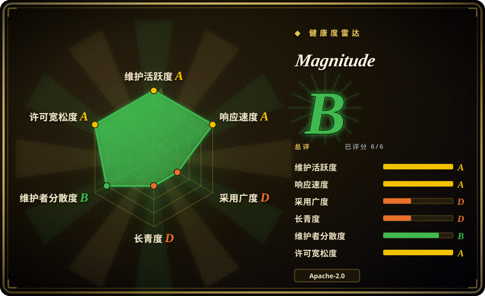
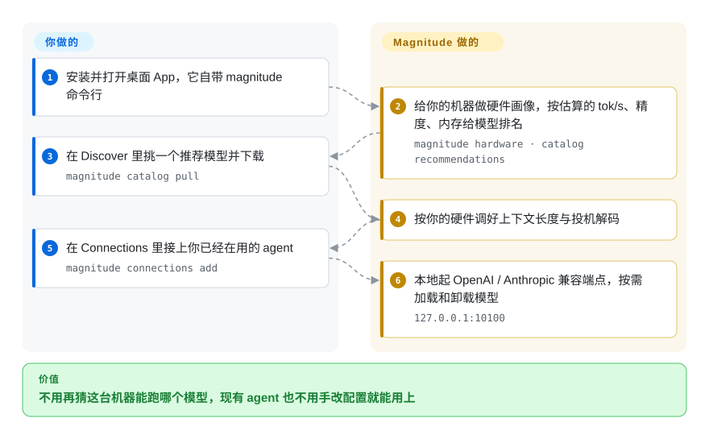

# Magnitude

本地推理引擎加桌面应用：先给你的机器做画像，在下载之前按估算的速度、精度、内存排序 catalog 里的模型，再为你选中的那个做好调优，并把模型写进你已经在用的 coding harness 配置里。

## 何时使用

你带着一个小团队，机器故意不统一——两台 Apple Silicon 笔记本、一台带 NVIDIA 卡的 Windows 台式机、一台 AMD 工作站、一台纯 CPU 的机器——而每个人用的 coding agent 还不一样（opencode、Codex、Claude Code、Cline）。要铺开本地模型，先得回答“这个模型、这个量化档，在**这台**机器上到底能不能用”，否则谁都可能在瞎猜里先花掉 20 GB 磁盘；答完还要手改四套互不相同的 harness 配置格式。

你选择 Magnitude，是因为它把**决策本身**做成了产品：桌面应用（或 `magnitude catalog recommendations`）先给硬件画像，在下载之前按估算的 tokens/秒、精度、智能程度和内存给 catalog 模型排序，为选中的模型准备好投机解码与上下文长度，再一键把该模型写进目标 harness 的配置。当决定性取舍是“我们不知道这台硬件能跑什么、也不想手调 flag”而不是原始吞吐时，选它而不是 Ollama 或 llama.cpp——同时要接受：这个产品当前最不可信的恰恰是估算层（见下）。

## 怎么用起来

Magnitude 的卖点是**帮你选**模型，而不只是把模型跑起来。桌面 App（内含 `magnitude` 命令行）先给你的机器做一次画像——显卡与驱动、内存、CPU——并在你下载任何东西**之前**估算出目录里每个模型在这台机器上的 tok/s，所以你面对的候选列表已经过滤成「这台机器真能跑的」。选定之后，它负责下载权重，并替你把跟硬件相关的旋钮调好（上下文长度、投机解码），不用你去记命令行参数。之后它作为本地推理服务常驻后台，对外提供 OpenAI 和 Anthropic 兼容端点，agent 要用时才加载模型，内存吃紧时自动卸载。你的 agent 不需要知道这些：在 Connections 里接一下，它就把对应配置写进那个 agent 自己的配置文件。

<!-- flow-steps:begin (generated from flows/magnitude.json by tools/flow_card.py — do not edit) -->

流程文字版

1. **你**：安装并打开桌面 App，它自带 magnitude 命令行
2. **Magnitude**：给你的机器做硬件画像，按估算的 tok/s、精度、内存给模型排名 — `magnitude hardware · catalog recommendations`
3. **你**：在 Discover 里挑一个推荐模型并下载 — `magnitude catalog pull`
4. **Magnitude**：按你的硬件调好上下文长度与投机解码
5. **你**：在 Connections 里接上你已经在用的 agent — `magnitude connections add`
6. **Magnitude**：本地起 OpenAI / Anthropic 兼容端点，按需加载和卸载模型 — `127.0.0.1:10100`

**价值**：不用再猜这台机器能跑哪个模型，现有 agent 也不用手改配置就能用上

<!-- flow-steps:end -->

## 何时不用

- **如果决定因素是 Apple Silicon 上的吞吐，改用 [llama.cpp](llama-cpp.zh.md)（`llama serve`）或 [Ollama](ollama.zh.md)**，因为 issue #82（自 2026-09-06 起仍开放）在同一个 GGUF、同一台 Mac 上实测内置引擎 9.05 tok/s，而 llama.cpp 达到 55.71 tok/s；维护者“升到 0.0.13 就修复”的说法至今没得到报告者确认。
- **如果你需要 AMD ROCm 或更宽的 GPU 支持矩阵，改用 [llama.cpp](llama-cpp.zh.md)（HIP）或 [Ollama](ollama.zh.md)（ROCm 加 Vulkan）**，因为 Magnitude 官方文档没有 ROCm 后端（AMD 只能走 Vulkan），CUDA 构建也只覆盖 Ampere 及更新架构。
- **如果你需要无头服务、容器或局域网/远程访问，服务端场景改用 [vLLM](../serving-engines/vllm.zh.md)/[SGLang](../serving-engines/sglang.zh.md)，单机场景改用 [llama.cpp](llama-cpp.zh.md) 的 `llama serve`**，因为 Magnitude 的 API 只绑定 `127.0.0.1`，不提供 Docker 镜像，并依赖桌面应用常驻；可配置监听地址仍是一个未实现的 feature request（#116）。
- **如果你在挑一个要长期依赖的项目，改用 [llama.cpp](llama-cpp.zh.md) 或 [Ollama](ollama.zh.md)**，因为 Magnitude 是两个月大、单厂商所有的仓库，两名贡献者产出约 92% 的提交，且产品定位三周内改过两次（见「健康度与可持续性」）。
- **如果你需要长时间无人值守地跑服务，眼下优先 [llama.cpp](llama-cpp.zh.md) 或 [Ollama](ollama.zh.md)**，因为未关闭的报告里有推理 worker 在服务约 35 分钟后卡死（#99），以及长时高 effort 生成触发 gateway 502 并打掉 worker（#62）。
- **如果你需要庞大的模型库或任意 GGUF 导入，改用 [Ollama](ollama.zh.md) 的模型库或 [llama.cpp](llama-cpp.zh.md) 的 `llama cli -hf`**，因为 Magnitude 的 catalog 只有 21 条模型条目，而临时的 Hugging Face 加载路径存在未修复的 inventory 失败（#99）。

## 横向对比

| 替代品 | 是否收录 | 我们的评价 | 取舍 |
|---|---|---|---|
| [Ollama](ollama.zh.md) | ✅ | 当机器能力未知、你想要下载前的速度与内存估算以及自动的上下文和投机解码配置时，选 Magnitude；当你已经知道要跑哪个模型、想要大得多的模型库与官方 Python/JS SDK、或需要它的托管云服务时，选 Ollama。 | Magnitude 换来的是免思考的适配评估和 harness 接线；Ollama 换来的是生态、SDK、以及一个需要你自己调大的 4096 token 默认上下文，还有 Magnitude 完全没有的 ROCm 路径。 |
| [llama.cpp](llama-cpp.zh.md) | ✅ | 当你要跨混合 GPU 一键装好并自动配投机解码、不想碰 flag 时选 Magnitude；当吞吐、后端广度或上游新鲜度是决定因素时选 llama.cpp。 | Magnitude 本质是这套引擎之上的一层 fork 加产品化，所以你用“更慢、更年轻的衍生物”换“不用读 llama.cpp 的 flag 文档”，并且继承它的版本滞后。 |
| [omlx](omlx.zh.md) | ✅ | 当机器群里包含 NVIDIA/AMD/纯 CPU 且你要一套统一流程时选 Magnitude；当目标全是 Apple Silicon Mac、且 MLX 原生吞吐比跨平台一致性更重要时选 omlx。 | Magnitude 用一套界面覆盖更多硬件；omlx 在一个平台上挖得更深，而那个平台 Magnitude 只通过 llama.cpp 的 Metal 后端间接服务。 |
| [MTPLX](mtplx.zh.md) | ✅ | 当你要下载前的硬件排序与多 harness 接线、且硬件混杂时选 Magnitude；当你专门要在 Mac 上让模型自带的 MTP 头精确投机解码 Qwen 3.8 时选 MTPLX。 | 两者都自动化了投机解码，但 MTPLX 是 Mac 加 Qwen 的形状；Magnitude 放弃这种深度，换取跨 GPU 与跨模型的广度。 |
| LM Studio | 未收录 | 当你需要可脚本化、许可干净的集成（接进别的 agent 与 CI）时选 Magnitude；当你只想有个 GUI 跟本地模型聊天、并接受闭源桌面应用时选 LM Studio。 | Magnitude 是 Apache-2.0，提供 CLI 和可自动化的 OpenAI/Anthropic 兼容 HTTP 端点；LM Studio 不是仓库形态的产品，无法 vendor、审计或自行打补丁。 |

## 技术栈

- **主语言：** GitHub 元数据标为 TypeScript；真正做推理的部件是 Rust（`inference/` 下的 `icn-*` crates），因此元数据低估了原生代码面。[推断]
- **形态：** Bun 加 Turborepo 的单体仓库——Electron 桌面应用（`desktop/`，React 19 加 Tailwind 4）、headless CLI（`cli/`）、基于 Effect-TS 的 SDK 与 daemon 层（`packages/*`），以及引擎的 Rust workspace。
- **引擎：** `llama.cpp` 绑定 fork（`magnitudedev/llama-cpp-rs`），通过两层嵌套 submodule 精确 pin 到上游某个 llama.cpp 提交；ICN server 暴露 HTTP/OpenAPI 边界。
- **HTTP 接口：** OpenAI 兼容（`/inference/v1/chat/completions`、`/responses`）与 Anthropic 兼容（`/inference/anthropic/v1/messages`，外加 `count_tokens`），监听 `127.0.0.1:10100`。
- **模型格式：** GGUF；catalog 在 `inference/catalog/models.lock.json` 里把每条目 pin 到不可变的 Hugging Face 提交。

## 依赖

- **打包路径：** 桌面安装包（`.dmg`/`.zip`、`.exe`、`.deb`/`.rpm`）与各后端 ICN 二进制都作为 GitHub release 资产发布；不需要 Python、CUDA toolkit，也不用单独装 CLI。
- **GPU 与驱动：** Apple Silicon 走 Metal（无需额外工具链）；CUDA 构建面向 Ampere 及更新的 NVIDIA GPU，需厂商驱动；AMD 与其他 GPU 需要 Vulkan 1.1 运行时。纯 CPU 也能跑。
- **模型权重：** 从 `huggingface.co` 按 catalog lock 文件 pin 的提交下载。
- **外部服务：** 模型下载与桌面端更新检查（`magnitude.dev/api/update`）是网络调用，已有报告称 release 请求失败会阻塞启动（#95）。模型下载完之后其余都在本机。
- **源码构建：** 需要 Bun、Rust 工具链、CMake/C++ 构建工具，并递归初始化 submodule——比装应用重得多。

## 运维难度

**上手低，运维中等。** 安装是签名安装包加内置 CLI，模型下载、加载/卸载与开机自启都由应用自己管。必须接受的摩擦：HTTP API 只监听回环（没有局域网、容器、远程 worker），模型存储位置不可配置（#107），没有 Docker 镜像或纯服务端发行物，且 harness 要用模型就必须让桌面应用常驻。从源码构建引擎是重活（Rust workspace 加两层嵌套原生 submodule）。把它当工作站工具，而不是可部署的服务。

## 健康度与可持续性

- **维护：** 极其活跃但非常年轻——仓库创建于 2026-06-12，首个提交在 2026-07-13，到 2026-09-19 约 824 次提交，也就是说**代码谱系**只有约两个月；CLI 0.1.x 的发布就在本次核查前几天。这里的风险不是活跃度。
- **治理与公交因子：** 归 Magnitude AI Inc.（厂商组织，不是基金会）所有；列出 8 位贡献者，前两位产出约 92% 的提交。没有 `SECURITY.md`、`CODEOWNERS` 或 `GOVERNANCE.md`。路线图属于这家公司。
- **背书与 Lindy：** Lindy 先验目前不适用——两个月太短，存活本身不构成证据；单厂商项目的可持续性跟的是这家公司的融资，而不是仓库年龄。
- **采用信号：** 约 4,707 stars 对 364 forks，但 watchers 只有 20，且在极年轻的仓库上爬升异常快——本索引把这种形状当作警示信号而非社会证明。[推断]
- **风险标记：** 产品定位三周内变过两次——npm 包 `@magnitudedev/cli` 于 2026-09-17 被弃用，文案是 “MAGNITUDE HAS MOVED TO A FREE, OPEN SOURCE DESKTOP APP”；而仓库内 `AGENTS.md` 仍自称 “AI coding agent platform”，npm 元数据也仍写着 “Magnitude AI coding agent”。请为这种变动留出预算。
- **结论：** 今天可以把它的决策层当作提效工具用，但任何必须可靠的部分都要留 llama.cpp/Ollama 作为退路；不要让团队只靠它这一条路拿到本地模型。

## 存疑（未验证）

- [推断] `language: TypeScript` 反映的是 GitHub 的字节数统计；真正做推理的部件是 Rust 加 pin 住的 llama.cpp fork，因此 frontmatter 的语言标注低估了原生代码面。
- [未验证] 约 4,707 stars 对 20 watchers 的比例被标为可能的炒作信号；这里既不确认也不否认 star 注水，只说明年龄、归属方与比例值得警惕。
- [未验证] #82 里约 6 倍的 Apple Silicon 速度差距在 0.0.13 之后是否已修复——维护者声称是后台服务运行方式导致的回归并请报告者复测，但 issue 仍开放且没有确认。
- [未验证] catalog 估算的准确度。#82 报告估算约 30–40 tok/s 而实测 9.05，#99 报告两个模型上约 2 倍高估；我没有复现这些测量。
- [推断] 仓库年龄：GitHub 的 `created_at` 是 2026-06-12，但首个提交在 2026-07-13；“两个月大”指的是提交谱系，真实项目启动时间未确认。
- [未验证] 仓库内的 agent runtime、chat UI 与自家云 provider（`https://app.magnitude.dev/api/v1` 带 billing CTA）究竟是活的、废弃的还是内部使用——这些在源码树里可见，但公开文档完全没提。
- [未验证] 我没有从源码构建过该项目，因此构建可复现性、某个安装包内实际捆绑的引擎版本、以及真实下载体积都未经核实。
- [未验证] 雷达的采用度轴取自 npm 包 `@magnitudedev/cli`，而该包已于 2026-09-17 被弃用、改用桌面应用；因此它的下载量反映的是旧 CLI，而不是当前应用的采用度。
- [未验证] catalog 规模（“21 条模型条目”）是 2026-09-20 在提交 537ccb1 上对 `inference/catalog/models.json` 的计数；包含量化与 draft 变体后的可安装包数量更多，未统计。
