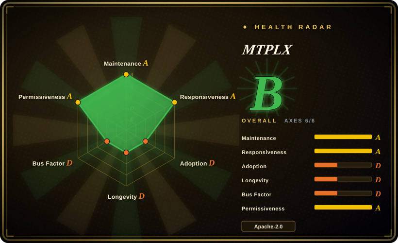

# MTPLX

Local LLM inference on Apple Silicon that uses the model's own MTP heads for exact speculative decoding, shipped as a macOS app plus an OpenAI/Anthropic-compatible server.

## When to use

You're a developer on a 32–128 GB Apple Silicon Mac driving a coding agent (OpenCode, Claude Code, Cline) against Qwen 3.8 27B or Flash Next locally, and decode speed — not prefill, not batch — is your bottleneck. You reach for MTPLX because it is the only indexed option that runs the **target model's own multi-token-prediction heads** as a speculative drafter: one batched pass verifies the draft and commits through exact rejection sampling (Leviathan & Chen with residual correction), so output distribution is the model's own at any temperature while decode runs roughly 1.6–2.2x faster than plain decoding [unverified — author's machines, see Caveats]. Versus llama.cpp/Ollama it wins on the Apple-Silicon MTP niche (no GGUF round-trip, MLX-native quant packs); versus omlx it wins on the decoder itself, not just KV-cache ergonomics; versus mlx-lm it adds the whole serving/app layer (fan control, auto-tune, session cache, Forge). The all-in-one install story (DMG or `brew install`, hardware check, model recommendation, depth benchmarking on your chip) is the deciding convenience if you want zero-config Mac-native serving for the Qwen family.

## When NOT to use

- **Any non-Apple-Silicon target** → use [vLLM](../serving-engines/vllm.md) or llm-metal-family stacks; MTPLX is MLX/Metal-only with a darwin+arm64 dependency gate, and the author says so ("for Linux, use vLLM").
- **Models outside the verified Qwen/Gemma pack catalog** → use Ollama or [llama.cpp](llama-cpp.md): MTPLX's advantage is native MTP heads, which today only the Qwen 3.5+/Gemma 4 packs it publishes have; on anything else it degrades to AR-only mode where [mlx-lm](../../on-device-ml/mlx-mlx-lm.md) is the leaner pick.
- **Embedding the engine in a commercial product** → check the license first: Apache-2.0 plus a NOTICE that **requires a visible in-product "Powered by MTPLX" attribution** (verified in-repo, 2026-09-18). If a credits-in-product clause is unacceptable, use mlx-lm or llama.cpp (no such clause).
- **Shared/team serving, GPU clusters, multi-tenant batching** → use [vLLM](../serving-engines/vllm.md) or [SGLang](../serving-engines/sglang.md); MTPLX's scheduler targets one Mac, one resident model.
- **You refuse any passwordless-sudo surface** → `mtplx max --install` installs a sudoers rule for its fan-control helper (ThermalForge); [omlx](omlx.md) and LM Studio (not indexed, closed-source) need nothing like it.
- **Low-risk production bets** → the public repo is ~5 months old (created 2026-05-02, API-verified) and ~78% of commits come from one author; treat it as an early-adopting tool, not infrastructure.

## Comparison

| Alternative | In index | Our verdict | Tradeoff |
| --- | --- | --- | --- |
| [mlx-lm](../../on-device-ml/mlx-mlx-lm.md) | ✅ | When you just want to run any MLX model on a Mac with minimal moving parts, pick mlx-lm; pick MTPLX when decode latency of Qwen MTP-capable models is the problem, since its own-MTP-head speculation is roughly 2x faster at the cost of a much bigger, attribution-bearing app-stack. | MTPLX: speed + polished server/app; mlx-lm: breadth, upstream-MLX stability, tiny surface. |
| [omlx](omlx.md) | ✅ | Both are young Mac/MLX OpenAI servers; pick omlx for SSD-tiered KV caching with a lighter footprint, pick MTPLX when you need the exact MTP speculative decode and packaged Qwen 3.8 weights — its differentiator is the decoder, not the cache. | MTPLX buys speed with a heavier install (fan control, bundled engine); omlx stays closer to plain mlx-lm. |
| [llama.cpp](llama-cpp.md) | ✅ | Pick llama.cpp for hardware breadth (CUDA/ROCm/CPU, any GGUF) and decade-proven longevity; pick MTPLX only for the Apple-Silicon-native MTP lane, where llama.cpp's mainline MTP speculation landed only in May 2026 (PR merge, API-verified) while MTPLX ships tuned model packs itself. | llama.cpp: portability + Lindy; MTPLX: Metal-native speed + one-click Mac UX. |
| [Ollama](ollama.md) | ✅ | For "pull and chat" simplicity across platforms with the largest model catalog, Ollama wins; MTPLX is for Mac users who benchmarked Ollama's decode and want the measured ~1.6–2.2x on Qwen 3.8 specifically. | Ollama: catalog + cross-OS; MTPLX: narrow model set, faster on it. |
| [vLLM](../serving-engines/vllm.md) | ✅ | Server-grade continuous batching, PagedAttention, multi-GPU — vLLM; single-Mac desk-side agent loop — MTPLX. Choosing vLLM for a laptop means CUDA tax or Metal-provenance games. | vLLM: throughput at scale; MTPLX: latency-per-watt on one Mac. |

## Tech stack

Python 3.11+ on MLX (`mlx`, `mlx-lm`, `transformers`, `safetensors`, verified via `pyproject.toml`/PyPI 2026-09-18); FastAPI + uvicorn server; vendored Apache-2.0 Metal paged-attention kernels from vllm-metal and NAX verify kernels adapted from dflash-mlx (per `NOTICE`, verified in-repo); Swift/SwiftUI macOS app (`apps/MTPLXApp`); fan control via ThermalForge; ~395 pytest files including an enumeration-based "exactness oracle" (`tests/test_block_verify_exact_law.py`) that checks accept laws against fraction-arithmetic ground truth on tiny vocabularies.

## Dependencies

Apple Silicon (M1+) on macOS 14+. Memory per model pack from 2.9 GiB (4-bit 4B) to ~87 GiB resident (Flash Next, needs a 96 GB Mac); the 51B-parameter n-gram table streams from SSD. Hugging Face downloads (106–115 GB for Flash Next packs). No external database, no GPU server. Optional root: fan-control install writes a sudoers rule.

## Ops difficulty

**Low** for the intended path: DMG drag-install or `brew install youssofal/mtplx/mtplx`; the app checks hardware, recommends a fitting model, downloads, and auto-tunes draft depth on your chip; one shared server process for app + CLI; SSD session cache restores chats across restarts. **Medium** if you step off the catalog: arbitrary MLX models run AR-only, Forge-built MTP adapters need the original checkpoint, and heavy models mean 100+ GB downloads plus thermal management.

## Health & viability

- **Maintenance: exceptional tempo, verified** — v2.11.3 released 2026-09-17; 8 releases Aug–Sep 2026; last push within a day of verification (GitHub API, 2026-09-18); 1,370 commits.
- **Governance: author-dominant, not solo** — 30 contributors, but top author ≈78% of commits (second contributor 102 commits) [API-verified]; no foundation backing.
- **Age / Lindy: negative so far** — public repo created 2026-05-02; HISTORY.md claims a 2026-04-27 first MTP runtime predating the repo (pre-history unverified). [推断] Five months of cadence cuts both ways: momentum, zero endurance evidence.
- **Adoption: real but young** — HF packs show 53.5k monthly downloads (Qwen3.8-27B Optimized Speed, API 2026-09-18) and PyPI 3318 downloads/month (health registry measure); 2.4k stars.
- **Risk flags** — in-product attribution NOTICE (verified); the same HF author account publishes many "abliterated/uncensored" model packs (verified 2026-09-18) — irrelevant to engine quality but a reputation-adjacency point for enterprise use; benchmarks hosted on the project's own site; `Security and quality: 0` on GitHub's tab (no advisories — nor any disclosed-incident process yet).

## Caveats (unverified)

- [未验证] All throughput numbers (79.3–227.8 tok/s, 1.6x/2.24x speedups, the 125.8 tok/s OpenCode run) are author-measured on author machines (M5 Max / M4 Mac mini); raw logs live only on mtplx.com; not reproduced here.
- [未验证] "First Apple Silicon runtime with exact MTP speculative sampling (2026-04-27, before llama.cpp had MTP)" — timing claim from HISTORY.md; the public repo created later (2026-05-02). Partially corroborated: llama.cpp mainline "llama + spec: MTP Support" merged 2026-05-04 (PR search, API-verified), though the 2026-04-27 date itself predates the repo and was not independently verified.
- [未验证] Distributional exactness at any temperature — the repo contains a genuine enumeration oracle test and CI, but neither was executed in this review (needs MLX hardware); treat as strong engineering evidence, not measured fact.
- [未验证] SSD session-cache restore numbers (96,760 tokens in 8 ms) and 261k-token prompt decoding — author-reported.
- [未验证] "M5 Max" hardware and Qwen "3.8" generation naming — Qwen 3.8 models verified to exist upstream on Hugging Face, but MTP exactness *of those specific upstream weights* was not checked.
- [推断] Fan-control watchdog restore-after-`kill -9` is claimed hardware-verified by the author; reviewed at code level only (a sidecar process in `mtplx/thermal_sidecar.py`).
- [未验证] Laguna-S-2.1 target-only support details (pinned revision, 85 GiB preflight) — README text only; the pinned-check logic was not read line-by-line.
