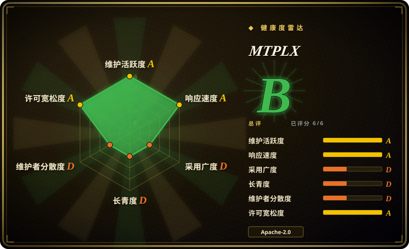

# MTPLX

在 Apple Silicon 上用模型自带的 MTP 头做精确投机解码的本地推理引擎，以 macOS 应用加 OpenAI/Anthropic 兼容服务器的形态交付。

## 何时使用

你在一台 32–128 GB 的 Apple Silicon Mac 上，让编码 agent（OpenCode、Claude Code、Cline）跑本地的 Qwen 3.8 27B 或 Flash Next，瓶颈是解码速度而不是 prefill 或批量吞吐。你选 MTPLX，因为它是索引内唯一把**目标模型自己的 MTP 头**当投机草稿器的方案：一次批量前向验证草稿，再用精确拒绝采样（Leviathan 与 Chen 定理加残差修正）提交，所以任何温度下的输出分布都是模型本身的，而解码比朴素路径快约 1.6–2.2 倍[未验证——作者自测数据，见存疑账本]。对比 llama.cpp/Ollama，它赢在 Apple Silicon 原生 MTP 这条道（不走 GGUF 往返，量化包原生 MLX）；对比 omlx，它赢在解码器本身而不只是 KV 缓存工效；对比 mlx-lm，它补齐了整套服务与应用层（风扇控制、自动调深度、会话缓存、Forge）。如果你想要对 Qwen 家族零配置的 Mac 原生服务体验，它的安装一条龙（DMG 或 `brew install`、硬件体检、按内存荐模型、在你芯片上实测各深度）就是决定性便利。

## 何时不用

- **任何非 Apple Silicon 目标**——用 [vLLM](../serving-engines/vllm.zh.md) 等；MTPLX 是 MLX/Metal 专属，依赖清单里就写死 darwin+arm64 门槛，作者自己也说“Linux 请用 vLLM”。
- **不在已验证 Qwen/Gemma 包目录内的模型**——用 Ollama 或 [llama.cpp](llama-cpp.zh.md)：MTPLX 的优势来自原生 MTP 头，目前只有它发布的 Qwen 3.5+/Gemma 4 包具备；其余模型退化为纯 AR 模式，那时 [mlx-lm](../../on-device-ml/mlx-mlx-lm.zh.md) 更轻更合适。
- **要把引擎嵌进商业产品**——先看清许可：Apache-2.0 之外，NOTICE 强制要求产品内可见位置的 “Powered by MTPLX” 署名（2026-09-18 已在仓库内核验原文）；不能接受产品内署名条款就用 mlx-lm 或 llama.cpp（均无此条款）。
- **团队共享服务、GPU 集群、多租户批量**——用 [vLLM](../serving-engines/vllm.zh.md) 或 [SGLang](../serving-engines/sglang.zh.md)；MTPLX 的调度器面向一台 Mac 驻留一个模型。
- **拒绝任何免密 sudo 面**——`mtplx max --install` 为风扇控制助手（ThermalForge）写入 sudoers 规则；[omlx](omlx.zh.md) 和 LM Studio（未收录，闭源）不需要这类东西。
- **求稳的生产押注**——公开仓库 2026-05-02 创建（API 核验），至今约五个月，约 78% 提交来自单一作者；当尝鲜工具，别当基础设施。

## 横向对比

| 替代品 | 是否收录 | 我们的评价 | 取舍 |
| --- | --- | --- | --- |
| [mlx-lm](../../on-device-ml/mlx-mlx-lm.zh.md) | ✅ | 只想在 Mac 上以最少活动零件跑任意 MLX 模型，选 mlx-lm；问题出在 Qwen 系 MTP 可解码模型的延迟时才选 MTPLX，因为自带 MTP 头投机约 2 倍提速，代价是一个大得多且带署名条款的应用栈。 | MTPLX 买到速度与打磨好的服务器/应用；mlx-lm 换来覆盖面、上游 MLX 的稳定性与极小暴露面。 |
| [omlx](omlx.zh.md) | ✅ | 两者都是年轻的 Mac/MLX OpenAI 服务器；要 SSD 分层 KV 缓存且足迹更轻选 omlx，要精确 MTP 投机解码和打包好的 Qwen 3.8 权重选 MTPLX——它的差异点在解码器不在缓存。 | MTPLX 用更重的安装（风扇控制、自带引擎）换速度；omlx 更接近朴素的 mlx-lm。 |
| [llama.cpp](llama-cpp.zh.md) | ✅ | 要硬件广度（CUDA/ROCm/CPU、任意 GGUF）和十年验证的长寿性选 llama.cpp；只有走 Apple Silicon 原生 MTP 这条道才选 MTPLX——llama.cpp 主线的 MTP 投机解码 2026 年 5 月才合入（PR 合入时间，API 核验），而 MTPLX 连模型包都是自己供的。 | llama.cpp：可移植性与 Lindy；MTPLX：Metal 原生速度加一键 Mac 体验。 |
| [Ollama](ollama.zh.md) | ✅ | 跨平台“拉了就用”的极简体验和最大模型目录，Ollama 赢；MTPLX 适合在 Mac 上实测过 Ollama 解码、就是要 Qwen 3.8 上那 1.6–2.2 倍的人。 | Ollama：目录与跨系统；MTPLX：模型集合窄，但在其上更快。 |
| [vLLM](../serving-engines/vllm.zh.md) | ✅ | 服务器级的连续批处理、PagedAttention、多 GPU 选 vLLM；单台 Mac 桌边的 agent 环路选 MTPLX；给笔记本硬上 vLLM 意味着 CUDA 税或 Metal 移植的不确定性。 | vLLM：规模化吞吐；MTPLX：一台 Mac 上的每瓦延迟。 |

## 技术栈

Python 3.11+ 之上的 MLX 栈（`mlx`、`mlx-lm`、`transformers`、`safetensors`，经 `pyproject.toml`/PyPI 于 2026-09-18 核验）；FastAPI + uvicorn 服务器；按 `NOTICE` 核验，vendored 了 vllm-metal 的 Apache-2.0 Metal 分页注意力内核子集与改编自 dflash-mlx 的 NAX 验证内核；Swift/SwiftUI macOS 应用（`apps/MTPLXApp`）；ThermalForge 风扇控制；约 395 个 pytest 文件，含一个枚举式“精确性神谕”测试（`tests/test_block_verify_exact_law.py`），在小词表上对照分数运算的真值逐一验证接受律。

## 依赖

macOS 14+ 的 Apple Silicon（M1 起）。各模型包内存从 2.9 GiB（4-bit 4B）到约 87 GiB 驻留（Flash Next，需 96 GB Mac）；51B 参数的 n-gram 表默认从 SSD 流式读取。Hugging Face 下载（Flash Next 包 106–115 GB）。无外部数据库、无 GPU 服务器。可选的 root：风扇控制会写一条 sudoers 规则。

## 运维难度

**低**（预期路径）：DMG 拖拽安装或 `brew install youssofal/mtplx/mtplx`；应用体检硬件、按内存荐模型、下载并在你的芯片上实测自动调草稿深度；应用与 CLI 共享同一服务器进程；SSD 会话缓存让对话跨重启恢复。**中**（离开目录半步）：任意 MLX 模型只跑纯 AR，Forge 造的 MTP adapter 要求原始 checkpoint，重量级模型意味着 100 GB 级下载与散热管理。

## 健康度与可持续性

- **维护节奏：极强，已核验**——v2.11.3 发布于 2026-09-17；2026 年 8–9 月共 8 个 release；最近推送距核验不足一天（GitHub API，2026-09-18）；1,370 次提交。
- **治理：作者主导但非孤狼**——30 位贡献者，头号作者约占 78% 提交（第二名 102 次，API 核验）；无基金会背书。
- **年龄/Lindy：尚不能加分**——公开仓库创建于 2026-05-02；HISTORY.md 声称 2026-04-27 的首个 MTP 运行早于仓库存在（前史未验证）。[推断] 五个月的节奏是双刃剑：动能十足，耐力为零。
- **采用：真实但年轻**——HF 模型包月下载 5.35 万（Qwen3.8-27B Optimized Speed，API 2026-09-18）、PyPI 月下载 3318（健康度登记簿实测）；2.4k stars。
- **风险信号**——产品内署名的 NOTICE 条款（已核验）；同一 HF 作者账号还发布大量 “abliterated/uncensored” 去对齐模型包（2026-09-18 核验）——与引擎质量无关，但企业采用时有声誉相邻问题；基准数据全部托管在项目自有站点；GitHub 安全页显示 0 条公告（既无已知漏洞，也还没有成建制的披露流程）。

## 存疑（未验证）

- [未验证] 全部吞吐数字（79.3–227.8 tok/s、1.6x/2.24x 加速、125.8 tok/s 的 OpenCode 单请求）为作者在自有机型（M5 Max / M4 Mac mini）实测，原始日志只存在于 mtplx.com，本次未复现。
- [未验证] “2026-04-27 首个在 Apple Silicon 上精确 MTP 投机采样的运行时、早于 llama.cpp 支持 MTP”——时间线出自 HISTORY.md，而公开仓库 2026-05-02 才创建；部分可佐证：llama.cpp 主线 “llama + spec: MTP Support” 于 2026-05-04 合入（PR 检索，API 核验），但 2026-04-27 本身早于仓库存在，未获独立验证。
- [未验证] 任意温度下分布精确性——仓库里有真实的枚举神谕测试与 CI，但本次评审未在任何 MLX 硬件上执行；按强工程证据对待，不按实测事实。
- [未验证] SSD 会话缓存恢复量级（96,760 token 用时 8 ms）与 261k token prompt 解码——均为作者自报。
- [未验证] “M5 Max” 硬件与 Qwen “3.8” 代际命名——Qwen 3.8 模型已核实存在于 Hugging Face 上游，但其上游权重是否自带精确 MTP 头未检查。
- [推断] 风扇看门狗在 `kill -9` 后恢复自动档被作者称为硬件验证过；本次只做代码级查看（`mtplx/thermal_sidecar.py` 的独立进程）。
- [未验证] Laguna-S-2.1 仅 AR 支持的细节（钉定 revision、85 GiB 预检）——仅来自 README 文字，钉定校验逻辑未逐行审读。
