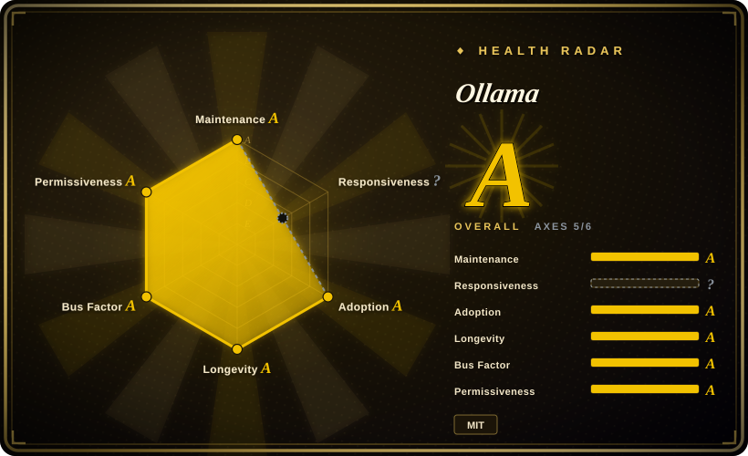
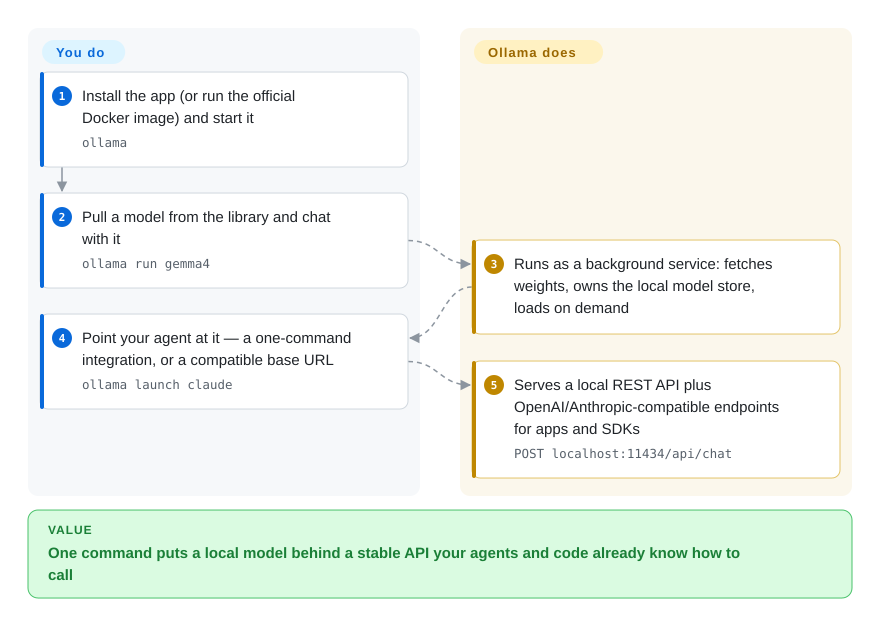

# Ollama

The default on-ramp to local models: one binary that pulls a quantized model, serves an OpenAI- and Anthropic-compatible API on `localhost:11434`, and now also launches or patches the coding agent you already use.

## When to use

You are the person who ends up supporting local models for a team, and you want the boring path: someone installs one app, types `ollama run <model>`, and gets an answer. Later they point Claude Code, Codex, opencode, or Copilot CLI at it — either through Ollama's own integration (`ollama launch claude`) or by setting an OpenAI/Anthropic-compatible base URL.

Reach for Ollama when the deciding factor is ecosystem and steadiness rather than peak throughput: it is a three-year-old, MIT-licensed project backed by a company, with 600+ contributors, official Python and JavaScript libraries, a first-party model library, Docker images for headless deployment, an in-repo desktop app, and now an MLX runner alongside its llama.cpp one on Apple Silicon. Choose it over [llama.cpp](llama-cpp.md) when you would rather trade some control for a managed model store and stable client libraries, and over [Magnitude](magnitude.md) when you already know which model you want and need breadth (library size, ROCm, SDKs, cloud tier) instead of a fit-estimation wizard.

## How it works

Ollama is the local-model equivalent of a package manager plus a always-on service. You install one app; it runs in the background, owns a local model store, and pulls weights from its own model library on first use — `ollama run <model>` downloads what's missing, loads it, and drops you into a chat. Underneath it runs llama.cpp (and an MLX runner on Apple Silicon), but the flags are its decision, not yours. Everything else in the product is a way to reach that service: a local REST API, OpenAI/Anthropic-compatible endpoints, first-party Python and JavaScript libraries, and one-command integrations that point a coding agent at it. Your side of the deal is picking a model name; its side is everything between that name and a running, callable endpoint.

<!-- flow-steps:begin (generated from flows/ollama.json by tools/flow_card.py — do not edit) -->

Text version of the flow

1. **You**: Install the app (or run the official Docker image) and start it — `ollama`
2. **You**: Pull a model from the library and chat with it — `ollama run gemma4`
3. **Ollama**: Runs as a background service: fetches weights, owns the local model store, loads on demand
4. **You**: Point your agent at it — a one-command integration, or a compatible base URL — `ollama launch claude`
5. **Ollama**: Serves a local REST API plus OpenAI/Anthropic-compatible endpoints for apps and SDKs — `POST localhost:11434/api/chat`

**Value**: One command puts a local model behind a stable API your agents and code already know how to call

<!-- flow-steps:end -->

## When NOT to use

- **If you need maximum throughput or a serving scheduler for many concurrent requests, use [vLLM](../serving-engines/vllm.md) or [SGLang](../serving-engines/sglang.md) instead**, because Ollama is a single-user-focused local runtime: it does not offer PagedAttention-class batching or multi-node serving.
- **If you need the newest quantization formats, the full backend matrix, or day-zero upstream features, use [llama.cpp](llama-cpp.md) directly instead**, because Ollama pins its own `LLAMA_CPP_VERSION` and only exposes a subset of the engine's flags — you wait for the wrapper to catch up.
- **If you already know what your hardware can run and want a pre-download speed/memory estimate plus harness config wiring, use [Magnitude](magnitude.md) instead**, because Ollama's model store gives you no fit assessment and its default context is 4096 tokens, which you must raise yourself (`OLLAMA_CONTEXT_LENGTH`) for agentic work.
- **If every target machine is an Apple Silicon Mac and you want MLX-native performance without a wrapper, consider [omlx](omlx.md) or [MTPLX](mtplx.md) instead**, because those go deeper on one platform and one speculative-decoding path than Ollama's general-purpose runners do.
- **If you need a GUI to browse and chat with models rather than a CLI/service, use LM Studio instead**, because it is a purpose-built desktop product; Ollama's surface is a CLI plus API, and LM Studio is not a repository, so it cannot be vendored or audited.
- **If you need a frozen, semver-stable API contract, pin an older release or use [llama.cpp](llama-cpp.md)'s server instead**, because Ollama moves fast (multiple releases per week), its own REST API evolves, and its OpenAI/Anthropic-compatible endpoints explicitly implement a subset of the originals.

## Comparison

| Alternative | In index | Our verdict | Tradeoff |
|---|---|---|---|
| [llama.cpp](llama-cpp.md) | ✅ | Pick Ollama when you want a managed model store, auto-updates and client libraries; pick llama.cpp when you need the newest engine features, the widest backend list (including HIP for AMD and many accelerators), or to embed inference in your own C/C++ program. | Ollama trades flag-level control and upstream freshness for convenience and stable client APIs; llama.cpp gives you the full engine surface and leaves model management, service lifecycle and SDKs to you. |
| [vLLM](../serving-engines/vllm.md) | ✅ | Pick Ollama for a single developer machine or a small internal endpoint; pick vLLM when many concurrent requests, GPU utilization and throughput-per-dollar decide. | Ollama's simplicity ceiling is exactly vLLM's starting point — continuous batching and PagedAttention cost you NVIDIA-centric ops and a much heavier deployment. |
| [Magnitude](magnitude.md) | ✅ | Pick Ollama when you already know the model, want the bigger library and SDKs, or need a documented ROCm path; pick Magnitude when the machine's capability is unknown and you want pre-download estimates plus one-click harness wiring. | Ollama gives up fit assessment and automatic speculative-decoding setup; Magnitude gives up backend breadth, ecosystem and operational maturity to provide them. |
| [omlx](omlx.md) | ✅ | Pick Ollama for cross-platform uniformity; pick omlx when every machine is an Apple Silicon Mac and you want MLX with SSD-tiered KV caching rather than a general-purpose runner. | Ollama now ships an MLX runner too, so omlx's edge is depth on one platform (KV cache tiering), not MLX access itself. |
| LM Studio | 未收录 | Pick Ollama when you need an API, Docker deployment, or scriptability; pick LM Studio when a human just wants to download a model and chat in a GUI. | LM Studio offers a friendlier desktop experience but is a closed product outside this index's repo-based scope, so it cannot be integrated into CI or patched. |

## Tech stack

- **Primary language:** Go for the service, CLI and clients; C/C++ for the vendored llama.cpp and MLX runners.
- **Two inference runners:** llama.cpp (tracked via `LLAMA_CPP_VERSION`) and MLX (tracked via `MLX_VERSION` / `MLX_C_VERSION`) — so on Apple Silicon there is an MLX path alongside Metal-via-llama.cpp. [推断]
- **In-repo surfaces:** `server/`, `api/`, `openai/` and `anthropic/` compatibility layers, `app/` (desktop app), `discover/`, `auth/`, `mlxrunner/`, plus official Python (`ollama-python`) and JavaScript (`ollama-js`) libraries.
- **Model format:** GGUF, plus safetensors/GGUF import through a `Modelfile`; the default library is served from `ollama.com`.

## Dependencies

- **Runtime:** a single self-contained binary/app per OS; no Python or CUDA toolkit required (only the vendor GPU driver). Runs as a background service (launchd/systemd) and auto-updates on macOS/Windows.
- **GPU/driver:** NVIDIA compute capability 5.0+ (driver 550+, or 570+ for 5.0–6.2); AMD via ROCm v7 on Linux/Windows with additional Vulkan support; Metal on Apple GPUs; CPU otherwise. Multi-GPU selection via `CUDA_VISIBLE_DEVICES`.
- **Storage:** model weights live in a local store; the app owns their lifecycle (`ollama pull` / `ollama rm`).
- **External services:** the default model registry and the optional cloud tier (`ollama.com/api` with an API key) are hosted. Local GGUF/safetensors can be imported via `Modelfile` when the registry is not reachable.
- **Headless deployment:** officially supported via the published Docker image.

## Ops difficulty

**Low.** One binary installs per OS, starts itself, and updates itself on macOS/Windows; Docker covers headless/server use. The real work is capacity planning rather than operations: model store growth, raising the 4096-token default context for agentic use, and choosing a GPU path (CUDA vs ROCm vs Vulkan vs Metal/MLX) per machine. Multi-GPU and container GPU passthrough take a few documented environment variables. There is no auth layer by default — do not expose the port beyond localhost without one.

## Health & viability

- **Maintenance:** mature and dense — created 2023-06-26, last pushed 2026-09-19, stable releases shipping multiple times per week (v0.34.1 on 2026-09-14, v0.34.2 on 2026-09-15).
- **Governance / bus factor:** MIT-licensed and company-backed (Ollama), not a foundation; ~615 all-time contributors with the top contributor at ~20% of commits and the top three around 48%, i.e. a real team rather than a single maintainer. `SECURITY.md` and `CONTRIBUTING.md` are present.
- **Backing & Lindy:** three-plus years of continuous activity is a strong Lindy prior for a fast-moving field, and the project has outlived several "Ollama is just a wrapper" critiques by absorbing features (MLX runner, agent integrations, cloud tier).
- **Adoption & ecosystem:** ~181,000 stars, 17,900 forks, 1,000+ watchers, an enormous third-party UI/integration list, and official client libraries — the deepest ecosystem in this category.
- **Risk flags:** parts of the experience live outside the repo (the model registry and the cloud tier), so "MIT" covers the engine and app, not the hosted service; the OpenAI/Anthropic compatibility layers implement subsets rather than the full specifications; and a ~4,000 open issue/PR backlog means fixes compete for attention.
- **Radar coverage:** the responsiveness axis is `?` for structural reasons (no qualifying issue-response signal in the sampling window), so the aggregate is computed over 5 of 6 axes — read that as incomplete coverage, not as a perfect score.
- **Verdict:** the safe default for local models in 2026 — pick it unless you specifically need serving-scale throughput (vLLM/SGLang) or an embedded engine (llama.cpp).

## Caveats (unverified)

- [未验证] Whether the desktop app's full distribution pipeline (signing, notarization, update feed) is reproducible from the in-repo `app/` sources; I read the tree, not the build.
- [推断] The MLX runner's maturity and coverage relative to the llama.cpp path is not documented as a support matrix; treat "Apple Silicon acceleration" as available but unverified per-model.
- [未验证] Exact dataset of shipped model quantizations and their licenses: model licenses are separate from Ollama's MIT license, and I did not audit the library's per-model terms.
- [未验证] Whether the hosted registry and cloud tier are open source in whole or in part; `auth/` is in the repo, but the service side is not reviewed here.
- [推断] The claim that Ollama is "just a wrapper" is a recurring community criticism; this page treats it as a stale framing, but the wrapper-vs-fork boundary (how much of `llama.cpp` Ollama patches) was not audited.
- [未验证] Performance characteristics were not benchmarked here; do not treat this page as a throughput comparison against llama.cpp or Magnitude.
