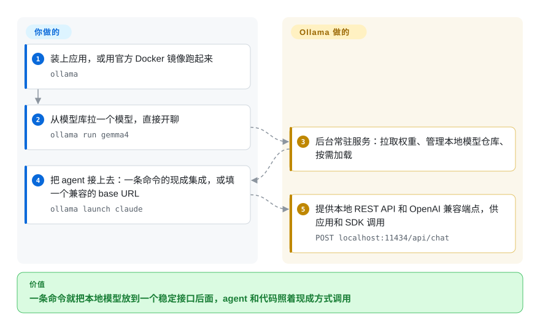

# Ollama

本地模型的默认入口：一个二进制文件就能拉取量化模型、在 `localhost:11434` 上提供 OpenAI 与 Anthropic 兼容 API，现在还顺手启动或改写你已经在用的 coding agent 配置。

## 何时使用

你是那个要替团队把本地模型跑起来的人，只想走最省事的路：有人装一个应用，敲 `ollama run <模型>`，就拿到回答；之后他们把 Claude Code、Codex、opencode 或 Copilot CLI 指过来——可以用 Ollama 自带集成（`ollama launch claude`），也可以直接填 OpenAI/Anthropic 兼容的 base URL。

当决定因素是生态与稳定度而不是峰值吞吐时，选 Ollama：它是一个三年多、MIT 许可、由公司支持的项目，有 600 多位贡献者、官方 Python 与 JavaScript 库、第一方模型库、可用于无头部署的 Docker 镜像、仓库内的桌面应用，并且在 Apple Silicon 上除 llama.cpp 之外还多了一条 MLX 路径。当你宁愿用一些控制权换取托管的模型仓库与稳定客户端库时，选它而不是 [llama.cpp](llama-cpp.zh.md)；当你已经知道要跑哪个模型、需要的是广度（模型库规模、ROCm、SDK、云服务）而不是一个适配评估向导时，选它而不是 [Magnitude](magnitude.zh.md)。

## 怎么用起来

Ollama 相当于本地模型的「包管理器 + 常驻服务」。你装一个应用，它在后台运行，管着一个本地模型仓库，第一次用某个模型时从它自己的模型库拉取——`ollama run <模型>` 会自动下载缺的权重、加载起来，然后直接进入对话。底层跑的是 llama.cpp（在 Apple Silicon 上还有一个 MLX runner），但那些参数由它来定，不用你操心。产品里其余的东西都是通往这个服务的入口：本地 REST API、OpenAI / Anthropic 兼容端点、官方的 Python 和 JavaScript 库，以及一条命令就把编程 agent 指过来的集成。你负责的只是报出一个模型名字，从这个名字到一个能调用的运行中端点，中间全是它的事。

<!-- flow-steps:begin (generated from flows/ollama.json by tools/flow_card.py — do not edit) -->

流程文字版

1. **你**：装上应用，或用官方 Docker 镜像跑起来 — `ollama`
2. **你**：从模型库拉一个模型，直接开聊 — `ollama run gemma4`
3. **Ollama**：后台常驻服务：拉取权重、管理本地模型仓库、按需加载
4. **你**：把 agent 接上去：一条命令的现成集成，或填一个兼容的 base URL — `ollama launch claude`
5. **Ollama**：提供本地 REST API 和 OpenAI 兼容端点，供应用和 SDK 调用 — `POST localhost:11434/api/chat`

**价值**：一条命令就把本地模型放到一个稳定接口后面，agent 和代码照着现成方式调用

<!-- flow-steps:end -->

## 何时不用

- **如果你需要最大吞吐或面向大量并发请求的服务调度，改用 [vLLM](../serving-engines/vllm.zh.md) 或 [SGLang](../serving-engines/sglang.zh.md)**，因为 Ollama 是面向单用户本地的运行时：它不提供 PagedAttention 级别的批处理，也没有多节点服务能力。
- **如果你要最新的量化格式、完整后端矩阵或上游当天的特性，直接改用 [llama.cpp](llama-cpp.zh.md)**，因为 Ollama 自己 pin 住 `LLAMA_CPP_VERSION` 且只暴露引擎参数的一个子集——你得等包装层跟上。
- **如果你已经知道自己的硬件能跑什么、想要下载前的速度与内存估算加 harness 配置接线，改用 [Magnitude](magnitude.zh.md)**，因为 Ollama 的模型库不给适配评估，而且默认上下文是 4096 token，做 agent 工作必须自己用 `OLLAMA_CONTEXT_LENGTH` 调大。
- **如果目标机器全是 Apple Silicon Mac、且你要的是不经包装层的 MLX 原生性能，考虑 [omlx](omlx.zh.md) 或 [MTPLX](mtplx.zh.md)**，因为这两个项目在单一平台和单条投机解码路径上挖得比 Ollama 的通用 runner 更深。
- **如果你要的是一个能浏览模型、直接聊天的 GUI 而不是 CLI 加服务，改用 LM Studio**，因为它是专门的桌面产品；Ollama 的界面是 CLI 加 API，而 LM Studio 不是仓库形态，无法 vendor 或审计。
- **如果你需要冻结的 semver 稳定 API 契约，请固定旧版本或改用 [llama.cpp](llama-cpp.zh.md) 的服务端**，因为 Ollama 迭代很快（每周多个版本），自有 REST API 持续演进，且它的 OpenAI/Anthropic 兼容端点明确只实现了原规范的一个子集。

## 横向对比

| 替代品 | 是否收录 | 我们的评价 | 取舍 |
|---|---|---|---|
| [llama.cpp](llama-cpp.zh.md) | ✅ | 当你想要托管式模型仓库、自动更新和客户端库时选 Ollama；当你需要最新引擎特性、最全后端列表（含 AMD 的 HIP 与多种加速器）、或要把推理嵌进自己的 C/C++ 程序时选 llama.cpp。 | Ollama 用 flag 级控制权与上游新鲜度换取便利与稳定的客户端 API；llama.cpp 给你完整引擎面，但模型管理、服务生命周期和 SDK 都得你自己搭。 |
| [vLLM](../serving-engines/vllm.zh.md) | ✅ | 单开发机或小规模内部端点选 Ollama；当决定因素是大量并发、GPU 利用率与单位成本吞吐时选 vLLM。 | Ollama 的简易性天花板正好是 vLLM 的起点——连续批处理与 PagedAttention 的代价是 NVIDIA 主导的运维和重得多的部署。 |
| [Magnitude](magnitude.zh.md) | ✅ | 当你已知模型、想要更大模型库与 SDK、或需要文档化的 ROCm 路径时选 Ollama；当机器能力未知、你要下载前估算加一键 harness 接线时选 Magnitude。 | Ollama 放弃的是适配评估与自动投机解码配置；Magnitude 为了提供这些，放弃的是后端广度、生态与运维成熟度。 |
| [omlx](omlx.zh.md) | ✅ | 需要跨平台统一时选 Ollama；当机器全是 Apple Silicon Mac、你要的是 MLX 加 SSD 分层 KV 缓存而不是通用 runner 时选 omlx。 | Ollama 现在也带 MLX runner，所以 omlx 的优势是单平台深度（KV 缓存分层），而不是“能不能用 MLX”。 |
| LM Studio | 未收录 | 你需要 API、Docker 部署或可脚本化时选 Ollama；当人只是想下个模型在 GUI 里聊天时选 LM Studio。 | LM Studio 的桌面体验更友好，但它是本索引收录范围之外的闭源产品，无法接入 CI 也无法打补丁。 |

## 技术栈

- **主语言：** 服务、CLI 与客户端是 Go；内置的 llama.cpp 与 MLX runner 是 C/C++。
- **两套推理 runner：** llama.cpp（用 `LLAMA_CPP_VERSION` 跟踪）与 MLX（用 `MLX_VERSION` / `MLX_C_VERSION` 跟踪）——所以在 Apple Silicon 上除 Metal 走 llama.cpp 之外还有 MLX 路径。[推断]
- **仓库内组件：** `server/`、`api/`、`openai/` 与 `anthropic/` 兼容层、`app/`（桌面应用）、`discover/`、`auth/`、`mlxrunner/`，以及官方 Python（`ollama-python`）与 JavaScript（`ollama-js`）库。
- **模型格式：** GGUF，另可通过 `Modelfile` 导入 safetensors/GGUF；默认模型库由 `ollama.com` 提供。

## 依赖

- **运行时：** 每个系统一个自包含二进制或应用；不需要 Python 或 CUDA toolkit（只需厂商 GPU 驱动）。以后台服务方式运行（launchd/systemd），macOS/Windows 上自动更新。
- **GPU 与驱动：** NVIDIA 需 compute capability 5.0 以上（驱动 550 以上，5.0–6.2 需 570 以上）；AMD 在 Linux/Windows 走 ROCm v7 并额外支持 Vulkan；Apple GPU 走 Metal；其余可退回 CPU。多 GPU 选择用 `CUDA_VISIBLE_DEVICES`。
- **存储：** 模型权重存在本机仓库，由应用管理其生命周期（`ollama pull` / `ollama rm`）。
- **外部服务：** 默认模型仓库与可选云服务（`ollama.com/api`，需 API key）是托管服务。模型仓库不可达时，可用 `Modelfile` 导入本地 GGUF/safetensors。
- **无头部署：** 官方支持，用已发布的 Docker 镜像。

## 运维难度

**低。** 每个系统一个二进制装完即用，自己启动，macOS/Windows 上自己更新；Docker 覆盖无头/服务端场景。真正的工作量在容量规划而非运维：模型仓库增长、为 agent 场景把 4096 token 的默认上下文调大、以及每台机器选一条 GPU 路径（CUDA、ROCm、Vulkan 还是 Metal/MLX）。多 GPU 与容器 GPU 透传只需几个有文档的环境变量。默认没有鉴权层——不要在没有鉴权的情况下把端口暴露到 localhost 之外。

## 健康度与可持续性

- **维护：** 成熟且密集——创建于 2023-06-26，最近推送 2026-09-19，稳定版每周发布多次（v0.34.1 于 2026-09-14，v0.34.2 于 2026-09-15）。
- **治理与公交因子：** MIT 许可、公司支持（Ollama），不是基金会项目；历史贡献者约 615 人，第一名约占 20% 提交、前三名约 48%，是真正的团队而非单人维护。仓库内有 `SECURITY.md` 与 `CONTRIBUTING.md`。
- **背书与 Lindy：** 三年多的持续活跃在一个快速迭代的领域里是强 Lindy 先验；它也扛过了几轮“Ollama 只是个 wrapper”的批评，靠的是持续吸收能力（MLX runner、agent 集成、云服务）。
- **采用与生态：** 约 181,000 stars、17,900 forks、1,000 多 watchers、庞大的第三方 UI/集成清单，以及官方客户端库——本分类里生态最深的一个。
- **风险标记：** 部分体验在仓库之外（模型仓库与云服务），所以 MIT 覆盖的是引擎与应用，不是托管服务；OpenAI/Anthropic 兼容层只实现子集而非完整规范；约 4,000 条未关闭 issue/PR 的积压意味着修复要排队。
- **雷达覆盖：** 响应度与采用度两轴为 `?`，且原因是结构性的（采样窗口内没有合格的 issue 响应信号；`app` 类型项目没有规范包），因此总分只覆盖 6 轴中的 4 轴——请读作覆盖不完整，而不是满分。
- **结论：** 2026 年本地模型的稳妥默认项——除非你明确需要服务级吞吐（vLLM/SGLang）或嵌入式引擎（llama.cpp），否则选它。

## 存疑（未验证）

- [未验证] 桌面应用的完整分发链路（签名、公证、更新源）是否能从仓库内 `app/` 源码复现；我只读了目录树，没有构建。
- [推断] MLX runner 相对 llama.cpp 路径的成熟度与覆盖范围没有公开的支持矩阵；可把“Apple Silicon 有加速”当作可用，但按模型是否都验证过并未确认。
- [未验证] 模型库实际提供的量化档及其许可：模型许可是独立的，与 Ollama 的 MIT 无关，我没有逐条审计模型库条款。
- [未验证] 托管模型仓库与云服务是否全部或部分开源；仓库里有 `auth/`，但服务端不在本次审查范围内。
- [推断] “Ollama 只是个 wrapper”是社区反复出现的批评；本页把它当作过时框架，但没有审计 wrapper 与 fork 的边界（Ollama 到底给 `llama.cpp` 打了多少补丁）。
- [未验证] 本页没有做任何性能实测；不要把本页当作与 llama.cpp 或 Magnitude 的吞吐对比。
