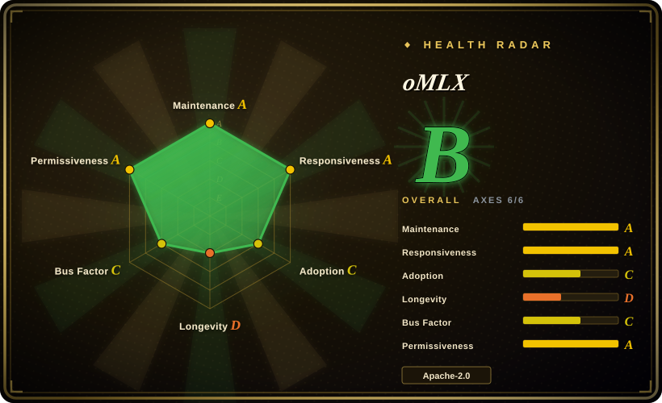
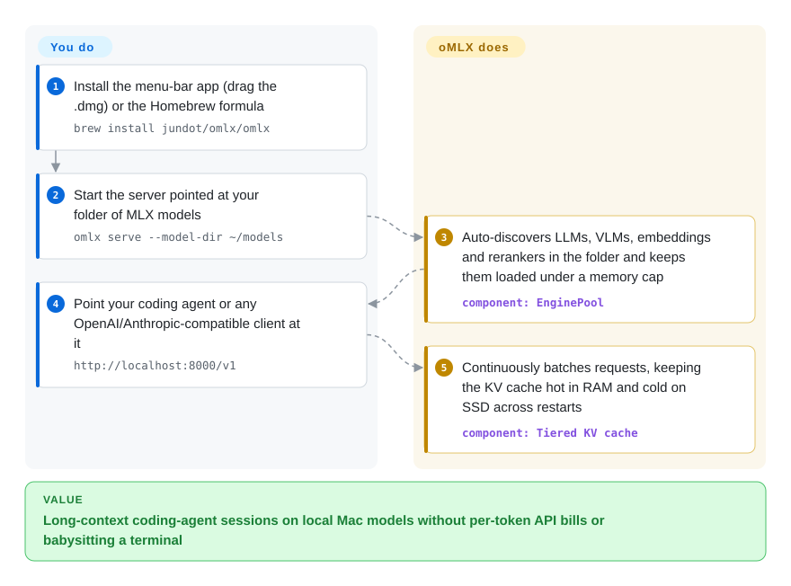

# oMLX

A plain Mac LLM server recomputes the conversation state on every request, so long coding sessions crawl as the context grows. oMLX is a menu-bar-operated Apple Silicon server built on Apple's MLX that batches requests continuously and tiers its cache between RAM and SSD — keeping cached context even across restarts.

## When to use

You're a developer on an M-series Mac (M1 through M5) who wants to run local LLMs for real coding work — wiring Claude Code, OpenCode, Codex, Hermes Agent, or Copilot to a local OpenAI-compatible endpoint instead of paying per token. The problem you keep hitting is that naive local servers recompute the KV cache on every request, so long-context coding sessions crawl, and you don't want to babysit a terminal. You install oMLX (a `.dmg` app or `brew install jundot/omlx/omlx`), point it at a folder of MLX models, and it serves them at `http://localhost:8000/v1` with continuous batching and a **tiered KV cache** that keeps hot blocks in RAM and offloads cold blocks to SSD (safetensors), restoring a matching prefix from disk on the next request — even across a server restart — instead of recomputing it. A native Swift menu-bar app lets you start/stop, pin models, set per-model TTLs, and watch throughput without opening a shell.

You also reach for it when you want one Mac-local server that handles text LLMs, vision-language models, OCR models, embeddings, and rerankers together, with LRU eviction and a memory cap so a laptop doesn't OOM — and an admin dashboard for model download (from HuggingFace), per-model sampling settings, and one-click benchmarks. The whole pitch is "local LLM serving optimized for a single Mac," not cluster-scale serving.

## How it works

oMLX is a FastAPI server riding on Apple's MLX (the tensor framework Apple wrote for its own chips), doing generation through mlx-lm's `BatchGenerator` — the piece that packs several in-flight requests into the same GPU step and lets finished ones leave without interrupting the rest (continuous batching). Its core trick is the block-based **KV cache** — the per-conversation key/value state that lets a model reuse tokens it has already read — managed "inspired by vLLM": hot blocks live in RAM, and when that fills up blocks are written to SSD as safetensors files; a later request with a matching prefix restores them from disk instead of re-reading the whole prompt, and this survives a server restart. Around the engine sit two control surfaces: a native Swift menu-bar app (start/stop, crash auto-restart, auto-update) and an `/admin` web dashboard that downloads models from Hugging Face, pins or evicts models, sets per-model sampling/TTL/profile settings, and runs one-click benchmarks. What oMLX does for you: batching, cache tiering, and LRU model eviction under a memory cap (default: system RAM − 8 GB). What stays yours: the Mac itself (Apple Silicon, macOS 15+, Python 3.11–3.13), the MLX-format model files, and the RAM/SSD budget — plus anything beyond one box, since the multi-Mac mode is experimental.

<!-- flow-steps:begin (generated from flows/omlx.json by tools/flow_card.py — do not edit) -->

Text version of the flow

1. **You**: Install the menu-bar app (drag the .dmg) or the Homebrew formula — `brew install jundot/omlx/omlx`
2. **You**: Start the server pointed at your folder of MLX models — `omlx serve --model-dir ~/models`
3. **oMLX**: Auto-discovers LLMs, VLMs, embeddings and rerankers in the folder and keeps them loaded under a memory cap — component: `EnginePool`
4. **You**: Point your coding agent or any OpenAI/Anthropic-compatible client at it — `http://localhost:8000/v1`
5. **oMLX**: Continuously batches requests, keeping the KV cache hot in RAM and cold on SSD across restarts — component: `Tiered KV cache`

**Value**: Long-context coding-agent sessions on local Mac models without per-token API bills or babysitting a terminal

<!-- flow-steps:end -->

## When NOT to use

- **You need production-grade, battle-tested serving — this is a very young, single-maintainer project.** Created 2026-02 (~7.5 months old as of 2026-09) with one dominant author (≈1.9k of ~2.1k commits); it is **unproven** and has a thin track record. For anything you must rely on, prefer mature stacks: **vLLM**, **TGI**, or **[Modular MAX](../serving-engines/modular.md)**. Treat oMLX as promising-but-early. [推断]
- **You're not on Apple Silicon.** oMLX is **macOS-only** and **Apple-Silicon-only** (requires macOS 15.0+ and an M-series chip), built on Apple's MLX. There is no Linux/NVIDIA/AMD path — for server GPUs use vLLM / TGI / TensorRT-LLM / MAX.
- **You're serving at cluster / multi-node scale.** The product is a single-Mac server with LRU model eviction and a RAM cap. Since the 0.7 line it has an **experimental multi-Mac mode** — splitting one model across unequal-memory Macs over MLX pipeline ranks with Ring/Thunderbolt RDMA, source-build-only with its own hardware-validation checklist — which is a lab feature, not fleet autoscaling. For orchestrated fleets use vLLM or Ray Serve.
- **SSD-offload caching has tradeoffs you can't accept.** Restoring KV blocks from disk is faster than recompute *on a cache hit*, but it adds I/O latency and SSD wear, and the win depends on prefix-hit rates; on a cold/novel prompt you pay normal prefill. Don't assume the cache is free.
- **You can't independently confirm the claims.** The benchmarks and the "tiered cache survives restart" are the project's own framing, and the **~22k-star count on a ~7-month repo** — while API-verified as a number — is an anomalous popularity signal whose adoption meaning is unverified/suspicious; verify it delivers for your models before betting a workflow on it. [未验证]

## Comparison

| Alternative | In index | Our verdict | Tradeoff |
|---|---|---|---|
| [Ollama](ollama.md) | ✅ | Choose Ollama when you need the default cross-platform local LLM runner and broad model library. | The default Mac/cross-platform local-LLM runner (llama.cpp-based), huge ecosystem and model library; broader OS support but no Apple-MLX backend and a simpler caching story than oMLX's tiered hot/cold KV cache. |
| LM Studio | 未收录 | Choose LM Studio when you need a polished desktop app with an OpenAI-compatible server. | Polished desktop app for local models on Mac/Win/Linux with an OpenAI-compatible server; closed-source GUI, not an Apple-MLX-native open-source server. |
| mlx-lm (`mlx_lm.server`) | 未收录 | Choose mlx-lm when you need Apple's own MLX LLM toolkit with a minimal server. | Apple's own MLX LLM toolkit with a minimal OpenAI-compatible server — oMLX is built **on** mlx-lm's BatchGenerator; mlx-lm is lower-level and lacks the menu-bar app, tiered SSD cache, multi-model LRU, and admin dashboard. |
| [llama.cpp](llama-cpp.md) | ✅ | Choose llama.cpp when you need a portable C/C++ GGUF engine that runs broadly, including Macs via Metal. | The portable C/C++ inference engine (GGUF) running everywhere incl. Macs via Metal; maximally portable and mature, but not MLX-native and no built-in macOS menu-bar/admin management layer. |
| [vLLM](../serving-engines/vllm.md) | ✅ | Choose vLLM when you need the de-facto datacenter LLM serving engine, not a Mac-local server. | The de-facto data-center LLM serving engine (PagedAttention, continuous batching), huge community; NVIDIA/Linux-first — not a Mac/Apple-Silicon local server. |
| [Text Generation Inference (TGI)](../serving-engines/text-generation-inference.md) | ✅ | Choose TGI when you need Hugging Face's production server and tight HF integration at scale. | Hugging Face's production server, tight HF integration and battle-tested at scale; server-GPU oriented, not an on-Mac local stack. |
| [SGLang](../serving-engines/sglang.md) | ✅ | Choose SGLang when you need high-throughput server-GPU serving with RadixAttention prefix caching. | High-throughput serving engine with RadixAttention prefix caching; server-GPU oriented and more complex to operate, not a single-Mac menu-bar app. |
| [Modular Platform (MAX + Mojo)](../serving-engines/modular.md) | ✅ | Choose Modular Platform when you need a server-class cross-vendor engine plus Mojo kernel language. | Vendor-built cross-vendor GPU/CPU serving engine + Mojo kernel language; a far larger, server-class, single-vendor platform — different layer and scale from a Mac-local server. |
| [Ray Serve](../serving-engines/ray-serve.md) | ✅ | Choose Ray Serve when you need scalable Python model serving with multi-model composition and autoscaling. | General-purpose scalable Python model-serving framework with multi-model composition and autoscaling; built on Ray, operationally demanding, not a Mac-local server. |

## Tech stack

- **Language:** Python 3.11–3.13 (server/engine, per the README badge and install note) plus a native **Swift / SwiftUI** menu-bar app (explicitly *not* Electron; the app bundle stages its Python layers with venvstacks).
- **Inference backend:** Apple's **MLX** via **mlx-lm**; continuous batching runs through mlx-lm's `BatchGenerator`. The README's lineage note says oMLX started from vllm-mlx v0.1.0 and diverged.
- **KV cache:** block-based, two-tier cache (hot RAM + cold SSD in **safetensors**) with prefix sharing and Copy-on-Write, described as "inspired by vLLM"; the SSD budget defaults to 50% of (free disk + existing cache files).
- **API:** FastAPI server exposing OpenAI-compatible endpoints (`/v1/chat/completions`, `/v1/completions`, `/v1/embeddings`, `/v1/rerank`, `/v1/models`) **and the Anthropic Messages API** (`/v1/messages`); built-in admin dashboard (`/admin`) for monitoring, model management, chat, benchmark; MCP support optional (`[mcp]` extra).
- **Model surface:** text LLMs (anything mlx-lm supports), VLMs incl. video/audio checkpoints (mlx-vlm), OCR models (DeepSeek-OCR, DOTS-OCR, GLM-OCR auto-detected), embeddings, rerankers; HuggingFace downloader built into the dashboard; optional native Metal custom kernels for the GLM-5.2 / MiniMax M3 / Qwen3.5 families (need full Xcode to build, or the official DMG which ships them precompiled).
- **Experimental:** multi-Mac pipeline-rank inference over Ring/Thunderbolt RDMA (source builds; `docs/distributed-cluster.md`).

## Dependencies

- **Hardware/OS:** an **Apple Silicon** Mac (M1–M5) running **macOS 15.0+ (Sequoia)** — hard requirements, no other platform supported.
- **Runtime:** Python **3.11–3.13**; install via prebuilt `.dmg` app, Homebrew (`brew tap jundot/omlx https://github.com/jundot/omlx` + `brew install jundot/omlx/omlx`), or `pip install -e .` from source. Optional `[mcp]` extra for Model Context Protocol; `brew install jundot/omlx/omlx --HEAD --with-custom-kernel` (or `OMLX_WITH_CUSTOM_KERNEL=1 pip install -e .`) builds the Metal kernels but needs full Xcode, not just Command Line Tools.
- **Models:** you bring **MLX-format** models (e.g. from HuggingFace); the dashboard can download them.
- **Storage:** SSD headroom for the cold KV-cache tier (safetensors blocks; per the README the default cap is 50% of free disk + existing cache); RAM is the binding resource (per the README, default cap = system RAM − 8 GB). The README states these defaults; they were not measured here. [推断]

## Ops difficulty

**Low (for its single-Mac scope).** The happy path is a `.dmg` drag-install or the brew formula, then `omlx start` (delegating to `brew services`) or `omlx serve --model-dir ~/models`, and point a client at `localhost:8000/v1`; the menu-bar app handles start/stop, crash auto-restart, and auto-update, and the admin dashboard does model download and per-model settings without restarts. There's no cluster, datastore, or GPU-driver fleet to run. The real operational burden is local and laptop-shaped: managing RAM pressure and model eviction so you don't OOM, sizing the SSD cache tier, keeping auth straight before binding to a LAN address (the server refuses non-loopback binds without an API key), and the fact that you're operating a **young, fast-moving project** (dev/rc tags, ~monthly stable bumps — v0.6.4 → v0.7.0rc inside a month) where behavior can shift release-to-release. The experimental multi-Mac mode ships its own hardware-validation checklist; treat it as a research feature, not ops.

## Health & viability

- **Responsiveness**: Grade A — median first-response time 4.1 hours across 11 qualifying issues (scorer, 2026-09-28).
- **Maintenance (2026-09).** Extremely active for its age: v0.6.4 stable (2026-08-29), then v0.7.0 dev/rc churn through v0.7.0rc1 (2026-09-24), repo pushed 2026-09-28 (GitHub API). Not archived.
- **Governance / bus factor (2026-09) — flag, but wider than it looks.** The repo is a **single User account's** (`jundot`; 1,856 of ~2,100 all-time commits, the next contributor has 85). The 12-month window is more populated — the scorer counts 97 active committers but the top author still carries **72% of commits** (grade C): a real contributor tail, still one-person-dominated. If the author stops, the center of gravity stops. [推断]
- **Age & Lindy (2026-09) — fails Lindy.** Created **2026-02** (~0.6 years old). Far **too young** to carry any Lindy prior; longevity is entirely unproven regardless of activity. Use age × still-active: active is good, but ~7.5 months is not a track record. [推断]
- **Adoption — suspicious-popularity flag.** ~22.3k stars on a ~7.5-month-old single-maintainer repo (GitHub API, 2026-09-28): the count is API-verified, but its adoption meaning is **anomalous** — that star velocity is wildly out of proportion to the contributor base, and the **1,937 forks / 1,517 open issues against just 116 watchers** is an odd profile (heavy drive-by traffic, weak settled-community signal). Treat the count's adoption/vetting meaning as **[未验证]** and suspicious — possibly genuine viral interest in a Mac-local LLM server, possibly a visibility spike — and do **not** read it as production-readiness. [未验证]
- **License & backing.** Apache-2.0 (confirmed via repo badge and GitHub API). No backing org or foundation; funded informally (a "Buy Me a Coffee" link), which compounds the bus-factor risk. Lineage: the README credits vllm-mlx v0.1.0 as the starting point, with kernels/design borrowed from MTPLX, mlx-serve, Splash, and SiliconScope. No relicense history yet (too young to have one).

## Caveats (unverified)

- [未验证] ~22.3k stars / 1,937 forks / 1,517 open issues / 116 watchers as of 2026-09-28 (via GitHub API). The star count itself is API-verified, but its adoption meaning is **anomalous for a ~7.5-month single-maintainer repo** and flagged as an unverified/suspicious popularity signal — treat as indicative only, not as adoption or quality evidence.
- [未验证] Core claims — continuous batching, the tiered hot-RAM/cold-SSD KV cache "surviving server restarts", prefix-cache hit benefits, "inspired by vLLM" block management, the ~30x fused-prefill claim for the GLM-5.2 custom kernels, and the published benchmarks — are the project's own README/site framing and were **not independently verified or benchmarked** here.
- [未验证] "Claude Code optimization" (token-count scaling, SSE keep-alive) and the one-click agent integrations (OpenClaw, OpenCode, Codex, Hermes Agent, Copilot, Pi) are described in the README but not validated against those tools here.
- [未验证] The experimental multi-Mac mode (unequal-memory sharding over Ring/Thunderbolt RDMA) is described in the README + docs/distributed-cluster.md; no hardware was tested.
- [推断] SSD-offload latency/wear tradeoffs and the memory-guard defaults (system RAM − 8 GB; SSD budget 50%) are inferred from README descriptions, not measured.
- [推断] The Apple-Silicon-only / macOS-15+ / Python-3.11–3.13 requirements are taken from README install notes; the precise minimum dependency set is governed by the repo's `pyproject.toml` at build time and not enumerated here.
- [推断] Bus-factor judgment is inferred from owner type (User) and the contributor distribution (one dominant author), not from a stated governance document.
