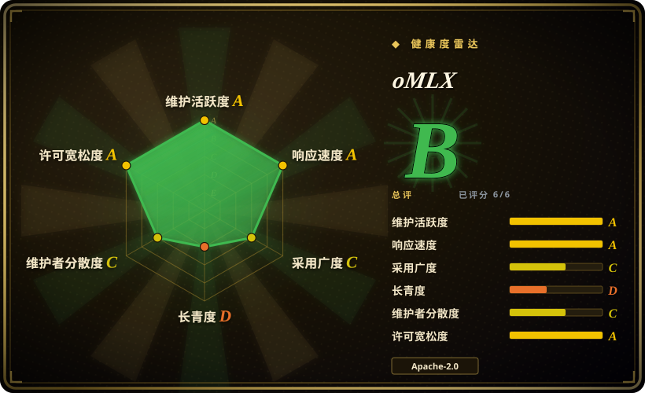
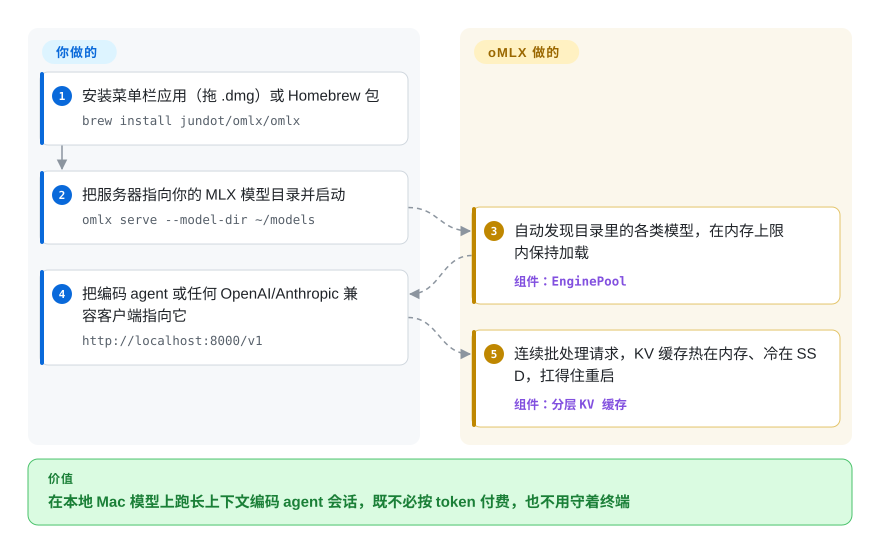

# oMLX

朴素的 Mac 本地服务器每次请求都把会话状态从头算一遍，上下文一长编码会话就慢下来。oMLX 是一个用菜单栏管理的 Apple Silicon 推理服务器，建在 Apple 的 MLX 之上：请求连续批处理，缓存热放内存、冷放 SSD——连重启都保得住。

## 何时使用

你是一名用 M 系列 Mac（M1 到 M5）的开发者，想跑本地 LLM 做真正的编码工作——把 Claude Code、OpenCode、Codex、Hermes Agent 或 Copilot 接到一个本地 OpenAI 兼容端点，而不是按 token 付费。你反复撞上的问题是：朴素的本地服务器每次请求都重算 KV 缓存，于是长上下文的编码会话慢如蜗牛，而你又不想守着一个终端。你装上 oMLX（一个 `.dmg` 应用或 `brew install jundot/omlx/omlx`），把它指向一个装满 MLX 模型的目录，它就在 `http://localhost:8000/v1` 上以 continuous batching 服务这些模型，并配一套**分层 KV 缓存**——热块留在内存、冷块卸载到 SSD（safetensors）；下次请求命中相同前缀时从磁盘恢复（哪怕服务器重启过），而不是从头重算。一个原生 Swift 菜单栏应用让你启停、pin 模型、设每模型 TTL、看吞吐，全程不用开终端。

当你想用一个 Mac 本地服务器同时承载文本 LLM、视觉语言模型（VLM）、OCR 模型、embedding 和 reranker 时也会选它，配 LRU 淘汰和内存上限，免得一台笔记本 OOM；还有一个 admin 面板做模型下载（从 HuggingFace）、每模型采样设置和一键 benchmark。它整个卖点就是「为单台 Mac 优化的本地 LLM 服务」，而不是集群级服务。

## 怎么用起来

拆开看，oMLX 是一台跑在 Apple MLX（苹果为自己芯片写的张量框架）上的 FastAPI 服务器，生成走 mlx-lm 的 `BatchGenerator`——把多个在途请求塞进同一个 GPU step、有请求结束就直接腾位不打断别人（continuous batching）。它的核心招式是块式 **KV 缓存**——模型借此复用已读 token 的逐会话键值状态——按「受 vLLM 启发」的方式管理：热块在 RAM，装不下时写成 SSD 上的 safetensors；后续请求命中相同前缀就从磁盘恢复而不是重读整个 prompt，且扛得过服务器重启。引擎外面有两层控制面：原生 Swift 菜单栏应用（启停、崩溃自动重启、自动更新）和 `/admin` 网页面板（从 Hugging Face 下模型、pin/淘汰模型、逐模型采样/TTL/profile 设置、一键 benchmark）。它替你做的：批处理、缓存分层、内存上限（默认系统 RAM − 8 GB）内的 LRU 模型淘汰。留给你的：那台 Mac 本身（Apple Silicon、macOS 15+、Python 3.11–3.13）、MLX 格式的模型文件、RAM/SSD 预算——以及单机之外的一切，因为多机模式还是实验特性。

<!-- flow-steps:begin (generated from flows/omlx.json by tools/flow_card.py — do not edit) -->

流程文字版

1. **你**：安装菜单栏应用（拖 .dmg）或 Homebrew 包 — `brew install jundot/omlx/omlx`
2. **你**：把服务器指向你的 MLX 模型目录并启动 — `omlx serve --model-dir ~/models`
3. **oMLX**：自动发现目录里的各类模型，在内存上限内保持加载 — 组件：`EnginePool`
4. **你**：把编码 agent 或任何 OpenAI/Anthropic 兼容客户端指向它 — `http://localhost:8000/v1`
5. **oMLX**：连续批处理请求，KV 缓存热在内存、冷在 SSD，扛得住重启 — 组件：`分层 KV 缓存`

**价值**：在本地 Mac 模型上跑长上下文编码 agent 会话，既不必按 token 付费，也不用守着终端

<!-- flow-steps:end -->

## 何时不用

- **你需要生产级、久经检验的服务——而这是一个非常年轻、单一维护者的项目。** 2026-02 创建（截至 2026-09 约 7 个半月），一位主导作者撑起约 2,100 个提交里的 1,856 个，**未经证明**、track record 很薄。任何你必须依赖的场景，都该优先选成熟栈：**vLLM**、**TGI** 或 **[Modular MAX](../serving-engines/modular.zh.md)**。把 oMLX 当作「有潜力但很早期」。[推断]
- **你不在 Apple Silicon 上。** oMLX **仅限 macOS**、**仅限 Apple Silicon**（要求 macOS 15.0+ 和 M 系列芯片），基于 Apple 的 MLX。没有 Linux/NVIDIA/AMD 路径——服务器 GPU 请用 vLLM / TGI / TensorRT-LLM / MAX。
- **你要在集群 / 多节点规模上服务。** 它的产品形态是单台 Mac 服务器，带 LRU 模型淘汰和内存上限。自 0.7 线起有一个**实验性多 Mac 模式**——用 MLX pipeline rank 加 Ring/雷雳 RDMA 把一个模型切给内存不等的多台 Mac，仅源码构建、自带硬件验证清单——那是实验室特性，不是自动扩缩的机群。编排机群请用 vLLM 或 Ray Serve。
- **SSD 卸载缓存的取舍你接受不了。** 从磁盘恢复 KV 块**在命中时**比重算快，但它带来 I/O 延迟和 SSD 磨损，且收益取决于前缀命中率；遇到冷的/全新的 prompt 你照样付正常 prefill。别把这个缓存当成免费的。
- **你无法独立核实它的宣称。** benchmark 和「分层缓存能扛重启」是项目自己的表述，而**一个约 7 个半月仓库上的约 22k star 计数**——这个数字本身经 API 核实——是一个反常的人气信号，其采用度含义未经核实、可疑；在把工作流押上去之前，先验证它对你的模型确实有效。[未验证]

## 横向对比

| 替代品 | 是否收录 | 我们的评价 | 取舍 |
|---|---|---|---|
| [Ollama](ollama.zh.md) | ✅ | 需要默认的跨平台本地 LLM 运行器和庞大模型库时，选 Ollama。 | 默认的 Mac/跨平台本地 LLM 运行器（基于 llama.cpp），生态和模型库极大；OS 支持更广，但没有 Apple-MLX 后端，缓存机制也比 oMLX 的热/冷分层 KV 缓存简单。 |
| LM Studio | 未收录 | 需要带 OpenAI 兼容服务器的精致桌面应用时，选 LM Studio。 | 打磨精良的本地模型桌面应用（Mac/Win/Linux），带 OpenAI 兼容服务器；GUI 闭源，不是 Apple-MLX 原生的开源服务器。 |
| mlx-lm（`mlx_lm.server`） | 未收录 | 需要 Apple 自家 MLX LLM 工具包和极简服务器时，选 mlx-lm。 | Apple 自家的 MLX LLM 工具包，带一个极简 OpenAI 兼容服务器——oMLX 正是**建在** mlx-lm 的 BatchGenerator 之上；mlx-lm 更底层，没有菜单栏应用、分层 SSD 缓存、多模型 LRU 和 admin 面板。 |
| [llama.cpp](llama-cpp.zh.md) | ✅ | 需要可移植的 C/C++ GGUF 推理引擎、并希望靠 Metal 跑 Mac 时，选 llama.cpp。 | 可移植的 C/C++ 推理引擎（GGUF），靠 Metal 也能在 Mac 上跑、到处都能跑；可移植性和成熟度都顶，但不是 MLX 原生，也没有内建的 macOS 菜单栏/admin 管理层。 |
| [vLLM](../serving-engines/vllm.zh.md) | ✅ | 需要事实标准的数据中心 LLM 服务引擎，而不是 Mac 本地服务器时，选 vLLM。 | 事实标准的数据中心 LLM 服务引擎（PagedAttention、continuous batching），社区庞大；偏 NVIDIA/Linux——不是 Mac/Apple Silicon 本地服务器。 |
| [Text Generation Inference (TGI)](../serving-engines/text-generation-inference.zh.md) | ✅ | 需要 Hugging Face 生产服务器、紧密 HF 集成和规模验证时，选 TGI。 | Hugging Face 的生产服务器，与 HF 贴合紧密、在规模上久经检验；面向服务器 GPU，不是 Mac 本地栈。 |
| [SGLang](../serving-engines/sglang.zh.md) | ✅ | 需要面向服务器 GPU 的高吞吐服务和 RadixAttention 前缀缓存时，选 SGLang。 | 高吞吐服务引擎，带 RadixAttention 前缀缓存；面向服务器 GPU、运维更复杂，不是单 Mac 菜单栏应用。 |
| [Modular Platform (MAX + Mojo)](../serving-engines/modular.zh.md) | ✅ | 需要服务器级跨厂商引擎和 Mojo kernel 语言时，选 Modular Platform。 | 厂商自建的跨厂商 GPU/CPU 服务引擎 + Mojo kernel 语言；一个大得多、服务器级、单一厂商的平台——与 Mac 本地服务器是不同的层和量级。 |
| [Ray Serve](../serving-engines/ray-serve.zh.md) | ✅ | 需要可扩展 Python 模型服务、多模型组合和自动扩缩容时，选 Ray Serve。 | 通用可扩展的 Python 模型服务框架，支持多模型组合和自动扩缩容；基于 Ray，运维要求高，不是 Mac 本地服务器。 |

## 技术栈

- **语言：** Python 3.11–3.13（服务器/引擎，依 README badge 与安装说明）加一个原生 **Swift / SwiftUI** 菜单栏应用（明确**不是** Electron；应用包用 venvstacks 分层打包 Python）。
- **推理后端：** Apple 的 **MLX**，经 **mlx-lm**；continuous batching 走 mlx-lm 的 `BatchGenerator`。README 的致谢写明 oMLX 从 vllm-mlx v0.1.0 起步后大幅分化。
- **KV 缓存：** 块式、两层缓存（热 RAM + 冷 SSD，存为 **safetensors**），带前缀共享与 Copy-on-Write，自述「受 vLLM 启发」；SSD 预算默认为（空闲磁盘 + 既有缓存文件）的 50%。
- **API：** FastAPI 服务器，OpenAI 兼容端点（`/v1/chat/completions`、`/v1/completions`、`/v1/embeddings`、`/v1/rerank`、`/v1/models`）**加 Anthropic Messages API**（`/v1/messages`）；内建 admin 面板（`/admin`）做监控、模型管理、chat、benchmark；可选 MCP 支持（`[mcp]` extra）。
- **模型覆盖：** 文本 LLM（mlx-lm 支持的都行）、VLM 含视频/音频 checkpoint（mlx-vlm）、OCR 模型（DeepSeek-OCR、DOTS-OCR、GLM-OCR 自动识别）、embedding、reranker；面板内建 HuggingFace 下载器；GLM-5.2 / MiniMax M3 / Qwen3.5 家族有可选原生 Metal 自定义 kernel（构建需完整版 Xcode，官方 DMG 已预编译带上）。
- **实验性：** 多 Mac pipeline rank 推理，走 Ring/雷雳 RDMA（仅源码构建；`docs/distributed-cluster.md`）。

## 依赖

- **硬件/OS：** 一台 **Apple Silicon** Mac（M1–M5），跑 **macOS 15.0+（Sequoia）**——硬性要求，不支持其它平台。
- **运行时：** Python **3.11–3.13**；可经预构建 `.dmg` 应用、Homebrew（`brew tap jundot/omlx https://github.com/jundot/omlx` + `brew install jundot/omlx/omlx`）或源码 `pip install -e .` 安装。可选 `[mcp]` extra 启用 Model Context Protocol；`brew install jundot/omlx/omlx --HEAD --with-custom-kernel`（或 `OMLX_WITH_CUSTOM_KERNEL=1 pip install -e .`）构建 Metal kernel，但需要完整版 Xcode，Command Line Tools 不够。
- **模型：** 你自带 **MLX 格式**模型（如来自 HuggingFace）；面板可下载它们。
- **存储：** 冷 KV 缓存层（safetensors 块）需要 SSD 余量，README 称默认上限为空闲磁盘加既有缓存的 50%；RAM 是约束性资源，README 称默认上限 = 系统 RAM − 8 GB。这些默认值未在本页实测。[推断]

## 运维难度

**低（就其单 Mac 范围而言）。** 顺路径是 `.dmg` 拖拽安装或 brew 公式，然后 `omlx start`（委托给 `brew services`）或 `omlx serve --model-dir ~/models`，再把客户端指向 `localhost:8000/v1`；菜单栏应用负责启停、崩溃自动重启和自动更新，admin 面板做模型下载和每模型设置且无需重启。没有集群、数据存储或 GPU 驱动机群要运维。真正的运维负担是本地、笔记本形态的：管理 RAM 压力和模型淘汰以免 OOM、给 SSD 缓存层留好量、把服务绑到局域网地址前先配好 API key（非回环绑定没有 key 时服务器会拒绝启动），以及它是一个**年轻、快速演进的项目**（dev/rc tag、约每月一个 stable——一个月内从 v0.6.4 走到 v0.7.0rc），行为可能 release 间变动。实验性多 Mac 模式自带硬件验证清单；把它当研究特性，别当运维面。

## 健康度与可持续性

- **响应速度**：Grade A——中位首次响应时间 4.1 小时，基于 11 个 qualifying issue（计分器 2026-09-28）。
- **维护（2026-09）。** 就其年龄而言极其活跃：v0.6.4 stable（2026-08-29），随后 v0.7.0 一路 dev/rc 到 v0.7.0rc1（2026-09-24），仓库 2026-09-28 仍在推送（GitHub API）。未归档。
- **治理 / bus factor（2026-09）——标记，但底盘比看上去宽。** 仓库是**单个 User 账号**的（`jundot`，全部约 2,100 个提交里占 1,856 个；第二名 85 个）。12 个月窗口更热闹些——计分器数到 97 位活跃提交者，但头号作者仍占 **72% 的提交**（Grade C）：确有贡献长尾，仍是一人主导。作者停手，重心就停。[推断]
- **年龄与 Lindy（2026-09）——Lindy 不通过。** 2026-02 创建（约 0.6 年）。**太年轻**，扛不起任何 Lindy 先验；不论多活跃，长期存活完全未经证明。用年龄 × 仍活跃来看：活跃是好事，但约 7 个半月不算 track record。[推断]
- **采用度——可疑人气标记。** 一个约 7 个半月、单一维护者的仓库上有约 22.3k star（GitHub API，2026-09-28）：计数经 API 核实，但其采用度含义**反常**——这种 star 增速与贡献者基数严重不成比例，且 **1,937 fork / 1,517 个 open issue 对仅 116 个 watcher** 是个古怪的组合（路过流量大、沉淀社区弱的信号）。把这个计数对采用/检验程度的含义当作**可疑**——可能是对 Mac 本地 LLM 服务器的真实爆火兴趣，也可能是可见度高峰——且**不要**把它读成生产就绪。[未验证]
- **许可证与背书。** Apache-2.0（经仓库 badge 和 GitHub API 确认）。没有背书组织或基金会；非正式资助（一个「Buy Me a Coffee」链接），这进一步放大 bus-factor 风险。谱系：README 致谢写明从 vllm-mlx v0.1.0 起步，kernel/设计借鉴 MTPLX、mlx-serve、Splash 与 SiliconScope。尚无 relicense 历史（太年轻，还来不及有）。

## 存疑（未验证）

- [未验证] 截至 2026-09-28（经 GitHub API），约 22.3k star / 1,937 fork / 1,517 个 open issue / 116 个 watcher。star 计数本身经 API 核实，但其采用度含义对一个**约 7 个半月的单一维护者仓库而言反常**，被标记为未经核实/可疑的人气信号——仅供参考，不作为采用度或质量证据。
- [未验证] 核心宣称——continuous batching、「热 RAM/冷 SSD 分层 KV 缓存能扛服务器重启」、前缀缓存命中收益、「受 vLLM 启发」的块管理、GLM-5.2 自定义 kernel 约 30 倍 fused prefill 的说法，以及公开的 benchmark——都是项目自己的 README/官网表述，本页**未独立验证或跑 benchmark**。
- [未验证]「Claude Code 优化」（token 计数缩放、SSE keep-alive）和一键 agent 集成（OpenClaw、OpenCode、Codex、Hermes Agent、Copilot、Pi）在 README 里有描述，但本页未对这些工具实测验证。
- [未验证] 实验性多 Mac 模式（内存不等的分片、Ring/雷雳 RDMA）见于 README 与 docs/distributed-cluster.md 的描述，本页未在任何硬件上验证。
- [推断] SSD 卸载的延迟/磨损取舍和内存守护默认值（系统 RAM − 8 GB；SSD 预算 50%）是从 README 描述推断的，非实测。
- [推断] Apple-Silicon-only / macOS-15+ / Python-3.11–3.13 要求取自 README 安装说明；精确的最小依赖集由仓库 `pyproject.toml` 在构建时决定，本页未逐条枚举。
- [推断] bus-factor 判断是从 owner 类型（User）和贡献者分布（一位主导作者）推断的，非来自某份治理文档的明文。
