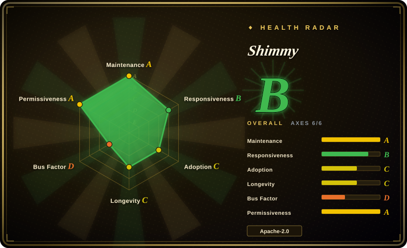
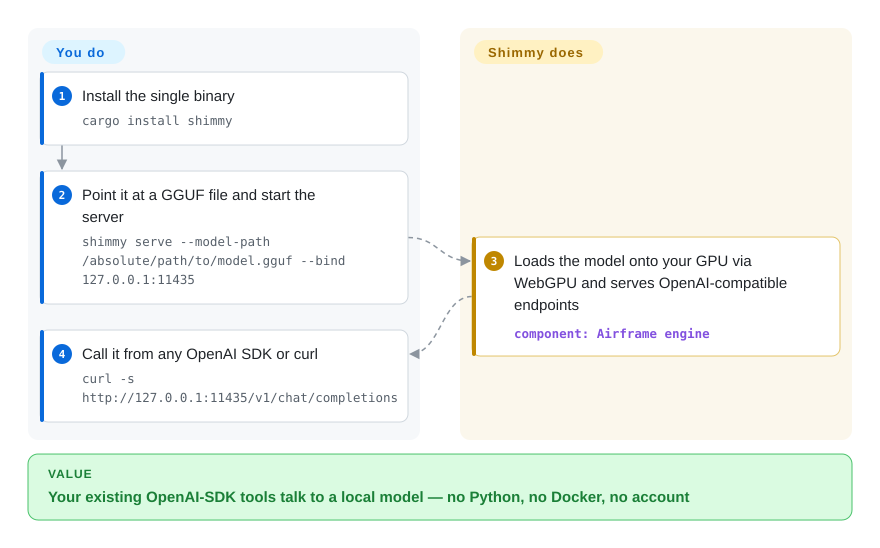

# Shimmy

Your AI tools already speak the OpenAI API, but the model you want to run is a GGUF file on your disk — and the usual answer means installing a background service with its own model store. Shimmy is a single Rust binary that serves an OpenAI-compatible HTTP API directly from that file, with no Python, no Docker, and no account.

## When to use

You already have GGUF models on disk — downloaded from Hugging Face or pulled by Ollama — and you want an OpenAI-compatible endpoint in front of one of them without adopting a model-management system. You run one command with the file path, and your existing SDK code, curl scripts, and tools that expect `http://localhost:…/v1/chat/completions` work unchanged. Shimmy can also scan the usual model directories itself (`shimmy discover` covers `~/.ollama/models` and `~/.cache/huggingface`), so files Ollama already downloaded are reused instead of duplicated.

Pick Shimmy over [Ollama](ollama.md) when the deciding factor is footprint and directness — one binary, one file path, no daemon, no store — rather than ecosystem depth. Pick it over [llama.cpp](llama-cpp.md)'s server when you want OpenAI-, Ollama-, and Anthropic-compatible endpoints without reading a flag reference. The deciding tradeoff: you accept a one-year-old, single-maintainer engine that certifies only 26 model+quantization combinations, in exchange for the lightest OpenAI-compatible serving path in this category.

## How it works

Shimmy is an HTTP server shell around a separate engine. You hand it a GGUF file path (or let auto-discovery find models in the Ollama and Hugging Face directories); it loads the weights through Airframe, a pure-Rust engine that runs the model as GPU compute shaders — small programs your graphics card executes — via WebGPU, the cross-vendor GPU API that works on NVIDIA, AMD, Intel, and Apple Silicon alike. Your side of the deal ends at the file path and the port; everything between a GGUF file and a streamed chat-completion response — tokenizer, chat template, sampling — is its side.

<!-- flow-steps:begin (generated from flows/shimmy.json by tools/flow_card.py — do not edit) -->

Text version of the flow

1. **You**: Install the single binary — `cargo install shimmy`
2. **You**: Point it at a GGUF file and start the server — `shimmy serve --model-path /absolute/path/to/model.gguf --bind 127.0.0.1:11435`
3. **Shimmy**: Loads the model onto your GPU via WebGPU and serves OpenAI-compatible endpoints — component: `Airframe engine`
4. **You**: Call it from any OpenAI SDK or curl — `curl -s http://127.0.0.1:11435/v1/chat/completions`

**Value**: Your existing OpenAI-SDK tools talk to a local model — no Python, no Docker, no account

<!-- flow-steps:end -->

## When NOT to use

- **If your model is not on its certified list, use [llama.cpp](llama-cpp.md) or [Ollama](ollama.md) instead**, because Shimmy v2 removed its llama.cpp backend and runs GGUF only through Airframe, which certifies 26 model+quantization combinations across 12 architecture families — anything else may load but has no correctness guarantee.
- **If many clients will hit the endpoint concurrently, use [vLLM](../serving-engines/vllm.md) or [SGLang](../serving-engines/sglang.md) instead**, because Shimmy is a single-user local server with no batching scheduler.
- **If you want a managed model library with one-command pulls and client SDKs, use [Ollama](ollama.md) instead**, because Shimmy has no model store — you bring file paths yourself.
- **If a compliance review needs a clean license story, resolve this first or use [llama.cpp](llama-cpp.md) instead**, because Shimmy's `Cargo.toml` and README badge say MIT while the repo's root `LICENSE` file is Apache-2.0 (verified 2026-09-23), and its engine's FSE subsystem carries a pending US patent.
- **If the endpoint must be reachable beyond localhost, put your own gateway in front of it**, because the server has no authentication layer (checked `src/server.rs`: route table only, no credential check) — same exposure rule as Ollama, without Ollama's track record.

## Comparison

| Alternative | In index | Our verdict | Tradeoff |
|---|---|---|---|
| [Ollama](ollama.md) | ✅ | Pick Shimmy when you want one binary over a GGUF path with zero background service; pick Ollama when a managed model store, llama.cpp's broad model coverage, and a large support ecosystem matter more. | Shimmy trades model coverage and ecosystem maturity for footprint and directness; Ollama pays for those with an always-on service and a wrapper's flag subset. |
| [llama.cpp](llama-cpp.md) | ✅ | Pick Shimmy when you want OpenAI/Ollama/Anthropic-compatible endpoints without learning engine flags; pick llama.cpp when you need the widest architecture and quantization support, or engine-level control. | Shimmy hides the engine but constrains you to Airframe's certified list; llama.cpp exposes everything and leaves compatibility and API-shaping to you. |
| [vLLM](../serving-engines/vllm.md) | ✅ | Pick Shimmy for a developer machine serving one model to local tools; pick vLLM the moment throughput and concurrent clients decide. | Shimmy's zero-dependency simplicity ends where vLLM starts — continuous batching costs you NVIDIA-centric, multi-service operations. |
| LocalAI | 未收录 | Pick Shimmy when your models are GGUF and you want minimal moving parts; evaluate LocalAI when you need many model formats and backends behind one API. | LocalAI is a real repository deferred from this batch, not rejected; it covers more formats at the cost of a much heavier dependency tree. |
| LM Studio | 非仓库 | Pick Shimmy when you need scriptable, headless, license-inspectable serving; pick LM Studio when a human just wants a GUI to download a model and chat. | LM Studio is a closed desktop product, not a repository, so it cannot be vendored, audited, or automated. |

## Tech stack

- **Language:** Rust throughout (single crate, ~29k lines), async HTTP on axum/tokio.
- **Engine:** Airframe (crate `airframe` 0.4.x) — pure-Rust transformer inference on WebGPU (WGSL compute shaders via wgpu); model specs are derived from GGUF metadata rather than hardcoded per-model constants.
- **API surfaces:** OpenAI (`/v1/chat/completions`, `/v1/completions`, `/v1/models`), Ollama (`/api/generate`, `/api/tags`), Anthropic (`/v1/messages`), plus a WebSocket streaming endpoint, `/metrics`, and an OpenAPI doc UI at `/docs`.
- **Model formats:** GGUF runs fully through Airframe; SafeTensors files load but full inference is roadmap work per its own docs.

## Dependencies

- **Runtime:** one compiled binary, installed from source via `cargo install shimmy` (no prebuilt release binaries are published); no Python, no C++ toolchain, no Docker required.
- **GPU:** any WebGPU-capable device — NVIDIA, AMD, Intel, integrated graphics, Apple Silicon — needing only the vendor graphics driver; a CPU-only build exists via `--no-default-features`.
- **Models:** local GGUF files you supply; auto-discovery covers `~/.ollama/models` and `~/.cache/huggingface`.

## Ops difficulty

**Low to run, medium to trust.** It is one process with a `--bind` flag, a `/health` endpoint, and a metrics route — trivially supervisable, and there is no daemon or store to administer. The real work is compatibility, not deployment: before relying on a model you must confirm its exact model+quantization combination is on the 26-entry certified list, because outside that list output correctness is unverified. There is no authentication layer, so treat it as localhost-only or put your own gateway in front. Upgrades mean rerunning `cargo install` — there is no auto-updater and no published binary to pin by URL.

## Health & viability

- **Maintenance:** active as of 2026-09-23 — v2.6.4 released 2026-08-30 at the end of a dense release run (v2.6.0 through v2.6.4 in four days); the last push is 2026-08-30, about three weeks stale at verification time.
- **Governance / bus factor:** single maintainer (Michael A. Kuykendall), GitHub User-owned, exactly one contributor in the contributors API; sponsorship-funded.
- **Backing & Lindy:** created 2025-08-28 — about one year old, young for infrastructure. Roughly 5.9k stars with two Hacker News front-page appearances is hype-weighted attention on a young repo, which the Lindy prior reads as risk, not proof.
- **Adoption & ecosystem:** crates.io's `shimmy` crate shows ~13.3k lifetime downloads and downloads_last_month=13259 (checked 2026-09-23) — essentially the entire lifetime total landed in the last month, consistent with the late-August v2.6 release burst; Homebrew adds only 139 installs in 90 days, and with no Docker image or release binaries, casual adoption is limited.
- **Risk flags:** contradictory license record — `Cargo.toml` declares MIT and the README badge says MIT, but the root `LICENSE` file is Apache-2.0 and GitHub's detector agrees (verified 2026-09-23); the engine's FSE subsystem has a pending US patent; the README's "Security-Audited" badge links to a security policy page, not an audit report.
- **Verdict:** a promising lightweight path for OpenAI-compatible local serving of certified models — treat as experimental: pin a version, confirm your exact model is certified, and keep Ollama/llama.cpp as the fallback.

## Caveats (unverified)

- [未验证] The "~5MB binary", "<1s startup", and "~50MB memory" claims come from the README; no prebuilt binaries are published and this was not built or measured here.
- [未验证] The 3-box certification regimen (MATH + INFERENCE + DETERMINISM) is described in its docs; the certification ledger was not audited and no certified result was reproduced.
- [未验证] Whether an uncertified GGUF loads-and-runs or is rejected was not tested; the README says architecture recognition does not imply certification.
- [推断] The "Security-Audited" badge most likely refers to the security policy rather than a completed third-party audit, since no report is linked.
- [未验证] TurboShimmy INT4 KV-cache ("about 7× lower KV-cache memory") and YaRN extended-context behavior were not measured.
- [未验证] The SafeTensors boundary between "loads" and "runs inference" for a given file was not exercised.
