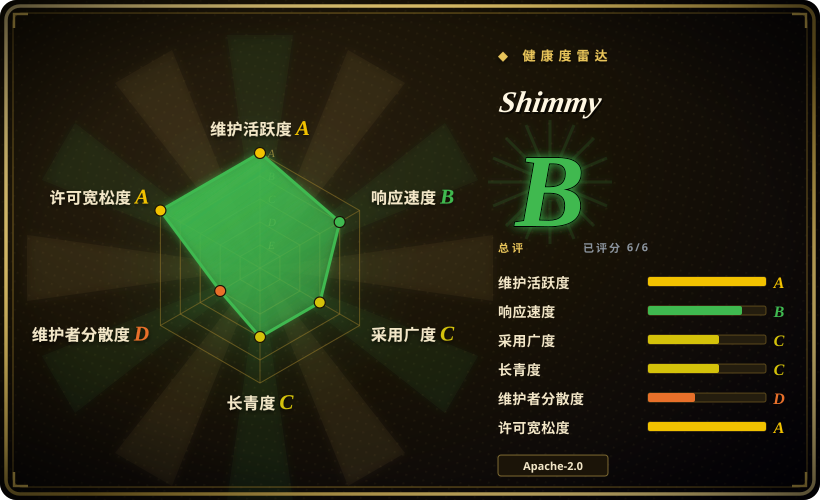
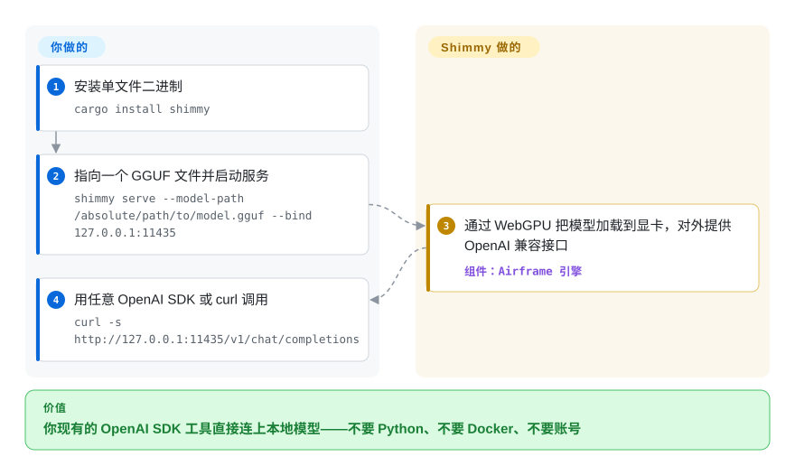

# Shimmy

你的 AI 工具都会说 OpenAI 的 API，但你想跑的模型只是磁盘上的一个 GGUF 文件——而常见答案是装一个带模型仓库的后台服务。Shimmy 是单个 Rust 二进制，直接把这个文件变成 OpenAI 兼容的 HTTP 接口：不要 Python、不要 Docker、不要账号。

## 何时使用

你磁盘上已经有 GGUF 模型——从 Hugging Face 下载的，或者 Ollama 拉下来的——现在想在它前面架一个 OpenAI 兼容端点，又不想引入一整套模型管理系统。你执行一条命令、给出文件路径，现有的 SDK 代码、curl 脚本和任何认 `http://localhost:…/v1/chat/completions` 的工具都不需要改。Shimmy 还会自己扫描常见模型目录（`shimmy discover` 覆盖 `~/.ollama/models` 和 `~/.cache/huggingface`），Ollama 下过的文件直接复用，不用存两份。

和 [Ollama](ollama.zh.md) 之间选 Shimmy 的场景，是决定因素是体积和直接性——一个二进制、一个文件路径、没有守护进程、没有模型仓库——而不是生态深度。和 [llama.cpp](llama-cpp.zh.md) 自带 server 之间选它的场景，是你想要 OpenAI、Ollama、Anthropic 三家兼容的端点，又不想翻参数手册。决定性的取舍是：你接受一个刚满一年、单人维护、只认证了 26 个模型加量化组合的引擎，换来本类目里最轻的 OpenAI 兼容服务路径。

## 怎么用起来

Shimmy 是一个套在独立引擎外面的 HTTP 服务壳。你给它一个 GGUF 文件路径（或者让它自动发现 Ollama 和 Hugging Face 目录里的模型）；它通过 Airframe 加载权重——Airframe 是纯 Rust 引擎，把模型跑成 GPU 计算着色器（显卡执行的小程序），走的是 WebGPU 这个跨厂商接口，NVIDIA、AMD、Intel、Apple Silicon 都覆盖。你这边的责任到文件路径和端口为止；从 GGUF 文件到流式聊天补全响应之间的所有环节——分词、对话模板、采样——都是它的事。

<!-- flow-steps:begin (generated from flows/shimmy.json by tools/flow_card.py — do not edit) -->

流程文字版

1. **你**：安装单文件二进制 — `cargo install shimmy`
2. **你**：指向一个 GGUF 文件并启动服务 — `shimmy serve --model-path /absolute/path/to/model.gguf --bind 127.0.0.1:11435`
3. **Shimmy**：通过 WebGPU 把模型加载到显卡，对外提供 OpenAI 兼容接口 — 组件：`Airframe 引擎`
4. **你**：用任意 OpenAI SDK 或 curl 调用 — `curl -s http://127.0.0.1:11435/v1/chat/completions`

**价值**：你现有的 OpenAI SDK 工具直接连上本地模型——不要 Python、不要 Docker、不要账号

<!-- flow-steps:end -->

## 何时不用

- **如果你的模型不在它的认证名单里，改用 [llama.cpp](llama-cpp.zh.md) 或 [Ollama](ollama.zh.md)**，因为 Shimmy v2 删掉了 llama.cpp 后端，GGUF 只能走 Airframe，而 Airframe 只认证了 12 个架构家族的 26 个模型加量化组合——名单外的模型也许能加载，但输出正确性没有保证。
- **如果端点要服务多个并发客户端，改用 [vLLM](../serving-engines/vllm.zh.md) 或 [SGLang](../serving-engines/sglang.zh.md)**，因为 Shimmy 是单用户本地服务器，没有批处理调度器。
- **如果你想要带模型仓库、一条命令拉模型、官方客户端 SDK 的完整体验，改用 [Ollama](ollama.zh.md)**，因为 Shimmy 没有模型仓库——文件路径要你自己给。
- **如果合规审查需要干净的许可证记录，先把这个问题解决了，或者改用 [llama.cpp](llama-cpp.zh.md)**，因为 Shimmy 的 `Cargo.toml` 和 README 徽章写的是 MIT，但仓库根目录的 `LICENSE` 文件是 Apache-2.0（2026-09-23 核实），而且引擎的 FSE 子系统挂着一项 pending 美国专利。
- **如果端点需要暴露到 localhost 以外，自己架一层网关**，因为服务本身没有鉴权层（查过 `src/server.rs`：只有路由表，没有任何凭据校验）——暴露风险和 Ollama 一样，但没有 Ollama 的成熟度背书。

## 横向对比

| 替代品 | 是否收录 | 我们的评价 | 取舍 |
|---|---|---|---|
| [Ollama](ollama.zh.md) | ✅ | 想要一个二进制对着 GGUF 路径、零后台服务时选 Shimmy；想要托管模型仓库、llama.cpp 的广模型覆盖和庞大支持生态时选 Ollama。 | Shimmy 用模型覆盖面和生态成熟度换体积和直接性；Ollama 用常驻服务和包装层的参数子集换回它们。 |
| [llama.cpp](llama-cpp.zh.md) | ✅ | 想要 OpenAI／Ollama／Anthropic 兼容端点又不想学引擎参数时选 Shimmy；需要最广的架构与量化支持、或引擎级控制时选 llama.cpp。 | Shimmy 藏起引擎但把你限制在 Airframe 认证名单内；llama.cpp 把一切都暴露出来，兼容性和 API 形状都归你管。 |
| [vLLM](../serving-engines/vllm.zh.md) | ✅ | 开发机上给一个模型供本地工具调用时选 Shimmy；吞吐量和并发客户端成为决定因素时选 vLLM。 | Shimmy 零依赖的简单性恰好止于 vLLM 的起点——连续批处理要以 NVIDIA 为中心的多服务运维为代价。 |
| LocalAI | 未收录 | 模型是 GGUF、想要最少活动部件时选 Shimmy；需要多种模型格式和后端统一在一个 API 后面时评估 LocalAI。 | LocalAI 是真实仓库，本批次暂缓收录而非否决；它覆盖更多格式，代价是重得多的依赖树。 |
| LM Studio | 非仓库 | 需要可脚本化、可无头运行、许可证可审的服务时选 Shimmy；人只想用图形界面下载模型聊天时选 LM Studio。 | LM Studio 是闭源桌面产品、不是仓库，无法内嵌、审计或自动化。 |

## 技术栈

- **语言：** 全 Rust（单 crate，约 2.9 万行），异步 HTTP 用 axum／tokio。
- **引擎：** Airframe（crate 名 `airframe`，0.4.x）——纯 Rust transformer 推理，走 WebGPU（经 wgpu 的 WGSL 计算着色器）；模型规格从 GGUF 元数据推导，不为每个模型硬编码常量。
- **API 面：** OpenAI（`/v1/chat/completions`、`/v1/completions`、`/v1/models`）、Ollama（`/api/generate`、`/api/tags`）、Anthropic（`/v1/messages`），另有 WebSocket 流式端点、`/metrics` 和 `/docs` 的 OpenAPI 文档页。
- **模型格式：** GGUF 经 Airframe 完整推理；SafeTensors 按其官方文档目前只能加载，完整推理还在 roadmap 上。

## 依赖

- **运行时：** 一个编译好的二进制，通过 `cargo install shimmy` 从源码安装（官方不发布预编译二进制）；不需要 Python、C++ 工具链或 Docker。
- **GPU：** 任何支持 WebGPU 的设备——NVIDIA、AMD、Intel、核显、Apple Silicon——只要装厂商显卡驱动；也有 `--no-default-features` 的纯 CPU 构建。
- **模型：** 你自己提供的本地 GGUF 文件；自动发现覆盖 `~/.ollama/models` 和 `~/.cache/huggingface`。

## 运维难度

**跑起来简单，敢不敢信是另一回事。** 它就是一个带 `--bind` 参数的进程，有 `/health` 端点和 metrics 路由，没有守护进程和模型仓库要管。真正的工作在兼容性而不是部署：依赖某个模型之前，必须确认它的模型加量化组合恰好在那 26 条认证名单里，名单之外输出正确性未经验证。服务没有鉴权层，按 localhost-only 对待，或者自己架网关。升级就是重跑 `cargo install`——没有自动更新，也没有可以按 URL 钉住的发布二进制。

## 健康度与可持续性

- **维护：** 截至 2026-09-23 活跃——v2.6.4 发布于 2026-08-30，是一轮密集发布的收尾（v2.6.0 到 v2.6.4 共四天）；最后一次 push 是 2026-08-30，核实时已约三周无提交。
- **治理／巴士因子：** 单人维护者（Michael A. Kuykendall），GitHub User 持有，contributors 接口恰好只有 1 个贡献者；靠赞助维持。
- **背景与 Lindy：** 创建于 2025-08-28，刚满一年，对基础设施来说很年轻。约 5.9k star 加两次 Hacker News 首页属于年轻仓库上的热度型关注，按 Lindy 先验应读作风险而非证明。
- **采用与生态：** crates.io 上 `shimmy` crate 的累计下载约 1.33 万，其中 downloads_last_month=13259（2026-09-23 查）——几乎全部下载都落在最近一个月，与 8 月下旬 v2.6 密集发布一致；Homebrew 90 天仅 139 次安装，加上没有 Docker 镜像和发布二进制，尝鲜采用面有限。
- **风险信号：** 许可证记录自相矛盾——`Cargo.toml` 声明 MIT、README 徽章写 MIT，但根目录 `LICENSE` 文件是 Apache-2.0，GitHub 的检测结果也是 Apache-2.0（2026-09-23 核实）；引擎的 FSE 子系统有 pending 美国专利；README 的「Security-Audited」徽章链向安全政策页而不是审计报告。
- **结论：** 认证名单内的模型要走轻量 OpenAI 兼容本地服务，这是有前途的路径——但按实验品对待：钉死版本、确认你的模型在名单里、留好 Ollama／llama.cpp 作为退路。

## 存疑（未验证）

- [未验证] 「约 5MB 二进制」「启动 <1 秒」「内存约 50MB」来自 README；官方不发布预编译二进制，本次没有构建也没有实测。
- [未验证] 三箱认证流程（MATH＋INFERENCE＋DETERMINISM）仅见其文档描述；认证账本没有审过，任何认证结果都没有复现。
- [未验证] 未认证的 GGUF 是能加载运行还是被拒绝，没有实测；README 只说架构识别不等于认证。
- [推断] 「Security-Audited」徽章很可能指的是安全政策而非已完成的第三方审计，因为没有链接任何报告。
- [未验证] TurboShimmy 的 INT4 KV 缓存（「约 7 倍降低」）和 YaRN 扩展上下文的实际表现没有测量。
- [未验证] SafeTensors 的「能加载」和「能推理」边界对具体文件没有实测。
