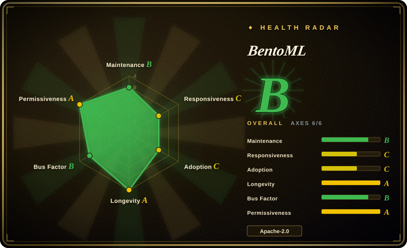
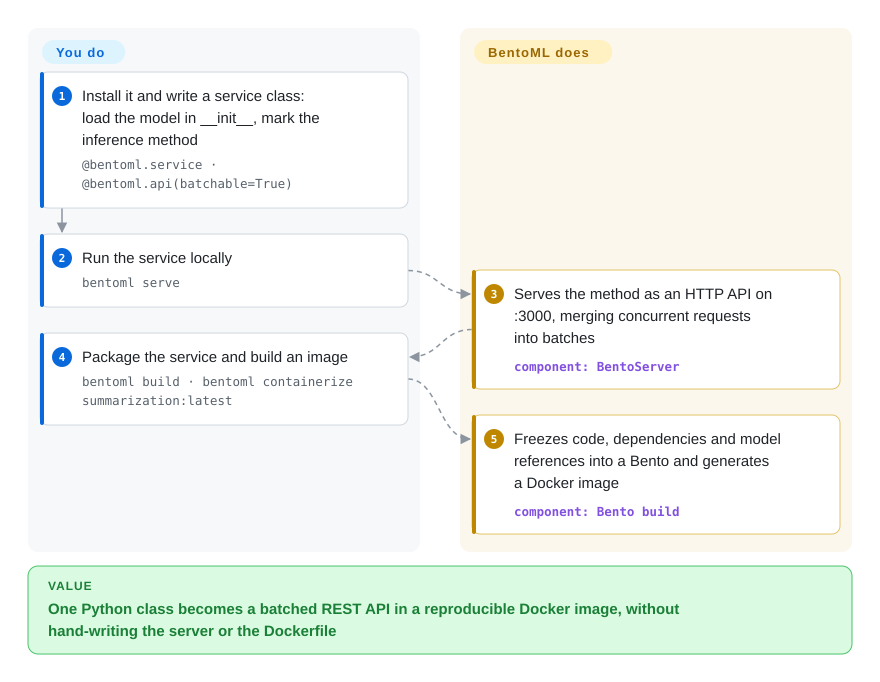

# BentoML

Your model works in a notebook — a summarizer, a Whisper transcriber, an embedder plus a reranker — and now it has to become an HTTP API that batches requests onto the GPU and ships as a Docker image ops will accept, which usually means a hand-written FastAPI app and a week of CUDA-in-Dockerfile pain. BentoML lets you write one decorated Python class and generates the server, the request batching and the container image from it.

## When to use

You're an ML engineer on a product team, and the models you serve are not only chat LLMs: a summarization pipeline, an OCR → embedding → classifier chain, a diffusion model, a speech model, each wrapped in your own pre- and post-processing code. Your first attempt is a FastAPI app; under load every request runs the model alone, the GPU sits at 15% while latency climbs, and the Docker image breaks whenever someone bumps `torch` because the CUDA base image and the pip pins drift apart.

BentoML replaces that glue. You write a class decorated with `@bentoml.service`, load the model in `__init__`, and expose methods with `@bentoml.api`; mark one `batchable=True` and the server starts merging concurrent requests into batches. Services can call each other to build multi-model pipelines, `bentoml serve` runs it locally, and `bentoml build` plus `bentoml containerize` produce a reproducible Docker image with the Python version and packages you declared in code. Pick it over [vLLM](vllm.md) or [SGLang](sglang.md) when the thing you serve is *any* model plus Python logic rather than one LLM at maximum tokens per second (you can still run vLLM inside a BentoML service); over [Ray Serve](ray-serve.md) when you want a container per service without operating a Ray cluster.

## How it works

You write a Python class and BentoML turns it into a server. `@bentoml.service` marks the class and also declares its container image (Python version, packages); `__init__` runs once per worker to load the model; `@bentoml.api` turns a method into an HTTP endpoint whose input and output schema come from your Python type hints. With `batchable=True`, the server holds incoming requests for a few milliseconds and hands your method a list — *adaptive batching*, like an elevator that waits a moment so it can carry several people per trip — so the GPU processes many inputs in one pass. `bentoml build` freezes code, dependency spec and model references into a *Bento* (BentoML's deployable bundle), and `bentoml containerize` turns that into a Docker image. What BentoML does for you: the HTTP server, batching, worker processes, typed schemas, metrics and tracing hooks, and the image build. What you do: write the inference code, choose batching and resource settings, and run the containers somewhere — autoscaling and scale-to-zero beyond a single host are documented under BentoCloud, the vendor's managed platform, not the open-source server.

<!-- flow-steps:begin (generated from flows/bentoml.json by tools/flow_card.py — do not edit) -->

Text version of the flow

1. **You**: Install it and write a service class: load the model in __init__, mark the inference method — `@bentoml.service · @bentoml.api(batchable=True)`
2. **You**: Run the service locally — `bentoml serve`
3. **BentoML**: Serves the method as an HTTP API on :3000, merging concurrent requests into batches — component: `BentoServer`
4. **You**: Package the service and build an image — `bentoml build · bentoml containerize summarization:latest`
5. **BentoML**: Freezes code, dependencies and model references into a Bento and generates a Docker image — component: `Bento build`

**Value**: One Python class becomes a batched REST API in a reproducible Docker image, without hand-writing the server or the Dockerfile

<!-- flow-steps:end -->

## When NOT to use

- **You only need to serve a popular open LLM as fast as possible.** Run [vLLM](vllm.md) or [SGLang](sglang.md) directly — both expose an OpenAI-compatible API on their own. BentoML adds a layer that is worth it only when you need custom Python logic around the engine.
- **You want vendor-supported, self-hosted Kubernetes autoscaling.** Yatai, BentoML's Kubernetes operator, is archived, and the autoscaling docs live under BentoCloud. For open-source cluster serving with autoscaling use [Ray Serve](ray-serve.md) or KServe (not indexed); with BentoML you wire Kubernetes HPA yourself.
- **One huge model must span many nodes, or LLM traffic needs cache-aware routing across a fleet.** That is [llm-d](llm-d.md) on top of vLLM/SGLang, or Ray Serve for Ray-native distributed composition.
- **You need a high-performance multi-framework server with a model repository and C++ backends (TensorRT, ONNX, TorchScript).** Use NVIDIA Triton Inference Server (not indexed); BentoML is Python-first and runs your Python code in the request path.
- **You need fast upstream fixes.** Since Modular acquired BentoML (announced 2026-02-09), open-source activity has slowed: the last release is v1.4.39 from 2026-05-07, the main branch saw commits in only 3 of the last 13 weeks, and issues wait weeks for a first response. If that matters, pin versions and plan to patch, or prefer Ray Serve.
- **Your environment forbids phone-home by default.** BentoML reports anonymous usage statistics unless you pass `--do-not-track` or set `BENTOML_DO_NOT_TRACK=True`.

## Comparison

| Alternative | In index | Our verdict | Tradeoff |
|---|---|---|---|
| [Ray Serve](ray-serve.md) | ✅ | Choose Ray Serve when you need autoscaling, multi-node composition and an actively maintained open-source scaler; choose BentoML when a container per service built from one Python class is enough. | Ray Serve scales further but makes you operate Ray; BentoML is lighter to run but leaves cluster scaling to you or BentoCloud. |
| [vLLM](vllm.md) | ✅ | Choose vLLM to serve an LLM with maximum throughput behind an OpenAI-compatible API; choose BentoML when the service is any model plus Python pre/post-processing, possibly with vLLM inside. | vLLM is a specialized engine; BentoML is a general packaging and serving framework that is slower on raw LLM throughput unless it wraps an engine. |
| KServe | 未收录 | Choose KServe when you are on Kubernetes and want a standard InferenceService resource with autoscaling and scale-to-zero; choose BentoML when you want to start from Python code and a Docker image without a Kubernetes control plane. | KServe brings Kubernetes-native scaling and multi-runtime support; BentoML is simpler to start but has no maintained OSS operator. |
| NVIDIA Triton Inference Server | 未收录 | Choose Triton for maximum-throughput serving of exported models (TensorRT, ONNX) from a model repository; choose BentoML when your request path is mostly custom Python. | Triton is faster for exported graphs but less friendly to arbitrary Python; BentoML runs Python everywhere at some performance cost. |
| [Modular Platform (MAX + Mojo)](modular.md) | ✅ | Choose MAX when you want Modular's own optimized GPU/CPU inference engine; choose BentoML for a framework-agnostic serving layer around models you already run, keeping in mind that Modular now owns it. | MAX optimizes the engine itself; BentoML packages arbitrary models. After the acquisition, BentoML's direction may tilt toward MAX integration. |

## Tech stack

- **Language:** Python (requires ≥3.9).
- **Server:** ASGI on Starlette and uvicorn; aiohttp/httpx for service-to-service calls; pydantic for typed I/O.
- **Observability:** OpenTelemetry tracing and Prometheus metrics built in.
- **Packaging:** generates Dockerfiles and images from the service's `bentoml.images.Image` spec; ships a BentoCloud CLI (`bentoml cloud login`, `bentoml deploy`).

## Dependencies

- **Runtime:** Python 3.9+ and your ML framework (PyTorch, Transformers, etc.); no database or broker.
- **Containerization:** Docker for `bentoml containerize`.
- **GPU:** NVIDIA drivers/CUDA when your model uses the GPU (`nvidia-ml-py` is a core dependency for GPU monitoring).
- **Optional:** a BentoCloud account for the managed deployment, autoscaling and BYOC path.

## Ops difficulty

**Low to start, medium in production.** `bentoml serve` and `bentoml containerize` are a short path to a working image. After that you own everything a container platform needs: load balancing, autoscaling (Kubernetes HPA or similar, with no maintained BentoML operator), GPU scheduling, rollouts and monitoring wired to the built-in Prometheus metrics.

## Health & viability

- **Maintenance — coasting (2026-10-08).** The last release is v1.4.39 (2026-05-07); the last commit on the main branch was 31 days ago, with commits in only 3 of the last 13 weeks, mostly fixes and new agent-skill docs.
- **Responsiveness — slow.** The median first response to recent issues was about 667.5 hours (roughly four weeks), on a small sample.
- **Backing — acquired.** Modular bought BentoML in February 2026; Modular states the licence stays Apache 2.0 and the founder said they would keep shipping at the same pace, but the cadence since then is lower than that promise.
- **Age / Lindy — strong prior, weakened by the slowdown.** The repository dates from 2019-04 (about 7.5 years), with 134,418 PyPI downloads last month and 499 dependent repos; Lindy favours it, but age × still-active is now only partly satisfied.
- **Risk flags.** Apache-2.0 with no relicense; Yatai (its Kubernetes operator) archived; default-on usage tracking; roadmap now owned by an acquirer with its own competing engine.

## Caveats (unverified)

- [推断] "Autoscaling and scale-to-zero are BentoCloud-only" is inferred from the docs layout (the autoscaling guide sits under "Scale with BentoCloud") and the archived Yatai operator; no code-level check was done.
- [未验证] The claim that the GPU idles under a naive FastAPI deployment is a typical pattern, not a measurement on any specific model.
- [推断] Whether the slower cadence is temporary (team busy integrating MAX) or a long-term reprioritization is not known.
- [未验证] KServe and Triton capabilities in the comparison come from general knowledge, not from pages in this index.
- [未验证] Acquisition date and quotes come from Modular's forum announcement (2026-02-09).
