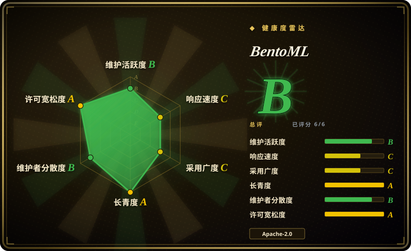
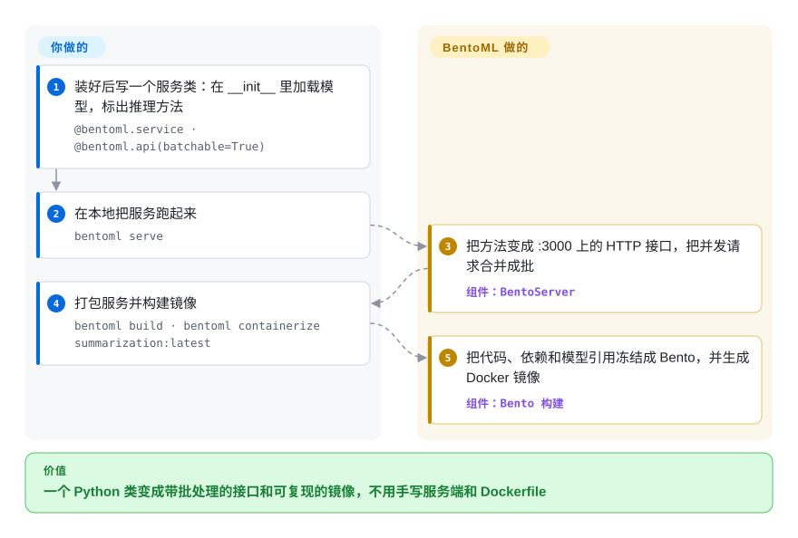

# BentoML

模型在笔记本里跑通了——一个摘要模型、一个 Whisper 转写、一个向量模型加重排模型——现在要把它变成一个 HTTP 接口：请求要攒成批送进 GPU，还要打成运维肯收的 Docker 镜像，通常这意味着手写一个 FastAPI 应用，再在 Dockerfile 里和 CUDA 折腾一周。BentoML 让你只写一个加了装饰器的 Python 类，由它生成服务端、请求批处理和容器镜像。

## 何时使用

你是产品团队里的机器学习工程师，要上线的不只是聊天大模型：一条摘要流水线、一串 OCR → 向量化 → 分类器、一个扩散模型、一个语音模型，每个外面都包着你自己写的前处理和后处理代码。第一版你用 FastAPI 写；一上压力，每个请求都单独跑一次模型，GPU 利用率停在 15%，延迟却一路上涨；每次有人升级 `torch`，Docker 镜像就坏一次，因为 CUDA 基础镜像和 pip 版本锁对不上。

BentoML 替掉的就是这层胶水。你写一个加了 `@bentoml.service` 的类，在 `__init__` 里加载模型，用 `@bentoml.api` 暴露方法；把某个方法标成 `batchable=True`，服务端就开始把并发请求合并成批。服务之间可以互相调用，拼成多模型流水线；`bentoml serve` 在本地跑起来，`bentoml build` 加 `bentoml containerize` 产出一个可复现的 Docker 镜像，Python 版本和依赖包就是你在代码里声明的那些。当你要服务的是“任意模型加 Python 逻辑”、而不是把单个大模型的每秒 token 数推到极限时，选它而不是 [vLLM](vllm.zh.md) 或 [SGLang](sglang.zh.md)（你仍然可以在 BentoML 服务里跑 vLLM）；当你想一个服务一个容器、又不想运维一个 Ray 集群时，选它而不是 [Ray Serve](ray-serve.zh.md)。

## 怎么用起来

你写一个 Python 类，BentoML 把它变成服务端。`@bentoml.service` 标记这个类，同时声明它的容器镜像（Python 版本、依赖包）；`__init__` 在每个工作进程里只跑一次，用来加载模型；`@bentoml.api` 把一个方法变成 HTTP 接口，输入输出的格式直接取自你的 Python 类型注解。加上 `batchable=True` 后，服务端会把进来的请求先攒几毫秒，再把一整个列表交给你的方法——这叫“自适应批处理”，像电梯稍等片刻、一趟多载几个人——于是 GPU 一次就能处理很多条输入。`bentoml build` 把代码、依赖声明和模型引用冻结成一个“Bento”（BentoML 的可部署包），`bentoml containerize` 再把它变成 Docker 镜像。BentoML 替你做的：HTTP 服务端、批处理、工作进程、带类型的接口格式、指标和链路追踪的接入点，以及镜像构建。你要做的：写推理代码，选批处理和资源配置，并找地方把容器跑起来——跨主机的自动扩缩容和缩到零，文档里都放在厂商的托管平台 BentoCloud 名下，不属于开源服务端。

<!-- flow-steps:begin (generated from flows/bentoml.json by tools/flow_card.py — do not edit) -->

流程文字版

1. **你**：装好后写一个服务类：在 __init__ 里加载模型，标出推理方法 — `@bentoml.service · @bentoml.api(batchable=True)`
2. **你**：在本地把服务跑起来 — `bentoml serve`
3. **BentoML**：把方法变成 :3000 上的 HTTP 接口，把并发请求合并成批 — 组件：`BentoServer`
4. **你**：打包服务并构建镜像 — `bentoml build · bentoml containerize summarization:latest`
5. **BentoML**：把代码、依赖和模型引用冻结成 Bento，并生成 Docker 镜像 — 组件：`Bento 构建`

**价值**：一个 Python 类变成带批处理的接口和可复现的镜像，不用手写服务端和 Dockerfile

<!-- flow-steps:end -->

## 何时不用

- **你只是想把一个热门开源大模型尽可能快地跑起来。** 直接用 [vLLM](vllm.zh.md) 或 [SGLang](sglang.zh.md)——它们自己就提供 OpenAI 兼容接口。只有当你要在引擎外面包一层自定义 Python 逻辑时，多出来的 BentoML 这一层才值得。
- **你要厂商支持的、自托管的 Kubernetes 自动扩缩容。** BentoML 的 Kubernetes operator Yatai 已归档，自动扩缩容文档放在 BentoCloud 名下。要开源的集群服务加自动扩缩容，用 [Ray Serve](ray-serve.zh.md) 或 KServe（未收录）；用 BentoML 的话，Kubernetes HPA 得你自己接。
- **一个超大模型要跨多台机器，或者大模型流量需要在整个集群里按缓存做路由。** 那是建在 vLLM/SGLang 之上的 [llm-d](llm-d.zh.md)，或者用 Ray Serve 做 Ray 原生的分布式组合。
- **你需要一个高性能、多框架、带模型仓库和 C++ 后端（TensorRT、ONNX、TorchScript）的推理服务器。** 用 NVIDIA Triton Inference Server（未收录）；BentoML 以 Python 为先，请求路径上跑的是你的 Python 代码。
- **你需要上游快速修 bug。** Modular 收购 BentoML（2026-02-09 宣布）之后，开源活跃度下降了：最近一个版本是 2026-05-07 的 v1.4.39，主分支在过去 13 周里只有 3 周有提交，issue 要等好几周才有第一条回复。如果这对你重要，就锁定版本、准备自己打补丁，或者优先考虑 Ray Serve。
- **你的环境不允许默认向外回传。** 除非加 `--do-not-track` 或设置 `BENTOML_DO_NOT_TRACK=True`，BentoML 会上报匿名使用统计。

## 横向对比

| 替代品 | 是否收录 | 我们的评价 | 取舍 |
|---|---|---|---|
| [Ray Serve](ray-serve.zh.md) | ✅ | 需要自动扩缩容、多节点组合和仍在积极维护的开源扩缩容能力，选 Ray Serve；一个 Python 类构建出一个服务一个容器就够用，选 BentoML。 | Ray Serve 能扩得更远，但你要运维 Ray；BentoML 运行起来更轻，但把集群扩缩容留给你自己或 BentoCloud。 |
| [vLLM](vllm.zh.md) | ✅ | 要以最高吞吐、通过 OpenAI 兼容接口服务一个大模型，选 vLLM；服务的是任意模型加 Python 前后处理（里面也可以套 vLLM），选 BentoML。 | vLLM 是专门的推理引擎；BentoML 是通用的打包与服务框架，除非包着一个引擎，否则纯大模型吞吐不如它。 |
| KServe | 未收录 | 你在 Kubernetes 上、想要带自动扩缩容和缩到零的标准 InferenceService 资源，选 KServe；想从 Python 代码和一个 Docker 镜像起步、不要 Kubernetes 控制面，选 BentoML。 | KServe 带来 Kubernetes 原生的扩缩容和多运行时支持；BentoML 上手更简单，但没有仍在维护的开源 operator。 |
| NVIDIA Triton Inference Server | 未收录 | 要从模型仓库以最高吞吐服务导出好的模型（TensorRT、ONNX），选 Triton；请求路径大部分是自定义 Python，选 BentoML。 | Triton 跑导出的计算图更快，但对任意 Python 不友好；BentoML 处处都能跑 Python，代价是一些性能。 |
| [Modular Platform (MAX + Mojo)](modular.zh.md) | ✅ | 想用 Modular 自家优化过的 GPU/CPU 推理引擎，选 MAX；要给已有模型套一层与框架无关的服务层，选 BentoML，但要记得它现在归 Modular 所有。 | MAX 优化的是引擎本身；BentoML 负责打包任意模型。收购之后，BentoML 的方向可能会偏向与 MAX 集成。 |

## 技术栈

- **语言：** Python（要求 ≥3.9）。
- **服务端：** 基于 Starlette 和 uvicorn 的 ASGI；服务间调用用 aiohttp/httpx；用 pydantic 做带类型的输入输出。
- **可观测性：** 内置 OpenTelemetry 链路追踪和 Prometheus 指标。
- **打包：** 按服务里的 `bentoml.images.Image` 声明生成 Dockerfile 和镜像；自带 BentoCloud 命令行（`bentoml cloud login`、`bentoml deploy`）。

## 依赖

- **运行时：** Python 3.9+ 和你用的机器学习框架（PyTorch、Transformers 等）；不需要数据库或消息中间件。
- **容器化：** `bentoml containerize` 需要 Docker。
- **GPU：** 模型用 GPU 时需要 NVIDIA 驱动/CUDA（`nvidia-ml-py` 是用于 GPU 监控的核心依赖）。
- **可选：** 走托管部署、自动扩缩容和 BYOC 路线时需要 BentoCloud 账号。

## 运维难度

**起步低，生产环境中等。** `bentoml serve` 和 `bentoml containerize` 很快就能产出一个能用的镜像。之后容器平台要的一切都归你：负载均衡、自动扩缩容（Kubernetes HPA 之类，没有仍在维护的 BentoML operator）、GPU 调度、发布，以及把内置的 Prometheus 指标接进监控。

## 健康度与可持续性

- **维护——在滑行（2026-10-08）。** 最近一个版本是 v1.4.39（2026-05-07）；主分支最后提交在 31 天前，过去 13 周只有 3 周有提交，内容多是修复和新增的 agent skill 文档。
- **响应速度——慢。** 近期 issue 的首次响应中位数约 667.5 小时（约四周），样本很小。
- **背书——已被收购。** Modular 于 2026 年 2 月收购 BentoML；Modular 表示许可证保持 Apache 2.0，创始人也说会按原来的速度继续发布，但此后的节奏低于这个承诺。
- **年龄 / Lindy——先验很强，被放缓削弱。** 仓库建于 2019-04（约 7.5 年），上月 PyPI 下载量 134,418 次，依赖仓库 499 个；Lindy 偏向它，但“年龄 × 仍活跃”现在只部分成立。
- **风险信号。** Apache-2.0，无改许可证历史；它的 Kubernetes operator Yatai 已归档；使用统计默认开启；路线图如今归一家有自家竞品引擎的收购方。

## 存疑（未验证）

- [推断] “自动扩缩容和缩到零只在 BentoCloud 上有”是根据文档结构（自动扩缩容指南放在“Scale with BentoCloud”下）和已归档的 Yatai 推出来的，没有做代码层面的核对。
- [未验证] “朴素 FastAPI 部署下 GPU 闲置”是常见现象，不是在某个具体模型上测出来的。
- [推断] 节奏放缓是暂时的（团队忙于集成 MAX）还是长期的优先级调整，目前不清楚。
- [未验证] 对比表里 KServe 和 Triton 的能力来自一般了解，本索引里没有它们的页面。
- [未验证] 收购日期和引语来自 Modular 论坛公告（2026-02-09）。
