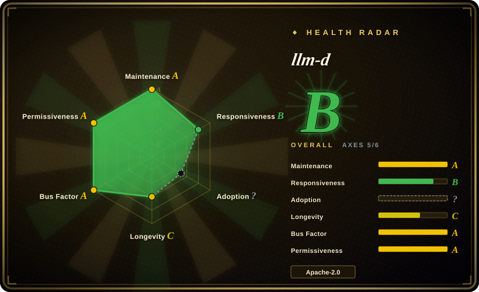
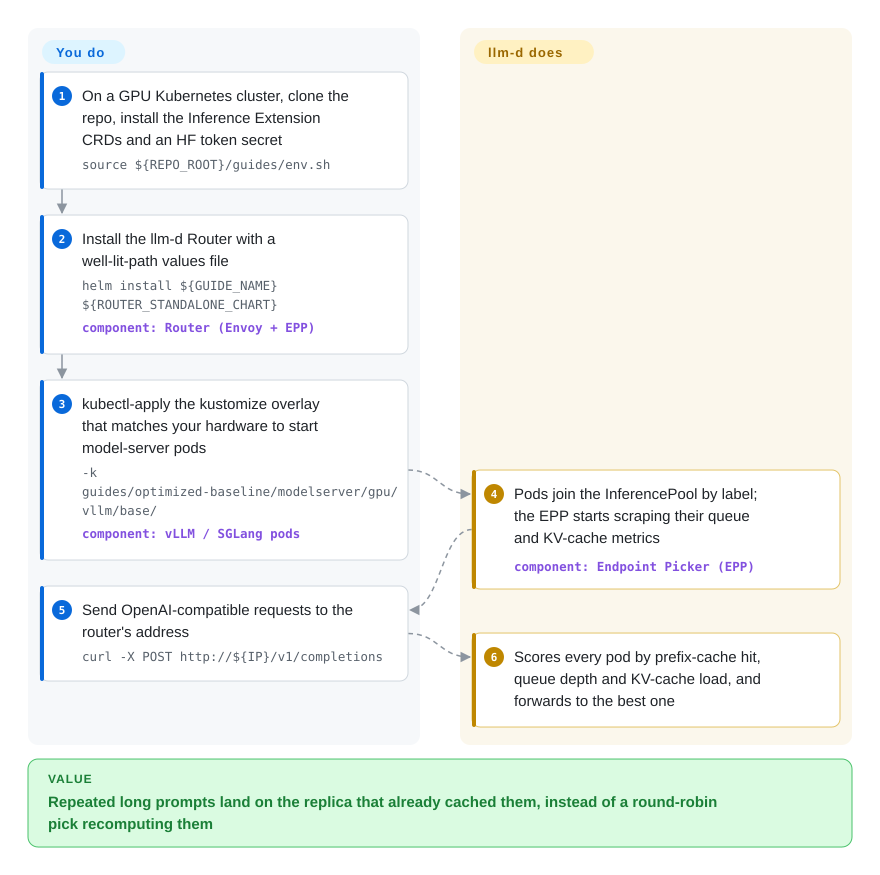

# llm-d

You already run vLLM on a dozen GPU pods behind a plain Kubernetes Service, and the round-robin balancer keeps sending a 20k-token chat history to a replica that has never seen it, so every turn recomputes the prompt from scratch while another pod sits on the cached copy. llm-d puts an LLM-aware router in front of those pods that sends each request to the replica already holding its prompt prefix and the least queue, and ships tested Helm/kustomize recipes for the heavier tricks (split prefill/decode, cache offload to CPU, autoscaling on queue depth).

## When to use

You are the platform team that owns inference for a company: an internal model-as-a-service on Kubernetes, 8–100+ accelerator pods running vLLM (or SGLang), traffic dominated by multi-turn chat and agent loops that resend long shared prefixes. The dashboards show the symptom: TTFT (time to first token) p99 of several seconds on one replica while its neighbour is idle, `vllm:kv_cache_usage_perc` pinned near 100% on some pods and low on others, and a Kubernetes `Service` that cannot tell the difference because it balances TCP connections, not prompts. You also have a DeepSeek-class MoE model to bring up and no appetite to hand-tune prefill/decode split and expert parallelism from papers.

You reach for llm-d when you want to keep your model server (vLLM first; SGLang and TensorRT-LLM `trtllm-serve` are also supported) and your Kubernetes, and add the missing layer on top: the llm-d Router (an Endpoint Picker plugged into a Gateway API Inference Extension gateway) that scores pods by prefix-cache hit, queue depth and KV-cache load, plus benchmarked "well-lit path" recipes for disaggregation, tiered KV cache and autoscaling. Against NVIDIA Dynamo the deciding tradeoff is standards and hardware breadth — llm-d composes upstream Kubernetes APIs (InferencePool, Gateway API) and maintains guides for AMD, Intel, Google TPU and several NPUs, where Dynamo is an NVIDIA-led integrated framework with its own frontend and router. Against a bare [vLLM](vllm.md) deployment it wins only once you have enough replicas that *where* a request lands matters.

## How it works

llm-d does not run models itself; it is the traffic controller and the recipe book around the engines that do. Your model server pods are grouped into an `InferencePool` (think of it as a Kubernetes Service that knows it is serving an LLM); in front sits the llm-d Router, made of an Envoy proxy and an Endpoint Picker (EPP) — a scheduler the proxy asks, for every request, "which pod should take this?". The EPP scrapes each pod's queue length and KV-cache usage (the KV cache is the GPU memory holding already-computed attention state for a prompt, which is what makes a repeated prefix cheap) and scores pods — like a maître d' who seats a returning party at the table where their order is already half-cooked, not just the emptiest table. The heavier optimisations are opt-in recipes: splitting a request's prompt-processing (prefill) and token-generation (decode) phases onto different pods with the KV cache shipped between them over RDMA, spilling the cache to CPU or disk, and letting KEDA scale replicas on the EPP's queue metrics. What stays yours: the Kubernetes cluster, the accelerators and their drivers, the Gateway API / Inference Extension CRDs, choosing which well-lit path fits your traffic, and — for disaggregation and wide expert parallelism — a fast RDMA network exposed inside pods. The main repo is mostly those guides, Helm values and kustomize overlays; the router itself lives in `llm-d/llm-d-router` (Go). A no-Kubernetes path (EPP + Envoy + vLLM with a YAML endpoints file) exists but is documented as vLLM-on-NVIDIA only.

<!-- flow-steps:begin (generated from flows/llm-d.json by tools/flow_card.py — do not edit) -->

Text version of the flow

1. **You**: On a GPU Kubernetes cluster, clone the repo, install the Inference Extension CRDs and an HF token secret — `source ${REPO_ROOT}/guides/env.sh`
2. **You**: Install the llm-d Router with a well-lit-path values file — `helm install ${GUIDE_NAME} ${ROUTER_STANDALONE_CHART}` — component: `Router (Envoy + EPP)`
3. **You**: kubectl-apply the kustomize overlay that matches your hardware to start model-server pods — `-k guides/optimized-baseline/modelserver/gpu/vllm/base/` — component: `vLLM / SGLang pods`
4. **llm-d**: Pods join the InferencePool by label; the EPP starts scraping their queue and KV-cache metrics — component: `Endpoint Picker (EPP)`
5. **You**: Send OpenAI-compatible requests to the router's address — `curl -X POST http://${IP}/v1/completions`
6. **llm-d**: Scores every pod by prefix-cache hit, queue depth and KV-cache load, and forwards to the best one

**Value**: Repeated long prompts land on the replica that already cached them, instead of a round-robin pick recomputing them

<!-- flow-steps:end -->

## When NOT to use

- **One to a few replicas, or no Kubernetes.** Run [vLLM](vllm.md) or [SGLang](sglang.md) directly; with two pods the routing decision barely matters and llm-d adds Gateway API CRDs, an EPP, Envoy and Helm charts to operate. The no-Kubernetes guide exists but is vLLM-on-NVIDIA only and has no Helm/kustomize support.
- **You are all-in on NVIDIA and want one vendor-integrated stack.** NVIDIA Dynamo bundles its own frontend, KV-aware router, planner and NIXL transfer, and can run with or without an external gateway; llm-d's differentiator (multi-vendor accelerators, upstream Kubernetes APIs) is worth less to you than a single supported product.
- **You need a general model-serving platform, not just LLMs.** Use KServe (it can use llm-d as its LLM backend) or [Ray Serve](ray-serve.md) for mixed predictive/generative fleets, Python composition, or non-LLM models; llm-d is scoped to LLM (and newer multimodal/diffusion) traffic on OpenAI-compatible engines.
- **You need a stable component list to pin for a year.** v0.10.0 (2026-09-29) alone migrated the `llm-d-kv-cache` repo into `llm-d-router`, renamed the autoscaler repo and deprecated its WVA guides, deprecated the `llm-d-latency-predictor` component (after it was promoted as a headline win), and deprecated the `llm-d-cuda` image in favour of upstream `vllm/vllm-openai`. If you cannot absorb that churn, stay on the upstream Gateway API Inference Extension EPP or plain vLLM until 1.0.
- **Prefill/decode disaggregation or wide expert parallelism without an RDMA fabric.** These well-lit paths assume InfiniBand/RoCE exposed inside pods (plus DRA drivers on GKE); the P/D guide itself lists known NIXL connector limitations. Without that network, stay on the optimized-baseline routing path — or a single-node engine — rather than chase the headline throughput numbers.
- **Old GPU drivers you cannot upgrade.** Current images target CUDA 12.9.1 (driver < 580) and the project has announced a move to CUDA 13.0.2 (driver ≥ 580.65.06); a fleet frozen on an old driver branch should pin a release or build its own images.

## Comparison

| Alternative | In index | Our verdict | Tradeoff |
|---|---|---|---|
| [vLLM](vllm.md) | ✅ | For one to a handful of replicas, run vLLM alone; add llm-d in front once a Kubernetes fleet is large enough that prefix-cache-aware placement and P/D splitting pay for the extra control plane. | vLLM is the engine llm-d mostly routes to, so they stack rather than compete; going bare saves Gateway/EPP/Helm operations but leaves prompt placement to a TCP load balancer. |
| [Ray Serve](ray-serve.md) | ✅ | For Python-composed pipelines mixing many model types, pick Ray Serve; pick llm-d when the job is LLM traffic on Kubernetes and you want Gateway API routing with KV-cache awareness. | Ray Serve is long-lived and general but brings a Ray cluster to operate and its own routing model; llm-d is narrower and younger but plugs into standard Kubernetes networking. |
| NVIDIA Dynamo (ai-dynamo/dynamo) | not indexed | On an NVIDIA-only fleet that wants one vendor-backed framework with its own router and planner, pick Dynamo; pick llm-d for multi-vendor accelerators and upstream Kubernetes APIs under CNCF governance. | Dynamo is more integrated (Rust frontend, planner, NIXL, can skip the gateway) but NVIDIA-led; llm-d spreads across Red Hat/Google/IBM/CoreWeave/NVIDIA but leaves more assembly to you. Not added in this tab batch. |
| KServe (kserve/kserve) | not indexed | When you need one serving platform for predictive and generative models with standard CRDs, pick KServe and let it drive llm-d for LLMs; pick llm-d directly when LLMs are the only workload and you want its recipes without KServe's control plane. | KServe adds a broader, older CRD surface and multi-framework support; going direct to llm-d is thinner but LLM-only. Not added in this tab batch. |
| AIBrix (vllm-project/aibrix) | not indexed | If you want a vLLM-project control plane with high-density LoRA management and its own gateway/autoscaler, evaluate AIBrix; choose llm-d when multi-engine support, Gateway API conformance and a CNCF multi-vendor governance model weigh more. | AIBrix is ByteDance-originated and vLLM-centric with LoRA density as a strength; llm-d has broader founding backing and accelerator guides but a heavier recipe matrix. Not added in this tab batch. |

## Tech stack

- **Router (core, separate repo `llm-d/llm-d-router`):** Go Endpoint Picker speaking Envoy `ext-proc`, conformant with the Kubernetes Gateway API Inference Extension (GAIE CRDs v1.5.0 in v0.10.0); pluggable scorers (`prefix-cache-scorer`, `queue-scorer`, `kv-cache-utilization-scorer`, …).
- **This repo:** guides, Helm values and kustomize overlays per well-lit path, container build files for non-CUDA images (ROCm, XPU, CPU, SGLang-XPU), benchmark tooling and docs (Python 240 KB, Shell 198 KB per GitHub's language stats).
- **Model servers:** vLLM (default; upstream `vllm/vllm-openai` v0.30.0 in v0.10.0), SGLang, TensorRT-LLM `trtllm-serve`; KV transfer via NIXL (UCX) or Mooncake.
- **Other components:** KV-cache indexing/offloading, P/D routing sidecar, async processor and OpenAI-compatible batch gateway (Go), autoscaling via KEDA on EPP metrics, LeaderWorkerSet for multi-node, `llm-d-inference-sim` GPU-free simulator, `llm-d-benchmark`.

## Dependencies

- **Kubernetes** with Gateway API CRDs and the Gateway API Inference Extension CRDs; a gateway (Istio, AgentGateway, Envoy Gateway) or the router's standalone mode with its bundled Envoy.
- **Accelerators and drivers:** NVIDIA GPUs by default (CUDA 12.9.1 images, driver < 580 today; CUDA 13 / driver ≥ 580.65.06 announced); maintained guides for AMD ROCm, Google TPU (GKE), Intel XPU, x86 CPU, Iluvatar, MetaX and Rebellions NPU, each with a named vendor maintainer.
- **Model weights:** a Hugging Face token stored as a Kubernetes secret (`llm-d-hf-token`) in the quickstart.
- **Advanced paths:** RDMA (InfiniBand/RoCE) exposed in pods for P/D and wide-EP, DRA drivers on GKE, LeaderWorkerSet, KEDA + Prometheus for autoscaling.
- **Client tools:** `kubectl`, `helm`, a clone of this repo (guides are applied from the checkout).

## Ops difficulty

**High.** Even the quickstart assumes a GPU Kubernetes cluster, installing CRDs, a Helm release for the router and a kustomize overlay that starts 8 × `Qwen/Qwen3-32B` replicas; operators then own Gateway API resources, the EPP's scoring config, model-server images and driver compatibility. The advanced paths add RDMA networking, multi-node LeaderWorkerSets and KV transfer connectors with documented failure modes (NIXL TP-ratio limits, stale agent caching after prefill restarts). Release-to-release component churn (repo moves, deprecations, image source changes) means every upgrade needs its release notes read. The project mitigates this with nightly CI on several clouds, a GPU-free simulator and published benchmarks, but it is a platform-team tool, not a drop-in.

## Health & viability

- **Maintenance (2026-09-30):** very active — pushes daily, ten releases from v0.3.1 (2025-11-06) to v0.10.0 (2026-09-29), roughly every 1–2 months; 510 closed vs 63 open issues. Issue triage is slower than the commit pace: the health scorer measured a median first response of ~147 hours (~6 days) over 30 recent issues — much of the conversation happens in Slack and SIG meetings instead.
- **Governance / bus factor:** CNCF Sandbox since 2026-03; founded by Red Hat, Google Cloud, IBM Research, CoreWeave and NVIDIA; project maintainers Carlos Costa, Clayton Coleman and Robert Shaw; OWNERS files, SIGs, lazy consensus, DCO sign-off; core components require maintainers from more than one organisation. Contributions spread across many people (top contributor ~125 commits of the main repo).
- **Age / Lindy:** young — repo created 2025-04-29 (~17 months), pre-1.0. The prior on survival rests on the multi-vendor backing and CNCF home, not on age.
- **Adoption:** ~4.7k stars, 808 forks; `ADOPTERS.md` lists Tesla, Cohere, JetBrains, Snowflake Cortex, DigitalOcean, Capital One, Prime Intellect and others as users (self-submitted, not independently verified).
- **Risk flags:** Apache-2.0, no relicense history, no open-core gating seen; the real risk is architectural churn — components are promoted, merged and deprecated between minors, and README performance claims can outlive the component behind them (the predicted-latency win is still in the README after v0.10.0 deprecated the predictor).

## Caveats (unverified)

- [未验证] Headline performance numbers in the README (3x throughput / 2x TTFT with prefix-aware routing, up to 70% more tokens/s with P/D, 50k tok/s wide-EP on 16×16 B200) come from vendor and partner blogs; not reproduced here, and no cluster was available to test.
- [未验证] Adopter list in `ADOPTERS.md` is self-submitted by PR; the depth of each company's production use was not checked.
- [推断] Dynamo comparison: based on Dynamo's README (Rust/Python, own frontend and router, optional GAIE EPP plugin, SGLang/TensorRT-LLM/vLLM backends) read 2026-09-30, not a hands-on evaluation; "NVIDIA-led" reflects the `ai-dynamo` org and its docs hosted on docs.nvidia.com.
- [推断] AIBrix characterisation (ByteDance origin, LoRA density strength) comes from its README and KubeCon talk titles, not from deployment.
- [推断] The `language: Go / Python` field reflects the split between the core router (Go, `llm-d/llm-d-router`) and this repo (Python/Shell tooling); GitHub labels this repo Python.
- [未验证] The radar's adoption axis is `?`: llm-d ships Helm charts and container images rather than a registry package, so the scorer had no dependent/download signal; star and adopter counts above are the only adoption evidence.
- [推断] "Much of the conversation happens in Slack and SIG meetings" is inferred from PROJECT.md stating Slack is preferred for active issues; message volume there was not measured.
- [未验证] Whether the no-Kubernetes deployment reaches parity with the Kubernetes optimized baseline — its own doc points to "parity caveats" that were not tested.
