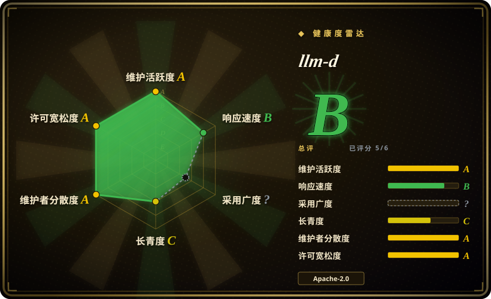
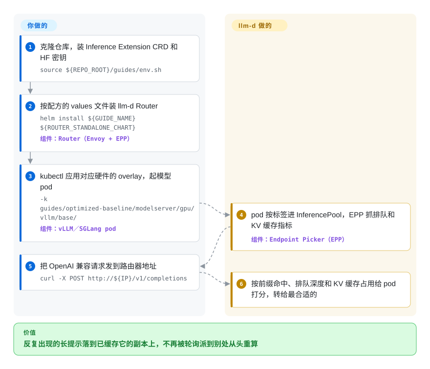

# llm-d

你在 Kubernetes 上跑了十几个 vLLM 副本，前面挂一个普通 Service 轮询分流：同一段两万字的对话历史，这一轮被派到从没见过它的副本，只能从头把整段提示再算一遍，而隔壁副本手里明明缓存着。llm-d 在这些副本前面加一个懂大模型的路由器，把每个请求派给已经缓存了这段开头、排队又最短的那台；更重的招数（预填充和解码拆到不同机器、缓存溢出到内存、按排队长度自动扩缩）则做成测过的 Helm／kustomize 配方。

## 何时使用

你是公司推理平台团队的人：在 Kubernetes 上给内部提供“模型即服务”，8 到上百个加速卡 pod 跑着 vLLM（或 SGLang），流量主要是多轮对话和 agent 循环，每次都重发很长的公共前缀。监控上症状很具体：某个副本的首 token 延迟（TTFT）p99 到了好几秒，旁边的副本却闲着；有的 pod `vllm:kv_cache_usage_perc` 顶在 100% 附近，有的很低；而 Kubernetes 的 `Service` 看不出区别，因为它按 TCP 连接分流，不看提示内容。手上还压着一个 DeepSeek 级别的 MoE 模型要上线，没人想照着论文手调预填充／解码拆分和专家并行。

这时你会想到 llm-d：模型服务器（首选 vLLM，也支持 SGLang 和 TensorRT-LLM 的 `trtllm-serve`）和 Kubernetes 都不换，只在上面补缺的那一层——llm-d Router（接在 Gateway API Inference Extension 网关上的 Endpoint Picker），按前缀缓存命中、排队深度和 KV 缓存占用给 pod 打分；再加上一套跑过基准的“well-lit path”配方，覆盖拆分部署、分层 KV 缓存和自动扩缩。和 NVIDIA Dynamo 比，决定性的取舍是标准与硬件广度：llm-d 组合的是上游 Kubernetes API（InferencePool、Gateway API），并维护 AMD、Intel、Google TPU 和几家 NPU 的部署指南；Dynamo 是 NVIDIA 主导的一体化框架，自带前端和路由。和直接部署 [vLLM](vllm.zh.md) 比，只有当副本多到“请求落在哪台”开始影响性能时，它才划算。

## 怎么用起来

llm-d 自己不跑模型，它是那些引擎外面的调度员加配方手册。你的模型服务器 pod 被归进一个 `InferencePool`（可以理解为“知道自己在服务大模型的 Kubernetes Service”）；前面是 llm-d Router，由一个 Envoy 代理和一个 Endpoint Picker（EPP）组成——EPP 是个调度器，代理每收到一个请求都会问它“这个该给哪个 pod？”。EPP 持续抓取每个 pod 的排队长度和 KV 缓存占用（KV 缓存是显存里存着的、某段提示已经算好的注意力中间结果，正是它让重复的前缀变便宜），据此打分——像餐厅领位员，把回头客领到他们那道菜已经做了一半的那张桌，而不是随便找张空桌。更重的优化都是可选配方：把一次请求的提示处理（预填充）和逐字生成（解码）拆到不同 pod，中间通过 RDMA 搬运 KV 缓存；把缓存溢出到 CPU 内存或磁盘；让 KEDA 按 EPP 暴露的排队指标扩缩副本。留给你的：Kubernetes 集群、加速卡和驱动、Gateway API／Inference Extension 的 CRD、判断哪条配方适合你的流量，以及——做拆分部署和大规模专家并行时——一张在 pod 内可见的高速 RDMA 网络。主仓库大部分是这些指南、Helm values 和 kustomize overlay；路由器本体在 `llm-d/llm-d-router`（Go）。另有一条不用 Kubernetes 的路径（EPP + Envoy + vLLM，用一个 YAML 端点文件），但文档写明只针对 NVIDIA 上的 vLLM。

<!-- flow-steps:begin (generated from flows/llm-d.json by tools/flow_card.py — do not edit) -->

流程文字版

1. **你**：克隆仓库，装 Inference Extension CRD 和 HF 密钥 — `source ${REPO_ROOT}/guides/env.sh`
2. **你**：按配方的 values 文件装 llm-d Router — `helm install ${GUIDE_NAME} ${ROUTER_STANDALONE_CHART}` — 组件：`Router（Envoy + EPP）`
3. **你**：kubectl 应用对应硬件的 overlay，起模型 pod — `-k guides/optimized-baseline/modelserver/gpu/vllm/base/` — 组件：`vLLM／SGLang pod`
4. **llm-d**：pod 按标签进 InferencePool，EPP 抓排队和 KV 缓存指标 — 组件：`Endpoint Picker（EPP）`
5. **你**：把 OpenAI 兼容请求发到路由器地址 — `curl -X POST http://${IP}/v1/completions`
6. **llm-d**：按前缀命中、排队深度和 KV 缓存占用给 pod 打分，转给最合适的

**价值**：反复出现的长提示落到已缓存它的副本上，不再被轮询派到别处从头重算

<!-- flow-steps:end -->

## 何时不用

- **只有一到几个副本，或者没有 Kubernetes。** 直接跑 [vLLM](vllm.zh.md) 或 [SGLang](sglang.zh.md)；两个 pod 时路由怎么选几乎无所谓，llm-d 却要你多运维 Gateway API CRD、EPP、Envoy 和 Helm chart。无 Kubernetes 指南虽然有，但只支持 NVIDIA 上的 vLLM，也没有 Helm／kustomize。
- **全栈 NVIDIA、想要一个厂商整合好的方案。** NVIDIA Dynamo 自带前端、KV 感知路由、规划器和 NIXL 传输，可以不接外部网关；llm-d 的差异点（多厂商加速卡、上游 Kubernetes API）对你的价值不如一个有人兜底的整体产品。
- **要的是通用模型服务平台，不只是大模型。** 选 KServe（它可以把 llm-d 当大模型后端）或 [Ray Serve](ray-serve.zh.md)，用于预测式与生成式混合的集群、Python 组合或非大模型；llm-d 的范围是 OpenAI 兼容引擎上的大模型（以及新加的多模态／扩散）流量。
- **需要一份能锁定一年的稳定组件清单。** 光是 v0.10.0（2026-09-29）就把 `llm-d-kv-cache` 仓库并进了 `llm-d-router`，把自动扩缩仓库改名并废弃 WVA 指南，废弃了曾作为主打收益宣传的 `llm-d-latency-predictor`，还废弃了 `llm-d-cuda` 镜像、改用上游 `vllm/vllm-openai`。扛不住这种变动，就在 1.0 之前继续用上游 Gateway API Inference Extension 的 EPP 或纯 vLLM。
- **没有 RDMA 网络却想做预填充／解码拆分或大规模专家并行。** 这两条配方默认 pod 内能看到 InfiniBand／RoCE（GKE 上还要 DRA 驱动），P/D 指南自己就列了 NIXL connector 的已知限制。没有这张网，就停在 optimized-baseline 路由配方或单机引擎上，别去追宣传里的吞吐数字。
- **GPU 驱动旧且升不了。** 当前镜像基于 CUDA 12.9.1（驱动 < 580），项目已宣布将迁到 CUDA 13.0.2（驱动 ≥ 580.65.06）；驱动版本冻结的集群应 pin 住某个版本，或自己构建镜像。

## 横向对比

| 替代品 | 是否收录 | 我们的评价 | 取舍 |
|---|---|---|---|
| [vLLM](vllm.zh.md) | ✅ | 一到几个副本时单跑 vLLM；等 Kubernetes 集群大到按前缀缓存派单和 P/D 拆分能抵掉多出的控制面，再在前面加 llm-d。 | vLLM 就是 llm-d 主要路由的引擎，两者是叠加而非竞争；裸跑省掉 Gateway／EPP／Helm 运维，但提示落在哪台交给了 TCP 负载均衡。 |
| [Ray Serve](ray-serve.zh.md) | ✅ | 要用 Python 组合多种模型的流水线，选 Ray Serve；任务是 Kubernetes 上的大模型流量、想要带 KV 缓存感知的 Gateway API 路由，选 llm-d。 | Ray Serve 历史长、通用，但要运维 Ray 集群、路由模型自成一套；llm-d 更窄更年轻，但接进的是标准 Kubernetes 网络。 |
| NVIDIA Dynamo（ai-dynamo/dynamo） | 未收录 | 纯 NVIDIA 集群、想要一个厂商背书、自带路由和规划器的整体框架，选 Dynamo；要多厂商加速卡、上游 Kubernetes API 和 CNCF 治理，选 llm-d。 | Dynamo 更一体化（Rust 前端、规划器、NIXL、可不接网关）但由 NVIDIA 主导；llm-d 由 Red Hat／Google／IBM／CoreWeave／NVIDIA 共建，但要你自己拼的更多。本批次未收录。 |
| KServe（kserve/kserve） | 未收录 | 需要一个平台同时服务预测式和生成式模型、用标准 CRD 管理时，选 KServe，让它在大模型部分调用 llm-d；只有大模型负载、想直接用 llm-d 配方而不要 KServe 控制面时，直接上 llm-d。 | KServe 多一层更宽、更老的 CRD 体系并支持多框架；直接用 llm-d 更薄，但只管大模型。本批次未收录。 |
| AIBrix（vllm-project/aibrix） | 未收录 | 想要 vLLM 项目旗下、擅长高密度 LoRA 管理、自带网关和扩缩器的控制面，可评估 AIBrix；更看重多引擎支持、Gateway API 一致性和 CNCF 多厂商治理，选 llm-d。 | AIBrix 源自字节跳动、以 vLLM 为中心，LoRA 密度是强项；llm-d 发起方更多、硬件指南更全，但配方矩阵更重。本批次未收录。 |

## 技术栈

- **路由器（核心组件，独立仓库 `llm-d/llm-d-router`）：** Go 写的 Endpoint Picker，通过 Envoy `ext-proc` 协议工作，符合 Kubernetes Gateway API Inference Extension（v0.10.0 用 GAIE CRD v1.5.0）；打分器可插拔（`prefix-cache-scorer`、`queue-scorer`、`kv-cache-utilization-scorer` 等）。
- **本仓库：** 每条 well-lit path 的指南、Helm values 与 kustomize overlay，非 CUDA 镜像（ROCm、XPU、CPU、SGLang-XPU）的构建文件，基准工具和文档（GitHub 语言统计为 Python 240 KB、Shell 198 KB）。
- **模型服务器：** vLLM（默认；v0.10.0 用上游 `vllm/vllm-openai` v0.30.0）、SGLang、TensorRT-LLM `trtllm-serve`；KV 传输走 NIXL（UCX）或 Mooncake。
- **其他组件：** KV 缓存索引／卸载、P/D 路由 sidecar、异步处理器和 OpenAI 兼容的批处理网关（Go），基于 EPP 指标的 KEDA 自动扩缩，多节点用 LeaderWorkerSet，免 GPU 的模拟器 `llm-d-inference-sim`，以及 `llm-d-benchmark`。

## 依赖

- **Kubernetes**，装好 Gateway API CRD 和 Gateway API Inference Extension CRD；再加一个网关（Istio、AgentGateway、Envoy Gateway），或用路由器自带 Envoy 的独立模式。
- **加速卡与驱动：** 默认 NVIDIA GPU（镜像基于 CUDA 12.9.1，目前要求驱动 < 580；已宣布迁到 CUDA 13、驱动 ≥ 580.65.06）；AMD ROCm、Google TPU（GKE）、Intel XPU、x86 CPU、天数智芯、沐曦和 Rebellions NPU 都有维护中的指南，各有具名的厂商维护者。
- **模型权重：** quickstart 里把 Hugging Face token 存成 Kubernetes secret（`llm-d-hf-token`）。
- **进阶配方：** P/D 和大规模专家并行需要 pod 内可见的 RDMA（InfiniBand／RoCE），GKE 上需 DRA 驱动，另需 LeaderWorkerSet；自动扩缩需 KEDA + Prometheus。
- **客户端工具：** `kubectl`、`helm`，以及本仓库的一份克隆（指南从本地检出目录里 apply）。

## 运维难度

**高。** 连 quickstart 都假设你已有带 GPU 的 Kubernetes 集群：装 CRD、为路由器装一个 Helm release、再 apply 一个会起 8 个 `Qwen/Qwen3-32B` 副本的 kustomize overlay；之后你要长期管 Gateway API 资源、EPP 打分配置、模型服务器镜像和驱动兼容。进阶配方再叠上 RDMA 网络、多节点 LeaderWorkerSet 和 KV 传输 connector，这些都有文档记载的故障模式（NIXL 的 TP 比例限制、预填充 pod 重启后 agent 缓存过期）。版本之间组件变动频繁（仓库迁移、废弃、镜像来源更换），每次升级都得读 release notes。项目用多家云上的 nightly CI、免 GPU 模拟器和公开基准来缓解，但它是给平台团队的工具，不是即插即用。

## 健康度与可持续性

- **维护（2026-09-30）：** 非常活跃——每天都有推送，从 v0.3.1（2025-11-06）到 v0.10.0（2026-09-29）共十个版本，大约每 1–2 个月一版；已关闭 issue 510 个，未关闭 63 个。issue 分诊比提交节奏慢：健康度评分器在最近 30 个 issue 上测得首次回复中位数约 147 小时（约 6 天）——很多讨论发生在 Slack 和 SIG 会议里。
- **治理／巴士因子：** 2026-03 起为 CNCF Sandbox 项目；由 Red Hat、Google Cloud、IBM Research、CoreWeave、NVIDIA 共同发起；项目维护者为 Carlos Costa、Clayton Coleman、Robert Shaw；有 OWNERS 文件、SIG、惰性共识和 DCO 签署；核心组件要求维护者来自不止一个组织。贡献分散在很多人身上（主仓库贡献最多的人约 125 次）。
- **年龄／林迪：** 年轻——仓库创建于 2025-04-29（约 17 个月），尚未 1.0。存续的先验来自多厂商背书和 CNCF 归属，而不是年龄。
- **采用度：** 约 4.7k star、808 fork；`ADOPTERS.md` 列出 Tesla、Cohere、JetBrains、Snowflake Cortex、DigitalOcean、Capital One、Prime Intellect 等用户（自行提交，未独立核实）。
- **风险信号：** Apache-2.0，无改许可证历史，没看到开源核心式的功能门槛；真正的风险是架构变动——组件在 minor 版本之间被提升、合并、废弃，README 里的性能宣传可能比背后的组件活得还久（v0.10.0 已废弃延迟预测器，README 仍在宣传它的收益）。

## 存疑（未验证）

- [未验证] README 里的主打性能数字（前缀感知路由 3 倍吞吐／2 倍 TTFT、P/D 拆分最多多 70% tokens/s、16×16 B200 上大规模专家并行 5 万 tok/s）来自厂商和合作方博客；本次没有集群可复现。
- [未验证] `ADOPTERS.md` 的用户名单由各公司自行提 PR 添加；各家生产使用的深度未核实。
- [推断] 与 Dynamo 的对比依据的是 2026-09-30 读到的 Dynamo README（Rust／Python、自带前端和路由、可选 GAIE EPP 插件、支持 SGLang／TensorRT-LLM／vLLM 后端），并非上手评测；“NVIDIA 主导”依据是 `ai-dynamo` 组织及其托管在 docs.nvidia.com 的文档。
- [推断] 对 AIBrix 的描述（源自字节跳动、LoRA 密度是强项）来自它的 README 和 KubeCon 演讲标题，并未实际部署。
- [推断] `language: Go / Python` 反映的是核心路由器（Go，`llm-d/llm-d-router`）与本仓库（Python／Shell 工具）的分工；GitHub 把本仓库标为 Python。
- [未验证] 雷达的采用度一轴是 `?`：llm-d 发布的是 Helm chart 和容器镜像，不是包管理器里的包，评分器拿不到依赖数／下载量信号；上文的 star 数和用户名单是仅有的采用度证据。
- [推断] “很多讨论发生在 Slack 和 SIG 会议里”依据的是 PROJECT.md 写明活跃问题优先在 Slack 讨论；Slack 里的实际消息量没有测。
- [未验证] 无 Kubernetes 部署能否与 Kubernetes 上的 optimized baseline 对齐——它自己的文档提到“parity caveats”，本次未测试。
