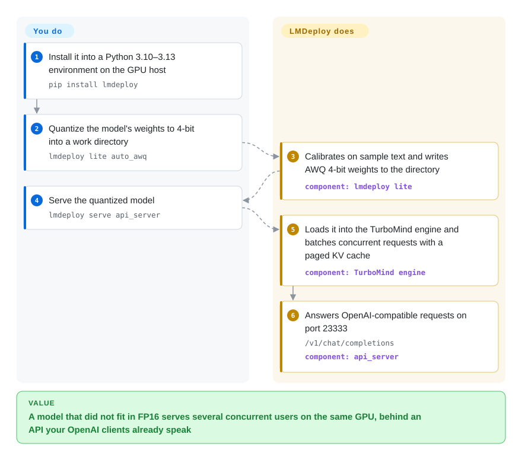

# LMDeploy

You want to serve a 7B–70B open model on the GPUs you actually have — V100s, T4s, consumer RTX cards, or a Huawei Ascend box — but at full precision it either doesn't fit or crawls, and the usual answer is one tool to shrink the weights and another to serve them. LMDeploy does both from one CLI: it compresses the model to 4-bit weights (or squeezes the attention cache), then serves it with its own C++/CUDA engine behind an OpenAI-compatible API.

## When to use

You're the engineer standing up an internal LLM endpoint with a fixed hardware budget. The model is `internlm2_5-7b-chat`, a Qwen or InternVL vision-language model, or a DeepSeek MoE, and the box is what procurement gave you: older NVIDIA cards, a mix of consumer GPUs, or domestic accelerators (Ascend, Cambricon, MetaX). In FP16 the weights alone eat most of the card, so the attention cache has no room and you can serve only a handful of concurrent users.

LMDeploy is built for that squeeze. `lmdeploy lite auto_awq` quantizes the weights to 4-bit (AWQ), the KV cache can be quantized to int8/int4 online, and `lmdeploy serve api_server ./internlm2_5-7b-chat-4bit --backend turbomind --model-format awq` serves the result as `/v1/chat/completions` on port 23333, so any OpenAI client works unchanged. Pick it over [vLLM](vllm.md) when quantize-then-serve in one toolkit, first-class InternLM/InternVL support, or non-NVIDIA accelerators through its PyTorch engine decide the job; pick vLLM when model coverage, community size and day-0 support for new architectures matter more.

## How it works

LMDeploy ships two inference engines. **TurboMind** is a C++/CUDA engine (descended from NVIDIA's FasterTransformer) tuned for speed on NVIDIA GPUs; the **PyTorch engine** is pure Python, easier to extend, and is the path to Ascend, Cambricon and MetaX hardware. Both use *persistent batching* — new requests join the running batch at every generation step instead of waiting for the whole batch to finish, like a bus that picks up passengers at each stop — and a *blocked KV cache*, which stores the model's memory of earlier tokens in fixed-size pages so many conversations share GPU memory without fragmentation. The `lmdeploy lite` commands do the compression: AWQ calibrates on sample text and writes new 4-bit weights to a directory you then serve. `lmdeploy serve api_server` wraps an engine in an OpenAI-compatible HTTP server, `lmdeploy serve proxy` spreads traffic across several such servers, and `lmdeploy.pipeline()` runs offline batch jobs in Python. What LMDeploy does for you: quantization, batching, cache management, tensor parallelism across GPUs, the API. What you do: pick the engine and model format, choose the quantization and memory settings (`--tp`, `--cache-max-entry-count`), and run it behind your own load balancer or Kubernetes — there is no autoscaler.

<!-- flow-steps:begin (generated from flows/lmdeploy.json by tools/flow_card.py — do not edit) -->

Text version of the flow

1. **You**: Install it into a Python 3.10–3.13 environment on the GPU host — `pip install lmdeploy`
2. **You**: Quantize the model's weights to 4-bit into a work directory — `lmdeploy lite auto_awq`
3. **LMDeploy**: Calibrates on sample text and writes AWQ 4-bit weights to the directory — component: `lmdeploy lite`
4. **You**: Serve the quantized model — `lmdeploy serve api_server`
5. **LMDeploy**: Loads it into the TurboMind engine and batches concurrent requests with a paged KV cache — component: `TurboMind engine`
6. **LMDeploy**: Answers OpenAI-compatible requests on port 23333 — `/v1/chat/completions` — component: `api_server`

**Value**: A model that did not fit in FP16 serves several concurrent users on the same GPU, behind an API your OpenAI clients already speak

<!-- flow-steps:end -->

## When NOT to use

- **You want the widest model coverage, the largest community and day-0 support for new architectures.** Use [vLLM](vllm.md); for prefix-heavy agent traffic and structured output, [SGLang](sglang.md).
- **You want every last token per second on NVIDIA hardware and accept vendor lock-in.** Use [TensorRT-LLM](tensorrt-llm.md).
- **You serve one user on a laptop, a Mac, or a CPU.** LMDeploy targets server GPUs and lists no Apple Silicon support; use [llama.cpp](../local-runtimes/llama-cpp.md) or [Ollama](../local-runtimes/ollama.md).
- **You need a stable API surface across upgrades.** It is still 0.x with a minor release every few weeks, and minors carry refactors (v0.18.0 migrated TurboMind to C++20 and removed the legacy OpenAI API client). Pin exact versions and re-test each upgrade, or choose vLLM.
- **You can't absorb install friction.** In early 2026 PyPI wheel uploads stalled on a storage quota until v0.12.3 (2026-04); building from source needs CUDA 12+, CMake ≥3.25.2 and a C++20 compiler. Prefer the official `openmmlab/lmdeploy` Docker image if pip fails you.
- **A Kubernetes fleet needs cache-aware routing and autoscaling across many replicas.** LMDeploy's `proxy` server balances requests but is not a fleet router; look at [llm-d](llm-d.md) (built for vLLM/SGLang) or [Ray Serve](ray-serve.md).

## Comparison

| Alternative | In index | Our verdict | Tradeoff |
|---|---|---|---|
| [vLLM](vllm.md) | ✅ | Choose vLLM as the default open-source serving engine when model coverage and ecosystem matter most; choose LMDeploy when built-in AWQ/KV quantization, InternLM/InternVL focus or non-NVIDIA accelerators decide it. | vLLM has the larger community and faster new-model support; LMDeploy bundles compression with serving and covers Ascend/Cambricon/MetaX. |
| [SGLang](sglang.md) | ✅ | Choose SGLang for agent workloads with heavy shared prefixes and constrained JSON output; choose LMDeploy when the binding constraint is fitting a quantized model onto limited GPUs. | SGLang's prefix caching and structured generation lead for agents; LMDeploy leads on its integrated quantization path. |
| [TensorRT-LLM](tensorrt-llm.md) | ✅ | Choose TensorRT-LLM for peak NVIDIA throughput when you can afford engine builds and lock-in; choose LMDeploy for an all-Python install with no compile step and hardware beyond NVIDIA. | TensorRT-LLM squeezes more from NVIDIA GPUs; LMDeploy is simpler to deploy and less locked in. |
| [llama.cpp](../local-runtimes/llama-cpp.md) | ✅ | Choose llama.cpp for CPU, Apple Silicon or single-user local inference with GGUF files; choose LMDeploy for multi-user serving on server GPUs. | llama.cpp runs almost anywhere; LMDeploy is built for concurrent GPU serving. |
| [BentoML](bentoml.md) | ✅ | Choose BentoML when the LLM is one piece of a larger Python service that needs packaging; choose LMDeploy when the LLM endpoint itself is the job. BentoML can wrap LMDeploy via the BentoLMDeploy example. | BentoML adds packaging and pipelines around an engine; LMDeploy is the engine. |

## Tech stack

- **Languages:** Python front end and PyTorch engine; C++20/CUDA TurboMind engine (with TileLang and Triton kernels on Linux x86).
- **Hardware:** NVIDIA GPUs from Volta (V100) through Ada, plus Hopper and RTX 50 series per the README and release notes; AMD ROCm; Huawei Ascend, Cambricon and MetaX via the PyTorch engine.
- **Platforms:** Linux and Windows; Python 3.10–3.13 recommended.
- **Serving:** OpenAI-compatible `api_server`, a `proxy` server for multi-model/multi-machine routing, Prometheus metrics; prefill/decode disaggregation via DLSlime and Mooncake for DeepSeek-class models.

## Dependencies

- **Runtime:** PyTorch (≤2.12.1), Triton, and the CUDA-12.8-built wheel from PyPI for NVIDIA; device-specific requirement sets for ROCm, Ascend, Cambricon and MetaX.
- **Model source:** Hugging Face by default; ModelScope or openMind Hub via environment variables.
- **Optional:** Docker with the NVIDIA runtime for the official image; a calibration dataset download for AWQ quantization.

## Ops difficulty

**Medium.** A single `lmdeploy serve api_server` on one GPU host is quick, but production means sizing KV-cache memory and tensor parallelism per model, re-testing after each 0.x upgrade, and supplying your own load balancing, autoscaling and monitoring. Non-NVIDIA hardware adds driver and vendor-SDK work on top.

## Health & viability

- **Maintenance — very active (2026-10-08).** Minor releases every few weeks (v0.14.0 2026-06-24 through v0.18.0 2026-09-28), steady model additions, and a TurboMind paper accepted at EuroSys 2027.
- **Responsiveness — good.** The median first response to recent issues is about 21.7 hours.
- **Governance / backing — institutional team.** 50 active maintainers in the last 12 months, the top contributor at about 22%; it lives in the InternLM organization and was built by the MMRazor and MMDeploy teams, so the roadmap follows that lab's model work.
- **Age / Lindy — moderate prior, still active.** The repository dates from 2023-06 (about 3.3 years) and is still shipping, a reasonable but not long Lindy record.
- **Adoption — modest.** About 8.1k stars, 23,478 PyPI downloads last month and 2 dependent repos; Docker and release-asset downloads add more, but it is far behind vLLM.
- **Risk flags.** Apache-2.0 with no relicense; pre-1.0 API churn; the 2026 PyPI quota episode shows distribution fragility.

## Caveats (unverified)

- [推断] The organisational link from InternLM to Shanghai AI Laboratory is common knowledge but was not confirmed from a repository file in this pass.
- [未验证] Throughput claims in the README (up to 1.8x vLLM request throughput, 4-bit 2.4x faster than FP16) are the project's own benchmarks and were not reproduced.
- [推断] The FP16-vs-4-bit memory picture in "When to use" is arithmetic from parameter counts, not a measurement.
- [未验证] Hopper and RTX 50 support is taken from the README news and release notes; the installation page's GPU list still stops at Ada.
- [未验证] The category index's claim that part of the docs are Chinese-only was not confirmed: the repo ships both `docs/en` and `docs/zh_cn`.
