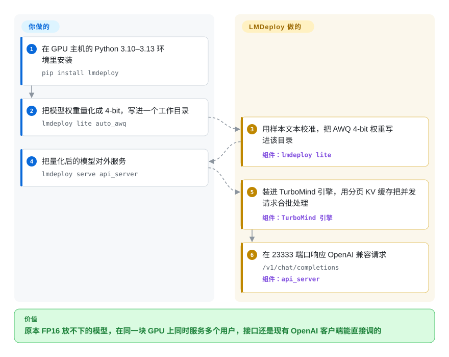

# LMDeploy

你想在手头真有的显卡上——V100、T4、消费级 RTX，或者一台华为昇腾服务器——跑一个 7B 到 70B 的开源模型，可按全精度要么放不下，要么慢得没法用；常见做法是一个工具负责把权重压小，另一个工具负责对外服务。LMDeploy 用一个命令行把两件事都做了：先把模型压成 4-bit 权重（或者压缩注意力缓存），再用自家的 C++/CUDA 引擎在 OpenAI 兼容接口后面提供服务。

## 何时使用

你是负责在固定硬件预算下搭内部大模型接口的工程师。模型是 `internlm2_5-7b-chat`、一个 Qwen 或 InternVL 视觉语言模型，或者一个 DeepSeek MoE；机器是采购给你的那些：老一代 NVIDIA 卡、混搭的消费级显卡，或者国产加速卡（昇腾、寒武纪、沐曦）。用 FP16 时光权重就吃掉了大半张卡，注意力缓存没地方放，只能同时服务寥寥几个用户。

LMDeploy 就是为这种紧巴巴的情况做的。`lmdeploy lite auto_awq` 把权重量化到 4-bit（AWQ），KV 缓存可以在线量化到 int8/int4，`lmdeploy serve api_server ./internlm2_5-7b-chat-4bit --backend turbomind --model-format awq` 把结果以 `/v1/chat/completions` 的形式开在 23333 端口上，任何 OpenAI 客户端都能原样调用。当“先量化再服务一个工具包搞定”、对 InternLM/InternVL 的一等支持，或者通过 PyTorch 引擎跑非 NVIDIA 加速卡是决定因素时，选它而不是 [vLLM](vllm.zh.md)；当模型覆盖面、社区规模和新架构首发即支持更重要时，选 vLLM。

## 怎么用起来

LMDeploy 带两个推理引擎。**TurboMind** 是 C++/CUDA 引擎（脱胎于 NVIDIA 的 FasterTransformer），针对 NVIDIA GPU 的速度调优；**PyTorch 引擎**是纯 Python，更容易扩展，也是通往昇腾、寒武纪、沐曦硬件的路径。两者都用“持续批处理”——新请求在每一步生成时就加入正在跑的批次，而不是等整批跑完，像公交车每站都上客——以及“分块 KV 缓存”，即把模型对前文的记忆按固定大小的页来存，让很多对话共享显存而不产生碎片。`lmdeploy lite` 系列命令负责压缩：AWQ 先用一段样本文本做校准，再把新的 4-bit 权重写进一个目录，之后你直接服务这个目录。`lmdeploy serve api_server` 把引擎包成 OpenAI 兼容的 HTTP 服务，`lmdeploy serve proxy` 把流量分到多个这样的服务上，`lmdeploy.pipeline()` 则在 Python 里跑离线批量任务。LMDeploy 替你做的：量化、批处理、缓存管理、多卡张量并行、对外接口。你要做的：选引擎和模型格式，定量化方式和显存参数（`--tp`、`--cache-max-entry-count`），并把它放在你自己的负载均衡或 Kubernetes 后面——它没有自动扩缩容。

<!-- flow-steps:begin (generated from flows/lmdeploy.json by tools/flow_card.py — do not edit) -->

流程文字版

1. **你**：在 GPU 主机的 Python 3.10–3.13 环境里安装 — `pip install lmdeploy`
2. **你**：把模型权重量化成 4-bit，写进一个工作目录 — `lmdeploy lite auto_awq`
3. **LMDeploy**：用样本文本校准，把 AWQ 4-bit 权重写进该目录 — 组件：`lmdeploy lite`
4. **你**：把量化后的模型对外服务 — `lmdeploy serve api_server`
5. **LMDeploy**：装进 TurboMind 引擎，用分页 KV 缓存把并发请求合批处理 — 组件：`TurboMind 引擎`
6. **LMDeploy**：在 23333 端口响应 OpenAI 兼容请求 — `/v1/chat/completions` — 组件：`api_server`

**价值**：原本 FP16 放不下的模型，在同一块 GPU 上同时服务多个用户，接口还是现有 OpenAI 客户端能直接调的

<!-- flow-steps:end -->

## 何时不用

- **你要最广的模型覆盖、最大的社区、新架构发布当天就能用。** 用 [vLLM](vllm.zh.md)；如果是前缀大量重复的 agent 流量和结构化输出，用 [SGLang](sglang.zh.md)。
- **你要在 NVIDIA 硬件上榨出最后一点每秒 token 数，并接受厂商锁定。** 用 [TensorRT-LLM](tensorrt-llm.zh.md)。
- **你只在笔记本、Mac 或 CPU 上给一个人用。** LMDeploy 面向服务器 GPU，没有列出对 Apple Silicon 的支持；用 [llama.cpp](../local-runtimes/llama-cpp.zh.md) 或 [Ollama](../local-runtimes/ollama.zh.md)。
- **你需要跨升级稳定的 API。** 它仍是 0.x，每隔几周发一个小版本，小版本里就带重构（v0.18.0 把 TurboMind 迁到 C++20，并删除了旧的 OpenAI API 客户端）。锁定精确版本、每次升级都重新测试，或者选 vLLM。
- **你扛不住安装上的折腾。** 2026 年初 PyPI 上传因存储配额停了一阵，直到 2026-04 的 v0.12.3 才恢复；从源码构建需要 CUDA 12+、CMake ≥3.25.2 和支持 C++20 的编译器。pip 装不上时，优先用官方 `openmmlab/lmdeploy` Docker 镜像。
- **一个 Kubernetes 集群需要在大量副本间按缓存路由并自动扩缩容。** LMDeploy 的 `proxy` 服务能分流请求，但不是集群级路由器；去看 [llm-d](llm-d.zh.md)（为 vLLM/SGLang 构建）或 [Ray Serve](ray-serve.zh.md)。

## 横向对比

| 替代品 | 是否收录 | 我们的评价 | 取舍 |
|---|---|---|---|
| [vLLM](vllm.zh.md) | ✅ | 模型覆盖和生态最重要时，把 vLLM 当默认的开源推理服务引擎；内置 AWQ/KV 量化、侧重 InternLM/InternVL 或要用非 NVIDIA 加速卡时，选 LMDeploy。 | vLLM 社区更大、新模型支持更快；LMDeploy 把压缩和服务打包在一起，并覆盖昇腾、寒武纪、沐曦。 |
| [SGLang](sglang.zh.md) | ✅ | agent 负载里共享前缀多、要约束 JSON 输出，选 SGLang；卡脖子的约束是把量化模型塞进有限的 GPU，选 LMDeploy。 | SGLang 的前缀缓存和结构化生成更适合 agent；LMDeploy 胜在一体化的量化路径。 |
| [TensorRT-LLM](tensorrt-llm.zh.md) | ✅ | 能承担引擎构建和锁定、要 NVIDIA 上的峰值吞吐，选 TensorRT-LLM；要纯 Python 安装、无编译步骤、硬件不止 NVIDIA，选 LMDeploy。 | TensorRT-LLM 从 NVIDIA GPU 上榨得更多；LMDeploy 部署更简单、锁定更少。 |
| [llama.cpp](../local-runtimes/llama-cpp.zh.md) | ✅ | 在 CPU、Apple Silicon 上或单人本地用 GGUF 文件推理，选 llama.cpp；在服务器 GPU 上做多用户服务，选 LMDeploy。 | llama.cpp 几乎哪儿都能跑；LMDeploy 为并发 GPU 服务而生。 |
| [BentoML](bentoml.zh.md) | ✅ | 大模型只是一个更大的、需要打包的 Python 服务中的一环，选 BentoML；大模型接口本身就是全部任务，选 LMDeploy。BentoML 可以通过 BentoLMDeploy 示例把 LMDeploy 包进去。 | BentoML 在引擎外面加了打包和流水线；LMDeploy 就是引擎本身。 |

## 技术栈

- **语言：** Python 前端和 PyTorch 引擎；C++20/CUDA 的 TurboMind 引擎（在 Linux x86 上还用 TileLang 和 Triton 内核）。
- **硬件：** NVIDIA 从 Volta（V100）到 Ada，README 和发布说明还提到 Hopper 与 RTX 50 系列；AMD ROCm；昇腾、寒武纪、沐曦通过 PyTorch 引擎支持。
- **平台：** Linux 和 Windows；推荐 Python 3.10–3.13。
- **服务：** OpenAI 兼容的 `api_server`，用于多模型/多机路由的 `proxy` 服务，Prometheus 指标；针对 DeepSeek 一类模型，可通过 DLSlime 和 Mooncake 做预填充/解码分离部署。

## 依赖

- **运行时：** PyTorch（≤2.12.1）、Triton，NVIDIA 上用 PyPI 上基于 CUDA 12.8 构建的 wheel；ROCm、昇腾、寒武纪、沐曦各有一套对应的依赖清单。
- **模型来源：** 默认 Hugging Face；通过环境变量可切到 ModelScope 或 openMind Hub。
- **可选：** 用官方镜像需要带 NVIDIA 运行时的 Docker；AWQ 量化要下载一份校准数据集。

## 运维难度

**中等。** 在一台 GPU 主机上起一个 `lmdeploy serve api_server` 很快，但生产环境意味着要按模型调 KV 缓存显存和张量并行，每次 0.x 升级后重新测试，并自己补上负载均衡、自动扩缩容和监控。非 NVIDIA 硬件还要额外处理驱动和厂商 SDK。

## 健康度与可持续性

- **维护——非常活跃（2026-10-08）。** 每隔几周发一个小版本（2026-06-24 的 v0.14.0 到 2026-09-28 的 v0.18.0），模型支持稳步增加，TurboMind 论文被 EuroSys 2027 接收。
- **响应速度——好。** 近期 issue 的首次响应中位数约 21.7 小时。
- **治理 / 背书——机构团队。** 过去 12 个月有 50 位活跃维护者，第一贡献者约占 22%；项目在 InternLM 组织下，由 MMRazor 和 MMDeploy 团队开发，路线图跟着这个实验室的模型工作走。
- **年龄 / Lindy——先验中等，仍活跃。** 仓库建于 2023-06（约 3.3 年），仍在持续发布，Lindy 记录尚可但不算长。
- **采用——一般。** 约 8.1k stars，上月 PyPI 下载量 23,478 次，依赖仓库 2 个；Docker 和发布附件下载还能再加一些，但远落后于 vLLM。
- **风险信号。** Apache-2.0，无改许可证历史；1.0 之前的 API 变动；2026 年的 PyPI 配额事件暴露了分发渠道的脆弱。

## 存疑（未验证）

- [推断] InternLM 组织与上海人工智能实验室的关系是常识，但本轮没有从仓库文件里核实。
- [未验证] README 里的吞吐说法（请求吞吐最高达 vLLM 的 1.8 倍、4-bit 比 FP16 快 2.4 倍）是项目自己的基准，没有复现。
- [推断] “何时使用”里 FP16 与 4-bit 的显存对比是按参数量算出来的，不是实测。
- [未验证] Hopper 和 RTX 50 的支持取自 README 新闻和发布说明；安装文档的 GPU 列表仍只写到 Ada。
- [未验证] 分类索引里“部分文档只有中文”的说法没有得到证实：仓库同时有 `docs/en` 和 `docs/zh_cn`。
