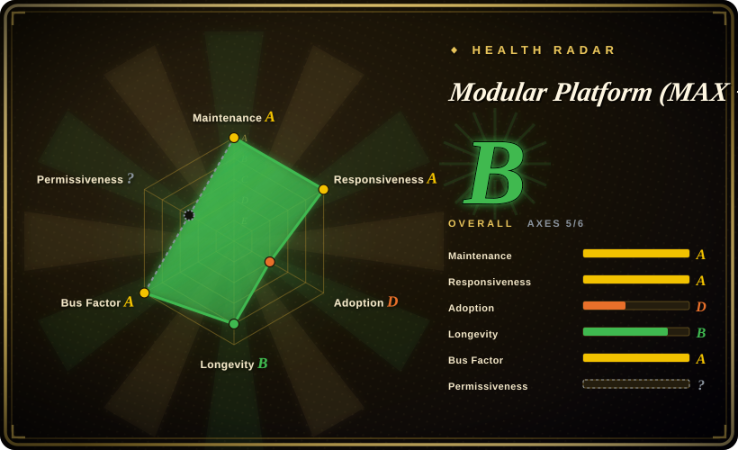
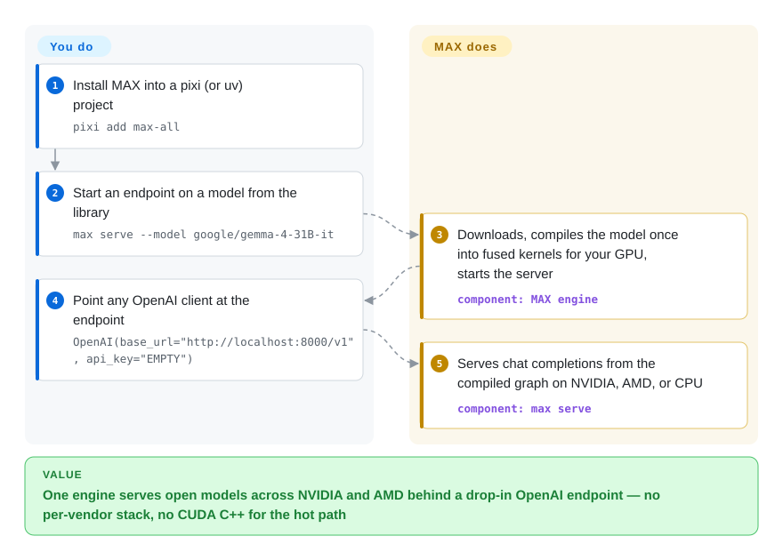

# Modular Platform (MAX + Mojo)

One serving stack per GPU vendor is the norm, and the hot path always ends in CUDA C++. Modular ships a vertically integrated alternative: **MAX**, a single engine that runs popular open models on NVIDIA, AMD, and CPU behind an OpenAI-compatible endpoint, plus **Mojo**, a Python-like systems language for writing the kernels underneath — 1.0 shipped in August 2026.

## When to use

You're an ML platform engineer who has to serve a handful of open-weight LLMs (Llama, Gemma, Qwen, …) at high throughput across a mixed fleet of NVIDIA and AMD GPUs, and you're tired of maintaining a different serving path and a different set of hand-tuned kernels per accelerator. You install MAX into a `pixi` or `uv` project (`pixi add max-all`), start an endpoint on a library model (`max serve --model google/gemma-4-31B-it`), and point any OpenAI client at `http://localhost:8000/v1` — one engine targeting NVIDIA, AMD, and CPU alike. The pitch is "industry-leading GPU and CPU performance without code changes," abstracting hardware differences so the same stack targets both vendors. [未验证：性能宣称来自 README，未经独立基准]

You also reach for this when you specifically want **Mojo** — you're writing custom AI kernels or operators and want a single language that reads like Python but compiles to systems-level performance, instead of dropping into CUDA C++ or Triton for the hot path. Mojo crossed 1.0 in August 2026 (MAX 26.5) and is at 1.1 (MAX 26.6, 2026-09-17, GitHub releases), so the language now makes a stability promise — but the promise is weeks old, not years. In that world, MAX is the serving runtime your Mojo kernels plug into. The decision to adopt is really a decision to bet on Modular's whole vertically-integrated stack (compiler + kernels + runtime + serving) rather than wire together best-of-breed pieces yourself.

## How it works

MAX sits between your HTTP requests and the accelerator. On `max serve`, it downloads a model from its library or Hugging Face, compiles the graph once into fused native kernels for your specific hardware (NVIDIA, AMD, or CPU), and starts an OpenAI-compatible server — the quickstart literally says it "will take some time to download the model, compile it, and start the server." At request time the engine runs that compiled graph, batching and memory-managing like a serving engine should, while you keep talking to it through the ordinary OpenAI client (`base_url` + `api_key="EMPTY"`). What the Mojo half changes is who writes the kernels: MAX's accelerator library and much of the repo (Mojo is the plurality language, ~48 MB vs Python ~34 MB by GitHub languages) are authored in Mojo, and you can add or swap kernels in the same language instead of CUDA C++. What stays yours: the GPU drivers, model licenses and HF tokens for gated weights, version pinning between the nightly and stable channels, and any load balancing or HA layer in front of the single server.

<!-- flow-steps:begin (generated from flows/modular.json by tools/flow_card.py — do not edit) -->

Text version of the flow

1. **You**: Install MAX into a pixi (or uv) project — `pixi add max-all`
2. **You**: Start an endpoint on a model from the library — `max serve --model google/gemma-4-31B-it`
3. **Modular Platform (MAX + Mojo)**: Downloads, compiles the model once into fused kernels for your GPU, starts the server — component: `MAX engine`
4. **You**: Point any OpenAI client at the endpoint — `OpenAI(base_url="http://localhost:8000/v1", api_key="EMPTY")`
5. **Modular Platform (MAX + Mojo)**: Serves chat completions from the compiled graph on NVIDIA, AMD, or CPU — component: `max serve`

**Value**: One engine serves open models across NVIDIA and AMD behind a drop-in OpenAI endpoint — no per-vendor stack, no CUDA C++ for the hot path

<!-- flow-steps:end -->

## When NOT to use

- **The MAX runtime itself is not Apache-2.0 — it's under a vendor EULA.** The repo's source is "Apache License v2.0 with LLVM Exceptions" (README, 2026-09), but the same README states "MAX usage and distribution are licensed under the [Modular Community License]" — a proprietary license (last modified 2025-04-12): per-device grants, redistribution limits, a free community tier that "Modular may at any time change," and Licenses/README.md still warns licenses differ per product and some pieces are free "for non-production use" only. If you need a serving stack whose *use* is unconditionally open-source, take [vLLM](vllm.md) or [TensorRT-LLM](tensorrt-llm.md) instead — their licenses cover use, not just source.
- **You don't want to lock into one funded startup's vertically-integrated platform.** This is MAX + Mojo + the Modular toolchain from a single company (Modular Inc.). The serving endpoint is OpenAI-compatible, but the kernel language, the engine, and the license terms above are all one vendor's — a deep, non-portable bet. This is the sharpest structural reason to hesitate.
- **You just need to serve LLMs on NVIDIA today.** Mature, widely-adopted serving stacks already exist: **vLLM** (PagedAttention, huge community), **TGI** (Hugging Face), and **TensorRT-LLM** (NVIDIA's own, hardest-tuned for NVIDIA). They have larger ecosystems, more battle-testing, and license terms that don't hinge on one company's discretion.
- **You want to write kernels in a proven language/toolchain.** For custom kernels, plain **PyTorch** (+ `torch.compile`), **Triton**, or CUDA are the established, hireable, well-documented paths. **Mojo just reached 1.0 in August 2026** — a real stability milestone, but the versioning history behind it is ~3 years, and contributions to the Mojo compiler are still not accepted (README, 2026-09): you can file stdlib PRs, but the compiler's direction is vendor-locked.
- **You need general request orchestration / multi-model routing.** Ray Serve and similar serving frameworks focus on scaling and composing arbitrary Python model services; MAX is the engine, not a general orchestration layer.
- **On-device / edge inference.** This is a server-class GPU/CPU serving stack (the quickstart recommends datacenter GPUs like B200/H200/H100 or MI355X/MI325X/MI300X; consumer systems and Macs work but with "fewer compatible models and slower performance"); for phones, browsers, or embedded targets see → on-device-ml.

## Comparison

| Alternative | In index | Our verdict | Tradeoff |
|---|---|---|---|
| [vLLM](vllm.md) | ✅ | When you need the de-facto open serving engine *under a license that covers use*, pick vLLM; pick MAX only when cross-vendor NVIDIA+AMD serving from one engine outweighs accepting the Modular Community License on the runtime. | PagedAttention engine, huge community and model coverage, plain Apache-2.0; NVIDIA-first tuning, no cross-vendor CPU/AMD story, no kernel language of its own. |
| [Text Generation Inference (TGI)](text-generation-inference.md) | ✅ | Pick TGI when Hugging Face ecosystem integration and a community-governed stack matter more than MAX's compiler; pick MAX when you need one engine across NVIDIA and AMD. | Hugging Face's production server, tight HF ecosystem integration; license history has wobbled (Apache→HFOIL→Apache), narrower than a full compiler+language platform. |
| [TensorRT-LLM](tensorrt-llm.md) | ✅ | Pick TensorRT-LLM for the hardest NVIDIA-only latency, Apache-covered; pick MAX when the same deployment must also run on AMD and CPU. | NVIDIA's own engine, top-tier latency on NVIDIA hardware; deeply NVIDIA-locked, heavier build/engine-compile workflow, no cross-vendor abstraction. |
| [Ray Serve](ray-serve.md) | ✅ | Pick Ray Serve when your problem is orchestrating many arbitrary Python services, not squeezing one engine; MAX is the engine layer, not the scheduler. | General Python model-serving/orchestration framework for scaling and composing services; not a hand-tuned single-model inference engine — different layer. |
| plain PyTorch (+ Triton) | 未收录 | Pick plain PyTorch when hiring pool and license purity outweigh a vertically-integrated engine — you assemble performance yourself, and nothing in your stack is under one vendor's EULA. | The default, maximally-portable, maximally-hireable stack for serving and custom kernels; you pay in assembly work what MAX pays in a proprietary runtime license. |
| [SGLang](sglang.md) | ✅ | Pick SGLang when structured generation and prefix caching on NVIDIA are the goal; pick MAX only if the same stack must target AMD too. | High-throughput serving engine with RadixAttention prefix caching and structured-generation optimizations; newer, smaller ecosystem than vLLM, NVIDIA-centric, not a compiler platform. |

## Tech stack

- **Mojo** — the repo's plurality language (~48 MB vs Python ~34 MB, C++ ~13 MB, MLIR ~1.9 MB per GitHub languages 2026-09): a Python-superset systems language used to author MAX's kernels/operators (`/max/kernels`), compiling through an MLIR/LLVM-based toolchain (see Caveats).
- **MAX** — the inference engine + serving runtime: `max serve` exposes an **OpenAI-compatible REST API** (`/max/python/max/serve` in the repo), with model pipelines as Python graphs (`/max/python/max/pipelines`).
- **Packaging/deploy surface** — installed via package managers: pixi channels (`conda.modular.com/max`, nightly variant) or uv/pip (`uv add "max[all]" --index https://whl.modular.com/nightly/simple/`); ships Kubernetes-compatible Docker containers (`modular/max-*`).
- **Targets** — NVIDIA and AMD GPUs plus CPU; the quickstart recommends datacenter cards (B200/H200/H100, MI355X/MI325X/MI300X) and notes Linux/WSL; `main` tracks nightly, stable releases land on versioned tags (`max/v26.6.0`, 2026-09-17) roughly every one to two months.

## Dependencies

- **Hardware** — the value case needs server-class accelerators (NVIDIA or AMD GPUs); the quickstart's flagship model (Gemma 4 31B) asks for >96 GiB of GPU RAM, and smaller library models have their own floors. CPU execution is supported but the performance story is GPU-centric.
- **Models & tokens** — open-weight models from the MAX model library or Hugging Face; gated weights need `export HF_TOKEN="hf_..."` and accepting the model's own license.
- **Runtime/install** — a pixi or uv project (or Docker) plus NVIDIA/AMD GPU drivers on the host; the default quickstart installs nightly builds and tells you to switch to the stable channel for production. [推断：驱动/运行时细节依据 GPU 容器部署模型，未逐项核对 manifest]
- **License terms (not a package, but a dependency)** — MAX usage and distribution are governed by the Modular Community License (proprietary, per-device), on top of the Apache-2.0+LLVM-exception source.
- **Toolchain (for Mojo/kernel work)** — the Modular toolchain (Mojo compiler, at 1.1.0 as of 2026-09); not a generic third-party compiler.

## Ops difficulty

**Medium.** The serving happy path is genuinely smooth: `pixi add max-all`, `max serve --model …`, point an OpenAI client at port 8000 — the Kubernetes-ready images make cluster deployment conventional. Difficulty rises with (1) GPU fleet management (drivers, NVIDIA vs AMD runtimes, scheduling, memory/throughput tuning), (2) tracking a fast-moving stack where the quickstart defaults to nightly and you must pin the stable channel for production, and (3) anything involving custom Mojo kernels, where you're operating a freshly-1.x language/toolchain whose compiler is closed to contributions. As with any inference engine, the operational weight is mostly the GPUs and the model lifecycle, not a datastore.

## Health & viability

- **Responsiveness**: Grade A — median first-response time 0.1 hours across 15 qualifying issues (scorer, 2026-09-28).
- **Maintenance (2026-09).** Very active — default branch pushed 2026-09-27; stable releases every one to two months (v26.1 Jan → v26.2 Mar → v26.3 May → v26.4 Jun → v26.5 Aug → v26.6 Sep, GitHub releases). Mojo's 1.0.0 cut landed in August 2026. Not archived.
- **Governance / bus factor (2026-09).** Single-vendor: the roadmap, the language (Mojo), the engine, and the runtime license are all controlled by **Modular Inc.**, a funded startup — **not** a foundation (no Apache/CNCF/LF governance). The scorer counts 235 distinct committers in 12 months with no single contributor above ~5.5% — but they are building one company's product, and the README explicitly does not accept compiler contributions. If Modular pivots, gets acquired, or reterms the Community License, downstream users carry that risk.
- **Age & Lindy (2026-09).** Created 2023-04 (~3.4 years) and still actively shipping ⇒ a **moderate** signal: real momentum, but **weak Lindy** — too young to be long-proven, and its long-term survival is unproven relative to incumbents like vLLM/TensorRT-LLM. Use age × still-active: active is good, young still means unproven. [推断]
- **License / relicense & open-core risk — key flag, now first-party.** The repo's `LICENSE` is Apache-2.0 with LLVM Exceptions, but the README (2026-09) states "MAX usage and distribution are licensed under the [Modular Community License]" — a proprietary EULA (page dated 2025-04-12) with per-device licensing and a free community tier Modular "may at any time change." In-repo `Licenses/README.md` adds that licenses differ per product and some pieces are free only "for non-production use." GitHub's detector reports NOASSERTION, so the health scorer cannot parse the axis. Treat "the platform is open source" as true *of the source*, not of the runtime: the licensing structure is verified; the exact per-component boundary is not (see Caveats).
- **Adoption (2026-09).** ~29.9k stars / ~3.2k forks (GitHub API, 2026-09-28, up from ~26.4k in June) and ~1,183 open issues indicate growing mindshare for a ~3-year-old project, with a published model library and container images; but star count is not production-adoption evidence — the health scorer's adoption axis is D (2064 downloads/month on the registered package, PyPI via scorer 2026-09-28), and incumbents still dominate real-world LLM serving. [未验证：生产采用广度]

## Caveats (unverified)

- [未验证] ~29.9k stars / ~3.2k forks / ~1,183 open issues as of 2026-09-28 (via GitHub API); star and issue counts are volatile and date-sensitive — indicative only.
- [未验证] Performance claims ("industry-leading GPU and CPU performance," cross-vendor NVIDIA/AMD parity) are the project's own README framing and were not independently benchmarked here.
- [未验证] The exact split of what the Modular Community License governs versus what stays plain Apache-2.0, component by component (the README names MAX, Mojo SDK, and "Magic tooling" as covered), is asserted from the README and license page but not exhaustively mapped here — verify the specific component you depend on against current product terms.
- [推断] "Mojo 1.x is still risky for production kernels" rests on the milestone being only weeks old (1.0.0 shipped 2026-08-11 with MAX 26.5) and the compiler being closed to contributions; no measured post-1.0 breaking-change record.
- [推断] Host runtime/driver dependencies (NVIDIA/AMD GPU drivers, container runtime) are inferred from the GPU-container deployment model, not enumerated from a manifest.
- [推断] Mojo→MLIR/LLVM toolchain detail is inferred from public descriptions and the repo's MLIR/TableGen sources (~1.9 MB); the precise compiler internals were not read from source here.
