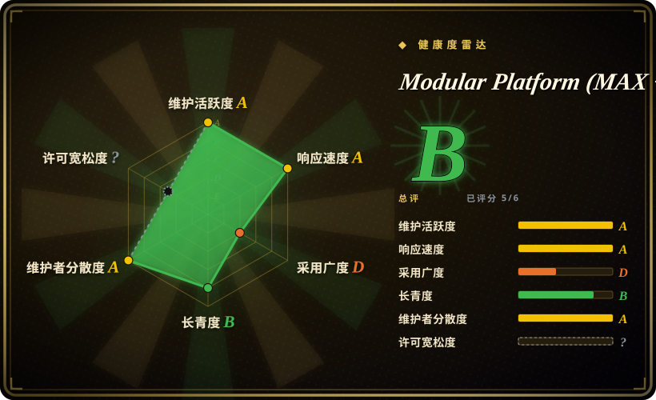
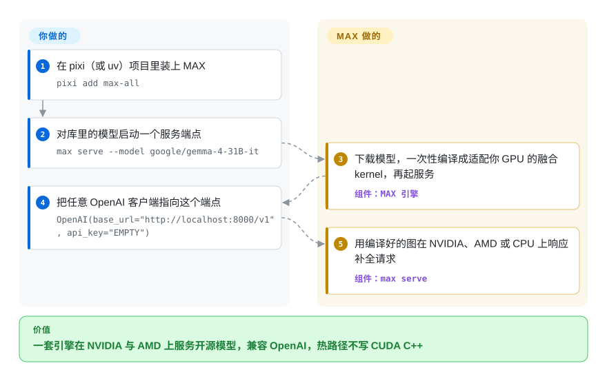

# Modular Platform (MAX + Mojo)

每个 GPU 厂商配一套服务栈、热路径最后都得掉进 CUDA C++，这是常态。Modular 给的是一套厂商垂直整合的替代方案：**MAX**——一个引擎同时在 NVIDIA、AMD 与 CPU 上跑主流开源模型，对外暴露 OpenAI 兼容端点；外加 **Mojo**——一门写得像 Python、编译到系统级性能的语言，用来写底层 kernel，1.0 正式版在 2026 年 8 月落地。

## 何时使用

你是 ML 平台工程师，要在一片混杂的 NVIDIA 与 AMD GPU 机群上以高吞吐服务若干开源权重 LLM（Llama、Gemma、Qwen……），而你已经厌倦了为每种加速卡各维护一条服务路径、一套手调 kernel。你在 `pixi` 或 `uv` 项目里装上 MAX（`pixi add max-all`），对库里的模型起一个端点（`max serve --model google/gemma-4-31B-it`），再把任意 OpenAI 客户端指向 `http://localhost:8000/v1`——一套引擎同时打 NVIDIA、AMD 与 CPU。它的卖点是「无需改一行代码，就用业界领先的 GPU 与 CPU 性能跑最主流的开源模型」，抹平硬件差异。[未验证：性能宣称来自 README，未经独立基准]

当你**专门想要 Mojo** 时也会选它——你在写自定义 AI kernel 或算子，想要一门读起来像 Python、却能编译到系统级性能的语言，而不是为热路径掉进 CUDA C++ 或 Triton。Mojo 在 2026 年 8 月跨过 1.0（MAX 26.5），现为 1.1（MAX 26.6，发布于 2026-09-17，GitHub releases）：语言终于给出了稳定性承诺——只是这份承诺才几周大，不是几年。在那个世界里，MAX 就是你的 Mojo kernel 插进去的服务运行时。所以「采用」这个决定，本质是赌 Modular 整套垂直整合的栈（编译器 + kernel + 运行时 + 服务），而不是自己把各路最佳组件拼起来。

## 怎么用起来

MAX 坐在你的 HTTP 请求和加速卡之间。执行 `max serve` 时，它从模型库或 Hugging Face 下载模型，把整张计算图一次性编译成针对你这块硬件（NVIDIA、AMD 或 CPU）的融合原生 kernel，再启动 OpenAI 兼容服务——官方快速上手原话就是「下载模型、编译、启动服务器要花一些时间」。请求进来后，引擎跑的是那份编译好的图，批处理与显存管理由它承担，你继续用普通的 OpenAI 客户端（`base_url` 加 `api_key="EMPTY"`）跟它说话。Mojo 那一半改变的是 kernel 由谁来写：MAX 的加速库与仓库主体（按 GitHub 语言统计，Mojo 约 48 MB，是第一大语言，Python 约 34 MB）就是用 Mojo 写的，你也可以用同一门语言增换 kernel，而不必写 CUDA C++。仍然归你管的：GPU 驱动、模型许可与门控权重需要的 HF token、nightly 与稳定渠道之间的版本 pin，以及单台服务器前面的负载均衡和高可用层。

<!-- flow-steps:begin (generated from flows/modular.json by tools/flow_card.py — do not edit) -->

流程文字版

1. **你**：在 pixi（或 uv）项目里装上 MAX — `pixi add max-all`
2. **你**：对库里的模型启动一个服务端点 — `max serve --model google/gemma-4-31B-it`
3. **Modular Platform (MAX + Mojo)**：下载模型，一次性编译成适配你 GPU 的融合 kernel，再起服务 — 组件：`MAX 引擎`
4. **你**：把任意 OpenAI 客户端指向这个端点 — `OpenAI(base_url="http://localhost:8000/v1", api_key="EMPTY")`
5. **Modular Platform (MAX + Mojo)**：用编译好的图在 NVIDIA、AMD 或 CPU 上响应补全请求 — 组件：`max serve`

**价值**：一套引擎在 NVIDIA 与 AMD 上服务开源模型，兼容 OpenAI，热路径不写 CUDA C++

<!-- flow-steps:end -->

## 何时不用

- **MAX 运行时本身不是 Apache-2.0——它挂着一份厂商 EULA。** 仓库源码按 README（2026-09）是「Apache License v2.0 加 LLVM Exceptions」，但同一份 README 写明「MAX 的使用与分发按 [Modular Community License] 授权」——一份专有许可证（页面标注改定于 2025-04-12）：按物理设备逐个授权、再分发受限、免费社区版「Modular 可随时变更」，且仓库内 `Licenses/README.md` 仍提醒许可证因产品而异、某些部分只是「非生产用途免费」。如果你要一份**使用**也无条件开源的服务栈，去选 [vLLM](vllm.zh.md) 或 [TensorRT-LLM](tensorrt-llm.zh.md)——它们的许可证覆盖使用，不只是源码。
- **你不想锁死在一家拿了融资的初创公司的垂直整合平台上。** 这是来自单一公司（Modular Inc.）的 MAX + Mojo + Modular 工具链。服务端点是 OpenAI 兼容的，但 kernel 语言、引擎和上面那份运行时限使用条款全是一个厂商的——一个又深又不可移植的赌注。这是结构上最该犹豫的理由。
- **你今天只是要在 NVIDIA 上服务 LLM。** 成熟、被广泛采用的服务栈早已存在：**vLLM**（PagedAttention、社区庞大）、**TGI**（Hugging Face）、**TensorRT-LLM**（NVIDIA 自家、对 NVIDIA 调得最狠）。它们的生态更大、实战检验更久，许可证也不取决于一家公司的自由裁量。
- **你想用一门久经验证的语言/工具链写 kernel。** 写自定义 kernel，原生 **PyTorch**（配 `torch.compile`）、**Triton** 或 CUDA 才是成熟、好招人、文档齐全的路径。**Mojo 2026 年 8 月才到 1.0**——这是一个货真价实的稳定里程碑，但它身后的版本化历史只有约 3 年，而且 README 明确表示暂不接受对 Mojo 编译器的贡献：stdlib 可以提 PR，编译器的方向却锁在厂商手里。
- **你需要通用的请求编排 / 多模型路由。** Ray Serve 这类服务框架专注于扩展和组合任意 Python 模型服务；MAX 是引擎，不是通用编排层。
- **端侧 / 边缘推理。** 这是面向服务器级 GPU/CPU 的服务栈（快速上手推荐 B200/H200/H100、MI355X/MI325X/MI300X 这类数据中心卡，并说明消费级设备与 Mac 可跑但「兼容模型更少、速度更慢」）；手机、浏览器或嵌入式目标请见 → on-device-ml。

## 横向对比

| 替代品 | 是否收录 | 我们的评价 | 取舍 |
|---|---|---|---|
| [vLLM](vllm.zh.md) | ✅ | 要事实标准的开源服务引擎、且许可证覆盖「使用」时，选 vLLM；只有当一套引擎同时打 NVIDIA 与 AMD 的价值，高过在运行时上接受 Modular 社区许可证的代价时，才选 MAX。 | PagedAttention 引擎，社区与模型覆盖极大，纯 Apache-2.0；偏 NVIDIA 调优、跨 CPU/AMD 的统一叙事较弱，也没有自己的 kernel 语言。 |
| [Text Generation Inference (TGI)](text-generation-inference.zh.md) | ✅ | 需要 Hugging Face 生态集成与社区治理的栈多于要编译器时，选 TGI；需要同一套栈兼顾 AMD 时，选 MAX。 | Hugging Face 的生产服务器，与 HF 生态贴合紧密；许可证历史有过反复（Apache→HFOIL→Apache），范围比一整套编译器+语言平台窄。 |
| [TensorRT-LLM](tensorrt-llm.zh.md) | ✅ | 只要 NVIDIA、且要把时延压到极限，选 TensorRT-LLM（许可证覆盖使用）；同一部署还要跑 AMD 与 CPU 时，选 MAX。 | NVIDIA 自家引擎，在 NVIDIA 硬件上性能顶级；深度锁定 NVIDIA，构建/引擎编译流程更重，无跨厂商抽象。 |
| [Ray Serve](ray-serve.zh.md) | ✅ | 你的问题是编排一堆任意 Python 服务而非榨干一个引擎时，选 Ray Serve；MAX 是引擎层，不是调度层。 | 通用 Python 模型服务/编排框架，负责扩展与组合服务；不是手调的单模型推理引擎——是另一层。 |
| 原生 PyTorch（配 Triton） | 未收录 | 更看重招聘池与许可证纯度时，选原生 PyTorch——性能自己拼，栈里没有任何东西挂在厂商 EULA 下。 | 服务与自定义 kernel 两头都最默认、最可移植、最好招人的栈；MAX 用专有运行时许可证换的性能，你要用自己的拼装工时换。 |
| [SGLang](sglang.zh.md) | ✅ | 目标是 NVIDIA 上的结构化生成与前缀缓存时，选 SGLang；同一栈还要覆盖 AMD 时才考虑 MAX。 | 高吞吐服务引擎，带 RadixAttention 前缀缓存和结构化生成优化；比 vLLM 更新、生态更小，以 NVIDIA 为中心，不是编译器平台。 |

## 技术栈

- **Mojo**——仓库的第一大语言（GitHub languages 2026-09：Mojo 约 48 MB，Python 约 34 MB，C++ 约 13 MB，MLIR 约 1.9 MB）：一门 Python 超集系统级语言，用来写 MAX 的 kernel/算子（`/max/kernels`），经一套基于 MLIR/LLVM 的工具链编译到原生性能（见存疑）。
- **MAX**——推理引擎 + 服务运行时：`max serve` 暴露 **OpenAI 兼容 REST API**（仓库内 `/max/python/max/serve`），模型管线以 Python 图形式提供（`/max/python/max/pipelines`）。
- **打包/部署面**——经包管理器安装：pixi 渠道（`conda.modular.com/max`，另有 nightly 版）或 uv/pip（`uv add "max[all]" --index https://whl.modular.com/nightly/simple/`）；提供 Kubernetes 兼容 Docker 容器（`modular/max-*`）。
- **目标硬件**——NVIDIA 与 AMD GPU 加 CPU；快速上手推荐数据中心卡（B200/H200/H100、MI355X/MI325X/MI300X）并注明 Linux/WSL；`main` 跟踪 nightly，稳定版按 tag 发布（`max/v26.6.0`，2026-09-17），节奏约一到两个月一次。

## 依赖

- **硬件**——要拿到价值，你需要服务器级加速卡（NVIDIA 或 AMD GPU）；快速上手的招牌示例（Gemma 4 31B）要求超过 96 GiB 显存，库里更小的模型也各有下限。支持 CPU 执行，但性能叙事以 GPU 为中心。
- **模型与令牌**——开源权重模型来自 MAX 模型库或 Hugging Face；门控模型需要 `export HF_TOKEN="hf_..."` 并接受模型自身的许可条款。
- **运行时/安装**——一个 pixi 或 uv 项目（或走 Docker），宿主机上要有 NVIDIA/AMD 的 GPU 驱动；默认快速上手装的是 nightly，上生产要自己切稳定渠道 pin 版本。[推断：驱动/运行时细节依据 GPU 容器部署模型，未逐项核对 manifest]
- **许可条款（不是包，但也是依赖）**——在 Apache-2.0+LLVM-exception 的源码之外，MAX 的使用与分发受 Modular Community License（专有、按设备授权）约束。
- **工具链（做 Mojo/kernel 用）**——来自本仓库/发行版的 Modular 工具链（Mojo 编译器，2026-09 为 1.1.0），不是通用第三方编译器。

## 运维难度

**中。** 服务的顺路径确实顺滑：`pixi add max-all`、`max serve --model …`，把 OpenAI 客户端指向 8000 端口——Kubernetes 就绪的镜像让集群部署很常规。难度上升在于：（1）GPU 机群管理（驱动、NVIDIA 与 AMD 运行时、调度、显存/吞吐调优）；（2）跟一个快速演进的栈——快速上手默认给 nightly，要稳定得上生产就得自己 pin 稳定渠道；（3）任何涉及自定义 Mojo kernel 的活，你是在运维一门刚满 1.x 的语言/工具链，而且它的编译器还不接受外部贡献。和任何推理引擎一样，运维重量主要在 GPU 和模型生命周期，而非某个数据存储。

## 健康度与可持续性

- **响应速度**：Grade A——中位首次响应时间 0.1 小时，基于 15 个 qualifying issues（评分器，2026-09-28）。
- **维护（2026-09）。** 非常活跃——默认分支 2026-09-27 仍有推送；稳定版每一到两个月发一次（v26.1 一月 → v26.2 三月 → v26.3 五月 → v26.4 六月 → v26.5 八月 → v26.6 九月，GitHub releases）。Mojo 1.0.0 正式版于 2026 年 8 月落地。未归档。
- **治理 / bus factor（2026-09）。** 单一厂商：路线图、语言（Mojo）、引擎和上面那份运行时许可全由 **Modular Inc.** 这家拿了融资的初创公司掌控——**不是**基金会（没有 Apache/CNCF/LF 治理）。评分器数到 12 个月内 235 个不同提交者、单人不超约 5.5%——但他们在为一家公司的产品写代码，且 README 明确不收 Mojo 编译器的外部贡献。若 Modular 转向、被收购或改动社区版条款，下游用户要承担这份风险。
- **年龄与 Lindy（2026-09）。** 2023-04 创建（约 3.4 年）且仍在活跃发布⇒一个**中等**信号：势头是真的，但 **Lindy 偏弱**——还太年轻，谈不上久经验证，相对 vLLM/TensorRT-LLM 这些既有者，其长期存活尚未被证明。用年龄 × 仍活跃来看：活跃是好事，年轻仍意味着未经证明。[推断]
- **许可证 / relicense 与 open-core 风险——关键标记，且已是一手事实。** 仓库 `LICENSE` 是 Apache-2.0 加 LLVM Exceptions，但 README（2026-09）写明「MAX 的使用与分发按 Modular Community License 授权」——一份专有 EULA（页面标注改定于 2025-04-12），按设备授权、再分发受限、免费社区版可被 Modular 随时变更；仓库内 `Licenses/README.md` 补充说许可证因产品而异、某些部分仅「非生产用途免费」。GitHub 检测器因此报 NOASSERTION，健康度评分器解析不出该轴。请把「这个平台是开源的」理解为**对源码为真、对运行时不为真**：许可结构已核实，逐组件边界未核实（见存疑）。
- **采用度（2026-09）。** 约 29.9k star、约 3.2k fork（GitHub API，2026-09-28，较六月的约 26.4k 上涨），约 1,183 个未决 issue：对一个约 3.4 年的项目而言关注度在涨，并有公开的模型库与容器镜像；但 star 数不是生产采用的证据——评分器的 adoption 轴只有 D（注册包月下载量 2064，PyPI，评分器 2026-09-28），真实世界的 LLM 服务仍由既有者主导。[未验证：生产采用广度]

## 存疑（未验证）

- [未验证] 截至 2026-09-28（经 GitHub API），约 29.9k star / 约 3.2k fork / 约 1,183 个未决 issue；star 与 issue 数易变且对时间敏感，仅供参考。
- [未验证] 性能宣称（「业界领先的 GPU 与 CPU 性能」、跨 NVIDIA/AMD 厂商等价）是项目 README 自己的表述，本页未独立跑 benchmark 验证。
- [未验证] Modular Community License 具体管辖哪些组件（README 点名 MAX、Mojo SDK 与「Magic tooling」）、哪些仍纯 Apache-2.0，本页依据 README 与许可页面陈述结构，未逐组件穷尽映射——依赖某组件前请对照当前产品条款核实。
- [推断]「Mojo 1.x 对生产 kernel 仍有风险」基于里程碑才几周大（1.0.0 随 MAX 26.5 于 2026-08-11 发布）且编译器不收外部贡献，并非对 1.x 后破坏性变更的实测记录。
- [推断] 宿主机运行时/驱动依赖（NVIDIA/AMD GPU 驱动、容器运行时）是从 GPU 容器部署模型推断的，未从某个 manifest 逐条枚举。
- [推断] Mojo→MLIR/LLVM 工具链细节是从公开描述与仓库里的 MLIR/TableGen 源码（约 1.9 MB）推断的，本页未从源码读取确切的编译器内部实现。
