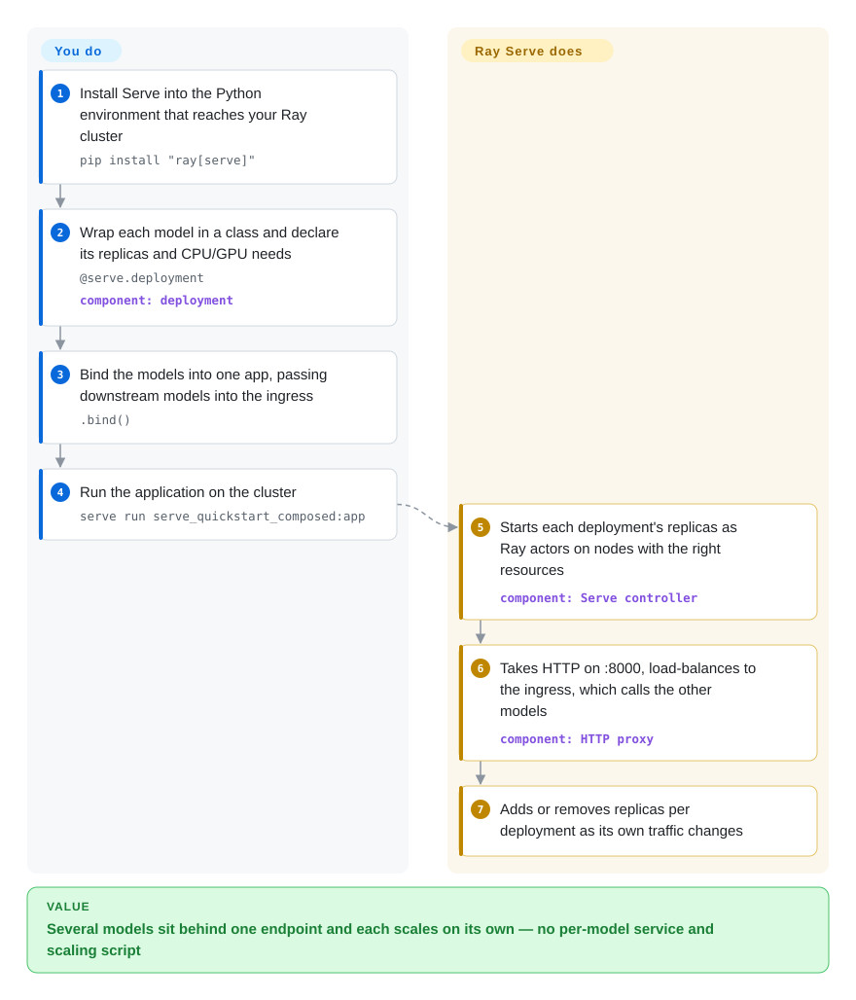

# Ray Serve

Your product calls a ranker, a classifier and an LLM on every request, and each one runs in its own hand-rolled service with its own scaling script — when traffic spikes, one of them falls over while the GPUs behind the others sit idle. Ray Serve puts them all in one Python application on a Ray cluster, where each model scales its own replicas and models call each other like ordinary Python objects.

## When to use

You're an ML platform engineer whose team serves a mix of models — an XGBoost ranker, a scikit-learn fraud classifier, a few custom PyTorch functions and, increasingly, LLMs — and today each one is a separate FastAPI container with its own autoscaling rules. A single user request fans out across three of them over HTTP, the tail latency is the sum of three network hops and three queues, and the GPU nodes behind the LLM are idle at night while the CPU pool for the ranker is pinned. Your team already runs Ray for training or batch inference, so the cluster exists.

You reach for Ray Serve: each model becomes a Python class with `@serve.deployment`, you wire them together with `.bind()`, and Ray places replicas on CPU or GPU nodes and scales each deployment independently. For the LLM part you no longer hand-wrap an engine: Ray Serve LLM (`ray.serve.llm`) gives you an OpenAI-compatible app on top of vLLM or SGLang, with prefix-aware routing and multi-LoRA. The deciding tradeoff against a dedicated engine (vLLM, SGLang) or a Kubernetes-native stack (KServe, llm-d) is that Ray Serve is **Python-code-first orchestration across heterogeneous models**: you compose and scale in Python instead of YAML, at the price of running a Ray cluster.

## How it works

Ray Serve is a layer on top of Ray, a distributed runtime that runs Python classes as long-lived processes ("actors") anywhere in a cluster. **You write the model logic** — a class whose `__call__` handles a request — and declare how much CPU/GPU each copy needs and how many copies to run; **Ray Serve does the rest**: it starts that many copies ("replicas") as actors on suitable nodes, puts an HTTP proxy on port 8000 in front, load-balances requests across replicas, and adds or removes replicas as traffic changes. When one deployment needs another, you pass it in at `.bind()` time and it arrives as a `DeploymentHandle` — a Python object whose method calls are routed to the other deployment's replicas, so composing a ranker and an LLM looks like calling a function, not like writing an HTTP client. Think of a restaurant kitchen: you write each station's recipe, Ray Serve decides how many cooks staff each station tonight and passes plates between them. For LLMs, Ray Serve LLM replaces the hand-written class with an `LLMConfig` and runs the vLLM (or SGLang) engine inside the replicas for you; the engine still does the token-level work.

<!-- flow-steps:begin (generated from flows/ray-serve.json by tools/flow_card.py — do not edit) -->

Text version of the flow

1. **You**: Install Serve into the Python environment that reaches your Ray cluster — `pip install "ray[serve]"`
2. **You**: Wrap each model in a class and declare its replicas and CPU/GPU needs — `@serve.deployment` — component: `deployment`
3. **You**: Bind the models into one app, passing downstream models into the ingress — `.bind()`
4. **You**: Run the application on the cluster — `serve run serve_quickstart_composed:app`
5. **Ray Serve**: Starts each deployment's replicas as Ray actors on nodes with the right resources — component: `Serve controller`
6. **Ray Serve**: Takes HTTP on :8000, load-balances to the ingress, which calls the other models — component: `HTTP proxy`
7. **Ray Serve**: Adds or removes replicas per deployment as its own traffic changes

**Value**: Several models sit behind one endpoint and each scales on its own — no per-model service and scaling script

<!-- flow-steps:end -->

## When NOT to use

- **You only serve one LLM and want maximum throughput with the least moving parts.** Run the engine directly: [vLLM](vllm.md) or [SGLang](sglang.md) each ship their own OpenAI-compatible server. Ray Serve LLM itself runs vLLM/SGLang underneath, so for a single model it adds a Ray cluster without adding speed.
- **Your team doesn't know Ray and has no other reason to run it.** Ray Serve is built on Ray's actors, placement groups and object store; when something breaks you debug those before you debug serving. If Kubernetes is already your control plane, KServe (not indexed) or, for LLM fleets, [llm-d](llm-d.md) keep everything in CRDs and Helm instead of adding a second scheduler.
- **You want a lightweight serving layer on one machine.** `ray[serve]` brings a whole distributed runtime (GCS, raylets, dashboard). For a model plus preprocessing behind one API, [BentoML](bentoml.md) or plain FastAPI + Uvicorn (not indexed) are lighter.
- **You expect the serving layer itself to optimize LLM inference.** Ray Serve LLM adds routing-level features (prefix-aware routing, prefill/decode disaggregation, multi-LoRA), but PagedAttention, continuous batching and kernels come from the engine you configure. If you need NVIDIA's own kernels, [TensorRT-LLM](tensorrt-llm.md) is the engine to evaluate; Ray Serve won't make a slow engine fast.
- **You want a fully managed, zero-ops endpoint.** Open-source Ray Serve means you run the Ray cluster (KubeRay on Kubernetes, VMs, or bare metal). Anyscale sells managed Ray; otherwise use a cloud vendor's managed inference endpoint (not a repo).
- **Your inference stack is not Python.** Deployments, routing logic and autoscaling policies are all Python. A Go/Rust/C++ serving stack should stay with a language-neutral server such as NVIDIA Triton Inference Server (not indexed).

## Comparison

| Alternative | In index | Our verdict | Tradeoff |
|---|---|---|---|
| [vLLM](vllm.md) | ✅ | For one LLM behind an OpenAI API, run vLLM directly; pick Ray Serve when that LLM is one of several models that must scale and compose together. | vLLM is the engine Ray Serve LLM uses by default — going direct removes the Ray cluster, but you lose cross-model composition and per-deployment autoscaling. |
| [SGLang](sglang.md) | ✅ | Pick SGLang directly for prefix-heavy agent or structured-output traffic on one model; pick Ray Serve when SGLang is one backend among several deployments. | SGLang brings its own server and router; Ray Serve adds Python-level composition and autoscaling on top at the cost of operating Ray. |
| [TensorRT-LLM](tensorrt-llm.md) | ✅ | Pick TensorRT-LLM when NVIDIA-tuned kernels on Hopper/Blackwell decide the budget; pick Ray Serve when the problem is orchestrating many models, not squeezing one. | TensorRT-LLM is an NVIDIA-only engine with its own `trtllm-serve`; it does no multi-model composition or cluster-level scaling. |
| [llm-d](llm-d.md) | ✅ | If your platform is Kubernetes and the fleet is all LLM pods, pick llm-d for LLM-aware routing in Helm/CRDs; pick Ray Serve when you also serve non-LLM models and want to compose them in Python. | llm-d is Kubernetes-native and LLM-only (vLLM/SGLang pods); Ray Serve is cluster-agnostic and model-agnostic but adds Ray as a second scheduler. |
| [BentoML](bentoml.md) / OpenLLM | 部分已收录 | Pick BentoML when you want a container-per-service packaging workflow without a distributed runtime; pick Ray Serve when deployments must share a cluster and call each other in-process. | BentoML is lighter to run and package; Ray Serve scales further across a shared cluster but requires Ray operations. OpenLLM has no page. |
| KServe | not indexed | Pick KServe when model serving must be declared as Kubernetes CRDs and fit Kubeflow; pick Ray Serve when your team prefers to define serving graphs in Python code. | KServe is config/YAML-centric and Kubernetes-only; Ray Serve is code-centric and also runs off Kubernetes. |
| [Text Generation Inference (TGI)](text-generation-inference.md) | ✅ | Do not start new deployments on TGI — the repository is archived (maintenance mode); use vLLM or SGLang as the engine, under Ray Serve if you need orchestration. | TGI was Hugging Face's production LLM server; archival means no new model or security work upstream. |
| FastAPI + Uvicorn | not indexed | Pick plain FastAPI for one small model on one box; pick Ray Serve once you need replicas, GPU placement and autoscaling. | FastAPI is minimal and familiar, but scaling, batching and multi-node placement are all yours to build. |

## Tech stack

- **Python** — deployments, composition, request handling and autoscaling policy are Python (`@serve.deployment`, `.bind()`, `serve.run` / the `serve run` CLI, `DeploymentHandle`). Ray supports Python 3.10–3.14.
- **Ray core** — C++ runtime with Python bindings: actors host replicas, the GCS (global control store) holds cluster metadata, the object store passes data between processes.
- **HTTP / gRPC ingress** — an HTTP proxy actor (Uvicorn) on port 8000, on the head node by default or one per node via `proxy_location`; Starlette request objects with an optional FastAPI integration; a gRPC proxy is also available.
- **Ray Serve LLM** (`ray.serve.llm`, installed with `ray[llm]`) — `LLMConfig` + `build_openai_app` produce an OpenAI-compatible app; engine backends are vLLM (pulled in by the extra) and SGLang; supports tensor/pipeline/expert parallelism, prefill/decode disaggregation, prefix-aware routing, multi-LoRA and Grafana dashboards.
- **KubeRay** — a separate repository (`ray-project/kuberay`) providing the Kubernetes operator and the RayService resource for running Serve applications on Kubernetes.

## Dependencies

- **Ray cluster** — single node for development; for production a head node plus worker nodes (on KubeRay, VMs or bare metal). You operate it.
- **Hardware** — CPU for classic models and Ray itself; NVIDIA GPUs for most LLM serving through vLLM/SGLang.
- **Python packages** — `pip install "ray[serve]"`; `pip install "ray[llm]"` additionally pulls vLLM and its CUDA stack (deliberately excluded from `ray[all]`).
- **Observability** — Prometheus/Grafana if you want the shipped dashboards; the Ray dashboard comes with the cluster.
- **Models** — you bring them; Ray Serve is the serving layer, not a model source.

## Ops difficulty

**High.** Ray Serve is powerful but you are running a distributed system:

1. **Ray cluster management** — the head node holds cluster metadata (GCS); worker nodes join and leave; node loss, network partitions and resource fragmentation are failure modes you must plan for (GCS fault tolerance needs an external Redis).
2. **Resource scheduling** — per-deployment `num_cpus`/`num_gpus`, placement groups and autoscaling bounds interact; getting min/max replicas and target load right takes production iteration.
3. **Two layers of metrics** — Ray internals (GCS, raylets, object store) and application-level serving metrics; dashboards exist but you host Prometheus/Grafana.
4. **Version coupling** — Serve ships inside Ray, and Ray releases every few weeks (2.56 → 2.59 between June and October 2026); upgrading Serve means upgrading the cluster, and `ray[llm]` also moves your vLLM version.
5. **Learning curve** — debugging means understanding actor lifecycles, serialization and fault handling, not just a container that restarts.

## Health & viability

- **Maintenance (2026-10).** Very active: Ray 2.59.0 shipped 2026-10-02 after 2.57 (Aug 11) and 2.58 (Aug 23); commits land daily and issues get a first response within hours on median. Ray Serve is a first-class library in the monorepo, not a side module.
- **Governance / bus factor.** Since 2025-10-22 Ray is a hosted project of the **PyTorch Foundation** (Linux Foundation), contributed by Anyscale. 182 people committed in the last 12 months and no one holds more than ~7% of commits, so the bus factor is high; the core maintainers are still largely Anyscale engineers.
- **Age & Lindy.** The repository dates from 2016 and is still shipping every few weeks — about ten years of continuous activity, which is a strong Lindy prior; Serve itself has been part of Ray since around 2020.
- **Adoption.** ~44k GitHub stars for the whole Ray project, 13,390,380 PyPI downloads of `ray` in the last month (scored 2026-10-08), and 3,641 dependent repositories on the registry graph; the Ray project reported 237M cumulative downloads at the foundation announcement.
- **Risk flags.** Apache-2.0, no relicense history; foundation hosting lowers the single-vendor risk that used to be the main flag. Remaining risks are breadth (Data, Train, Tune, RLlib, Serve, LLM all move at once) and `ray[llm]` inheriting vLLM's fast churn.

## Caveats (unverified)

- [未验证] Star, download and contributor counts are for the whole `ray-project/ray` repository, not Ray Serve alone; Serve-specific adoption is not separately measured.
- [推断] "Core maintainers are largely Anyscale engineers" is inferred from the top-contributor list (2026-10), not from a published maintainer roster.
- [未验证] Autoscaling reaction time and cold-start latency for scale-from-zero were not benchmarked here.
- [未验证] KubeRay operator features and maturity were not independently validated; only its repository activity was checked.
- [推断] The "strong Lindy prior" combines the 2016 repository age with observed 2026 activity; it is a heuristic, not a prediction.
