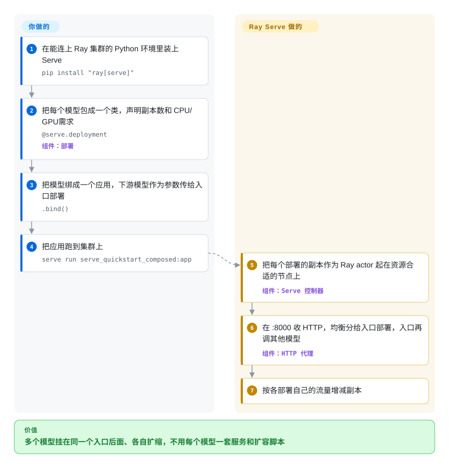

# Ray Serve

你的产品每个请求都要调一个排序模型、一个分类器和一个大模型，三者各跑在一个手搓的服务里、各有一套扩容脚本——流量一冲，其中一个先倒下，另外两个背后的 GPU 却闲着。Ray Serve 把它们放进同一个跑在 Ray 集群上的 Python 应用：每个模型按自己的流量扩缩副本，模型之间像调用普通 Python 对象一样互相调用。

## 何时使用

你是机器学习平台工程师，团队要服务一堆模型：XGBoost 排序器、scikit-learn 反欺诈分类器、几段自定义 PyTorch 函数，以及越来越多的大模型。现在它们各是一个 FastAPI 容器、各有一套自动扩缩规则。一个用户请求要通过 HTTP 依次打到其中三个，尾延迟等于三跳网络加三个队列之和；夜里大模型背后的 GPU 节点空着，排序器那池 CPU 却被打满。团队本来就在用 Ray 做训练或批量推理，集群是现成的。

这时你会想到 Ray Serve：每个模型写成一个加了 `@serve.deployment` 的 Python 类，用 `.bind()` 把它们串起来，Ray 负责把副本放到 CPU 或 GPU 节点上，并按每个部署各自的负载扩缩。大模型那部分也不用自己再包一层引擎：Ray Serve LLM（`ray.serve.llm`）直接在 vLLM 或 SGLang 之上给出一个 OpenAI 兼容的应用，带前缀感知路由和多 LoRA。它和专用推理引擎（vLLM、SGLang）或 Kubernetes 原生方案（KServe、llm-d）之间起决定作用的取舍是：Ray Serve 是**用 Python 代码编排异构模型**——组合和扩缩写在 Python 里而不是 YAML 里，代价是你得运维一个 Ray 集群。

## 怎么用起来

Ray Serve 是叠在 Ray 之上的一层；Ray 是一个分布式运行时，能把 Python 类作为常驻进程（叫 actor）跑在集群任意节点上。**你写模型逻辑**——一个用 `__call__` 处理请求的类——并声明每份拷贝要多少 CPU/GPU、跑几份；**其余由 Ray Serve 完成**：它把这些拷贝（叫副本）作为 actor 起在合适的节点上，在前面放一个默认监听 8000 端口的 HTTP 代理，把请求在副本间做负载均衡，并随流量增减副本。一个部署要用另一个部署时，你在 `.bind()` 时把它传进去，运行时它变成一个 `DeploymentHandle`——一个 Python 对象，对它的方法调用会被路由到对方的副本上，所以把排序器和大模型串起来就像调函数，不用写 HTTP 客户端。好比餐厅后厨：你写每个工位的菜谱，Ray Serve 决定今晚每个工位排几个厨师、并在工位之间传菜。对大模型，Ray Serve LLM 用一个 `LLMConfig` 取代手写的类，在副本里替你跑 vLLM（或 SGLang）引擎；逐 token 生成的活仍由引擎干。

<!-- flow-steps:begin (generated from flows/ray-serve.json by tools/flow_card.py — do not edit) -->

流程文字版

1. **你**：在能连上 Ray 集群的 Python 环境里装上 Serve — `pip install "ray[serve]"`
2. **你**：把每个模型包成一个类，声明副本数和 CPU/GPU 需求 — `@serve.deployment` — 组件：`部署`
3. **你**：把模型绑成一个应用，下游模型作为参数传给入口部署 — `.bind()`
4. **你**：把应用跑到集群上 — `serve run serve_quickstart_composed:app`
5. **Ray Serve**：把每个部署的副本作为 Ray actor 起在资源合适的节点上 — 组件：`Serve 控制器`
6. **Ray Serve**：在 :8000 收 HTTP，均衡分给入口部署，入口再调其他模型 — 组件：`HTTP 代理`
7. **Ray Serve**：按各部署自己的流量增减副本

**价值**：多个模型挂在同一个入口后面、各自扩缩，不用每个模型一套服务和扩容脚本

<!-- flow-steps:end -->

## 何时不用

- **你只服务一个大模型，想要最高吞吐和最少的组件。** 直接跑引擎：[vLLM](vllm.zh.md) 或 [SGLang](sglang.zh.md) 都自带 OpenAI 兼容服务端。Ray Serve LLM 底下跑的本来就是 vLLM/SGLang，单模型场景它只多出一个 Ray 集群，不会更快。
- **团队不懂 Ray，也没有别的理由要跑 Ray。** Ray Serve 建在 Ray 的 actor、placement group 和对象存储之上；出问题时你得先调这些，才轮到调服务本身。如果 Kubernetes 已经是你的控制面，用 KServe（未收录），或者大模型集群用 [llm-d](llm-d.zh.md)，一切留在 CRD 和 Helm 里，不用再加一个调度器。
- **你只想在一台机器上要一个轻量服务层。** `ray[serve]` 会带上一整套分布式运行时（GCS、raylet、仪表盘）。一个模型加预处理挂在一个 API 后面，[BentoML](bentoml.zh.md) 或者纯 FastAPI + Uvicorn（未收录）更轻。
- **你指望服务层自己去优化大模型推理。** Ray Serve LLM 加的是路由层的能力（前缀感知路由、预填充/解码拆分、多 LoRA），PagedAttention、连续批处理和内核都来自你配置的引擎。要用 NVIDIA 自家内核，该评估的引擎是 [TensorRT-LLM](tensorrt-llm.zh.md)；Ray Serve 不会把慢引擎变快。
- **你要完全托管、零运维的端点。** 开源 Ray Serve 意味着 Ray 集群由你来跑（Kubernetes 上用 KubeRay、虚拟机或裸金属）。Anyscale 卖托管 Ray；否则就用云厂商的托管推理端点（非仓库）。
- **你的推理栈不是 Python。** 部署定义、路由逻辑和扩缩策略都是 Python。Go/Rust/C++ 的服务栈应留在语言中立的服务器上，例如 NVIDIA Triton Inference Server（未收录）。

## 横向对比

| 替代品 | 是否收录 | 我们的评价 | 取舍 |
|---|---|---|---|
| [vLLM](vllm.zh.md) | ✅ | 一个大模型挂 OpenAI API，直接跑 vLLM；当这个大模型只是若干个需要一起扩缩、互相组合的模型之一时，选 Ray Serve。 | Ray Serve LLM 默认用的就是 vLLM——直接用省掉 Ray 集群，但失去跨模型组合和按部署扩缩。 |
| [SGLang](sglang.zh.md) | ✅ | 单模型、前缀复用多的 agent 或结构化输出流量，直接用 SGLang；SGLang 只是多个部署中的一个后端时，选 Ray Serve。 | SGLang 自带服务端和路由器；Ray Serve 在其上加 Python 级组合与扩缩，代价是运维 Ray。 |
| [TensorRT-LLM](tensorrt-llm.zh.md) | ✅ | 预算取决于 Hopper/Blackwell 上 NVIDIA 调优内核时，选 TensorRT-LLM；问题在于编排很多模型而不是把一个模型榨干时，选 Ray Serve。 | TensorRT-LLM 是只跑在 NVIDIA 上的引擎，自带 `trtllm-serve`；不做多模型组合，也不做集群级扩缩。 |
| [llm-d](llm-d.zh.md) | ✅ | 平台是 Kubernetes、集群里全是大模型 pod 时，选 llm-d，用 Helm/CRD 做懂大模型的路由；你还要服务非大模型、并想用 Python 组合它们时，选 Ray Serve。 | llm-d 原生 Kubernetes、只管大模型（vLLM/SGLang pod）；Ray Serve 不挑集群也不挑模型，但多了 Ray 这第二个调度器。 |
| [BentoML](bentoml.zh.md) / OpenLLM | 部分已收录 | 想要“一服务一容器”的打包流程、不要分布式运行时，选 BentoML；部署之间要共享集群、进程内互相调用时，选 Ray Serve。 | BentoML 运行和打包更轻；Ray Serve 在共享集群上扩得更远，但要运维 Ray。OpenLLM 没有页面。 |
| KServe | 未收录 | 模型服务必须写成 Kubernetes CRD、要贴合 Kubeflow 时，选 KServe；团队更愿意用 Python 代码定义服务图时，选 Ray Serve。 | KServe 以配置/YAML 为中心、只跑在 Kubernetes 上；Ray Serve 以代码为中心，也能离开 Kubernetes 运行。 |
| [Text Generation Inference（TGI）](text-generation-inference.zh.md) | ✅ | 不要在 TGI 上开新部署——仓库已归档（维护模式）；引擎用 vLLM 或 SGLang，需要编排再套 Ray Serve。 | TGI 曾是 Hugging Face 的生产级大模型服务端；归档意味着上游不再做新模型和安全工作。 |
| FastAPI + Uvicorn | 未收录 | 一台机器上一个小模型，用纯 FastAPI；一旦需要副本、GPU 放置和自动扩缩，选 Ray Serve。 | FastAPI 极简、人人熟悉，但扩缩、批处理和多节点放置全得自己造。 |

## 技术栈

- **Python** —— 部署、组合、请求处理和扩缩策略都写在 Python 里（`@serve.deployment`、`.bind()`、`serve.run` / `serve run` 命令行、`DeploymentHandle`）。Ray 支持 Python 3.10–3.14。
- **Ray 核心** —— C++ 运行时加 Python 绑定：actor 承载副本，GCS（全局控制存储）保存集群元数据，对象存储在进程间传数据。
- **HTTP / gRPC 入口** —— 一个 HTTP 代理 actor（Uvicorn），端口 8000，默认只在 head 节点上，可用 `proxy_location` 改成每个节点一个；请求以 Starlette 对象传入，可选 FastAPI 集成；也提供 gRPC 代理。
- **Ray Serve LLM**（`ray.serve.llm`，随 `ray[llm]` 安装）—— `LLMConfig` 加 `build_openai_app` 生成 OpenAI 兼容应用；引擎后端是 vLLM（由该 extra 拉入）和 SGLang；支持张量/流水线/专家并行、预填充/解码拆分、前缀感知路由、多 LoRA 和 Grafana 仪表盘。
- **KubeRay** —— 独立仓库（`ray-project/kuberay`），提供 Kubernetes operator 和 RayService 资源，用来在 Kubernetes 上跑 Serve 应用。

## 依赖

- **Ray 集群** —— 开发用单节点；生产需要一个 head 节点加若干 worker 节点（KubeRay、虚拟机或裸金属），由你运维。
- **硬件** —— 经典模型和 Ray 本身用 CPU；通过 vLLM/SGLang 服务大模型大多需要 NVIDIA GPU。
- **Python 包** —— `pip install "ray[serve]"`；`pip install "ray[llm]"` 还会拉入 vLLM 及其 CUDA 依赖（该 extra 被刻意排除在 `ray[all]` 之外）。
- **可观测性** —— 想用自带仪表盘就要有 Prometheus/Grafana；Ray 仪表盘随集群提供。
- **模型** —— 自带；Ray Serve 是服务层，不提供模型。

## 运维难度

**高。** Ray Serve 能力强，但你在运行一个分布式系统：

1. **Ray 集群管理** —— head 节点保存集群元数据（GCS）；worker 节点会加入和离开；节点丢失、网络分区和资源碎片都是要提前设计的故障模式（GCS 容错需要外部 Redis）。
2. **资源调度** —— 每个部署的 `num_cpus`/`num_gpus`、placement group 和扩缩上下限相互影响；把最小/最大副本数和目标负载调对需要在生产中反复迭代。
3. **两层指标** —— Ray 内部指标（GCS、raylet、对象存储）加应用层服务指标；仪表盘现成，但 Prometheus/Grafana 得自己托管。
4. **版本耦合** —— Serve 随 Ray 发布，而 Ray 每隔几周发一版（2026 年 6 月到 10 月从 2.56 走到 2.59）；升级 Serve 就是升级集群，`ray[llm]` 还会顺带改变你的 vLLM 版本。
5. **学习曲线** —— 排错要懂 actor 生命周期、序列化和故障处理，不是“容器挂了自动重启”那么简单。

## 健康度与可持续性

- **维护（2026-10）。** 非常活跃：继 2.57（8 月 11 日）、2.58（8 月 23 日）之后，Ray 2.59.0 于 2026-10-02 发布；每天都有提交，issue 首次回复的中位数以小时计。Ray Serve 是单体仓库里的一等库，不是附属模块。
- **治理 / 巴士因子。** 自 2025-10-22 起，Ray 由 Anyscale 捐给 **PyTorch 基金会**（Linux 基金会旗下）托管。过去 12 个月有 182 人提交过代码，没有人超过约 7% 的提交量，巴士因子很高；核心维护者仍以 Anyscale 工程师为主。
- **年龄与 Lindy。** 仓库建于 2016 年，至今仍每隔几周发版——约十年的持续活跃，Lindy 先验很强；Serve 大约从 2020 年起就是 Ray 的一部分。
- **采用度。** 整个 Ray 项目约 4.4 万 GitHub star，`ray` 上个月 PyPI 下载 13,390,380 次（2026-10-08 评分时），依赖图上有 3,641 个依赖仓库；Ray 项目在加入基金会时公布累计下载 2.37 亿次。
- **风险标志。** Apache-2.0，无改许可证历史；基金会托管降低了过去最主要的单一厂商风险。剩下的风险是面太广（Data、Train、Tune、RLlib、Serve、LLM 同时在变），以及 `ray[llm]` 继承了 vLLM 的快速变动。

## 存疑（未验证）

- [未验证] star、下载量和贡献者数都是整个 `ray-project/ray` 仓库的，不是 Ray Serve 单独的；Serve 自己的采用度没有单独度量。
- [推断] “核心维护者以 Anyscale 工程师为主”是从 2026-10 的头部贡献者名单推断的，不是来自公开的维护者名册。
- [未验证] 自动扩缩的反应时间和从零副本冷启动的延迟，本页未做基准测试。
- [未验证] KubeRay operator 的功能和成熟度未独立验证，只核对了其仓库活跃度。
- [推断] “Lindy 先验很强”结合了 2016 年的仓库年龄和 2026 年观察到的活跃度，是启发式判断，不是预测。
