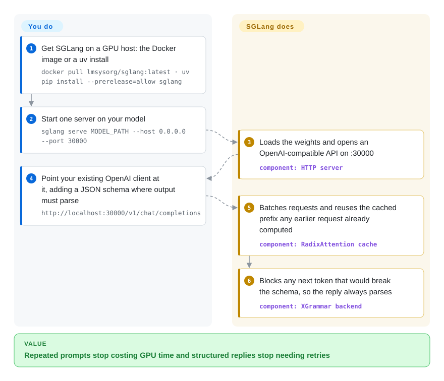

# SGLang

Your agent sends the same 6,000-token system prompt and tool list on every turn, so the GPU recomputes that identical prefix again and again before it writes a single new word, and every JSON reply still has to be validated and sometimes retried. SGLang keeps already-computed prefixes in GPU memory and reuses them for any request that starts the same way, and it can force the output to match a JSON schema or regex while it is being generated.

## When to use

You're a backend engineer running an agent platform on your own GPUs. Each agent run is 20–40 model calls; every call repeats the same long system prompt, tool definitions and conversation so far, and your profiler shows most GPU time going into "prefill" — re-reading that shared prefix — rather than generating answers. On top of that, about one call in fifty returns `{"action": "search", "query": "...` with the closing brace missing, and the retry doubles the latency of that step.

You reach for SGLang: you start one server on the model, point your existing OpenAI client at it, and the engine notices that requests share a prefix and serves them from cache instead of recomputing (RadixAttention); when a request carries a JSON schema, the grammar engine makes malformed output impossible instead of retrying it. Compared with [vLLM](vllm.md), the deciding tradeoff is that SGLang is the engine tuned first for **agentic, prefix-heavy and RL-rollout workloads**, and is the rollout engine many RL frameworks (verl, Miles, slime, AReaL) integrate with — while vLLM still has the broader third-party ecosystem and the longer track record.

## How it works

SGLang is a single server process per model (spanning one or more GPUs) that you start from the command line and talk to over an OpenAI-compatible HTTP API. **You choose the model and the launch flags; the engine does the scheduling, caching and kernels.** Every time a model reads a prompt it produces a KV cache — the intermediate attention results for each token, which are what make the next token cheap to compute. SGLang stores these caches in a radix tree, a prefix tree keyed by token sequence, so a new request that starts with the same system prompt, tools or chat history as an earlier one picks up the cached part and only computes what is new; old branches are evicted when memory runs out. It's like a library that keeps the pages you photocopied yesterday, so tomorrow you only copy the new chapter. For structured output, a grammar backend (XGrammar by default) turns your JSON schema, regex or EBNF into a filter that blocks any next token that would break the format. Scaling past one server — routing across replicas, splitting prefill and decode onto different GPUs — is done with SGLang's companion router and disaggregation modes, which you configure and operate.

<!-- flow-steps:begin (generated from flows/sglang.json by tools/flow_card.py — do not edit) -->

Text version of the flow

1. **You**: Get SGLang on a GPU host: the Docker image or a uv install — `docker pull lmsysorg/sglang:latest · uv pip install --prerelease=allow sglang`
2. **You**: Start one server on your model — `sglang serve MODEL_PATH --host 0.0.0.0 --port 30000`
3. **SGLang**: Loads the weights and opens an OpenAI-compatible API on :30000 — component: `HTTP server`
4. **You**: Point your existing OpenAI client at it, adding a JSON schema where output must parse — `http://localhost:30000/v1/chat/completions`
5. **SGLang**: Batches requests and reuses the cached prefix any earlier request already computed — component: `RadixAttention cache`
6. **SGLang**: Blocks any next token that would break the schema, so the reply always parses — component: `XGrammar backend`

**Value**: Repeated prompts stop costing GPU time and structured replies stop needing retries

<!-- flow-steps:end -->

## When NOT to use

- **Your GPU hosts can't move to a CUDA 13 driver.** Since v0.5.20 (2026-09) SGLang wheels and images require CUDA 13; `v0.5.19-cu129` is the last CUDA 12 build. If your fleet is pinned to an older driver, either stay pinned to 0.5.19 (and lose fixes) or use [vLLM](vllm.md) built for your CUDA version.
- **You want the widest third-party integration surface and the longest production record.** [vLLM](vllm.md) predates SGLang by about a year and more downstream tools, cloud templates and tutorials assume it first; pick it when "every vendor supports it" matters more than prefix-reuse speed.
- **You want a laptop or single-Mac inference tool.** SGLang now runs on Apple Silicon via Metal/MLX, but it is still a server built for datacenter batching; for a single user on a laptop, [Ollama](../local-runtimes/ollama.md) or [llama.cpp](../local-runtimes/llama-cpp.md) are lighter and simpler.
- **You need a "set it and forget it" runtime.** SGLang releases roughly every two weeks (v0.5.16 → v0.5.21 between July and October 2026) and launch flags and defaults move with it; teams that can't re-validate every few weeks should pin a version and budget upgrades, or prefer a slower-moving stack.
- **You need multi-model orchestration, canary releases or autoscaling.** SGLang serves a model; put [Ray Serve](ray-serve.md) or, on Kubernetes, [llm-d](llm-d.md) in front when several models must scale and route together.
- **Your production accelerator is a non-NVIDIA platform you need first-class.** The README lists AMD Instinct, Google TPU, Intel, Ascend and others, but kernel coverage and model support vary by platform; check the platform guide and cookbook for your exact model before committing, and compare [LMDeploy](lmdeploy.md) for Ascend-centric stacks.

## Comparison

| Alternative | In index | Our verdict | Tradeoff |
|---|---|---|---|
| [vLLM](vllm.md) | ✅ | Pick vLLM when broad third-party integration and the longest production record matter most; pick SGLang when prefix reuse, structured output or RL rollout speed decide the budget. | vLLM has the bigger ecosystem and a slower-changing surface; SGLang is often chosen for agent and rollout workloads but moves faster. |
| [TensorRT-LLM](tensorrt-llm.md) | ✅ | Pick TensorRT-LLM when you're all-in on recent NVIDIA GPUs and want NVIDIA's own kernels and support; pick SGLang when you need multi-vendor hardware or a community-governed engine. | TensorRT-LLM is NVIDIA-only and NVIDIA-run, with sparse stable releases; SGLang is vendor-neutral under LMSYS. |
| [LMDeploy](lmdeploy.md) | ✅ | Pick LMDeploy when you want its TurboMind engine and quantization toolkit, especially in the InternLM/Ascend ecosystem; pick SGLang for a larger contributor base and agent/RL-oriented features. | LMDeploy bundles compression and serving in one toolkit; SGLang has a much larger community and faster model coverage. |
| [Modular Platform (MAX + Mojo)](modular.md) | ✅ | Pick MAX when you want one vendor's compiler stack across NVIDIA and AMD with its own kernel language; pick SGLang for an Apache-2.0, community-run engine. | MAX is single-vendor with partly non-production licensing; SGLang is permissive but leaves kernel work to its community. |
| [Ray Serve](ray-serve.md) | ✅ | Use SGLang as the engine and add Ray Serve only when SGLang is one deployment among several models that must compose and autoscale. | Ray Serve adds Python-level orchestration (and can run SGLang as a backend) at the cost of operating a Ray cluster. |
| [Text Generation Inference (TGI)](text-generation-inference.md) | ✅ | Do not start new deployments on TGI — the repository is archived; SGLang or vLLM are the maintained replacements. | TGI had tight Hugging Face integration, but archival ends upstream model and security work. |
| [Ollama](../local-runtimes/ollama.md) / [llama.cpp](../local-runtimes/llama-cpp.md) | ✅ | Pick Ollama/llama.cpp for single-user local or edge inference with GGUF models; pick SGLang for multi-user GPU serving. | The local runtimes run everywhere with tiny setup; SGLang gives far higher multi-user throughput but needs server-class setup. |

## Tech stack

- **Python** — scheduler, HTTP server (FastAPI), tokenizer manager and the `sglang serve` CLI; Python 3.10+.
- **PyTorch** — the tensor runtime (the current build pins torch 2.14.x).
- **GPU kernels** — FlashInfer, FlashAttention 4, DeepGEMM/DeepEP, CUTLASS DSL and SGLang's own kernels; a Rust extension is built at install time.
- **Grammar backends** — XGrammar (default), Outlines and llguidance for `json_schema`, `regex` and `ebnf` constraints.
- **OpenAI- and Anthropic-compatible APIs** — `/v1/chat/completions`, `/v1/completions`, `/v1/embeddings` on port 30000 by default.
- **Distributed modes** — tensor, pipeline, expert and data parallelism; prefill/decode disaggregation; hierarchical KV cache (HiCache) with Mooncake/LMCache integration; SGLang Diffusion for image/video models in the same package.

## Dependencies

- **Hardware** — NVIDIA GPUs (A100, H100/H200, B200/GB200 and selected RTX cards) are the main target; AMD Instinct MI300-series, Google TPU, Intel GPUs/Xeon, Apple Silicon and Huawei Ascend have documented paths.
- **Driver / CUDA** — on NVIDIA, a CUDA 13–compatible driver (Docker images ship CUDA 13); CUDA 12 support ended after v0.5.19.
- **Runtime** — Docker with NVIDIA Container Toolkit (`lmsysorg/sglang:latest`), or `uv pip install --prerelease=allow sglang` into Python 3.10+. Expect several GB of wheels.
- **Models** — Hugging Face model IDs or local checkpoints; the cookbook gives per-model launch flags.
- **Front door (production)** — TLS, auth and multi-replica routing come from a proxy/ingress or SGLang's separate router (SMG), not from the single server.

## Ops difficulty

**High.** One `docker run` gets a model answering, but production is GPU-fleet work:

1. **Driver and CUDA alignment** — the CUDA 13 cut-over means driver upgrades are part of keeping current.
2. **GPU memory and parallelism tuning** — memory fraction, chunked prefill, tensor/expert parallel sizes and cache eviction policy interact; the cookbook helps for popular models, everything else is benchmarking.
3. **Model weights and cold start** — tens to hundreds of GB per model; download, caching and warm-up are yours.
4. **Release velocity** — a release every ~2 weeks; flags and defaults change, so pin versions and re-validate before upgrades.
5. **Scale-out is a second system** — replicas, routing, prefill/decode disaggregation and KV-cache tiers are separate components (router, Mooncake/LMCache) you deploy and monitor, or you hand them to [llm-d](llm-d.md) / [Ray Serve](ray-serve.md).

## Health & viability

- **Maintenance (2026-10).** Very active: v0.5.21 shipped 2026-10-02, with a release roughly every two weeks since July, and commits daily. The scorer could not measure issue responsiveness (no qualifying window signal), so that axis is unknown rather than bad.
- **Governance / bus factor.** Hosted by LMSYS, a non-profit open-source organization. 451 people committed in the last 12 months and the top contributor holds about 7% of commits (top three about 17%), so the project does not hinge on one person.
- **Age & Lindy.** The repository was created in January 2024 — under three years old. Activity is intense, but the Lindy prior is only moderate: it has not yet survived a full infrastructure cycle.
- **Adoption.** ~37k GitHub stars; 2,984,581 PyPI downloads last month; the registry graph shows no dependent repos counted, which understates real use because RL frameworks (verl, Miles, slime, AReaL) and orchestrators (Ray Serve LLM, llm-d, NVIDIA Dynamo) integrate it as a backend.
- **Risk flags.** Apache-2.0, no relicense history, no CLA in the contribution guide. Main risks are churn (CUDA 13 cut-over, fast-moving flags) and dependence on the CUDA/PyTorch stack for the best-supported path.

## Caveats (unverified)

- [未验证] Speed claims for RadixAttention prefix reuse and structured generation come from the project and its blog; not benchmarked here against vLLM on identical hardware.
- [未验证] Maturity of the non-NVIDIA platforms (AMD, TPU, Intel, Ascend, Apple) is listed in the README; per-model coverage on each was not tested.
- [推断] "Many RL frameworks use it for rollout" is based on the README's ecosystem table and the indexed Miles/verl pages, not on usage statistics.
- [未验证] The PyPI download count can swing month to month (CI mirrors, container builds) and is an indicative adoption signal only.
- [推断] The statement that the registry dependency graph understates use is a judgment from the known downstream integrations, not a measurement.
