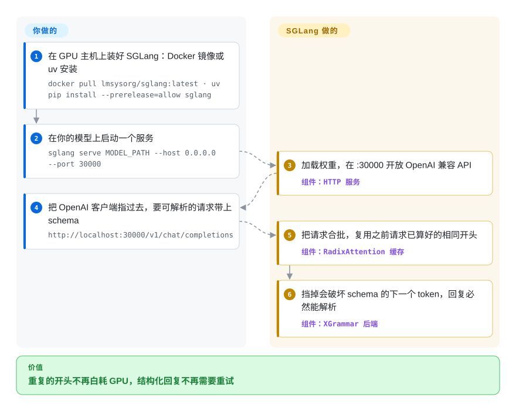

# SGLang

你的 agent 每一轮都带着同一段 6000 token 的系统提示和工具清单，GPU 在写出第一个新字之前，要把这段一模一样的开头一遍遍重算；每个 JSON 回复还得校验，坏了就重试。SGLang 把已经算过的开头留在显存里，只要新请求的开头一样就直接复用；它还能在生成过程中强制输出符合 JSON schema 或正则。

## 何时使用

你是一名后端工程师，在自己的 GPU 上跑一个 agent 平台。每次 agent 运行要调 20–40 次模型；每次调用都重复同一段长系统提示、工具定义和截至目前的对话，性能分析显示大部分 GPU 时间花在 prefill（重新读那段共享开头）上，而不是生成回答。另外大约每五十次调用就有一次返回 `{"action": "search", "query": "...`、少了收尾的大括号，重试一次让这一步的延迟翻倍。

这时你会想到 SGLang：在模型上起一个服务，把现有 OpenAI 客户端指过去，引擎会发现这些请求共享开头，直接从缓存里取而不是重算（RadixAttention）；请求带了 JSON schema 时，语法引擎让坏格式根本写不出来，而不是事后重试。和 [vLLM](vllm.zh.md) 比，起决定作用的取舍是：SGLang 首先为 **agent 式、前缀复用多、强化学习 rollout（让模型批量生成样本供训练打分）** 这类负载调优，也是许多强化学习框架（verl、Miles、slime、AReaL）接入的 rollout 引擎；而 vLLM 仍有更广的第三方生态和更长的生产记录。

## 怎么用起来

SGLang 是每个模型一个服务进程（可以跨一张或多张 GPU），你在命令行里启动它，再通过 OpenAI 兼容的 HTTP API 和它对话。**你选模型和启动参数；调度、缓存和内核由引擎负责。** 模型每读一段提示，就会产出一份 KV 缓存——每个 token 的注意力中间结果，有了它算下一个 token 才便宜。SGLang 把这些缓存存进一棵基数树（按 token 序列做键的前缀树），新请求只要开头和之前某个请求的系统提示、工具或聊天记录相同，就接上缓存部分、只算新增的那段；显存不够时淘汰旧分支。就像图书馆替你留着昨天复印好的页，明天你只需复印新的一章。结构化输出方面，语法后端（默认 XGrammar）把你的 JSON schema、正则或 EBNF 变成一个过滤器，任何会破坏格式的下一个 token 都被挡掉。超出单个服务的扩展——在多个副本间路由、把预填充和解码拆到不同 GPU——靠 SGLang 配套的路由器和拆分模式，配置和运维由你负责。

<!-- flow-steps:begin (generated from flows/sglang.json by tools/flow_card.py — do not edit) -->

流程文字版

1. **你**：在 GPU 主机上装好 SGLang：Docker 镜像或 uv 安装 — `docker pull lmsysorg/sglang:latest · uv pip install --prerelease=allow sglang`
2. **你**：在你的模型上启动一个服务 — `sglang serve MODEL_PATH --host 0.0.0.0 --port 30000`
3. **SGLang**：加载权重，在 :30000 开放 OpenAI 兼容 API — 组件：`HTTP 服务`
4. **你**：把 OpenAI 客户端指过去，要可解析的请求带上 schema — `http://localhost:30000/v1/chat/completions`
5. **SGLang**：把请求合批，复用之前请求已算好的相同开头 — 组件：`RadixAttention 缓存`
6. **SGLang**：挡掉会破坏 schema 的下一个 token，回复必然能解析 — 组件：`XGrammar 后端`

**价值**：重复的开头不再白耗 GPU，结构化回复不再需要重试

<!-- flow-steps:end -->

## 何时不用

- **你的 GPU 主机没法升级到支持 CUDA 13 的驱动。** 从 v0.5.20（2026-09）起，SGLang 的 wheel 和镜像都要求 CUDA 13；`v0.5.19-cu129` 是最后一个 CUDA 12 构建。集群被钉在旧驱动上，要么停在 0.5.19（放弃后续修复），要么用为你的 CUDA 版本构建的 [vLLM](vllm.zh.md)。
- **你要最广的第三方集成面和最长的生产记录。** [vLLM](vllm.zh.md) 比 SGLang 早约一年，更多下游工具、云模板和教程默认先支持它；“各家厂商都支持”比前缀复用速度更重要时，选它。
- **你要的是笔记本或单台 Mac 上的推理工具。** SGLang 现在能通过 Metal/MLX 跑在 Apple Silicon 上，但它仍是为数据中心批处理设计的服务端；单人在笔记本上用，[Ollama](../local-runtimes/ollama.zh.md) 或 [llama.cpp](../local-runtimes/llama-cpp.zh.md) 更轻、更省事。
- **你需要“部署完就不管”的运行时。** SGLang 大约每两周发一版（2026 年 7 月到 10 月从 v0.5.16 走到 v0.5.21），启动参数和默认值跟着变；没法每几周重新验证一次的团队，应钉住版本并预留升级预算，或者选变化更慢的栈。
- **你需要多模型编排、金丝雀发布或自动扩缩。** SGLang 只负责服务一个模型；多个模型要一起扩缩和路由时，在前面加 [Ray Serve](ray-serve.zh.md)，Kubernetes 上则用 [llm-d](llm-d.zh.md)。
- **你的生产加速卡是非 NVIDIA 平台，且要求一等支持。** README 列出了 AMD Instinct、Google TPU、Intel、昇腾等平台，但各平台的内核覆盖和模型支持不一样；上线前按你的具体模型查平台指南和 cookbook，以昇腾为主的栈也可以对比 [LMDeploy](lmdeploy.zh.md)。

## 横向对比

| 替代品 | 是否收录 | 我们的评价 | 取舍 |
|---|---|---|---|
| [vLLM](vllm.zh.md) | ✅ | 最看重第三方集成广度和最长生产记录时，选 vLLM；预算取决于前缀复用、结构化输出或 rollout 速度时，选 SGLang。 | vLLM 生态更大、接口变化更慢；SGLang 常被 agent 与 rollout 负载选中，但变化更快。 |
| [TensorRT-LLM](tensorrt-llm.zh.md) | ✅ | 全押新一代 NVIDIA GPU、想要 NVIDIA 自家内核和支持时，选 TensorRT-LLM；需要多厂商硬件或社区治理的引擎时，选 SGLang。 | TensorRT-LLM 只跑在 NVIDIA 上、由 NVIDIA 主导，正式版发布稀疏；SGLang 厂商中立，由 LMSYS 托管。 |
| [LMDeploy](lmdeploy.zh.md) | ✅ | 想要 TurboMind 引擎和量化工具链、尤其在书生/昇腾生态里时，选 LMDeploy；想要更大的贡献者群体和面向 agent/强化学习的特性时，选 SGLang。 | LMDeploy 把压缩和服务打包在一个工具里；SGLang 社区大得多，新模型跟进更快。 |
| [Modular Platform（MAX + Mojo）](modular.zh.md) | ✅ | 想要单一厂商的编译栈同时覆盖 NVIDIA 和 AMD、并带自有内核语言时，选 MAX；想要 Apache-2.0、社区运营的引擎时，选 SGLang。 | MAX 单一厂商，部分许可不允许生产使用；SGLang 许可宽松，但内核工作靠社区。 |
| [Ray Serve](ray-serve.zh.md) | ✅ | 引擎用 SGLang；只有当 SGLang 是需要组合与自动扩缩的多个模型之一时，才再加 Ray Serve。 | Ray Serve 在上面加 Python 级编排（也能把 SGLang 当后端跑），代价是运维一个 Ray 集群。 |
| [Text Generation Inference（TGI）](text-generation-inference.zh.md) | ✅ | 不要在 TGI 上开新部署——仓库已归档；维护中的替代是 SGLang 或 vLLM。 | TGI 曾与 Hugging Face 集成紧密，但归档后上游不再做新模型和安全工作。 |
| [Ollama](../local-runtimes/ollama.zh.md) / [llama.cpp](../local-runtimes/llama-cpp.zh.md) | ✅ | 单人本地或边缘推理、用 GGUF 模型，选 Ollama/llama.cpp；多用户 GPU 服务，选 SGLang。 | 本地运行时处处能跑、几乎不用配置；SGLang 多用户吞吐高得多，但要服务器级的部署。 |

## 技术栈

- **Python** —— 调度器、HTTP 服务（FastAPI）、分词管理和 `sglang serve` 命令行；Python 3.10+。
- **PyTorch** —— 张量运行时（当前构建钉在 torch 2.14.x）。
- **GPU 内核** —— FlashInfer、FlashAttention 4、DeepGEMM/DeepEP、CUTLASS DSL 以及 SGLang 自己的内核；安装时还会构建一个 Rust 扩展。
- **语法后端** —— XGrammar（默认）、Outlines 和 llguidance，支持 `json_schema`、`regex`、`ebnf` 约束。
- **OpenAI 与 Anthropic 兼容 API** —— 默认端口 30000 上的 `/v1/chat/completions`、`/v1/completions`、`/v1/embeddings`。
- **分布式模式** —— 张量、流水线、专家和数据并行；预填充/解码拆分；分层 KV 缓存（HiCache）及 Mooncake/LMCache 集成；同一个包里还有面向图像/视频模型的 SGLang Diffusion。

## 依赖

- **硬件** —— 主要目标是 NVIDIA GPU（A100、H100/H200、B200/GB200 及部分 RTX 卡）；AMD Instinct MI300 系列、Google TPU、Intel GPU/Xeon、Apple Silicon 和华为昇腾都有文档化的路径。
- **驱动 / CUDA** —— NVIDIA 上需要支持 CUDA 13 的驱动（Docker 镜像自带 CUDA 13）；v0.5.19 之后不再支持 CUDA 12。
- **运行环境** —— 带 NVIDIA Container Toolkit 的 Docker（`lmsysorg/sglang:latest`），或在 Python 3.10+ 里 `uv pip install --prerelease=allow sglang`。wheel 合计数 GB。
- **模型** —— Hugging Face 模型 ID 或本地 checkpoint；cookbook 给出各模型的启动参数。
- **入口（生产）** —— TLS、认证和多副本路由来自代理/ingress 或 SGLang 独立的路由器（SMG），单个服务进程不管这些。

## 运维难度

**高。** 一条 `docker run` 就能让模型答话，但生产是在管一支 GPU 集群：

1. **驱动与 CUDA 对齐** —— 切到 CUDA 13 之后，升级驱动成了保持最新的一部分。
2. **显存与并行调优** —— 显存占比、分块预填充、张量/专家并行规模和缓存淘汰策略相互影响；热门模型有 cookbook，其余要靠基准测试。
3. **模型权重与冷启动** —— 每个模型几十到几百 GB；下载、缓存和预热都归你。
4. **发版速度** —— 约两周一版；参数和默认值会变，升级前钉版本、重新验证。
5. **横向扩展是第二套系统** —— 副本、路由、预填充/解码拆分和 KV 缓存分层都是你要另外部署和监控的组件（路由器、Mooncake/LMCache），或者交给 [llm-d](llm-d.zh.md) / [Ray Serve](ray-serve.zh.md)。

## 健康度与可持续性

- **维护（2026-10）。** 非常活跃：v0.5.21 于 2026-10-02 发布，7 月以来大约每两周一版，每天都有提交。评分器量不到 issue 响应速度（没有符合条件的时间窗信号），所以这一轴是“未知”而不是“差”。
- **治理 / 巴士因子。** 由非营利开源组织 LMSYS 托管。过去 12 个月有 451 人提交过代码，头号贡献者约占 7% 的提交（前三约 17%），项目不系于某一个人。
- **年龄与 Lindy。** 仓库建于 2024 年 1 月，不到三年。活跃度很高，但 Lindy 先验只算中等：它还没熬过一整个基础设施周期。
- **采用度。** 约 3.7 万 GitHub star；上个月 PyPI 下载 2,984,581 次；注册表依赖图上没有统计到依赖仓库，这低估了真实使用，因为强化学习框架（verl、Miles、slime、AReaL）和编排层（Ray Serve LLM、llm-d、NVIDIA Dynamo）都把它当后端接入。
- **风险标志。** Apache-2.0，无改许可证历史，贡献指南里没有 CLA 要求。主要风险是变动快（CUDA 13 切换、参数频繁调整），以及最受支持的路径依赖 CUDA/PyTorch 栈。

## 存疑（未验证）

- [未验证] RadixAttention 前缀复用和结构化生成的速度宣称来自项目本身及其博客；本页没有在相同硬件上与 vLLM 做基准对比。
- [未验证] 非 NVIDIA 平台（AMD、TPU、Intel、昇腾、Apple）的成熟度来自 README 列表；各平台上的逐模型覆盖未经测试。
- [推断] “许多强化学习框架用它做 rollout”依据的是 README 的生态表和已收录的 Miles/verl 页面，不是使用统计。
- [未验证] PyPI 月下载量会随 CI 镜像、容器构建大幅波动，只能当作采用度的参考信号。
- [推断] “注册表依赖图低估了使用”是根据已知下游集成做出的判断，不是测量结果。
