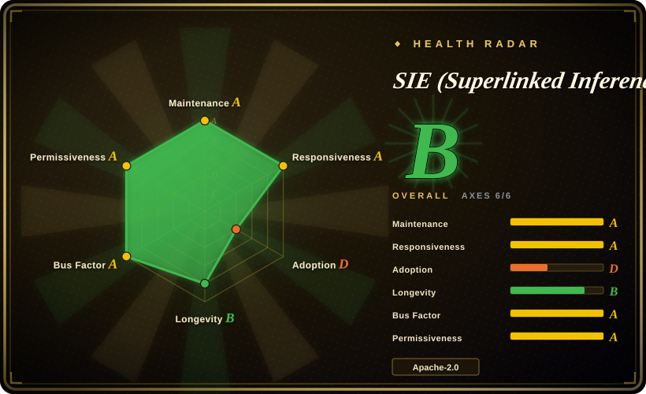
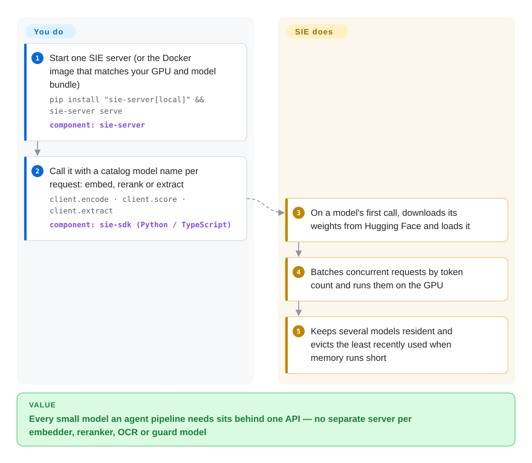

# SIE (Superlinked Inference Engine)

An agent pipeline quietly needs five or six different models — an embedder, a reranker, an OCR model, an entity extractor, a safety classifier, an LLM — and each tends to end up as its own container, its own GPU and its own API shape. SIE serves all of them from one server (or one Kubernetes cluster) behind one API, loading a model the first time it is called and evicting the idle ones.

## When to use

You are the platform engineer behind a retrieval-heavy agent: documents come in as PDFs and scans, get turned into markdown, chunked, embedded with a dense *and* a sparse model, reranked, run through an entity extractor and a content guard before the LLM ever sees them. Today that is `text-embeddings-inference` for the embedder, a second container for the reranker, a hand-rolled FastAPI wrapper around GLiNER, another around an OCR model, and a vLLM box for generation — five deployments, five health checks, and three GPUs that each sit at 10% utilisation because every small model got a whole card. Swapping `bge-m3` for `splade-v3` is a redeploy.

You reach for SIE when the pain is *the number of small models*, not the speed of one big one. One server exposes `encode` / `score` / `extract` / `generate` (plus OpenAI-compatible `/v1/embeddings` and, through the gateway, `/v1/chat/completions`) over a curated catalog of ~200 model configs, and the model is just a string in the request. Against Hugging Face TEI it wins on breadth (OCR, GLiNER extraction, zero-shot classification, guards, Whisper, vision in the same process — TEI is embed/rerank only, one model per container); against Xinference it wins on a production Kubernetes surface shipped in-repo (Rust gateway, KEDA scale-to-zero, Grafana dashboards, Terraform modules for EKS/GKE/AKS/ACK). You pay for that with a very young, fast-moving 0.x codebase from one vendor.

## How it works

SIE is a model server that treats every model as a config file. Each entry in `packages/sie_server/models/` says which Hugging Face weights to fetch, which *adapter* (the small piece of code that knows how to run that model family — FlagEmbedding, GLiNER, Docling, SGLang, TensorRT-LLM…) to use, and which tasks it answers. You start the server and send requests that name a model; SIE downloads that model's weights on first use, packs concurrent requests into GPU batches by token count, and keeps several models resident at once, throwing out the least-recently-used one when GPU memory runs short — like a cache that holds models instead of web pages. What stays yours: picking the right Docker image or bundle (dependency-incompatible model families are split into separate images, e.g. Transformers 4 vs 5, SGLang for OCR/generation), GPU capacity, and — in the cluster mode — running Kubernetes with NATS, KEDA and the observability stack the Helm chart pulls in. In cluster mode a Rust gateway sits in front, routes each request over a NATS JetStream queue to a worker pool that has the model, and lets KEDA scale pools down to zero when idle.

<!-- flow-steps:begin (generated from flows/sie.json by tools/flow_card.py — do not edit) -->

Text version of the flow

1. **You**: Start one SIE server (or the Docker image that matches your GPU and model bundle) — `pip install "sie-server[local]" && sie-server serve` — component: `sie-server`
2. **You**: Call it with a catalog model name per request: embed, rerank or extract — `client.encode · client.score · client.extract` — component: `sie-sdk (Python / TypeScript)`
3. **SIE (Superlinked Inference Engine)**: On a model's first call, downloads its weights from Hugging Face and loads it
4. **SIE (Superlinked Inference Engine)**: Batches concurrent requests by token count and runs them on the GPU
5. **SIE (Superlinked Inference Engine)**: Keeps several models resident and evicts the least recently used when memory runs short

**Value**: Every small model an agent pipeline needs sits behind one API — no separate server per embedder, reranker, OCR or guard model

<!-- flow-steps:end -->

## When NOT to use

- **You serve one embedding model at high QPS and nothing else.** Use Hugging Face `text-embeddings-inference` (TEI) instead — a single Rust binary per model, years older, with a much narrower surface to operate; SIE's multi-model machinery (bundles, LRU eviction, gateway, NATS) is overhead you won't use.
- **Your workload is mainly LLM chat/generation.** Run [vLLM](vllm.md) or [SGLang](sglang.md) directly. SIE's generation path itself delegates to SGLang / TensorRT-LLM / MLX sidecars and needs a separate `sglang` image; it adds a layer, not throughput, for a pure-LLM fleet.
- **You need a stable API you can pin for a year.** Everything is 0.x: the project's own `COMPATIBILITY.md` allows breaking changes in every minor release, and v0.8.0 (2026-09-23) shipped `BREAKING CHANGES` to server launch-arg handling; the week of this review also landed several `feat(helm)!` / `fix(helm)!` breaking chart commits. If you can't absorb migrations, a longer-lived server like TEI or [Ray Serve](ray-serve.md) (compose your own models) is the safer bet.
- **You're on AMD/ROCm or Intel GPUs.** The server ships only CPU, CUDA 12 and CUDA 13 Dockerfiles plus an Apple-Silicon/MLX native path; there is no ROCm image [推断]. Pick [vLLM](vllm.md), which ships ROCm wheels and Intel XPU images.
- **You run no Kubernetes and want a cluster anyway.** The production story is the `sie-cluster` Helm chart with NATS, KEDA, kube-prometheus-stack, Loki, Tempo and DCGM exporter as dependencies; the single `sie-server` process has no built-in multi-node story. On plain VMs, use Xinference (its own distributed mode) or Triton behind your own load balancer.
- **You need a model outside the catalog, fast.** Each model needs a YAML config and must map onto an existing adapter; an arbitrary PyTorch model means writing an adapter. For "serve whatever I export", NVIDIA Triton or [BentoML](bentoml.md) is the general-purpose path.
- **Egress-restricted or telemetry-averse environments.** Anonymous usage telemetry (version, OS, architecture, GPU type) is **on by default** — set `SIE_TELEMETRY_DISABLED=1` or `DO_NOT_TRACK=1` — and weights come from Hugging Face on first call unless you pre-seed the cache.

## Comparison

| Alternative | In index | Our verdict | Tradeoff |
|---|---|---|---|
| Hugging Face Text Embeddings Inference (TEI) | not indexed | For one embedder or reranker at high QPS, pick TEI; pick SIE when the same deployment must also serve OCR, extraction, guards or vision models. | TEI is a mature single-model Rust server with less to operate, but every extra model is another container and it has no extraction/OCR tasks. Not added in this tab-intake batch. |
| Infinity (michaelfeil/infinity) | not indexed | For a lightweight MIT-licensed multi-model embed/rerank/CLIP server on one box, Infinity is simpler; choose SIE when you also need extraction, OCR and a Kubernetes autoscaling cluster. | Infinity is lighter, but its last push was 2026-03-24 (≈6 months before this review), so maintenance is the open question; SIE is active but young. Not added in this tab-intake batch. |
| Xinference (xorbitsai/inference) | not indexed | When the fleet is LLM-first with embeddings on the side, or you're off Kubernetes, pick Xinference; pick SIE when small task models (GLiNER, OCR, guards) are the main load and you want the Helm/KEDA path. | Xinference has a longer track record and its own distributed mode but centres on LLMs; SIE's catalog is deeper on retrieval/extraction models. Not added in this tab-intake batch. |
| [vLLM](vllm.md) | ✅ | For LLM generation throughput, pick vLLM directly; put SIE in front only when the same API must also serve the non-LLM models around the LLM. | vLLM is the de-facto LLM engine with a vast community; SIE adds routing and many small-model adapters, but not LLM speed. |
| [Ray Serve](ray-serve.md) | ✅ | If you want to compose arbitrary models and business logic in Python with your own code, pick Ray Serve; pick SIE when you'd rather take a curated catalog and ready-made adapters than write deployments. | Ray Serve is general and long-lived but you write every model wrapper and run Ray; SIE is turnkey for its catalog but limited to what its adapters cover. |

## Tech stack

- **Server:** Python 3.12 only (`requires-python >=3.12,<3.13`), FastAPI + Uvicorn, PyTorch 2.9.x, Transformers (4.x default bundle, 5.x bundle), sentence-transformers, FlagEmbedding, GLiNER/GLiNER2/GLiClass/GLiFormer, Docling, PEFT for LoRA hot-swap; default wire format msgpack.
- **Generation backends:** SGLang, TensorRT-LLM, MLX (Apple Silicon), plus CTranslate2 and Candle bundles.
- **Cluster:** Rust gateway (axum) routing over NATS JetStream, a separate `sie-config` control plane, Rust server sidecar; Helm chart `sie-cluster` with KEDA, kube-prometheus-stack, DCGM exporter, Loki, Alloy, Tempo, optional cert-manager.
- **SDKs & integrations:** Python `sie-sdk`, TypeScript `@superlinked/sie-sdk`; LangChain, LlamaIndex, Haystack, DSPy, CrewAI, Chroma, Qdrant, Weaviate, LanceDB; an MCP package (`sie_mcp`).

## Dependencies

- **Single server:** Python 3.12 or a Docker image; an NVIDIA GPU (CUDA 12/13) for real throughput, CPU image for testing; Apple Silicon native via `sie-server[local]`.
- **Model weights:** Hugging Face Hub access on first call (a token for gated models), or a pre-populated `~/.cache/huggingface` volume.
- **Bundle choice:** dependency-incompatible families need different images (`default`, `transformers5`, `sglang`, `sglang-vision-extract`, …) — one Python environment cannot hold both Transformers 4 and 5.
- **Cluster mode:** Kubernetes, NATS (JetStream), KEDA, Prometheus/Grafana stack, NVIDIA DCGM exporter; cloud Terraform modules live in separate repos.

## Ops difficulty

**Low for one box, high for the cluster.** A single `docker run` or `sie-server serve` is a quick start, but choosing the right bundle image per model family is a real decision, and first calls block on weight downloads. The cluster mode is a full platform: a Rust gateway, a config service, NATS JetStream, KEDA autoscaling and an observability stack of 8+ Helm sub-charts, with chart-level breaking changes landing in 0.x minors. Open issues at review time show the edges still being found — KEDA scaling a worker lane to zero while its model is loading (#293), GLiClass requests waiting minutes under mixed load (#390).

## Health & viability

- **Maintenance (2026-09-30):** extremely active — 52 releases between v0.1.7 (2026-04-01) and v0.8.3 (2026-09-26), 100+ commits in the last 30 days, release-please automation, a written `COMPATIBILITY.md`. Pace is itself a risk: breaking changes ship often.
- **Age / Lindy — read carefully:** the GitHub repo dates from 2023-11, but it was the old Superlinked vector-framework repo; SIE's own history starts with an "Initial commit" on 2026-04-01, and the old framework was moved to `superlinked/superlinked` and archived on 2026-04-02. SIE is **~6 months old**; treat the ~3.3k stars and 315 forks as largely inherited from the previous product [推断], not as SIE adoption.
- **Governance / backing:** single-vendor (Superlinked, a venture-backed company [未验证]); a small core team — top contributors `svonava`, `krisztian-gajdar`, `fm1320`, `huronat`, `mamayer19` account for almost all human commits. The company already pivoted its flagship open-source product once (framework → inference engine), which is the main longevity risk.
- **Adoption:** early. npm `@superlinked/sie-sdk` measured 3070 downloads in the last month (health scorer, 2026-09-30); issues are mostly filed by the team itself.
- **Risk flags:** Apache-2.0 across server, chart and Terraform modules (no open-core gating seen in the repo); telemetry on by default; 0.x API with frequent breaking minors.

## Caveats (unverified)

- [推断] Most of the ~3.3k stars and 315 forks predate SIE (inherited from the renamed Superlinked framework repo created 2023-11); GitHub does not split stars by product, so SIE's own adoption can't be measured from them.
- [推断] No AMD ROCm / Intel GPU support: based on `packages/sie_server` shipping only `Dockerfile.cpu`, `Dockerfile.cuda12` and `Dockerfile.cuda13` plus an MLX path; not tested, and a native install might partially work.
- [未验证] Superlinked is venture-backed — from general knowledge, not a source read during this review.
- [未验证] "Serves 100+ models" / MTEB benchmark claims — the repo holds 198 model YAML configs (counted 2026-09-30), but that each loads and performs as claimed was not reproduced.
- [未验证] The telemetry payload is limited to version/OS/architecture/GPU type as the README states; the collection code was not audited.
- [推断] The radar's longevity grade (B) is computed from the repo's 1,058-day age, which includes the pre-SIE framework history; SIE's own age is ~6 months, so that axis overstates it.
- [推断] Adoption beyond the vendor is thin — based on npm downloads and the open-issue authors; PyPI download counts were rate-limited during this review.
