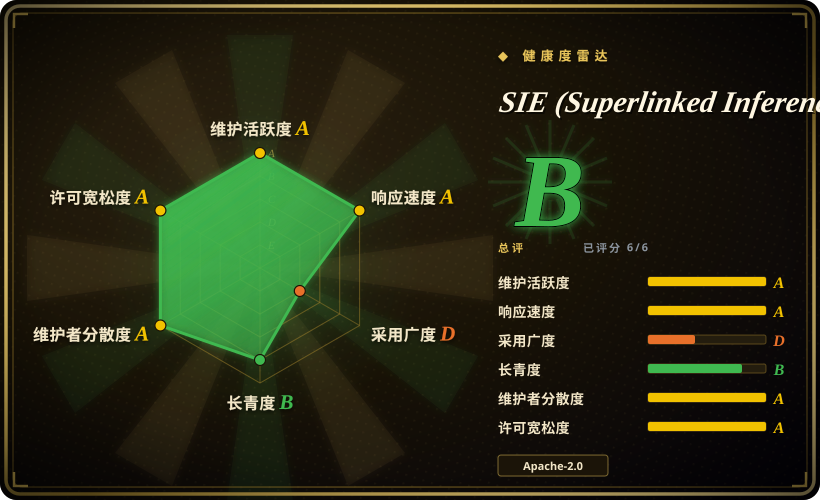
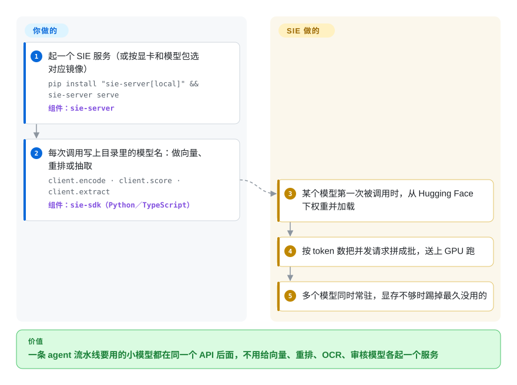

# SIE (Superlinked Inference Engine)

一条 agent 流水线背后往往悄悄要五六个模型：向量模型、重排模型、OCR、实体抽取、内容审核、再加一个大模型，结果每个都各占一个容器、一张显卡、一套接口。SIE 把它们都放进同一个服务（或同一个 Kubernetes 集群）、同一套 API 后面：哪个模型第一次被调用才加载，闲着的自动腾出显存。

## 何时使用

你是一个检索型 agent 的平台工程师：文档以 PDF 和扫描件进来，要先转成 markdown、切块，再用稠密和稀疏两个模型做向量，重排，过一遍实体抽取和内容审核，最后才交给大模型。眼下的样子是：向量模型跑在 `text-embeddings-inference` 里，重排模型另起一个容器，GLiNER 包了一个手写的 FastAPI，OCR 模型又包了一个，生成走一台 vLLM——五套部署、五个健康检查，三张显卡各自只有 10% 利用率，因为每个小模型都独占了一整张卡。想把 `bge-m3` 换成 `splade-v3`，就得重新部署一次。

当你的痛点是“小模型太多”而不是“某个大模型不够快”时，就该想到 SIE。一个服务同时提供 `encode`／`score`／`extract`／`generate`（外加 OpenAI 兼容的 `/v1/embeddings`，集群网关还提供 `/v1/chat/completions`），背后是约 200 份精选模型配置，模型只是请求里的一个字符串。和 Hugging Face TEI 比，它赢在覆盖面：OCR、GLiNER 抽取、零样本分类、审核模型、Whisper、视觉模型都在同一个进程里，而 TEI 只做向量和重排、一个容器一个模型；和 Xinference 比，它赢在仓库里自带一整套生产级 Kubernetes 方案：Rust 网关、KEDA 缩容到零、Grafana 看板，以及 EKS／GKE／AKS／ACK 的 Terraform 模块。代价是：这是一家厂商维护、非常年轻、改动很快的 0.x 代码库。

## 怎么用起来

SIE 是一个“把每个模型当成一份配置文件”的模型服务。`packages/sie_server/models/` 里每一项写明：去 Hugging Face 拉哪份权重、用哪个 *adapter*（适配器，就是知道怎么跑某一类模型的那一小段代码，比如 FlagEmbedding、GLiNER、Docling、SGLang、TensorRT-LLM），以及它能做哪些任务。你启动服务、在请求里写上模型名；SIE 在第一次用到某个模型时下载权重，按 token 数把并发请求拼成 GPU 批次，同时让多个模型常驻，显存不够时踢掉最久没用的那个——像一个缓存，只不过缓存的是模型而不是网页。留给你的是：为每类模型选对 Docker 镜像或模型包（依赖互相冲突的模型族被拆进不同镜像，比如 Transformers 4 和 5 分开，OCR 与生成走 SGLang 镜像）、准备 GPU 容量，以及在集群模式下运维 Kubernetes 和 Helm chart 拉进来的 NATS、KEDA 与观测栈。集群模式前面还有一个 Rust 网关，它通过 NATS JetStream 队列把请求派给装有该模型的 worker 池，并让 KEDA 在空闲时把池子缩到零。

<!-- flow-steps:begin (generated from flows/sie.json by tools/flow_card.py — do not edit) -->

流程文字版

1. **你**：起一个 SIE 服务（或按显卡和模型包选对应镜像） — `pip install "sie-server[local]" && sie-server serve` — 组件：`sie-server`
2. **你**：每次调用写上目录里的模型名：做向量、重排或抽取 — `client.encode · client.score · client.extract` — 组件：`sie-sdk（Python／TypeScript）`
3. **SIE (Superlinked Inference Engine)**：某个模型第一次被调用时，从 Hugging Face 下权重并加载
4. **SIE (Superlinked Inference Engine)**：按 token 数把并发请求拼成批，送上 GPU 跑
5. **SIE (Superlinked Inference Engine)**：多个模型同时常驻，显存不够时踢掉最久没用的

**价值**：一条 agent 流水线要用的小模型都在同一个 API 后面，不用给向量、重排、OCR、审核模型各起一个服务

<!-- flow-steps:end -->

## 何时不用

- **你只需要高 QPS 地服务一个向量模型。** 改用 Hugging Face `text-embeddings-inference`（TEI）：一个模型一个 Rust 二进制，历史长好几年，要运维的面窄得多；SIE 的多模型机制（模型包、LRU 淘汰、网关、NATS）对你只是额外负担。
- **你的负载主要是大模型对话／生成。** 直接跑 [vLLM](vllm.zh.md) 或 [SGLang](sglang.zh.md)。SIE 的生成链路本身就是交给 SGLang／TensorRT-LLM／MLX 旁路进程去跑，还要单独的 `sglang` 镜像；对纯大模型集群它只多加一层，不多出吞吐。
- **你要一个能钉住一年的稳定 API。** 现在全部是 0.x：项目自己的 `COMPATIBILITY.md` 允许每个 minor 版本带破坏性变更，v0.8.0（2026-09-23）就在服务启动参数上发了 `BREAKING CHANGES`，本次复核的这一周又合进了好几个 `feat(helm)!`／`fix(helm)!` 破坏性 chart 提交。吸收不了迁移成本的话，TEI 或 [Ray Serve](ray-serve.zh.md)（自己组合模型）这类存活更久的方案更稳。
- **你用的是 AMD／ROCm 或 Intel 显卡。** 服务端只有 CPU、CUDA 12、CUDA 13 三个 Dockerfile，外加 Apple Silicon／MLX 本地路径，没有 ROCm 镜像 [推断]。改选 [vLLM](vllm.zh.md)，它提供 ROCm wheel 和 Intel XPU 镜像。
- **你没有 Kubernetes，却想要集群。** 生产方案就是 `sie-cluster` Helm chart，依赖 NATS、KEDA、kube-prometheus-stack、Loki、Tempo 和 DCGM exporter；单个 `sie-server` 进程没有内建多机方案。在普通虚拟机上，用 Xinference（自带分布式部署）或自己加负载均衡的 Triton。
- **你急着要跑一个目录外的模型。** 每个模型都要一份 YAML 配置，还得能对上已有的适配器；任意 PyTorch 模型就意味着自己写适配器。要“导出什么就服务什么”，走 NVIDIA Triton 或 [BentoML](bentoml.zh.md) 这类通用路线。
- **出网受限或不接受遥测的环境。** 匿名使用遥测（版本、操作系统、CPU 架构、GPU 型号）**默认开启**，要设 `SIE_TELEMETRY_DISABLED=1` 或 `DO_NOT_TRACK=1` 关掉；权重也是首次调用时从 Hugging Face 下载，除非你预先灌好缓存。

## 横向对比

| 替代品 | 是否收录 | 我们的评价 | 取舍 |
|---|---|---|---|
| Hugging Face Text Embeddings Inference（TEI） | 未收录 | 只要一个向量或重排模型扛高 QPS，选 TEI；同一套部署还得服务 OCR、抽取、审核或视觉模型时，选 SIE。 | TEI 是成熟的单模型 Rust 服务，要运维的东西少，但每多一个模型就多一个容器，也没有抽取／OCR 任务。本批次（标签页收录）未新增此页。 |
| Infinity（michaelfeil/infinity） | 未收录 | 单机上要一个轻量、MIT 许可、能同时跑向量／重排／CLIP 的多模型服务，Infinity 更简单；还要抽取、OCR 和 Kubernetes 自动扩缩集群时，选 SIE。 | Infinity 更轻，但最后一次推送是 2026-03-24（距本次复核约 6 个月），维护状态是悬念；SIE 很活跃但很年轻。本批次（标签页收录）未新增此页。 |
| Xinference（xorbitsai/inference） | 未收录 | 集群以大模型为主、向量只是顺带，或者你不在 Kubernetes 上，选 Xinference；主要负载是 GLiNER、OCR、审核这类小任务模型、又想走 Helm／KEDA 路线时，选 SIE。 | Xinference 历史更长、自带分布式模式，但重心在大模型；SIE 在检索／抽取类模型上的目录更深。本批次（标签页收录）未新增此页。 |
| [vLLM](vllm.zh.md) | ✅ | 要大模型生成吞吐，直接选 vLLM；只有当同一套 API 还得服务大模型周边那些非大模型时，才在前面放 SIE。 | vLLM 是事实标准的大模型引擎、社区庞大；SIE 多了路由和一堆小模型适配器，但不提升大模型速度。 |
| [Ray Serve](ray-serve.zh.md) | ✅ | 想用 Python 自由组合任意模型和业务逻辑，选 Ray Serve；宁可用现成模型目录和适配器、也不想自己写部署代码时，选 SIE。 | Ray Serve 通用且存活久，但每个模型的包装都要你写、还要运维 Ray；SIE 对目录内模型开箱即用，但只覆盖它的适配器能跑的模型。 |

## 技术栈

- **服务端：** 仅支持 Python 3.12（`requires-python >=3.12,<3.13`），FastAPI + Uvicorn，PyTorch 2.9.x，Transformers（默认包用 4.x，另有 5.x 包），sentence-transformers，FlagEmbedding，GLiNER／GLiNER2／GLiClass／GLiFormer，Docling，用 PEFT 做 LoRA 热切换；默认传输格式是 msgpack。
- **生成后端：** SGLang、TensorRT-LLM、MLX（Apple Silicon），另有 CTranslate2 和 Candle 模型包。
- **集群：** Rust 网关（axum）经 NATS JetStream 路由，独立的 `sie-config` 控制面，Rust 服务端 sidecar；Helm chart `sie-cluster` 带 KEDA、kube-prometheus-stack、DCGM exporter、Loki、Alloy、Tempo，可选 cert-manager。
- **SDK 与集成：** Python `sie-sdk`、TypeScript `@superlinked/sie-sdk`；LangChain、LlamaIndex、Haystack、DSPy、CrewAI、Chroma、Qdrant、Weaviate、LanceDB；还有一个 MCP 包（`sie_mcp`）。

## 依赖

- **单机服务：** Python 3.12 或 Docker 镜像；要真正的吞吐需要 NVIDIA GPU（CUDA 12／13），CPU 镜像用于测试；Apple Silicon 可用 `sie-server[local]` 本地跑。
- **模型权重：** 首次调用需要能访问 Hugging Face Hub（受限模型要 token），或者预先准备好的 `~/.cache/huggingface` 卷。
- **模型包选择：** 依赖冲突的模型族要用不同镜像（`default`、`transformers5`、`sglang`、`sglang-vision-extract` 等）——同一个 Python 环境装不下 Transformers 4 和 5。
- **集群模式：** Kubernetes、NATS（JetStream）、KEDA、Prometheus／Grafana 观测栈、NVIDIA DCGM exporter；各云的 Terraform 模块在独立仓库里。

## 运维难度

**单机低，集群高。** 一条 `docker run` 或 `sie-server serve` 就能起来，但给每类模型选对镜像是个实打实的决定，而且首次调用会卡在下载权重上。集群模式是一整套平台：Rust 网关、配置服务、NATS JetStream、KEDA 自动扩缩，外加 8 个以上 Helm 子 chart 组成的观测栈，而且 chart 层面的破坏性变更会出现在 0.x 的 minor 版本里。复核时的未关 issue 显示边界还在被摸索：KEDA 会在模型加载中途把 worker 通道缩到零（#293），混合负载下 GLiClass 请求要排队好几分钟（#390）。

## 健康度与可持续性

- **维护（2026-09-30）：** 极其活跃——从 v0.1.7（2026-04-01）到 v0.8.3（2026-09-26）共 52 个 release，最近 30 天 100 多个提交，用 release-please 自动发版，有成文的 `COMPATIBILITY.md`。节奏本身也是风险：破坏性变更来得很勤。
- **年龄／Lindy——要细看：** GitHub 仓库创建于 2023-11，但那是 Superlinked 旧的向量框架仓库；SIE 自己的历史从 2026-04-01 的 “Initial commit” 开始，旧框架被挪到 `superlinked/superlinked` 并于 2026-04-02 归档。SIE 实际只有**约 6 个月**；约 3.3k star 和 315 个 fork 大多是从上一个产品继承来的 [推断]，不能当成 SIE 本身的采用度。
- **治理／背后力量：** 单一厂商（Superlinked，一家有风投背景的公司 [未验证]）；核心团队很小——`svonava`、`krisztian-gajdar`、`fm1320`、`huronat`、`mamayer19` 几乎包揽了全部人工提交。公司已经把旗舰开源产品转向过一次（框架 → 推理引擎），这是长期存续的主要风险。
- **采用度：** 早期。npm 上 `@superlinked/sie-sdk` 最近一个月下载量为 3070（健康度评分器 2026-09-30 测得）；issue 大多是团队自己提的。
- **风险信号：** 服务端、chart 和 Terraform 模块都是 Apache-2.0（仓库里没看到开源核心式的功能分层）；遥测默认开启；0.x API，minor 版本频繁带破坏性变更。

## 存疑（未验证）

- [推断] 约 3.3k star 和 315 个 fork 大部分早于 SIE（继承自 2023-11 创建、后被改名的 Superlinked 框架仓库）；GitHub 不按产品拆分 star，所以没法用它衡量 SIE 自身的采用度。
- [推断] 不支持 AMD ROCm／Intel GPU：依据是 `packages/sie_server` 只有 `Dockerfile.cpu`、`Dockerfile.cuda12`、`Dockerfile.cuda13` 和一条 MLX 路径；没有实测，原生安装也许能部分跑通。
- [未验证] Superlinked 有风投背景——来自一般认知，本次复核没有读到出处。
- [未验证] “服务 100 多个模型”和 MTEB 基准结论——仓库里有 198 份模型 YAML 配置（2026-09-30 计数），但每个都能加载并达到宣称效果，没有复现。
- [未验证] 遥测只收版本、操作系统、架构、GPU 型号，这是 README 的说法；采集代码没有审计。
- [推断] 雷达上的存续性（longevity）B 档按仓库 1,058 天的年龄计算，其中包含 SIE 之前的框架历史；SIE 自身只有约 6 个月，这一轴被高估了。
- [推断] 厂商之外的采用还很薄——依据是 npm 下载量和未关 issue 的作者；本次复核时 PyPI 下载量接口被限流。
