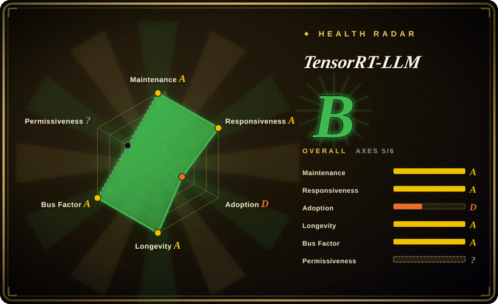
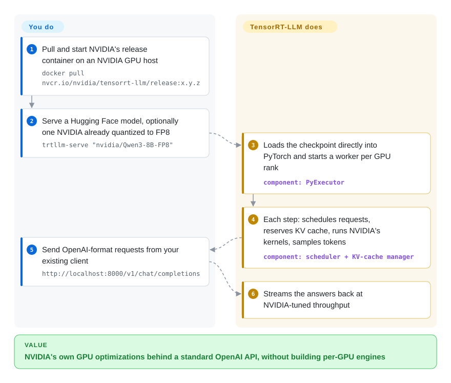

# TensorRT-LLM

You rent H100s or B200s by the hour, and the cost of every million tokens is set by how much of that GPU your inference engine actually uses — the newest hardware features (4-bit FP4 math, rack-wide NVLink) arrive first in NVIDIA's own code, months before generic engines catch up. TensorRT-LLM (now spelled "TensorRT LLM") is NVIDIA's own LLM serving engine: you point it at a Hugging Face model, and it runs it with NVIDIA-tuned kernels behind an OpenAI-compatible server.

## When to use

You're an ML infrastructure engineer serving a high-traffic model — say a large mixture-of-experts model like DeepSeek or Qwen3 — on Hopper or Blackwell GPUs, and you already run an open engine. Your benchmarks show NVIDIA publishing tokens-per-second numbers for the same model on the same GPUs that you can't reproduce, because they rely on FP4 checkpoints, wide expert parallelism across an NVL72 rack, or prefill/decode disaggregation tuned for that hardware. At your volume, a 20% throughput gap is a line item in the budget.

You reach for TensorRT-LLM: `trtllm-serve` on a model from NVIDIA's pre-quantized collection gives you an OpenAI-compatible endpoint running NVIDIA's own kernels, and the same LLM API plugs into NVIDIA Dynamo or Triton Inference Server when you scale out. The old reason to avoid it — a separate per-GPU "engine build" step — is gone: since 1.0 the default backend is PyTorch and Hugging Face checkpoints load directly. The deciding tradeoff against [vLLM](vllm.md) or [SGLang](sglang.md) is **NVIDIA-first performance and support versus portability and community governance**: you get NVIDIA's newest optimizations early, and in exchange you are NVIDIA-only, follow NVIDIA's release cadence, and accept on-by-default telemetry.

## How it works

TensorRT-LLM today is a PyTorch program with NVIDIA's specialised GPU code underneath. **You choose the model, precision and parallelism; NVIDIA's engine does the scheduling, memory management and the GPU math.** When you start `trtllm-serve` (or create an `LLM` object in Python), it loads the Hugging Face checkpoint as PyTorch modules and starts a worker per GPU rank. Each worker runs a loop: a scheduler picks which waiting requests run this step, a KV-cache manager reserves memory for them (the KV cache holds the attention results for tokens already processed, so they aren't recomputed), the model runs on NVIDIA's kernels — some open CUDA, some shipped only as precompiled GPU binaries — and a sampler turns the raw scores into the next token. Think of a race team: you pick the car and the driver, NVIDIA's pit crew tunes the engine for that exact track. Quantizing a model to FP8/FP4 is a separate step done with NVIDIA's Model Optimizer, or skipped by using a checkpoint NVIDIA already quantized.

<!-- flow-steps:begin (generated from flows/tensorrt-llm.json by tools/flow_card.py — do not edit) -->

Text version of the flow

1. **You**: Pull and start NVIDIA's release container on an NVIDIA GPU host — `docker pull nvcr.io/nvidia/tensorrt-llm/release:x.y.z`
2. **You**: Serve a Hugging Face model, optionally one NVIDIA already quantized to FP8 — `trtllm-serve "nvidia/Qwen3-8B-FP8"`
3. **TensorRT-LLM**: Loads the checkpoint directly into PyTorch and starts a worker per GPU rank — component: `PyExecutor`
4. **TensorRT-LLM**: Each step: schedules requests, reserves KV cache, runs NVIDIA's kernels, samples tokens — component: `scheduler + KV-cache manager`
5. **You**: Send OpenAI-format requests from your existing client — `http://localhost:8000/v1/chat/completions`
6. **TensorRT-LLM**: Streams the answers back at NVIDIA-tuned throughput

**Value**: NVIDIA's own GPU optimizations behind a standard OpenAI API, without building per-GPU engines

<!-- flow-steps:end -->

## When NOT to use

- **You don't have NVIDIA GPUs, or need to keep the option of leaving.** It runs only on NVIDIA (Ampere A100 through Blackwell). For AMD, TPU or mixed fleets use [vLLM](vllm.md) or [SGLang](sglang.md); for a vendor-portable compiler stack, look at [Modular MAX](modular.md).
- **Your GPUs are older or consumer-grade.** NVIDIA's support list names A100, Ada L20/L40/L40S, Hopper and Blackwell; V100/T4 and most RTX cards aren't on it. Use vLLM or, for local use, [llama.cpp](../local-runtimes/llama-cpp.md).
- **You need every performance-critical kernel as readable source.** Most kernels are open CUDA, but the trtllm-gen attention and GEMM kernels ship as thousands of precompiled cubin files and static libraries — you can call them, not read or patch them. If auditability down to the kernel matters, [vLLM](vllm.md) or [SGLang](sglang.md) are the open options.
- **You can't accept telemetry by default.** It collects anonymous usage data (GPU SKUs, model architecture, configuration flags, lifecycle events) unless you opt out with `TRTLLM_NO_USAGE_STATS=1`, `DO_NOT_TRACK=1`, `--no-telemetry` or a `~/.config/trtllm/do_not_track` file. In locked-down environments make the opt-out part of the image — or pick an engine without telemetry.
- **You want frequent, stable releases.** Stable releases are sparse (1.2.0 March 2026, 1.2.1 April 2026) while 1.3 has been in release candidates since January 2026 (rc29 by late September). Teams that only run GA versions get new features months late; teams that run RCs take on RC risk. vLLM and SGLang ship stable releases every few weeks.
- **You still depend on prebuilt TensorRT engines.** The engine-build path (`trtllm-build`, `convert_checkpoint.py`) was removed from main in 2026; only the 1.2.x line still has it as a legacy option. Plan a migration to loading Hugging Face checkpoints directly, or stay pinned and accept that new fixes won't reach that path.
- **You need multi-model orchestration or autoscaling.** It serves a model; put [Ray Serve](ray-serve.md), NVIDIA Dynamo (not indexed) or, on Kubernetes, [llm-d](llm-d.md) in front for fleet-level routing.
- **You serve low volume on one GPU.** The tuning effort pays off at fleet scale; for a single GPU or a dev box, [vLLM](vllm.md) or [Ollama](../local-runtimes/ollama.md) are simpler and close enough.

## Comparison

| Alternative | In index | Our verdict | Tradeoff |
|---|---|---|---|
| [vLLM](vllm.md) | ✅ | Pick vLLM as the default open engine across vendors and older GPUs; pick TensorRT-LLM when you're on Hopper/Blackwell at scale and NVIDIA's kernels measurably beat it on your model. | vLLM is portable, community-governed and ships stable releases often; TensorRT-LLM gets NVIDIA's newest optimizations first but locks you to NVIDIA. |
| [SGLang](sglang.md) | ✅ | Pick SGLang for prefix-heavy agent traffic, RL rollouts or multi-vendor hardware; pick TensorRT-LLM when NVIDIA-specific features (FP4, NVL72-scale expert parallelism) drive cost. | SGLang is vendor-neutral and moves fast; TensorRT-LLM is NVIDIA-run with partly binary kernels and sparse GA releases. |
| [Modular Platform (MAX + Mojo)](modular.md) | ✅ | Pick MAX when you want one vendor's stack that targets both NVIDIA and AMD; pick TensorRT-LLM when you're NVIDIA-only and want the GPU maker's own engine. | Both are single-vendor; MAX trades NVIDIA-specific depth for cross-vendor reach and has partly non-production licensing. |
| [LMDeploy](lmdeploy.md) | ✅ | Pick LMDeploy for its TurboMind engine and quantization toolkit in the InternLM/Ascend ecosystem; pick TensorRT-LLM for the deepest NVIDIA datacenter optimizations. | LMDeploy also covers Ascend; TensorRT-LLM covers only NVIDIA but goes further on new NVIDIA hardware. |
| [Ray Serve](ray-serve.md) | ✅ | Not either/or: use TensorRT-LLM as the engine and add Ray Serve only when it must sit beside other models that compose and autoscale. | Ray Serve adds Python-level orchestration at the cost of running a Ray cluster; it does not speed up the engine. |
| [Text Generation Inference (TGI)](text-generation-inference.md) | ✅ | Do not start new deployments on TGI — the repository is archived; choose a maintained engine (vLLM, SGLang or TensorRT-LLM). | TGI's Hugging Face integration no longer receives upstream model or security work. |
| [Ollama](../local-runtimes/ollama.md) / [llama.cpp](../local-runtimes/llama-cpp.md) | ✅ | Pick Ollama/llama.cpp for local or edge inference on laptops and consumer GPUs; pick TensorRT-LLM for datacenter NVIDIA fleets. | The local runtimes run almost anywhere with minimal setup; TensorRT-LLM needs datacenter GPUs and NVIDIA's software stack. |

## Tech stack

- **Python + PyTorch** — the sole execution backend on main (default since 1.0): the `LLM` API, `trtllm-serve`, the per-rank `PyExecutor` loop (scheduler, KV-cache manager, model engine, sampler); Python 3.10+, torch 2.14.
- **C++ runtime and CUDA kernels** — about 350 open `.cu` sources plus the trtllm-gen attention/GEMM kernels distributed as precompiled cubins and static libraries.
- **Optimizations** — FP8/FP4 (NVFP4) quantized inference, speculative decoding, prefill/decode disaggregation, wide expert parallelism, CUDA graphs, guided decoding (XGrammar/llguidance).
- **Serving** — `trtllm-serve` exposes an OpenAI-compatible API (`/v1/chat/completions` on port 8000 in the quick start); integrates with NVIDIA Dynamo and Triton Inference Server for fleets.
- **Telemetry** — anonymous usage collector in `tensorrt_llm/usage/`, on by default with documented opt-outs.
- **TensorRT** — the legacy engine backend that gave the project its name; removed from main in 2026, still present as a legacy option in 1.2.x.

## Dependencies

- **Hardware** — NVIDIA GPUs only: Blackwell (B200/GB200/B300/GB300, DGX Spark), Hopper (H100/H200/GH200), Ada (L20, L40/L40S), Ampere A100.
- **Software stack** — CUDA 13.x (the pip path asks for CUDA Toolkit 13.4 and `CUDA_HOME`), matching PyTorch build, OpenMPI; tested on Ubuntu 24.04.
- **Install path** — easiest is the NGC release container (`nvcr.io/nvidia/tensorrt-llm/release:x.y.z`); the PyPI wheel is built against public PyTorch and may not match NGC PyTorch containers.
- **Models** — Hugging Face checkpoints load directly; NVIDIA publishes pre-quantized FP8/FP4 checkpoints, and NVIDIA Model Optimizer produces your own.
- **Optional** — `libzmq` for disaggregated serving; Dynamo or Triton for multi-node fleets.

## Ops difficulty

**High.** The PyTorch backend removed the worst of the old build pain, but this is still NVIDIA-datacenter work:

1. **Stack alignment** — driver, CUDA 13.x, PyTorch build and the container tag must match; the NGC container is the path of least resistance and ties you to NVIDIA's image cadence.
2. **Release-line choice** — GA releases are months apart while RCs land weekly; you decide between stale-but-stable and current-but-RC, and re-validate on every jump.
3. **Tuning expertise** — precision (FP8 vs FP4), parallelism layout, CUDA-graph batch sizes and disaggregation ratios decide whether you actually beat an open engine; NVIDIA's deployment guides cover popular models, the rest is benchmarking.
4. **Telemetry policy** — the opt-out has to be baked into images and launch commands in regulated environments.
5. **Scale-out is separate** — routing, autoscaling and multi-model serving come from Dynamo, Triton, Kubernetes or Ray Serve, not from the engine.

## Health & viability

- **Maintenance (2026-10).** Very active on main — commits daily and a 1.3 release candidate roughly every week or two (rc29 on 2026-09-29) — but the last stable release is 1.2.1 (2026-04-20), and 1.3 has been in RC since January 2026. Active, with a slow GA cadence.
- **Governance / bus factor.** NVIDIA owns the roadmap. 357 accounts committed in the last 12 months and the top committer holds about 8% (top three about 16%), so it is not a one-person project; note that two of the top contributors are CI/agent bot accounts.
- **Age & Lindy.** Public since August 2023 — about three years — and it has already gone through one architecture change (TensorRT engines to PyTorch). Moderate Lindy prior: young, but backed by the GPU vendor with every incentive to keep it competitive.
- **Adoption.** ~14.8k GitHub stars; on PyPI only 13,654 downloads last month and no dependent repos counted, because most users run NVIDIA's NGC containers rather than pip — the registry signal understates real use (NVIDIA Dynamo and Triton ship it as a backend).
- **Risk flags.** The LICENSE file states Apache-2.0 for the project with bundled third-party notices (the scorer couldn't parse it, hence the unknown license axis). Real risks: single-vendor control, kernels partly shipped as binaries, telemetry on by default, and API churn across major backend changes.

## Caveats (unverified)

- [未验证] Throughput advantages over vLLM/SGLang on the same NVIDIA hardware come from NVIDIA's blogs and benchmarks; not reproduced here.
- [推断] "Most users run NGC containers rather than pip" is inferred from the install guide ordering and the low PyPI count, not from usage data.
- [未验证] The exact set of models and quantization formats supported on each GPU generation was not checked beyond the supported-hardware page.
- [推断] The count of precompiled kernels (~9,300 cubin files under `cpp/tensorrt_llm/kernels/`) is from a repository tree listing on 2026-10-08; which of them are on the hot path for a given model was not traced.
- [未验证] Whether the 1.3 GA will ship without the TensorRT backend exactly as on main is not confirmed until the release notes are published.
