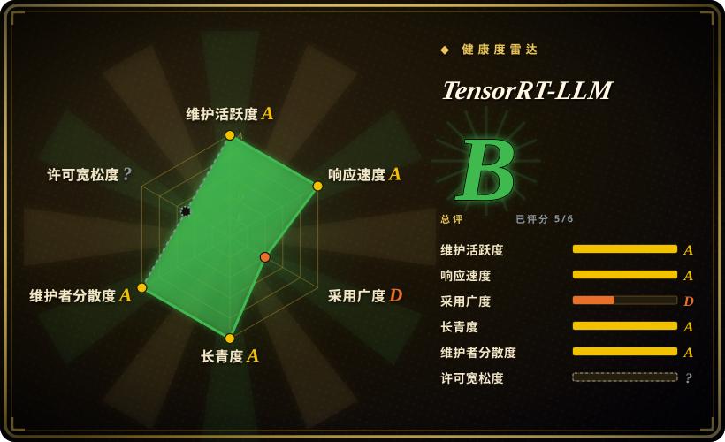
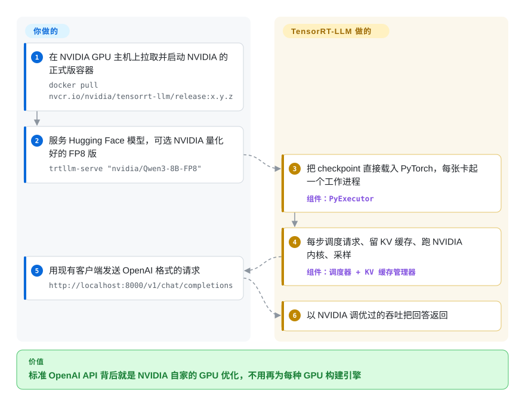

# TensorRT-LLM

你按小时租 H100 或 B200，每百万 token 的成本取决于推理引擎到底用上了多少 GPU——而新硬件的特性（4 位 FP4 运算、整机柜 NVLink）总是先出现在 NVIDIA 自己的代码里，通用引擎要晚几个月才跟上。TensorRT-LLM（现在官方写作“TensorRT LLM”）是 NVIDIA 自家的大模型服务引擎：你把它指向一个 Hugging Face 模型，它用 NVIDIA 调优的内核跑起来，前面挂一个 OpenAI 兼容服务。

## 何时使用

你是一名 ML 基础设施工程师，在 Hopper 或 Blackwell GPU 上服务一个高流量模型——比如 DeepSeek 或 Qwen3 这类大型混合专家模型——手上已经在跑一个开源引擎。基准测试显示，NVIDIA 公布的同模型、同 GPU 的每秒 token 数你复现不出来，因为那些数字依赖 FP4 checkpoint、跨 NVL72 机柜的大规模专家并行，或针对这套硬件调过的预填充/解码拆分。在你的流量规模下，20% 的吞吐差距就是预算表上的一行。

这时你会想到 TensorRT-LLM：对 NVIDIA 预量化合集里的模型跑一条 `trtllm-serve`，就得到一个运行 NVIDIA 自家内核的 OpenAI 兼容端点；横向扩展时，同一套 LLM API 能接进 NVIDIA Dynamo 或 Triton Inference Server。过去回避它的理由——每种 GPU 单独“构建引擎”的那一步——已经没了：1.0 起默认后端是 PyTorch，Hugging Face checkpoint 直接加载。和 [vLLM](vllm.zh.md) 或 [SGLang](sglang.zh.md) 比，起决定作用的取舍是 **NVIDIA 优先的性能与支持 vs 可移植性与社区治理**：你更早拿到 NVIDIA 的最新优化，代价是只能用 NVIDIA、跟着 NVIDIA 的发版节奏走，并接受默认开启的遥测。

## 怎么用起来

今天的 TensorRT-LLM 是一个 PyTorch 程序，底下是 NVIDIA 专门写的 GPU 代码。**你选模型、精度和并行方式；调度、显存管理和 GPU 运算由 NVIDIA 的引擎负责。** 启动 `trtllm-serve`（或在 Python 里创建一个 `LLM` 对象）后，它把 Hugging Face checkpoint 加载成 PyTorch 模块，并为每个 GPU rank 起一个工作进程。每个工作进程跑一个循环：调度器挑出这一步要跑的请求，KV 缓存管理器为它们预留显存（KV 缓存存放已处理 token 的注意力结果，免得重算），模型在 NVIDIA 的内核上运行——一部分是开源 CUDA，一部分只以预编译的 GPU 二进制形式提供——最后采样器把原始打分变成下一个 token。好比赛车队：车和车手你来选，NVIDIA 的维修组按这条赛道把发动机调好。把模型量化成 FP8/FP4 是另一步，用 NVIDIA 的 Model Optimizer 做，或者直接用 NVIDIA 已量化好的 checkpoint 跳过。

<!-- flow-steps:begin (generated from flows/tensorrt-llm.json by tools/flow_card.py — do not edit) -->

流程文字版

1. **你**：在 NVIDIA GPU 主机上拉取并启动 NVIDIA 的正式版容器 — `docker pull nvcr.io/nvidia/tensorrt-llm/release:x.y.z`
2. **你**：服务 Hugging Face 模型，可选 NVIDIA 量化好的 FP8 版 — `trtllm-serve "nvidia/Qwen3-8B-FP8"`
3. **TensorRT-LLM**：把 checkpoint 直接载入 PyTorch，每张卡起一个工作进程 — 组件：`PyExecutor`
4. **TensorRT-LLM**：每步调度请求、留 KV 缓存、跑 NVIDIA 内核、采样 — 组件：`调度器 + KV 缓存管理器`
5. **你**：用现有客户端发送 OpenAI 格式的请求 — `http://localhost:8000/v1/chat/completions`
6. **TensorRT-LLM**：以 NVIDIA 调优过的吞吐把回答返回

**价值**：标准 OpenAI API 背后就是 NVIDIA 自家的 GPU 优化，不用再为每种 GPU 构建引擎

<!-- flow-steps:end -->

## 何时不用

- **你没有 NVIDIA GPU，或者想保留换厂商的余地。** 它只跑在 NVIDIA 上（从 Ampere A100 到 Blackwell）。AMD、TPU 或混合集群用 [vLLM](vllm.zh.md) 或 [SGLang](sglang.zh.md)；想要跨厂商的编译栈，看 [Modular MAX](modular.zh.md)。
- **你的 GPU 偏旧或是消费级。** NVIDIA 的支持清单列的是 A100、Ada L20/L40/L40S、Hopper 和 Blackwell；V100/T4 和大多数 RTX 卡不在其中。用 vLLM，本地用途则用 [llama.cpp](../local-runtimes/llama-cpp.zh.md)。
- **你要求每个性能关键的内核都能读源码。** 大部分内核是开源 CUDA，但 trtllm-gen 的注意力和 GEMM 内核以数千个预编译 cubin 文件和静态库的形式分发——能调用，不能读也不能改。需要审计到内核层时，开源选项是 [vLLM](vllm.zh.md) 或 [SGLang](sglang.zh.md)。
- **你不能接受默认开启的遥测。** 它会收集匿名使用数据（GPU 型号、模型架构、配置开关、生命周期事件），除非用 `TRTLLM_NO_USAGE_STATS=1`、`DO_NOT_TRACK=1`、`--no-telemetry` 或 `~/.config/trtllm/do_not_track` 文件关闭。在管控严格的环境里，要把关闭写进镜像——或者换一个没有遥测的引擎。
- **你需要频繁且稳定的正式版。** 正式版很稀疏（1.2.0 在 2026 年 3 月，1.2.1 在 2026 年 4 月），而 1.3 从 2026 年 1 月起一直在发候选版（9 月底已到 rc29）。只跑正式版的团队要晚几个月拿到新特性，跑候选版的团队要承担候选版风险。vLLM 和 SGLang 每几周就发一个稳定版。
- **你还依赖预先构建好的 TensorRT 引擎。** 引擎构建路径（`trtllm-build`、`convert_checkpoint.py`）在 2026 年已从主干移除，只有 1.2.x 线还作为遗留选项保留。要么规划迁移到直接加载 Hugging Face checkpoint，要么钉住版本并接受新修复不会进到那条路径。
- **你需要多模型编排或自动扩缩。** 它只负责服务一个模型；集群级路由在前面加 [Ray Serve](ray-serve.zh.md)、NVIDIA Dynamo（未收录），Kubernetes 上则用 [llm-d](llm-d.zh.md)。
- **你在单卡上跑小流量。** 调优投入要到集群规模才划算；单卡或开发机用 [vLLM](vllm.zh.md) 或 [Ollama](../local-runtimes/ollama.zh.md) 更简单，效果也差不太多。

## 横向对比

| 替代品 | 是否收录 | 我们的评价 | 取舍 |
|---|---|---|---|
| [vLLM](vllm.zh.md) | ✅ | 跨厂商、跨新旧 GPU 的默认开源引擎选 vLLM；在 Hopper/Blackwell 上大规模服务、且 NVIDIA 内核在你的模型上实测更快时，选 TensorRT-LLM。 | vLLM 可移植、社区治理、稳定版发得勤；TensorRT-LLM 最先拿到 NVIDIA 新优化，但把你锁在 NVIDIA 上。 |
| [SGLang](sglang.zh.md) | ✅ | 前缀复用多的 agent 流量、强化学习 rollout 或多厂商硬件，选 SGLang；成本由 NVIDIA 专属特性（FP4、NVL72 规模的专家并行）决定时，选 TensorRT-LLM。 | SGLang 厂商中立、迭代快；TensorRT-LLM 由 NVIDIA 主导，部分内核是二进制，正式版稀疏。 |
| [Modular Platform（MAX + Mojo）](modular.zh.md) | ✅ | 想要一套同时面向 NVIDIA 和 AMD 的单厂商栈时，选 MAX；只用 NVIDIA、想要 GPU 厂商自家引擎时，选 TensorRT-LLM。 | 两者都是单一厂商；MAX 用 NVIDIA 专属深度换跨厂商覆盖，且部分许可不允许生产使用。 |
| [LMDeploy](lmdeploy.zh.md) | ✅ | 在书生/昇腾生态里要 TurboMind 引擎和量化工具链时，选 LMDeploy；要最深的 NVIDIA 数据中心优化时，选 TensorRT-LLM。 | LMDeploy 还覆盖昇腾；TensorRT-LLM 只覆盖 NVIDIA，但在新 NVIDIA 硬件上走得更远。 |
| [Ray Serve](ray-serve.zh.md) | ✅ | 不是二选一：引擎用 TensorRT-LLM，只有它要和其他模型一起组合、自动扩缩时才加 Ray Serve。 | Ray Serve 加的是 Python 级编排，代价是运维 Ray 集群；它不会让引擎变快。 |
| [Text Generation Inference（TGI）](text-generation-inference.zh.md) | ✅ | 不要在 TGI 上开新部署——仓库已归档；选维护中的引擎（vLLM、SGLang 或 TensorRT-LLM）。 | TGI 的 Hugging Face 集成不再获得上游的新模型和安全工作。 |
| [Ollama](../local-runtimes/ollama.zh.md) / [llama.cpp](../local-runtimes/llama-cpp.zh.md) | ✅ | 笔记本和消费级 GPU 上的本地或边缘推理，选 Ollama/llama.cpp；数据中心 NVIDIA 集群，选 TensorRT-LLM。 | 本地运行时几乎哪里都能跑、配置极少；TensorRT-LLM 需要数据中心 GPU 和 NVIDIA 软件栈。 |

## 技术栈

- **Python + PyTorch** —— 主干上唯一的执行后端（1.0 起为默认）：`LLM` API、`trtllm-serve`、每个 rank 的 `PyExecutor` 循环（调度器、KV 缓存管理器、模型引擎、采样器）；Python 3.10+，torch 2.14。
- **C++ 运行时与 CUDA 内核** —— 约 350 个开源 `.cu` 源文件，外加以预编译 cubin 和静态库分发的 trtllm-gen 注意力/GEMM 内核。
- **优化能力** —— FP8/FP4（NVFP4）量化推理、投机解码、预填充/解码拆分、大规模专家并行、CUDA graph、引导解码（XGrammar/llguidance）。
- **服务** —— `trtllm-serve` 暴露 OpenAI 兼容 API（快速上手里是 8000 端口上的 `/v1/chat/completions`）；集群场景接 NVIDIA Dynamo 和 Triton Inference Server。
- **遥测** —— `tensorrt_llm/usage/` 里的匿名使用数据收集器，默认开启，有文档化的关闭方式。
- **TensorRT** —— 项目名字的来源、遗留的引擎后端；2026 年已从主干移除，1.2.x 中仍作为遗留选项存在。

## 依赖

- **硬件** —— 仅 NVIDIA GPU：Blackwell（B200/GB200/B300/GB300、DGX Spark）、Hopper（H100/H200/GH200）、Ada（L20、L40/L40S）、Ampere A100。
- **软件栈** —— CUDA 13.x（pip 路径要求 CUDA Toolkit 13.4 并设置 `CUDA_HOME`）、匹配的 PyTorch 构建、OpenMPI；在 Ubuntu 24.04 上测试。
- **安装路径** —— 最省事的是 NGC 正式版容器（`nvcr.io/nvidia/tensorrt-llm/release:x.y.z`）；PyPI wheel 基于公开 PyTorch 构建，可能和 NGC 的 PyTorch 容器不匹配。
- **模型** —— Hugging Face checkpoint 直接加载；NVIDIA 发布了预量化的 FP8/FP4 checkpoint，也可以用 NVIDIA Model Optimizer 自己量化。
- **可选** —— 拆分式服务需要 `libzmq`；多节点集群用 Dynamo 或 Triton。

## 运维难度

**高。** PyTorch 后端消除了过去最痛的构建问题，但这仍是 NVIDIA 数据中心级的活：

1. **栈对齐** —— 驱动、CUDA 13.x、PyTorch 构建和容器标签必须匹配；NGC 容器阻力最小，但把你绑在 NVIDIA 的镜像节奏上。
2. **发布线选择** —— 正式版间隔数月、候选版每周都来；你得在“旧但稳”和“新但是候选版”之间选，每次跳版本都重新验证。
3. **调优门槛** —— 精度（FP8 还是 FP4）、并行布局、CUDA graph 批大小和拆分比例，决定你是否真的跑赢开源引擎；热门模型有 NVIDIA 部署指南，其余要靠基准测试。
4. **遥测策略** —— 在受监管环境里，关闭遥测要写进镜像和启动命令。
5. **横向扩展另算** —— 路由、自动扩缩和多模型服务来自 Dynamo、Triton、Kubernetes 或 Ray Serve，引擎本身不管。

## 健康度与可持续性

- **维护（2026-10）。** 主干非常活跃——每天都有提交，1.3 候选版每一两周一个（2026-09-29 发布 rc29）——但最近的正式版是 1.2.1（2026-04-20），1.3 从 2026 年 1 月起一直处于候选版。活跃，但正式版节奏慢。
- **治理 / 巴士因子。** 路线图由 NVIDIA 掌控。过去 12 个月有 357 个账号提交过代码，头号提交者约占 8%（前三约 16%），不是单人项目；注意头部贡献者里有两个是 CI/agent 机器人账号。
- **年龄与 Lindy。** 2023 年 8 月公开，约三年，已经经历过一次架构更换（从 TensorRT 引擎到 PyTorch）。Lindy 先验中等：项目年轻，但背后是最有动力让它保持竞争力的 GPU 厂商。
- **采用度。** 约 1.48 万 GitHub star；PyPI 上个月只有 13,654 次下载，依赖图上没有统计到依赖仓库，因为多数用户跑的是 NVIDIA 的 NGC 容器而不是 pip——注册表信号低估了真实使用（NVIDIA Dynamo 和 Triton 都把它作为后端）。
- **风险标志。** LICENSE 文件写明项目整体为 Apache-2.0，并附带第三方声明（评分器解析不了，所以许可证轴是未知）。真正的风险是：单一厂商控制、部分内核以二进制分发、遥测默认开启，以及后端大改带来的 API 变动。

## 存疑（未验证）

- [未验证] 在相同 NVIDIA 硬件上相对 vLLM/SGLang 的吞吐优势来自 NVIDIA 的博客和基准；本页没有复现。
- [推断] “多数用户跑 NGC 容器而不是 pip”是从安装指南的排序和偏低的 PyPI 数字推断的，没有使用数据支撑。
- [未验证] 每一代 GPU 上支持的模型和量化格式的确切组合，除支持硬件页外未做核对。
- [推断] 预编译内核的数量（`cpp/tensorrt_llm/kernels/` 下约 9300 个 cubin 文件）来自 2026-10-08 的仓库文件树；哪些在某个模型的热路径上没有追踪。
- [未验证] 1.3 正式版是否会和主干一样不带 TensorRT 后端，要等发布说明出来才能确认。
