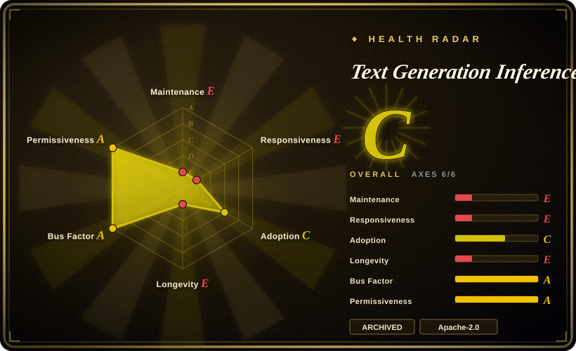
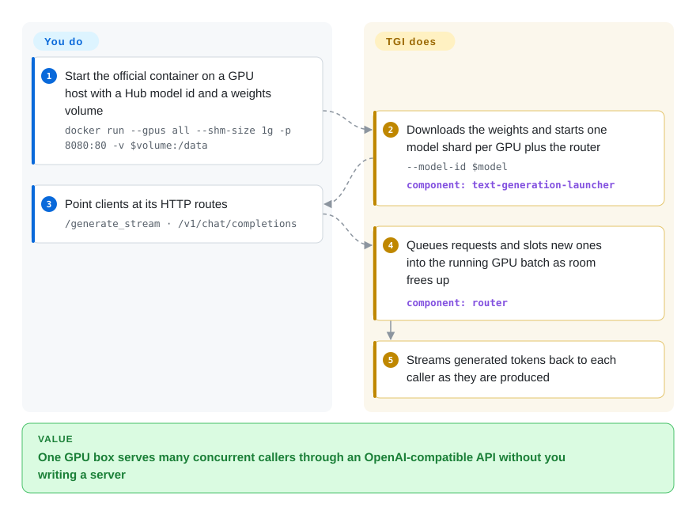

# Text Generation Inference (TGI)

You have open-weight model files and a GPU server, and you need many people or services to call the model over HTTP at once — without each request waiting for the previous one to finish. TGI was Hugging Face's ready-made server for exactly that (one `docker run`, requests batched together on the GPU), but Hugging Face put it in maintenance mode in 2025-12 and the repository is now archived, so today it is mostly something you are already running and planning to move off.

## When to use

You're the ML platform engineer who inherited a fleet of chat and summarisation endpoints that were stood up in 2023–2024 with `ghcr.io/huggingface/text-generation-inference` images, or behind Hugging Face Inference Endpoints / the SageMaker deployment path that wraps it. The containers work, clients already call `/generate_stream` and `/v1/chat/completions`, and your dashboards scrape TGI's Prometheus metrics. Now the upstream README opens with "text-generation-inference is now in maintenance mode" and the GitHub repo is read-only, and someone asks whether to keep it. This page is for that decision: keep TGI for models it already serves well while you plan a migration, pin the last image (3.3.7, 2025-12), and read its launcher/router split as a reference design.

It is also the right page when you are studying how a production LLM server is built: a Rust front door that queues requests and batches them continuously, separate Python model shards behind gRPC, tensor parallelism over NCCL, OpenAI-compatible routes on top. For a **new** deployment, though, the deciding fact is that TGI's own maintainers now recommend [vLLM](vllm.md) and [SGLang](sglang.md) (or llama.cpp / MLX locally) — pick those unless you are constrained to an existing TGI estate.

## How it works

TGI is a model server you start once and then call over HTTP. **What it does for you:** a Rust *launcher* downloads the model weights from the Hugging Face Hub (into a volume you mount, so the next start is fast), starts one Python model process per GPU shard, and starts a Rust *router* — the web server clients talk to. The router holds incoming requests in a queue and does *continuous batching*: instead of waiting for a whole batch to finish, it slots new requests into the running GPU batch as soon as earlier ones free up room, which is what lets one GPU serve many users at once. Tokens stream back as they are generated (Server-Sent Events), through either TGI's own `/generate` routes or an OpenAI-style `/v1/chat/completions`. **What you do:** pick the model and image tag, give the container GPUs and shared memory (`--shm-size 1g`), supply `HF_TOKEN` for gated models, choose sharding and quantization flags, and run the HTTP clients. Think of it as a restaurant kitchen that keeps adding new orders to the stove instead of cooking one table's meal at a time.

<!-- flow-steps:begin (generated from flows/text-generation-inference.json by tools/flow_card.py — do not edit) -->

Text version of the flow

1. **You**: Start the official container on a GPU host with a Hub model id and a weights volume — `docker run --gpus all --shm-size 1g -p 8080:80 -v $volume:/data`
2. **Text Generation Inference (TGI)**: Downloads the weights and starts one model shard per GPU plus the router — `--model-id $model` — component: `text-generation-launcher`
3. **You**: Point clients at its HTTP routes — `/generate_stream · /v1/chat/completions`
4. **Text Generation Inference (TGI)**: Queues requests and slots new ones into the running GPU batch as room frees up — component: `router`
5. **Text Generation Inference (TGI)**: Streams generated tokens back to each caller as they are produced

**Value**: One GPU box serves many concurrent callers through an OpenAI-compatible API without you writing a server

<!-- flow-steps:end -->

## When NOT to use

- **You are starting a new production deployment.** The README itself says TGI is in maintenance mode (2025-12-11) and the repo is archived; upstream recommends vLLM and SGLang going forward. Use [vLLM](vllm.md) for the widest model coverage and community, or [SGLang](sglang.md) when shared-prefix caching and structured output speed matter.
- **You need a model architecture released after late 2025.** Maintenance mode means no new model support; a new architecture will not be wired in. Use [vLLM](vllm.md) or [SGLang](sglang.md), which add architectures as they ship.
- **You need security fixes or a responsive upstream.** An archived repo takes no PRs and no CVE response; the scorer finds no issue traffic at all. If you must stay on TGI for now, own the image patching yourself and set a migration date; otherwise move to [vLLM](vllm.md).
- **You are serving on a laptop, CPU, or Apple Silicon.** CPU is "not the intended platform" per the README (`--disable-custom-kernels`, subpar performance). Use [llama.cpp](../local-runtimes/llama-cpp.md) or [Ollama](../local-runtimes/ollama.md) for local and edge inference.
- **You want maximum NVIDIA throughput and accept an engine-build step.** Use [TensorRT-LLM](tensorrt-llm.md), which compiles a model-specific engine for lower latency at the cost of a heavier, NVIDIA-only workflow.
- **You are pinned to a TGI release from 2023-07 to 2024-04.** The repo's LICENSE switched to the Hugging Face Optimized Inference License (HFOIL 1.0) on 2023-07-28 and back to Apache-2.0 on 2024-04-08; releases cut in between carry the HFOIL terms. Check your version before commercial hosting, or upgrade to a 2.x/3.x Apache release.

## Comparison

| Alternative | In index | Our verdict | Tradeoff |
|---|---|---|---|
| [vLLM](vllm.md) | ✅ | For any new GPU serving deployment, choose vLLM over TGI; keep TGI only while migrating an existing estate, because vLLM is where new models and fixes land. | Largest community and model coverage, PagedAttention, OpenAI-compatible server; you re-test prompts, sampling defaults and metrics names when moving clients off TGI's routes. |
| [SGLang](sglang.md) | ✅ | Choose SGLang over TGI when workloads share long prompt prefixes or need fast structured (JSON/regex) output; TGI's guidance feature is frozen while SGLang is still developed. | RadixAttention prefix reuse and a fast structured-generation path; younger ecosystem than vLLM, and a different launch/config surface from TGI. |
| [TensorRT-LLM](tensorrt-llm.md) | ✅ | Choose TensorRT-LLM when you are NVIDIA-only and squeezing latency matters more than a one-command start; TGI's single `docker run` was simpler but is no longer maintained. | Top latency on NVIDIA from compiled engines; per-model build step and hard NVIDIA lock-in. |
| [LMDeploy](lmdeploy.md) | ✅ | Choose LMDeploy when you need a maintained engine with strong quantized (4-bit/KV-cache) serving, especially on older or non-NVIDIA accelerators and InternLM-family models; TGI's quantization options will not grow further. | TurboMind engine with aggressive quantization and good throughput; smaller Western community and docs than vLLM. |
| [llama.cpp](../local-runtimes/llama-cpp.md) | ✅ | Choose llama.cpp when the target is a laptop, CPU, Mac or edge box; TGI is a datacenter GPU server and treats CPU as unsupported in practice. | Runs GGUF-quantized models nearly anywhere with tiny dependencies; not built for multi-GPU high-concurrency serving. |

## Tech stack

- **Launcher and router:** Rust. `text-generation-launcher` spawns the shards and the router; the router is the HTTP server that queues and continuously batches requests and exposes `/generate`, `/generate_stream`, `/v1/chat/completions` and OpenAPI docs at `/docs`.
- **Model server:** Python, built on `transformers` model code with optimized kernels (Flash Attention, Paged Attention); shards talk to the router over gRPC and to each other over NCCL for tensor parallelism.
- **Quantization:** bitsandbytes, GPT-Q, EETQ, AWQ, Marlin, fp8 (per README).
- **Observability:** OpenTelemetry tracing (`--otlp-endpoint`) and Prometheus metrics.
- **Hardware/backends:** NVIDIA (CUDA) and AMD (ROCm `-rocm` images) in the main images; Inferentia, Gaudi, Intel GPU and TPU via separate backends or repos; the tree also carries TensorRT-LLM and llama.cpp backend Dockerfiles.

## Dependencies

- **GPU host:** NVIDIA GPUs with the NVIDIA Container Toolkit and drivers for CUDA 12.2+ (README recommendation), or AMD Instinct MI210/MI250 with the ROCm image.
- **Container runtime:** Docker (or Kubernetes) with at least 1 GiB shared memory for NCCL (`--shm-size 1g`, or an in-memory `emptyDir` at `/dev/shm`).
- **Model source:** the Hugging Face Hub (weights downloaded at start, cached in a mounted volume); an `HF_TOKEN` for gated or private models.
- **Local build (optional):** Rust toolchain, Python 3.9+, and `protoc` if you build outside Docker.
- **No database or queue:** the router keeps its queue in memory; scaling out means more replicas behind your own load balancer.

## Ops difficulty

**Medium today, rising.** Getting one model served is a single `docker run`, and the image carries the kernels, so day one is easy if the GPU host is already set up. The real work is the usual GPU-serving work: driver/toolkit versions, shared-memory settings, choosing `--num-shard` and quantization so the model fits, and capacity planning for concurrency. What makes it rise over time is the archive: no new image tags, no security or dependency updates, no support for new models. Any TGI you keep running is a frozen dependency you must patch or replace yourself, so the ops plan should include a dated migration to vLLM or SGLang.

## Health & viability

- **Maintenance (Grade E):** maintenance mode announced 2025-12-11; last release v3.3.7 on 2025-12-19; last commit 2026-03-21 (a docs guide); repository archived (read-only) by 2026-07. No further fixes are expected.
- **Responsiveness (Grade E):** no qualifying issue traffic to measure — the archived repo cannot take new issues or PRs.
- **Governance and backing (Grade A):** Hugging Face–owned with a real team (9 active maintainers in the trailing 12 months; top contributors Narsil and OlivierDehaene). The backing org is strong, but it chose to stop: upstream now contributes to and recommends vLLM and SGLang.
- **Age & Lindy (Longevity Grade E):** created 2022-10 (1461 days old) and archived after ~3.5 years. Lindy does not rescue it: age × still-active fails on "still-active".
- **Adoption (Grade C):** the `text-generation` PyPI client still sees 41242 downloads/month and 231 dependent repos, and ~10.9k GitHub stars — a sizeable installed base that now has to migrate.
- **Risk flags (license Grade A):** Apache-2.0 today; the 2023-07 to 2024-04 HFOIL relicense episode is the precedent to remember for this vendor-owned project.

## Caveats (unverified)

- [未验证] "Archived by 2026-07" is bounded by this page's earlier snapshot; the exact archive date was not read from GitHub.
- [推断] That Hugging Face Inference Endpoints and the SageMaker LLM container path ran on TGI is taken from the README ("Used in production at Hugging Face … Inference Endpoints") and the 2026-03 AWS deployment guide; whether those products still default to TGI as of 2026-10 was not checked.
- [推断] The comparison verdicts (LMDeploy's quantization strength, SGLang's prefix caching, TensorRT-LLM's latency edge) lean on those projects' own pages in this index, not on a side-by-side benchmark.
- [未验证] Which exact TGI release tags fall inside the HFOIL window (2023-07-28 to 2024-04-08) was not enumerated; check the LICENSE file at the tag you run.
- [未验证] No run of the 3.3.x image was done for this page; the commands in the flow come from the README.
