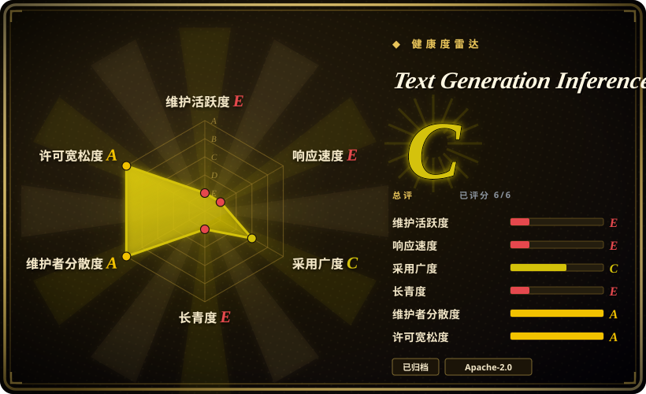
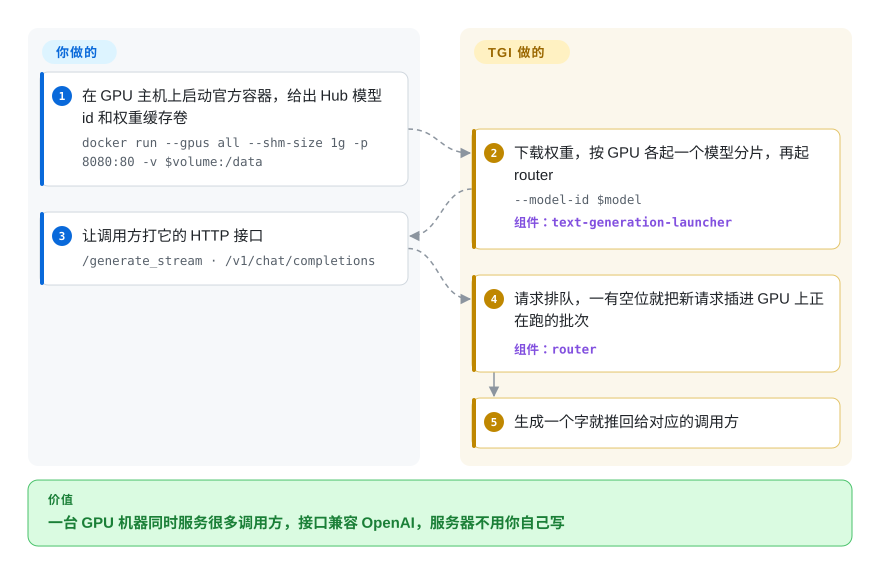

# Text Generation Inference (TGI)

你手里有开源模型的权重和一台 GPU 服务器，要让很多人或很多服务同时通过 HTTP 调用这个模型，而且不能每个请求都排队等上一个跑完。TGI 曾是 Hugging Face 为此做的现成服务器（一条 `docker run`，把并发请求合在一起放到 GPU 上算），但 Hugging Face 在 2025-12 把它转入维护模式，仓库现在也已归档，所以今天它多半是你已经在跑、正打算迁走的东西。

## 何时使用

你是 ML 平台工程师，接手了一批 2023–2024 年搭起来的对话、摘要接口，用的是 `ghcr.io/huggingface/text-generation-inference` 镜像，或者挂在 Hugging Face Inference Endpoints、SageMaker 这类包了一层的部署路径后面。容器能跑，调用方已经在打 `/generate_stream` 和 `/v1/chat/completions`，监控面板抓的也是 TGI 的 Prometheus 指标。现在上游 README 第一句就是“text-generation-inference is now in maintenance mode”，GitHub 仓库变成只读，有人问你要不要继续用。这一页就是给这个决定用的：已经跑得好的模型先留在 TGI 上，同时规划迁移；镜像钉在最后一版（3.3.7，2025-12）；它的 launcher/router 拆分可以当参考设计来读。

如果你在研究一个生产级 LLM 服务器是怎么搭的，这一页也合适：Rust 写的入口负责排队、连续批处理请求，后面是通过 gRPC 连接的 Python 模型分片，分片之间用 NCCL 做张量并行，最上面再加一层 OpenAI 兼容接口。但如果是**新**部署，决定性的事实是 TGI 自己的维护者现在推荐 [vLLM](vllm.zh.md) 和 [SGLang](sglang.zh.md)（本地则是 llama.cpp / MLX）——除非你被一批现存 TGI 部署绑住，否则选它们。

## 怎么用起来

TGI 是一个启动一次、之后通过 HTTP 调用的模型服务器。**它替你做的：**Rust 写的 *launcher*（启动器）从 Hugging Face Hub 下载模型权重（存进你挂载的卷，下次启动就快了），按 GPU 分片各起一个 Python 模型进程，再起一个 Rust 写的 *router*（路由器）——也就是调用方直接打交道的 Web 服务器。router 把进来的请求放进队列，做*连续批处理*：不等一整批全部算完，而是一有空位就把新请求插进 GPU 上正在跑的那一批，这样一张卡才能同时服务很多用户。生成的字随出随回（Server-Sent Events，服务端推送），接口可以是 TGI 自己的 `/generate` 系列，也可以是 OpenAI 风格的 `/v1/chat/completions`。**你要做的：**选模型和镜像版本，给容器分 GPU 和共享内存（`--shm-size 1g`），受限模型要提供 `HF_TOKEN`，决定分片和量化参数，再写好 HTTP 调用方。可以把它想成一个后厨：灶上一有空位就加新单，而不是一桌菜做完才做下一桌。

<!-- flow-steps:begin (generated from flows/text-generation-inference.json by tools/flow_card.py — do not edit) -->

流程文字版

1. **你**：在 GPU 主机上启动官方容器，给出 Hub 模型 id 和权重缓存卷 — `docker run --gpus all --shm-size 1g -p 8080:80 -v $volume:/data`
2. **Text Generation Inference (TGI)**：下载权重，按 GPU 各起一个模型分片，再起 router — `--model-id $model` — 组件：`text-generation-launcher`
3. **你**：让调用方打它的 HTTP 接口 — `/generate_stream · /v1/chat/completions`
4. **Text Generation Inference (TGI)**：请求排队，一有空位就把新请求插进 GPU 上正在跑的批次 — 组件：`router`
5. **Text Generation Inference (TGI)**：生成一个字就推回给对应的调用方

**价值**：一台 GPU 机器同时服务很多调用方，接口兼容 OpenAI，服务器不用你自己写

<!-- flow-steps:end -->

## 何时不用

- **你要起一个新的生产部署。** README 自己写明 TGI 已进入维护模式（2025-12-11），仓库也已归档；上游推荐今后用 vLLM 和 SGLang。要最广的模型覆盖和最大的社区，用 [vLLM](vllm.zh.md)；看重共享前缀缓存和结构化输出速度，用 [SGLang](sglang.zh.md)。
- **你要跑 2025 年底之后发布的新模型架构。** 维护模式意味着不再加新模型支持，新架构不会接进来。用 [vLLM](vllm.zh.md) 或 [SGLang](sglang.zh.md)，它们会随新架构发布跟进。
- **你需要安全修复或有人响应的上游。** 归档仓库不收 PR，也不响应 CVE；评分器连可测的 issue 流量都找不到。如果暂时必须留在 TGI 上，镜像补丁就得你自己打，并定好迁移日期；否则迁到 [vLLM](vllm.zh.md)。
- **你在笔记本、CPU 或 Apple Silicon 上跑。** README 说 CPU“不是这个项目的目标平台”（要加 `--disable-custom-kernels`，性能也差）。本地和边缘推理用 [llama.cpp](../local-runtimes/llama-cpp.zh.md) 或 [Ollama](../local-runtimes/ollama.zh.md)。
- **你要榨干 NVIDIA 的吞吐，也能接受先构建引擎。** 用 [TensorRT-LLM](tensorrt-llm.zh.md)：它为每个模型编译专用引擎，换来更低延迟，代价是更重、只限 NVIDIA 的流程。
- **你钉死在 2023-07 到 2024-04 之间的某个 TGI 版本上。** 仓库的 LICENSE 在 2023-07-28 改成 Hugging Face Optimized Inference License（HFOIL 1.0），2024-04-08 又改回 Apache-2.0；这段时间里发的版本适用 HFOIL 条款。做商业托管前先查你用的版本，或者升级到 2.x/3.x 的 Apache 版本。

## 横向对比

| 替代品 | 是否收录 | 我们的评价 | 取舍 |
|---|---|---|---|
| [vLLM](vllm.zh.md) | ✅ | 任何新的 GPU 推理部署都选 vLLM 而不是 TGI；TGI 只在迁移现有部署期间保留，因为新模型和修复都落在 vLLM 上。 | 社区和模型覆盖最大，有 PagedAttention 和 OpenAI 兼容服务；代价是把调用方从 TGI 的接口迁过来时，要重测提示词、采样默认值和指标名。 |
| [SGLang](sglang.zh.md) | ✅ | 请求共享很长的提示词前缀，或要快速的结构化（JSON/正则）输出时，选 SGLang 而不是 TGI；TGI 的 guidance 功能已经冻结，SGLang 还在开发。 | RadixAttention 复用前缀，结构化生成快；生态比 vLLM 年轻，启动和配置方式也和 TGI 不同。 |
| [TensorRT-LLM](tensorrt-llm.zh.md) | ✅ | 只用 NVIDIA、且压延迟比一条命令起服务更重要时，选 TensorRT-LLM；TGI 一条 `docker run` 更简单，但已经没人维护。 | 编译出的引擎在 NVIDIA 上延迟最低；每个模型都要构建一次，且彻底绑定 NVIDIA。 |
| [LMDeploy](lmdeploy.zh.md) | ✅ | 需要一个仍在维护、量化（4-bit 权重、KV 缓存量化）服务能力强的引擎，尤其是在老旧或非 NVIDIA 加速卡上跑 InternLM 系模型时，选 LMDeploy；TGI 的量化选项不会再增加。 | TurboMind 引擎量化激进、吞吐不错；英文社区和文档比 vLLM 小。 |
| [llama.cpp](../local-runtimes/llama-cpp.zh.md) | ✅ | 目标机器是笔记本、CPU、Mac 或边缘设备时选 llama.cpp；TGI 是数据中心 GPU 服务器，CPU 实际上不在支持范围内。 | GGUF 量化模型几乎哪里都能跑，依赖极少；不是为多卡高并发服务设计的。 |

## 技术栈

- **启动器和路由器：** Rust。`text-generation-launcher` 拉起各分片和 router；router 是 HTTP 服务器，负责请求排队和连续批处理，提供 `/generate`、`/generate_stream`、`/v1/chat/completions`，并在 `/docs` 提供 OpenAPI 文档。
- **模型服务：** Python，基于 `transformers` 的模型代码加优化算子（Flash Attention、Paged Attention）；分片通过 gRPC 和 router 通信，分片之间用 NCCL 做张量并行。
- **量化：** bitsandbytes、GPT-Q、EETQ、AWQ、Marlin、fp8（据 README）。
- **可观测性：** OpenTelemetry 链路追踪（`--otlp-endpoint`）和 Prometheus 指标。
- **硬件/后端：** 主镜像支持 NVIDIA（CUDA）和 AMD（ROCm 的 `-rocm` 镜像）；Inferentia、Gaudi、Intel GPU 和 TPU 走单独的后端或仓库；代码树里还有 TensorRT-LLM 和 llama.cpp 后端的 Dockerfile。

## 依赖

- **GPU 主机：** NVIDIA GPU，装好 NVIDIA Container Toolkit 和支持 CUDA 12.2+ 的驱动（README 的建议）；或者 AMD Instinct MI210/MI250 配 ROCm 镜像。
- **容器运行时：** Docker（或 Kubernetes），给 NCCL 至少 1 GiB 共享内存（`--shm-size 1g`，或在 `/dev/shm` 挂一个内存型 `emptyDir`）。
- **模型来源：** Hugging Face Hub（启动时下载权重，缓存在挂载卷里）；受限或私有模型需要 `HF_TOKEN`。
- **本地构建（可选）：** 不用 Docker 自己构建时，需要 Rust 工具链、Python 3.9+ 和 `protoc`。
- **没有数据库或消息队列：** router 的队列在内存里；要扩容就多起几个副本，前面放你自己的负载均衡。

## 运维难度

**眼下中等，而且会越来越高。** 起一个模型只要一条 `docker run`，算子都在镜像里，只要 GPU 主机已经配好，第一天很轻松。真正的工作是 GPU 推理服务的常规活：驱动和 Toolkit 版本、共享内存设置、选 `--num-shard` 和量化方式让模型放得下，以及按并发量做容量规划。难度会上升是因为归档：不会再有新镜像、安全和依赖更新，也不会支持新模型。你留着跑的每一个 TGI，都是一个冻结的依赖，补丁或替换都得你自己来，所以运维计划里要写上迁到 vLLM 或 SGLang 的日期。

## 健康度与可持续性

- **维护（Grade E）：** 2025-12-11 宣布进入维护模式；最后一个版本 v3.3.7 发布于 2025-12-19；最后一次提交是 2026-03-21（一篇文档指南）；仓库在 2026-07 之前已归档（只读）。不要指望再有修复。
- **响应速度（Grade E）：** 没有可测的 issue 流量——归档仓库收不了新 issue 和 PR。
- **治理与背书（Grade A）：** 归 Hugging Face 所有，背后是一个真团队（近 12 个月有 9 位活跃维护者，贡献最多的是 Narsil 和 OlivierDehaene）。背书组织很强，但它选择了停下：上游现在给 vLLM 和 SGLang 贡献代码并推荐它们。
- **年龄与 Lindy（长青度 Grade E）：** 创建于 2022-10（1461 天），约 3.5 年后归档。Lindy 救不了它：年龄 × 仍活跃，卡在“仍活跃”这一项。
- **采用度（Grade C）：** `text-generation` 这个 PyPI 客户端每月仍有 41242 次下载、231 个依赖它的仓库，GitHub 约 1.09 万 star——存量不小，而这些存量现在都得迁移。
- **风险标记（许可 Grade A）：** 现在是 Apache-2.0；2023-07 到 2024-04 改用 HFOIL 的那段经历，是这个厂商自有项目值得记住的先例。

## 存疑（未验证）

- [未验证] “2026-07 之前已归档”只是以本页上一次快照为上限，确切的归档日期没有从 GitHub 读到。
- [推断] Hugging Face Inference Endpoints 和 SageMaker 的 LLM 容器路径跑在 TGI 上，依据是 README（“Used in production at Hugging Face … Inference Endpoints”）和 2026-03 那篇 AWS 部署指南；截至 2026-10 这些产品是否仍默认用 TGI，没有核对。
- [推断] 横向对比里的判断（LMDeploy 的量化优势、SGLang 的前缀缓存、TensorRT-LLM 的延迟优势）依据的是本索引里这些项目各自的页面，不是并排跑出来的基准。
- [未验证] 具体哪些 TGI 发布标签落在 HFOIL 区间（2023-07-28 到 2024-04-08）里，没有逐个列出；以你所用标签下的 LICENSE 文件为准。
- [未验证] 写这一页时没有实际跑过 3.3.x 镜像；流程卡里的命令都取自 README。
