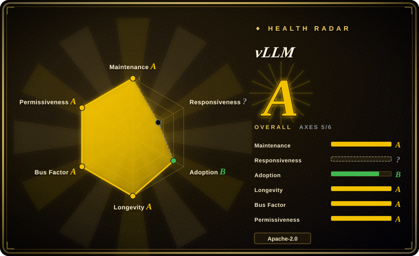
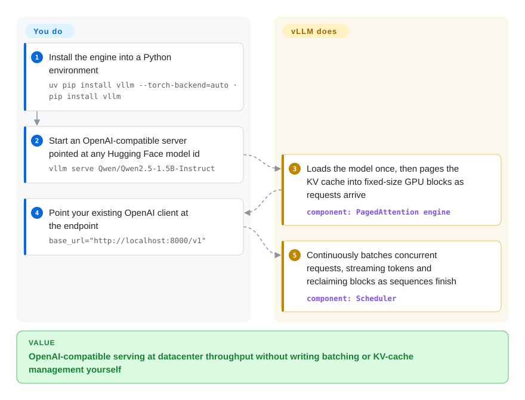

# vLLM

The most popular open-source LLM serving engine, built around **PagedAttention** — a memory-efficient KV cache manager that virtualizes attention state into fixed-size blocks, enabling continuous batching and high GPU utilization for throughput-oriented serving.

## When to use

You're running a production API that needs to serve open-weight LLMs (Llama, Qwen, Mistral, Gemma, …) at high throughput behind an OpenAI-compatible endpoint. Your traffic is bursty and interleaved — users send long prompts and short prompts, some stream tokens and some don't — and you keep hitting GPU memory fragmentation: naive batching leaves holes in the KV cache, so you can't fit as many concurrent requests as the hardware should allow. You deploy vLLM, which virtualizes the KV cache into fixed-size pages (like an OS memory manager) and reclaims blocks when sequences finish, letting you pack requests tightly and sustain far higher throughput than a simple static-batch server. The built-in OpenAI-compatible API (`/v1/chat/completions`) means your existing client code works without changes, and the Python ecosystem makes model customization (custom logits processors, sampling parameters, speculative decoding) accessible without dropping into C++.

You also reach for vLLM when you need multi-GPU and multi-node serving (tensor, pipeline, data, expert, and context parallelism), quantization (FP8, INT8/INT4, GPTQ/AWQ, GGUF, compressed-tensors) to squeeze larger models onto fewer GPUs, or prefix caching to avoid re-computing shared system prompts across many requests. The community is enormous, so when a new model drops on Hugging Face, a vLLM integration usually lands within days.

## How it works

vLLM sits between your HTTP requests and the GPU. On startup the server loads the model once, then **PagedAttention** manages the KV cache — the key/value state the model must remember for every in-flight conversation — like an OS manages memory: it is split into fixed-size blocks, allocated on demand, and reclaimed the moment a sequence finishes. On top of that, the scheduler runs **continuous batching**: finished requests free their blocks and queued requests join the same GPU step without pausing the generations already running, which is where the throughput comes from. The surface you touch is the OpenAI-compatible HTTP server (`/v1/completions`, `/v1/chat/completions`, plus the Anthropic Messages API and gRPC in current releases); for batch jobs with no server, the `from vllm import LLM` class drives the same engine in-process. What stays yours: the GPU environment and drivers, model choice, the batching/tuning knobs, and any load balancing, auth, or HA layer in front of the single-instance server.

<!-- flow-steps:begin (generated from flows/vllm.json by tools/flow_card.py — do not edit) -->

Text version of the flow

1. **You**: Install the engine into a Python environment — `uv pip install vllm --torch-backend=auto · pip install vllm`
2. **You**: Start an OpenAI-compatible server pointed at any Hugging Face model id — `vllm serve Qwen/Qwen2.5-1.5B-Instruct`
3. **vLLM**: Loads the model once, then pages the KV cache into fixed-size GPU blocks as requests arrive — component: `PagedAttention engine`
4. **You**: Point your existing OpenAI client at the endpoint — `base_url="http://localhost:8000/v1"`
5. **vLLM**: Continuously batches concurrent requests, streaming tokens and reclaiming blocks as sequences finish — component: `Scheduler`

**Value**: OpenAI-compatible serving at datacenter throughput without writing batching or KV-cache management yourself

<!-- flow-steps:end -->

## When NOT to use

- **Non-NVIDIA hardware is a growing plugin matrix, not one first-class path.** The tuned mainstream is NVIDIA CUDA. AMD (ROCm wheels), Intel (XPU, official Docker images since v0.26), Google TPU (`vllm-tpu`), Ascend NPU (community `vllm-ascend`), and Apple Silicon (the separate `vLLM-Metal` project, which swaps PyTorch for an MLX backend and needs MLX-converted models) are each their own install path with their own version pins — the ROCm wheels currently want Python 3.12 / ROCm 7.0 / glibc ≥ 2.35, for example. For an AMD-, TPU-, or NPU-first deployment you are choosing a plugin ecosystem, not the headline one. [推断：各平台调优深度未做同硬件实测]
- **You want a simple, single-binary local inference tool.** vLLM is a large, complex Python codebase with heavy PyTorch/CUDA dependencies and a long dependency tree. For a single Mac or a laptop, Ollama or llama.cpp are far lighter and easier to install (vLLM's Apple Silicon story is the separate vLLM-Metal project, not `pip install vllm`). vLLM is a datacenter serving engine, not a desktop convenience tool.
- **You need deep custom kernel modifications without CUDA expertise.** vLLM's performance comes from hand-tuned CUDA kernels and attention implementations. If you need to modify the attention mechanism or add a custom kernel, you are writing CUDA C++ and integrating with vLLM's kernel dispatch layer — a steep learning curve compared to a pure-Python framework.
- **You want a unified serving + orchestration + multi-model routing layer.** vLLM is the inference engine, not the orchestration framework. For multi-model A/B testing, canary deployments, request-level routing, or autoscaling across a fleet, you will still need a separate layer (Kubernetes, Ray Serve, or a proxy like BentoML) in front of vLLM. It does not replace a serving platform.
- **Latency is more critical than throughput.** vLLM optimizes for **throughput** (requests per second, GPU utilization). For ultra-low-latency interactive use cases where every millisecond of time-to-first-token matters, NVIDIA's **TensorRT-LLM** or hand-tuned custom engines often win because they compile a static graph and fuse operators more aggressively; vLLM's dynamic scheduling and Python overhead add latency.
- **You want to avoid fast-moving breakage.** vLLM ships at a furious pace — 1,581 commits in the 30 days to 2026-09-27 (≈50/day) and a minor release roughly every two weeks (v0.24.0 on 2026-06-29 → v0.30.0 on 2026-09-22, GitHub API). New features land quickly, but APIs shift, default behaviors change, and model-support compatibility moves fast. If you need a "set it and forget it" inference runtime with a 12-month stable surface, vLLM's velocity is a liability, not a feature.

## Comparison

| Alternative | In index | Our verdict | Tradeoff |
|---|---|---|---|
| [Modular Platform (MAX + Mojo)](modular.md) | ✅ | Use vLLM when you want the de-facto open serving engine, huge model coverage, and a Python-native stack; choose MAX when you want a vendor-built cross-vendor compiler+language platform with its own kernel language. | Vendor-built cross-vendor GPU/CPU serving engine + Mojo kernel language; single-vendor lock-in, younger community, smaller model coverage than vLLM. |
| [oMLX](../local-runtimes/omlx.md) | ✅ | Use vLLM for datacenter NVIDIA GPU serving; choose oMLX when you want a Mac (Apple Silicon) local inference server with SSD-tiered KV caching. | Mac-only local server on Apple Silicon with a Swift menu-bar app; not a datacenter multi-GPU engine. |
| [Text Generation Inference (TGI)](text-generation-inference.md) | ✅ | Use vLLM when you want the larger community and PagedAttention; choose TGI when you want Hugging Face's production server with tight HF ecosystem integration. | Hugging Face's production server, tight HF ecosystem integration; license history has wobbled (Apache→HFOIL→Apache), smaller community than vLLM. |
| [TensorRT-LLM](tensorrt-llm.md) | ✅ | Use vLLM when you want open-source Python flexibility and dynamic model loading; choose TensorRT-LLM when you need NVIDIA's own engine, top-tier latency on NVIDIA hardware. | NVIDIA's own engine, top-tier latency on NVIDIA hardware; deeply NVIDIA-locked, heavier build/engine-compile workflow, less dynamic model switching. |
| [Ray Serve](ray-serve.md) | ✅ | Use vLLM when you need a dedicated LLM inference engine; choose Ray Serve when you need general Python model-serving orchestration and scaling across many model types. | General Python model-serving/orchestration framework for scaling and composing services; not a hand-tuned single-model inference engine. |
| [SGLang](sglang.md) | ✅ | Use vLLM when you want the proven, widest-adopted engine; choose SGLang when you specifically need RadixAttention prefix caching and structured-generation optimizations. | High-throughput serving engine with RadixAttention prefix caching; newer, smaller ecosystem, less model coverage than vLLM. |
| [Ollama](../local-runtimes/ollama.md) / [llama.cpp](../local-runtimes/llama-cpp.md) | ✅ | Use vLLM for datacenter throughput serving; choose Ollama/llama.cpp for lightweight local/edge inference on CPU or consumer GPUs. | Portable C/C++ inference engine (GGUF) running everywhere including Macs and phones; not a datacenter multi-GPU throughput engine. |

## Tech stack

- **Python** — the primary language (~85% of the code, GitHub languages 2026-09): model loading, scheduler, API server, and user-facing customization surface (custom logits processors, sampling params, guided decoding).
- **CUDA C++ / Triton, plus Rust** — custom GPU kernels for attention, KV cache management, and quantization (C++/CUDA ~8%, Rust ~6% per GitHub languages 2026-09; the Rust crates sit in `rust/src/` — tokenizer/chat-parsing paths [推断：具体职责未逐一读源码]). Attention runs on swappable backends (FlashAttention, FlashInfer, TRTLLM-GEN, FlashMLA, Triton), auto-selected or pinned via `--attention-backend`.
- **PyTorch** — the underlying tensor framework (build metadata pins `torch == 2.13.0` as of v0.30); the Apple Silicon plugin is the exception, swapping in an MLX backend.
- **OpenAI-compatible API** — a FastAPI-based server exposing `/v1/completions`, `/v1/chat/completions`, and `/v1/embeddings` for drop-in compatibility with OpenAI clients; current releases additionally advertise an Anthropic Messages API and gRPC support.
- **Distributed primitives** — tensor, pipeline, data, expert, and context parallelism for multi-GPU and multi-node deployments.
- **Throughput feature set** — continuous batching with chunked prefill, prefix caching, CUDA/HIP graph capture, torch.compile-driven kernel generation, speculative decoding (n-gram, EAGLE, …), multi-LoRA serving, and structured output via xgrammar or guidance.

## Dependencies

- **Hardware** — NVIDIA GPUs are the tuned primary target (quickstart assumes Linux + CUDA); AMD (ROCm), Intel (XPU), Google TPU, Ascend NPU, and Apple Silicon go through the per-platform paths described in *When NOT to use*. Server-class GPUs (A100, H100, L4, etc.) are the typical deployment target. x86/ARM/PowerPC CPU inference exists but is not the performance story.
- **GPU drivers & runtime** — NVIDIA GPU drivers and the CUDA runtime on the host; `uv` can auto-select the right PyTorch CUDA build with `--torch-backend=auto`, but the host must still provide the driver stack.
- **Runtime environment** — Python ≥ 3.10, < 3.15 per packaging metadata (quickstart exercises 3.10–3.13); installed via `uv`/`pip` (`uv pip install vllm --torch-backend=auto`, recommended) or prebuilt Docker containers (`vllm/vllm-openai`, plus `-rocm`/`-xpu` nightlies). The package is heavy (multi-GB CUDA wheels and PyTorch).
- **Models** — you bring Hugging Face-compatible models (safetensors; GGUF also loadable as a quantization format); the README claims 200+ supported architectures across decoder-only, MoE, hybrid SSM, multimodal, embedding, and reward models. ModelScope is available via `VLLM_USE_MODELSCOPE=True`.
- **External services (optional)** — for production serving you typically place a load balancer or reverse proxy (nginx, Envoy, Kubernetes ingress) in front; the server supports API-key checking (`--api-key` / `VLLM_API_KEY`) but is still a single-model, single-process server that does not handle TLS termination or multi-node routing natively. [推断]

## Ops difficulty

**High.** The "happy path" of `docker run vllm/vllm-openai` and pointing at a model is deceptively simple, but production operation is demanding:

1. **GPU fleet management** — driver versions, CUDA compatibility, memory tuning, and multi-GPU topology (NVLink, PCIe) are your responsibility. A single vLLM instance typically owns one or more GPUs exclusively; you manage instance density, not the engine.
2. **Model lifecycle & disk** — model weights are large (tens to hundreds of GB); cold-start download times, disk cache management, and version upgrades across a fleet are significant operational work.
3. **Throughput vs. latency tuning** — vLLM exposes many knobs (max_num_seqs, max_num_batched_tokens, block size, scheduling policy) that interact in non-obvious ways. Getting the best throughput for your specific workload distribution requires benchmarking and iteration; defaults are conservative and often leave GPU headroom on the table.
4. **Version velocity** — ~50 commits/day and a minor release every ~2 weeks mean staying current is regular work, and the API surface shifts (new arguments, changed defaults, deprecated features). You will be upgrading vLLM regularly if you want bug fixes and new model support.
5. **No built-in HA or multi-node routing** — you run vLLM as a stateful process per GPU/node. High availability, autoscaling, request routing, and model A/B testing are handled by external infrastructure (Kubernetes, a proxy, or a serving framework like Ray Serve), not by vLLM itself.

## Health & viability

- **Maintenance (2026-09).** Extremely active — 1,581 commits in the last 30 days and a minor release roughly every two weeks (v0.24.0 → v0.30.0 between 2026-06-29 and 2026-09-22, GitHub API). The project is clearly in aggressive growth mode, not coasting. Not archived.
- **Governance / bus factor (2026-09).** The README describes "many dozens of academic institutions and companies from over 2000 contributors"; the health scorer counts 432 distinct committers in the last 12 months with no single contributor above ~4% of commits. Governance is **community-led open source** (UC Berkeley / Sky Computing origin) rather than a single vendor or foundation — high bus-factor, though there is still no Apache/CNCF/LF umbrella. [推断]
- **Backing & longevity (2026-09).** Originated from UC Berkeley's Sky Computing Lab; the PagedAttention paper was published at SOSP 2023. Strong academic pedigree + commercial adoption (many AI startups and cloud providers run vLLM in production). Age (repo ~3.6 years) × still-active gives a **moderate-to-strong Lindy prior**: old enough to have proven itself, still moving fast. [推断]
- **Adoption (2026-09).** ~92.8k stars (GitHub API, 2026-09-27) and ~1.9M PyPI downloads/month (health scorer, 2026-09-27) — cited as the backend for many inference-as-a-service platforms and internal AI teams. The OpenAI-compatible API, broad model support, and active ecosystem (plugins, Docker images, Helm charts) make it the de-facto open-source standard for LLM serving. Star count is not proof of quality, but the ecosystem density is real. The radar's adoption axis grades B — download volume and release assets carry the claim; the dependency-graph signal is weak — that is the gap between the numbers and the "de-facto standard" narrative. [未验证：生产采用广度]
- **Risk flags.** Apache-2.0 with no relicense history to date (2026-09). No CLA requirement. The main risk is **velocity fragility** — the fast pace means APIs and internal architecture shift rapidly, which creates upgrade burden and occasional breaking changes. Secondary: the **multi-platform expansion** (ROCm/XPU/TPU/NPU/Metal) spreads maintenance across per-hardware paths with their own pins, and some are community-run. There is also a **PyTorch/CUDA concentration risk**: the project is deeply tied to that stack; a major PyTorch breaking change or CUDA compatibility shift would affect vLLM directly. [推断]

## Caveats (unverified)

- [未验证] The adoption *meaning* of ~92.8k stars / ~2.3M PyPI downloads-month (both API-checked 2026-09-22/27) is indicative, not proof of production quality; "backend for many inference platforms" comes from project communications and community reports.
- [推断] Per-platform maturity (ROCm wheels, Intel XPU, `vllm-tpu`, `vllm-ascend`, `vLLM-Metal`) is read from the official install docs' structure and version notes; no hands-on benchmark on those platforms was performed.
- [推断] The role of the ~6% Rust code (tokenizer/chat-parsing crates under `rust/src/`) is inferred from GitHub languages stats and `pyproject.toml` build metadata (`setuptools-rust`), not from reading the crates.
- [未验证] The quantization set (FP8, MXFP8/MXFP4, NVFP4, INT8/INT4, GPTQ/AWQ, GGUF, compressed-tensors, ModelOpt, TorchAO) is quoted from the README; not all combinations were independently tested.
- [推断] The earlier "CUDA 11.8+ / 12.1+" pin was dropped rather than re-verified this pass; check the current installation guide for exact toolkit versions.
- [推断] The steep learning curve for custom CUDA kernel modifications is inferred from the codebase structure (custom CUDA kernels in `csrc/`, kernel dispatch in Python) and maintainer discussions, not from a first-hand kernel-development walkthrough.
- [推断] TensorRT-LLM latency advantage and the "latency vs. throughput" tradeoff are inferred from community benchmarks and NVIDIA's own performance claims, not from an independent head-to-head benchmark on identical hardware.
- [推断] The "moderate-to-strong Lindy prior" assessment combines the project's 2023 origin with its observed continued activity; this is a heuristic judgment, not a measured prediction.
- [推断] CPU-only inference support exists but is described as "not the performance story" based on README emphasis and community reports, not from a controlled CPU-vs-GPU benchmark.
