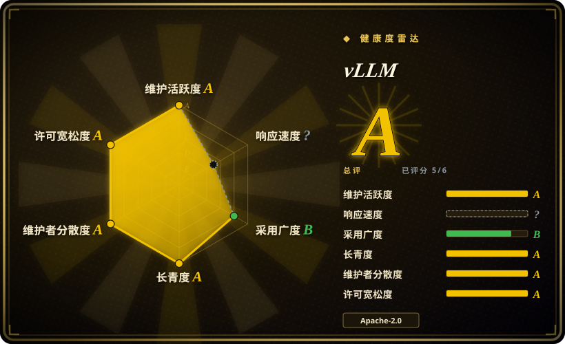
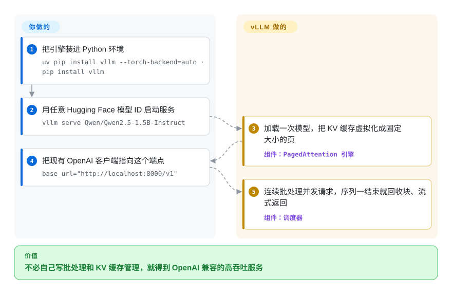

# vLLM

最受欢迎的开源 LLM 服务引擎，核心创新是 **PagedAttention**——一种内存高效的 KV 缓存管理器，将注意力状态虚拟化为固定大小的块，支持连续批处理（continuous batching）与高 GPU 利用率，面向吞吐量优化的推理服务。

## 何时使用

你正在运营一个生产级 API，需要以 OpenAI 兼容端点的方式对外提供开源权重 LLM（Llama、Qwen、Mistral、Gemma 等）的高吞吐服务。你的流量是突发且交错的——用户发送长短不一的 prompt，有些需要流式返回 token，有些则不需要——而你总是被 GPU 内存碎片困扰：朴素的批处理会在 KV 缓存中留下空洞，导致硬件本可以承载的并发请求数远低于理论值。你部署 vLLM，它将 KV 缓存虚拟化为固定大小的页面（类似操作系统内存管理），在序列结束时回收块，让你能紧密地打包请求，从而维持远高于静态批处理服务器的吞吐。内置的 OpenAI 兼容 API（`/v1/chat/completions`）意味着你现有的客户端代码无需改动即可接入，而 Python 生态也让模型定制（自定义 logits 处理器、采样参数、投机解码）无需下沉到 C++ 就能完成。

当你需要跨 GPU 与跨节点服务（张量、流水线、数据、专家、上下文五种并行）、量化（FP8、INT8/INT4、GPTQ/AWQ、GGUF、compressed-tensors）以在更少 GPU 上运行更大模型、或者前缀缓存以避免在大量请求中重复计算共享的系统 prompt 时，你也会选择 vLLM。社区极其庞大，因此当 Hugging Face 上出现新模型时，vLLM 的集成通常会在几天内落地。

## 怎么用起来

vLLM 坐在你的 HTTP 请求和 GPU 之间。服务启动时把模型加载一次，随后 **PagedAttention** 管理 KV 缓存——即模型为每个在途对话必须记住的键值状态——方式像操作系统管理内存：切成固定大小的块、按需分配、序列一结束立刻回收。在此之上，调度器做**连续批处理**：完成的请求释放它们的块，排队的请求在不打断已生成序列的前提下加入同一个 GPU 步，吞吐就来自这里。你接触的表面是 OpenAI 兼容 HTTP 服务（`/v1/completions`、`/v1/chat/completions`，当前版本还带 Anthropic Messages API 与 gRPC）；不需要服务器的批处理任务，用 `from vllm import LLM` 直接在进程内驱动同一个引擎。仍然归你管的：GPU 环境与驱动、模型选型、批处理与调优参数，以及单实例服务器前面的负载均衡、鉴权与高可用层。

<!-- flow-steps:begin (generated from flows/vllm.json by tools/flow_card.py — do not edit) -->

流程文字版

1. **你**：把引擎装进 Python 环境 — `uv pip install vllm --torch-backend=auto · pip install vllm`
2. **你**：用任意 Hugging Face 模型 ID 启动服务 — `vllm serve Qwen/Qwen2.5-1.5B-Instruct`
3. **vLLM**：加载一次模型，把 KV 缓存虚拟化成固定大小的页 — 组件：`PagedAttention 引擎`
4. **你**：把现有 OpenAI 客户端指向这个端点 — `base_url="http://localhost:8000/v1"`
5. **vLLM**：连续批处理并发请求，序列一结束就回收块、流式返回 — 组件：`调度器`

**价值**：不必自己写批处理和 KV 缓存管理，就得到 OpenAI 兼容的高吞吐服务

<!-- flow-steps:end -->

## 何时不用

- **非 NVIDIA 硬件是一套扩张中的插件矩阵，不是一条统一的一等公民路径。** 调优好的主流是 NVIDIA CUDA。AMD（ROCm wheel）、Intel（XPU，v0.26 起有官方 Docker 镜像）、Google TPU（`vllm-tpu` 包）、昇腾 NPU（社区维护的 `vllm-ascend`）和 Apple Silicon（独立的 `vLLM-Metal` 项目，把 PyTorch 换成 MLX 后端、需要 MLX 转换过的模型）各自是独立的安装路径和版本约束——例如 ROCm wheel 目前要求 Python 3.12 / ROCm 7.0 / glibc ≥ 2.35。以 AMD、TPU 或 NPU 为主的部署，你选的是插件生态，不是头牌路径。[推断：各平台调优深度未做同硬件实测]
- **你想要一个简单、单二进制的本地推理工具。** vLLM 是一个庞大复杂的 Python 代码库，依赖沉重的 PyTorch/CUDA 和很长的依赖链。对于单台 Mac 或笔记本，Ollama 或 llama.cpp 要轻量得多、也更容易安装（vLLM 在 Apple Silicon 上的路径是独立的 vLLM-Metal 项目，不是 `pip install vllm`）。vLLM 是数据中心服务引擎，不是桌面便利工具。
- **你需要深入定制内核但又没有 CUDA 经验。** vLLM 的性能来自手工调优的 CUDA 内核和注意力实现。如果你需要修改注意力机制或添加自定义内核，你要写 CUDA C++ 并与 vLLM 的内核分发层集成——相比纯 Python 框架，学习曲线陡峭得多。
- **你需要统一的服务 + 编排 + 多模型路由层。** vLLM 是推理引擎，不是编排框架。对于多模型 A/B 测试、金丝雀发布、请求级路由或跨集群的自动扩缩容，你仍然需要在 vLLM 前面叠加一层（Kubernetes、Ray Serve 或 BentoML 等代理）。它不能替代一个完整的 serving 平台。
- **延迟比吞吐更重要。** vLLM 优化的是**吞吐**（每秒请求数、GPU 利用率）。对于超低延迟的交互式场景，每一毫秒的 time-to-first-token 都至关重要，NVIDIA 的 **TensorRT-LLM** 或手工调优的定制引擎通常更优，因为它们编译静态图、更激进地融合算子；vLLM 的动态调度与 Python 开销会增加延迟。
- **你想避免快速迭代带来的破坏。** vLLM 的迭代速度极快——截至 2026-09-27 的近 30 天有 1,581 次提交（约每天 50 次），小版本约每两周一发（v0.24.0 发布于 2026-06-29，v0.30.0 发布于 2026-09-22，GitHub API）。新功能快速落地，但 API 会变动、默认行为会改变、模型支持兼容性也快速演进。如果你需要一个“部署后不管”、12 个月稳定表面的推理运行时，vLLM 的速度是负担而非优势。

## 横向对比

| 替代品 | 是否收录 | 我们的评价 | 取舍 |
|---|---|---|---|
| [Modular Platform (MAX + Mojo)](modular.zh.md) | ✅ | 当你需要事实上的开放服务引擎、巨大模型覆盖和 Python 原生栈时选 vLLM；当你需要厂商构建的跨厂商编译器+语言平台及其内核语言时选 MAX。 | 厂商构建的跨厂商 GPU/CPU 服务引擎 + Mojo 内核语言；单厂商绑定，社区更年轻，模型覆盖不如 vLLM。 |
| [oMLX](../local-runtimes/omlx.zh.md) | ✅ | 数据中心 NVIDIA GPU 服务选 vLLM；Mac（Apple Silicon）本地推理服务带 SSD 分层 KV 缓存时选 oMLX。 | 仅限 Mac 的 Apple Silicon 本地服务器，带 Swift 菜单栏应用；不是数据中心多 GPU 引擎。 |
| [Text Generation Inference (TGI)](text-generation-inference.zh.md) | ✅ | 当你需要更大社区和 PagedAttention 时选 vLLM；当你需要 Hugging Face 的生产服务器及其紧密的 HF 生态集成时选 TGI。 | Hugging Face 的生产服务器，紧密的 HF 生态集成；许可证历史曾波动（Apache→HFOIL→Apache），社区规模小于 vLLM。 |
| [TensorRT-LLM](tensorrt-llm.zh.md) | ✅ | 需要 NVIDIA 自有引擎、并在 NVIDIA 硬件上压低延迟时，选 TensorRT-LLM。 | NVIDIA 自有引擎，在 NVIDIA 硬件上顶级延迟；深度绑定 NVIDIA，构建/引擎编译流程更重，动态模型切换能力较弱。 |
| [Ray Serve](ray-serve.zh.md) | ✅ | 当你需要专用 LLM 推理引擎时选 vLLM；当你需要跨多种模型类型的通用 Python 模型服务编排与扩缩容时选 Ray Serve。 | 通用 Python 模型服务/编排框架，用于扩展和组合服务；不是手工调优的单模型推理引擎。 |
| [SGLang](sglang.zh.md) | ✅ | 当你需要经过验证、采用最广泛的引擎时选 vLLM；当你特别需要 RadixAttention 前缀缓存和结构化生成优化时选 SGLang。 | 高吞吐服务引擎，带 RadixAttention 前缀缓存；更新、生态更小、模型覆盖不如 vLLM。 |
| [Ollama](../local-runtimes/ollama.zh.md) / [llama.cpp](../local-runtimes/llama-cpp.zh.md) | ✅ | 数据中心吞吐服务选 vLLM；轻量级本地/边缘 CPU 或消费级 GPU 推理选 Ollama/llama.cpp。 | 可移植的 C/C++ 推理引擎（GGUF），可在 Mac 和手机等任何地方运行；不是数据中心多 GPU 吞吐引擎。 |

## 技术栈

- **Python** — 主要语言（按 GitHub 语言统计约占代码 85%，2026-09）：模型加载、调度器、API 服务器以及面向用户的定制层（自定义 logits 处理器、采样参数、引导解码）。
- **CUDA C++ / Triton，外加 Rust** — 用于注意力、KV 缓存管理和量化的自定义 GPU 内核（C++/CUDA 约 8%，Rust 约 6%，GitHub 语言统计 2026-09；Rust crate 位于 `rust/src/`，属 tokenizer／对话解析链路 [推断：具体职责未逐一读源码]）。注意力后端可切换（FlashAttention、FlashInfer、TRTLLM-GEN、FlashMLA、Triton），自动选择或用 `--attention-backend` 指定。
- **PyTorch** — 底层张量框架（v0.30 的构建元数据钉住 `torch == 2.13.0`）；Apple Silicon 插件是例外，换成 MLX 后端。
- **OpenAI 兼容 API** — 基于 FastAPI 的服务器，暴露 `/v1/completions`、`/v1/chat/completions` 和 `/v1/embeddings`，实现与 OpenAI 客户端的即插即用兼容；当前版本额外提供 Anthropic Messages API 与 gRPC 支持。
- **分布式原语** — 张量、流水线、数据、专家、上下文五种并行，覆盖多 GPU 与多节点部署。
- **吞吐特性集** — 带分块预填充（chunked prefill）的连续批处理、前缀缓存、CUDA/HIP 图捕获、torch.compile 驱动的内核生成、投机解码（n-gram、EAGLE 等）、多 LoRA 服务，以及经 xgrammar 或 guidance 的结构化输出。

## 依赖

- **硬件** — NVIDIA GPU 是调优后的主要目标（快速上手指南假定 Linux + CUDA）；AMD（ROCm）、Intel（XPU）、Google TPU、昇腾 NPU、Apple Silicon 走“何时不用”中描述的各平台路径。服务器级 GPU（A100、H100、L4 等）是典型部署目标。x86/ARM/PowerPC 的纯 CPU 推理存在，但不是性能重点。
- **GPU 驱动与运行时** — 主机上需要 NVIDIA GPU 驱动与 CUDA 运行时；`uv` 可用 `--torch-backend=auto` 自动挑选匹配的 PyTorch CUDA 构建，但主机仍必须提供驱动栈。
- **运行时环境** — 按打包元数据 Python ≥ 3.10 且 < 3.15（官方快速上手覆盖 3.10–3.13）；推荐用 `uv`/`pip` 安装（`uv pip install vllm --torch-backend=auto`）或预构建 Docker 容器（`vllm/vllm-openai`，另有 `-rocm`／`-xpu` nightly）。该包体积庞大（数 GB 的 CUDA wheel 和 PyTorch）。
- **模型** — 你自带 Hugging Face 兼容模型（safetensors；GGUF 也可作为量化格式加载）；README 宣称支持 200+ 种模型架构，覆盖 decoder-only、MoE、混合 SSM、多模态、embedding 与 reward 模型。可用 `VLLM_USE_MODELSCOPE=True` 切到 ModelScope。
- **外部服务（可选）** — 对于生产服务，通常需要在前面放置负载均衡器或反向代理（nginx、Envoy、Kubernetes ingress）；服务器支持 API key 校验（`--api-key`／`VLLM_API_KEY`），但仍是单模型、单进程服务器，不原生处理 TLS 终结或多节点路由。[推断]

## 运维难度

**高。** `docker run vllm/vllm-openai` 并指向模型的“快乐路径”看似简单，但生产运维实则要求很高：

1. **GPU 集群管理** — 驱动版本、CUDA 兼容性、内存调优和多 GPU 拓扑（NVLink、PCIe）都是你的责任。单个 vLLM 实例通常独占一个或多个 GPU；你管理实例密度，而非引擎本身。
2. **模型生命周期与磁盘** — 模型权重体积巨大（数十到数百 GB）；冷启动下载时间、磁盘缓存管理和跨集群的版本升级都是显著的运维工作。
3. **吞吐与延迟调优** — vLLM 暴露大量相互作用的参数（`max_num_seqs`、`max_num_batched_tokens`、块大小、调度策略），以非直观的方式交互。为你的特定工作负载分布获取最佳吞吐需要基准测试和迭代；默认值偏保守，通常会在 GPU 上留下余量。
4. **版本迭代速度** — 约每天 50 次提交、约每两周一发小版本，保持最新意味着定期升级，且 API 表面会变动（新参数、默认行为改变、废弃特性）。如果你需要 bug 修复和新模型支持，你会经常升级 vLLM。
5. **无内置高可用或多节点路由** — 你以每个 GPU/节点一个状态化进程的方式运行 vLLM。高可用、自动扩缩容、请求路由和模型 A/B 测试由外部基础设施（Kubernetes、代理或 Ray Serve 等服务框架）处理，而非 vLLM 本身。

## 健康度与可持续性

- **维护（2026-09）。** 极其活跃——近 30 天 1,581 次提交，小版本约每两周一发（v0.24.0 于 2026-06-29、v0.30.0 于 2026-09-22 发布，GitHub API）。项目明显处于激进增长模式，而非维持状态。未归档。
- **治理 / 总线因子（2026-09）。** README 自述由“数十家学术机构与公司、2000+ 贡献者”共同建设；健康度评分器统计近 12 个月有 432 名不同提交者，单人提交占比不超过约 4%。治理模式是**社区主导的开源**（UC Berkeley / Sky Computing 起源），而非单一厂商或基金会——总线因子高，但仍无 Apache/CNCF/LF 基金会庇护。[推断]
- **背书与 longevity（2026-09）。** 起源于 UC Berkeley 的 Sky Computing Lab；PagedAttention 论文发表于 SOSP 2023。强大的学术血统 + 商业采用（许多 AI 初创公司和云厂商在生产中使用 vLLM）。年龄（仓库约 3.6 年）× 仍然活跃，给出**中等到较强的 Lindy 先验**：足够老以证明自身，迭代依旧快。[推断]
- **采用（2026-09）。** 约 92.8k star（GitHub API，2026-09-27）与每月约 194 万次 PyPI 下载（健康度评分器，2026-09-27）——被许多推理即服务平台和内部 AI 团队用作后端。OpenAI 兼容 API、广泛的模型支持和活跃的生态（插件、Docker 镜像、Helm chart）使其成为 LLM 服务的事实开源标准。Star 数不是质量证明，但生态密度是真实的。雷达采用轴为 B（下载量级 B、发布资产 B、依赖图信号弱），与“事实标准”的叙述差别在于：采用广度由下载与生态证明，由依赖图证明的部分弱。[未验证：生产采用广度]
- **风险标志。** 截至 2026-09，Apache-2.0，无重新许可证历史。无需 CLA。主要风险是**速度脆弱性**——快速迭代意味着 API 和内部架构频繁变动，带来升级负担和偶尔的破坏性变更。次要风险：**多平台扩张**（ROCm/XPU/TPU/NPU/Metal）把维护摊薄到各自的硬件路径上，其中部分由社区运行。此外存在 **PyTorch/CUDA 集中风险**：项目深度绑定该栈；PyTorch 重大破坏性变更或 CUDA 兼容性变动会直接影响 vLLM。[推断]

## 存疑（未验证）

- [未验证] 约 92.8k star 与每月约 230 万次 PyPI 下载本身已由 API 核验（2026-09-22／09-27），但其“生产采用”含义仅供参考——“被许多推理平台用作后端”来自项目宣传与社区报告，不是质量证明。
- [推断] 各平台成熟度（ROCm wheel、Intel XPU、`vllm-tpu`、`vllm-ascend`、`vLLM-Metal`）读自官方安装文档的结构与版本说明，未在这些平台上做实际基准测试。
- [推断] 约 6% 的 Rust 代码（`rust/src/` 下的 tokenizer／对话解析 crate）的用途是从 GitHub 语言统计与 `pyproject.toml` 构建元数据（`setuptools-rust`）推断的，未逐一阅读这些 crate。
- [未验证] 量化方案集合（FP8、MXFP8/MXFP4、NVFP4、INT8/INT4、GPTQ/AWQ、GGUF、compressed-tensors、ModelOpt、TorchAO）引自 README；并非所有组合都经过独立测试。
- [推断] 旧版“CUDA 11.8+ / 12.1+”的具体版本钉在这一轮未重新核验，故删除而非照抄；确切工具链版本请查当前安装指南。
- [推断] 自定义 CUDA 内核修改的陡峭学习曲线是从代码库结构（`csrc/` 中的自定义 CUDA 内核、Python 中的内核分发）和维护者讨论推断的，并非来自第一手的内核开发实践。
- [推断] TensorRT-LLM 延迟优势和“延迟 vs. 吞吐”取舍是从社区基准测试和 NVIDIA 自身性能声明推断的，未在相同硬件上进行独立 head-to-head 基准测试。
- [推断] “中等到较强的 Lindy 先验”评估结合了项目 2023 年的起源时间和观察到的持续活动；这是启发式判断，而非可量化的预测。
- [推断] 纯 CPU 推理支持存在，但基于 README 重点和社区报告被描述为“不是性能重点”，而非来自受控的 CPU-vs-GPU 基准测试。
