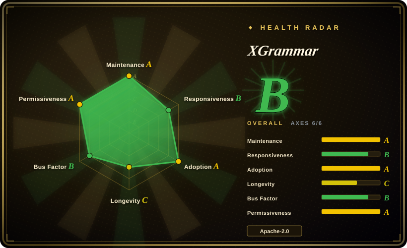
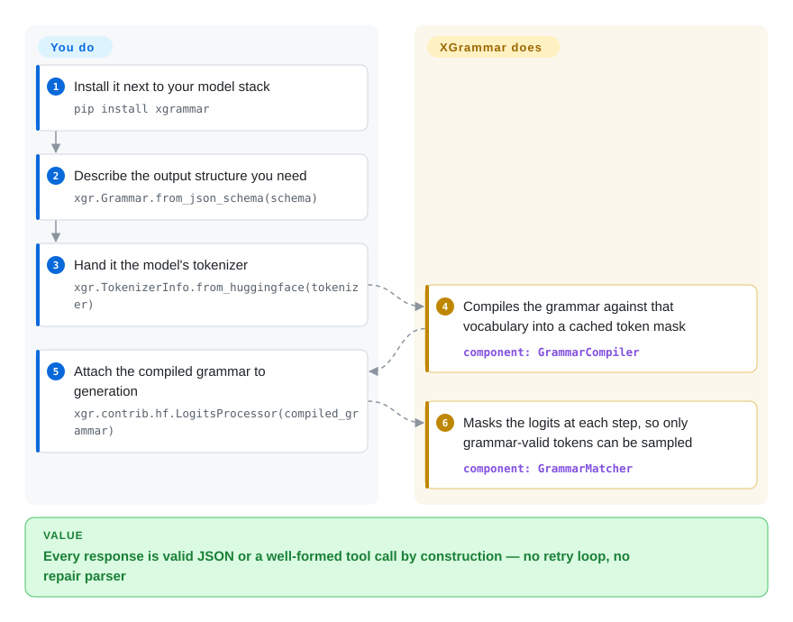

# XGrammar

You ask a model for JSON and it hands back something with a missing brace or `"age": "thirty-five"`, so your parser throws and you retry. XGrammar moves the check inside generation itself: a next word that would break the structure simply cannot be written. Most open LLM serving stacks already run it underneath.



## When to use

You are building an agent or a service that must emit machine-parseable output — a JSON object for a downstream API, a tool call in the model's own chat template, a DSL or code fragment — and you control the model's logits, because you run the model yourself (HuggingFace `transformers`, or a serving engine such as [vLLM](../serving-engines/vllm.md) or [SGLang](../serving-engines/sglang.md)). A model predicts one word at a time under rules that only keep it *plausible*, never *valid*, so what comes back is this:

```json
{"name": "Ada Lovelace", "age": "thirty-five", }
```

`age` should be a number and there is a trailing comma — `json.loads` throws, and your only move is to paste the error back and generate again. Retry-until-it-parses is not acceptable here: it burns tokens, adds latency, and still occasionally hands you a malformed payload at the worst moment.

Reach for XGrammar when the deciding factor is **overhead inside the decoding loop plus breadth of structure**. It compiles the grammar against the model's exact vocabulary up front and keeps a cached token mask, which is why its JSON path is the one engines reach for when structured output must not visibly slow generation; and it covers more shapes than a JSON-only tool — JSON Schema, regex, EBNF, Lark, and its own Structural Tag language for outputs that mix free-form reasoning with tool calls in a model-specific wrapper. Choose it over a pure-Python constraining library when you are wiring into an engine or need a C++-speed mask; choose your provider's hosted structured-output mode instead when you do not own the logits at all.

## How it works

A model writes one *token* at a time — a token being a word or word-fragment it picks from a fixed vocabulary — and it picks by scoring every candidate in that vocabulary and drawing one of the high scorers (those raw scores are the *logits*; the draw is *sampling*). XGrammar sits in that gap: at every step it works out which tokens would still leave a derivation to a valid end under the structure you asked for, and zeroes out all the others before the draw — a *mask*. The criterion is therefore "is there still a way to finish validly", not "is this text valid yet", which is why a half-written prefix such as `<a` or `{"na` is never misjudged as an error. The model is not corrected afterwards; the illegal continuation is never on the table. It is the difference between proofreading an essay and a keyboard that physically cannot type the bad sentence. You describe the structure once, hand it the model's tokenizer, and it precompiles the legal-token sets for that exact vocabulary; that compile happens once per grammar-and-model pair and is cached, so a repeated or shared schema is nearly free — and the answer has to be computed per token rather than per character, because a single token can span several characters. At run time it keeps a tiny bookmark of where you are in the structure: accept the token just sampled, hand back the next mask, repeat. The line between you and it is clean — **you own the prompt, the model, the generation loop and the stopping condition** (and should still describe the required structure in the prompt, since the mask only touches the sampling stage and cannot make the model *want* the right answer), while **XGrammar owns grammar compilation, the token mask and the state machine** that keeps the output inside the structure. If you serve through vLLM, SGLang, TensorRT-LLM or MLC-LLM you do not wire this yourself: those engines call XGrammar behind their structured-output option.



<!-- flow-steps:begin (generated from flows/xgrammar.json by tools/flow_card.py — do not edit) -->
<details>
<summary>Text version of the flow</summary>

1. **You**: Install it next to your model stack — `pip install xgrammar`
2. **You**: Describe the output structure you need — `xgr.Grammar.from_json_schema(schema)`
3. **You**: Hand it the model's tokenizer — `xgr.TokenizerInfo.from_huggingface(tokenizer)`
4. **XGrammar**: Compiles the grammar against that vocabulary into a cached token mask — component: `GrammarCompiler`
5. **You**: Attach the compiled grammar to generation — `xgr.contrib.hf.LogitsProcessor(compiled_grammar)`
6. **XGrammar**: Masks the logits at each step, so only grammar-valid tokens can be sampled — component: `GrammarMatcher`

**Value**: Every response is valid JSON or a well-formed tool call by construction — no retry loop, no repair parser

</details>
<!-- flow-steps:end -->

## When NOT to use

- **You only call closed model APIs (OpenAI, Anthropic, Gemini, …).** XGrammar has no access to the logits there, so it cannot do anything for you; use the provider's own structured-output / `response_format` mode instead, and accept that the grammar surface is whatever the vendor exposes.
- **You already serve with vLLM, SGLang, TensorRT-LLM, OpenVINO GenAI or Modular MAX.** Those engines integrate XGrammar, so turn on their structured-output flag rather than adding a second copy of the library — check the engine's option first, because a separately added version can conflict with the one the engine pins.
- **You want a pure-Python dependency with no C++/binary toolchain and no build step.** Use Outlines (`未收录`, a real repo left to a later sweep) instead, because it is transformers-native Python and easier to read and modify; the price is markedly slower mask generation at serving scale.
- **Your problem is orchestration, not one constrained output.** If you need to interleave loops, conditionals and tool calls as a program over the model, use Guidance (`未收录`, a real repo left to a later sweep) instead; XGrammar constrains a single generation, it does not script control flow.
- **You need the *content* to be right, not just the shape.** XGrammar guarantees structure, not meaning: `<age>三十五</age>` and `{"end": 1, "start": 9}` are perfectly legal, and no grammar can express "end must exceed start". Push what a grammar *can* hold into it (enums, ranges, regexes) and put the rest in an application validation layer such as a pydantic validator on the parsed object — do not expect the mask to enforce cross-field or business rules.
- **You need XML, HTML, or any format with no built-in front-end.** The box ships JSON/JSON Schema, regex, EBNF, Lark and Structural Tag only, so XML means writing and maintaining that grammar yourself in EBNF or Lark. If your plan was to start from a ready-made grammar, [llama.cpp](../local-runtimes/llama-cpp.md) keeps worked GBNF grammars you can port (XGrammar's EBNF is GBNF-compatible); XGrammar's edge is engine integration and mask speed, not a grammar catalogue.
- **You already run locally on [llama.cpp](../local-runtimes/llama-cpp.md) and only need a simple grammar.** Its built-in GBNF grammar support is already in the runtime you run, so adding XGrammar buys you nothing unless you need JSON Schema, Structural Tags or engine-grade speed.
- **You are on Python 3.8.** The package metadata claims `>=3.8` while the installation guide says "Python 3.9 and later"; do not plan a 3.8 deployment on the metadata alone, because the inconsistency was not resolved here.

## Comparison

| Alternative | In index | Our verdict | Tradeoff |
|---|---|---|---|
| [vLLM](../serving-engines/vllm.md) | ✅ | Pick vLLM (or another engine that embeds XGrammar) when you are already serving there: enable its structured-output option and skip this page. Pick XGrammar directly when you own the generation loop yourself — a transformer script, a custom runtime, or an engine without structured output. | The engine route is one flag and no extra dependency but locks the grammar surface to what the engine exposes and to its pinned XGrammar version; the library route gives you the full grammar API and control of the loop, and makes you responsible for batching, overlap and the compile cache. |
| [llama.cpp](../local-runtimes/llama-cpp.md) | ✅ | Pick XGrammar when the output must follow a JSON Schema or a tool-call structure, or when mask latency is the bottleneck; pick llama.cpp's GBNF grammars when you already run llama.cpp and only need a regex or a small custom grammar. | llama.cpp's grammar engine ships inside the binary you already run with no extra dependency, but its grammar tooling is narrower and it only constrains inside llama.cpp; XGrammar covers more grammar front-ends and plugs into any loop, at the cost of a second library and a per-model compile step. |
| Outlines | 未收录 | Pick XGrammar for a serving engine, a C++/Python stack, or Structural Tags; pick Outlines for a research script or a notebook where you want plain, hackable Python and no build toolchain. | Outlines is Python-only and easier to modify; XGrammar ships a compiled C++ core that is much faster per step but is a binary dependency with a build system behind it. |
| Guidance | 未收录 | Pick XGrammar to constrain one output's shape; pick Guidance to write a template that branches, loops and calls tools across several generations. | Guidance is a control-flow language over generation and carries more machinery per token; XGrammar is a narrow, fast constraint layer that leaves orchestration to you. |
| Hosted structured outputs (OpenAI / Anthropic / Gemini) | 非仓库 | Pick the hosted mode whenever the model is behind someone else's API and you cannot self-host; pick XGrammar the moment you run the model, need a custom grammar, or must keep data in-house. | Hosted modes cost zero integration and no operations but give you a vendor-limited grammar surface, no self-hosting, and no control over the model or its version. |

## Tech stack

- **Core.** C++17 (`cpp/`, `include/xgrammar/`), built with CMake plus Ninja into a static library; Python wheels are built with `scikit-build-core` and versioned by `setuptools-scm` from Git tags.
- **Language bindings.** A first-class Python package (`import xgrammar as xgr`), a C++ API, a JavaScript API (`web/`), and a Swift package (`Package.swift`); community Rust bindings exist as the separate `xgrammar-rs` project.
- **Grammar front-ends.** Built-in JSON, JSON Schema, regex, EBNF, Lark, and Structural Tag (whose request shape is compatible with OpenAI's `response_format`); grammars can also be serialized and cached. EBNF is the common intermediate representation every other front-end is converted to, and it is compatible with llama.cpp's GBNF with extensions (repetition ranges, macros). There is **no built-in XML or HTML front-end** — for those you write the grammar yourself in EBNF or Lark.
- **How the mask is precomputed.** For a given position in a rule the compiler splits the vocabulary into tokens it can always accept, tokens it can always reject, and an *uncertain* set whose verdict depends on the parent rules; at run time only the uncertain set is re-evaluated, which is what keeps the per-step cost low (documented in `cpp/grammar_matcher.cc`).
- **Numerics and FFI.** `apache-tvm-ffi` for the C++ boundary, `torch`/`numpy` for the logits and the `int32` bitset token mask, and a CUDA kernel for applying the mask on-GPU; compilation and batched matching are multi-threaded (`BatchGrammarMatcher`).
- **Tokenizers.** HuggingFace fast tokenizers, `tiktoken`, and SentencePiece, wrapped as `TokenizerInfo`; the model's padded logits size can be passed explicitly when it differs from the tokenizer vocabulary.

## Dependencies

- **Python.** Declared `>=3.8, <4` in `pyproject.toml` (installation docs say 3.9+; see the caveat in `When NOT to use`).
- **Runtime packages.** `apache-tvm-ffi>=0.1.11`, `pydantic`, `torch>=1.10.0`, `transformers>=4.38.0`, `numpy`, `typing-extensions>=4.9.0`, plus `triton` on Linux x86_64. Optional extra `xgrammar[metal]` pulls `mlx-lm` for Apple Silicon MPS.
- **Build-time only.** CMake ≥3.18, Ninja, a C++17 compiler, and the Git submodules (`git clone --recursive`), plus `scikit-build-core` / `apache-tvm-ffi` / `setuptools-scm` when installing from source without build isolation.
- **Not required.** No database, no service to run, no network access at generation time, and no GPU-only requirement — the mask is computed on the CPU, with the CUDA kernel used only to apply it to GPU logits. Conda packages are also published (`conda install -c conda-forge xgrammar`).

## Ops difficulty

**Low.** The common path is `pip install xgrammar` (or conda) and importing it in-process: there is nothing to deploy, no daemon, no datastore and no egress during generation, which is a large part of why engines can adopt it freely. The recurring costs are version and compile management rather than operations. Wheels cover Linux, macOS and Windows, but source builds want a C++17 toolchain and recursive submodules, so a source-pinned deployment needs that toolchain in the image. In a long-running engine, keep one compiler per model so the compilation cache is shared, and compile new grammars off the main loop — compiling a complex grammar can take non-negligible time, and the intended pattern is to overlap it with the request's prefill. The version is 0.2.x (upstream marks it Beta), so pin it and read release notes rather than assuming a frozen API.

## Health & viability

- **Maintenance — very active (checked 2026-09-22).** Created 2024-06-28; `main` pushed 2026-09-21; releases ship every few weeks rather than on a calendar (`v0.2.5` 2026-07-22, `v0.2.6` 2026-09-09, `v0.2.7` 2026-09-15), with prereleases marked separately. XGrammar-2 landed in 2026-05.
- **Governance / bus factor — a written process over a concentrated history.** The org is `mlc-ai`; `GOVERNANCE.md` names six core maintainers with a documented vote and role-change procedure, and `CODEOWNERS` assigns review by directory. The commit history is nonetheless top-heavy: the two leading contributors dominate contributions and the rest fall off sharply, so treat the roster as real but the day-to-day code path as key-person dependent. [推断]
- **Backing & Lindy — a young project with unusually wide adoption.** It comes out of the MLC / TVM / MLC-LLM research lineage (Tianqi Chen co-authors the papers) rather than a foundation or a vendor with a support contract. At roughly two and a quarter years old it is young on the Lindy clock, but the adoption below is what makes abandonment unlikely in the near term; weigh age and activity together, as the schema's heuristic asks.
- **Adoption & ecosystem — the strongest signal on this page.** XGrammar is the default structured-generation backend for vLLM, SGLang, TensorRT-LLM and MLC-LLM, and the README also records OpenVINO GenAI, Modular MAX, WebLLM and Mirai/uzu integrations; it publishes on PyPI and conda-forge and has community Rust bindings. The README's collaborator logo wall (xAI, DeepSeek, NVIDIA, Databricks, Meta, Google, Perplexity, Modular) is a first-party marketing claim and is not independently verified here. [未验证]
- **Risk flags.** Apache-2.0 with no relicense history observed in the repository; `CONTRIBUTING.md` describes a fork-and-PR flow with a `pre-commit` and `ruff` gate and CODEOWNERS approval, and mentions no CLA. No `SECURITY.md` is present in the tree, and 85 issues were open at review time. Being pre-1.0 with a Beta classifier, the API can move between minor versions.
- **Verdict.** A safe dependency if your stack is Python or C++ LLM inference and you pin the version: the integration point (a logits mask) is narrow and stable, and the serving ecosystem's dependence on it is a strong durability signal — but the short history and 0.x versioning mean you should track releases and not treat the grammar API as frozen.

## Caveats (unverified)

- [未验证] The README's collaborator logos (xAI, DeepSeek, NVIDIA, Databricks, Meta, Google, Perplexity, Modular) are self-reported adoption claims; only the vLLM/SGLang/TensorRT-LLM/MLC-LLM integrations are corroborated by the README news list, and this page did not verify each engine's default flag.
- [未验证] "Near-zero overhead" in JSON generation is the project's own claim from its README and technical reports; no benchmark was run here.
- [未验证] Python version support is internally inconsistent — `pyproject.toml` says `>=3.8` while `docs/start/installation.md` says "Python 3.9 and later" — so the 3.8 floor is unconfirmed.
- [未验证] Runtime dependencies were read from `pyproject.toml`, not from an executed install; transitive resolution of `torch`, `transformers` and `triton`, and their behavior per platform, was not tested.
- [推断] Contributor concentration (top two contributors far ahead, then a steep drop) is read from the GitHub contributors API on 2026-09-22, which is not identity-deduplicated; treat it as a concentration signal rather than exact shares.
- [推断] The "declared default backend" wording follows the README and the widely known integrations; which engine uses it by default without opting in was not checked in each engine's source at this revision.
- [未验证] No `SECURITY.md` was found in the repository tree at this revision; whether a private vulnerability-reporting channel exists outside the repo was not confirmed.
- [推断] Outlines and Guidance are real repositories deliberately left unindexed by this change (they are outside this one-project review); their capability descriptions come from their public positioning, not from a page read here.
- [推断] "A half-written prefix is never misjudged" rests on the documented three-way split of the compiled mask (always-accept / always-reject / uncertain, `cpp/grammar_matcher.cc`); the behaviour was not reproduced by running the library.
- [推断] "Structure, not semantics" is the standard reading of constrained decoding — the project claims structural correctness and makes no semantic guarantee — but the distinction is my framing, not a project statement.
- [未验证] "No built-in XML/HTML front-end" is read from the repository tree and the `docs/defining_structures/` listing at this revision; XML is expressible in EBNF/Lark, but whether a maintained ready-made XML grammar exists elsewhere was not checked.
- [未验证] The claim that truncation at `max_new_tokens` can leave a structurally incomplete output was reasoned from the fact that the mask governs token legality, not stopping conditions; it was not reproduced.
