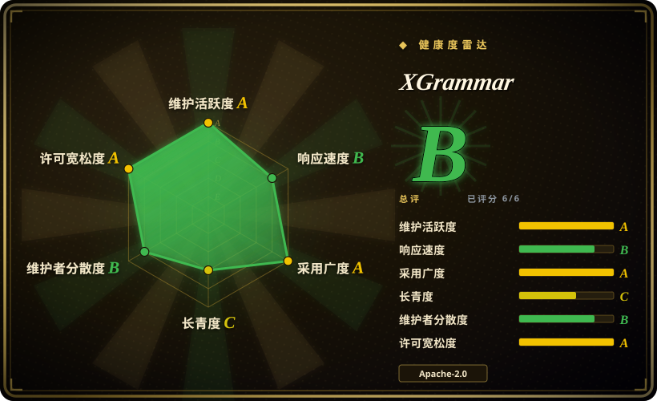
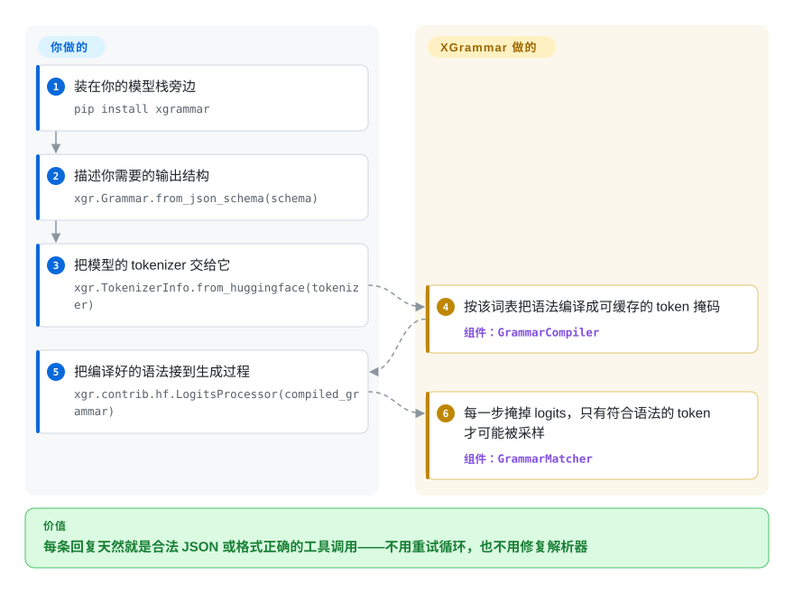

# XGrammar

你让大模型吐一段 JSON，它时不时给你一个少了括号、或者把数字写成中文的残次品，程序解析失败，你只能重试。XGrammar 把这道检查挪进生成过程本身：会破坏结构的下一个字，根本不可能被写出来。多数开源 LLM 服务栈底下跑的都是它。



## 何时使用

你在做一个必须输出机器可解析结果的 agent 或服务——给下游 API 用的 JSON、按模型自己的对话模板拼出的工具调用、某种 DSL 或代码片段——而你掌握模型的 logits，因为模型是你自己跑的（HuggingFace `transformers`，或 [vLLM](../serving-engines/vllm.zh.md)、[SGLang](../serving-engines/sglang.zh.md) 这类服务引擎）。大模型是一个字一个字往下猜的，猜的规则只保证「像人话」，不保证「合法」，于是你拿到的是这种东西：

```json
{"name": "张三", "age": "三十五岁", }
```

`age` 本该是数字，末尾还多了个逗号——`json.loads` 直接抛错，你唯一的招数是把报错贴回去重来一遍。「解析失败就重试」在这里不可接受：它烧 token、加延迟，而且在最不能出错的时候仍然偶尔给你一个畸形载荷。

决定因素是**解码循环里的额外开销加上结构的覆盖面**时，就选 XGrammar。它先按模型的确切词表把语法编译好并缓存 token 掩码，所以它的 JSON 路径成了各家引擎在「结构化输出不能明显拖慢生成」时的首选；它的覆盖面也超过只做 JSON 的工具——JSON Schema、正则、EBNF、Lark，以及它自己的 Structural Tag 语言，用来描述「自由推理文本和模型专属包装的工具调用混在一起」的输出。要接进引擎、或需要 C++ 级别的掩码速度时选它而不是纯 Python 的约束库；完全不掌握 logits 时，改用厂商自带的托管结构化输出。

## 怎么用起来

模型每次只写一个 **token**（一个词或半个词，从固定词表里挑），挑的方式是给词表里每个候选打分，再从高分里抽一个——那些原始分数叫 **logits**，这一抽叫**采样**。XGrammar 就卡在这个缝隙里：每一步它先算出「按你要的结构，哪些 token 写下去仍然合法」，把其余的分数全部抹平再抽——这层过滤叫**掩码**。模型不是写完了被纠正，而是那条错路压根没出现在选项里。打个比方：不是写完作文再批改，而是这个键盘物理上就敲不出病句。你把结构描述一次、把模型的 tokenizer 交给它，它针对这个确切词表预编译出合法 token 集合；这件事对每一对「语法 + 模型」只做一次并缓存，所以重复或共享的 schema 几乎不花代价。运行期它只维护一个很小的书签，记住你走到结构的哪一步：收下刚抽出的 token，交出下一步的掩码，循环往复。你与它的分工很干净——**prompt、模型和生成循环归你**（而且你仍应在 prompt 里写清所需结构，因为掩码只作用于采样阶段，没法让模型真心想给对答案），**语法编译、token 掩码和保持输出不越界的状态机归它**。如果你通过 vLLM、SGLang、TensorRT-LLM 或 MLC-LLM 提供服务，就不必自己接：这些引擎在它们各自的结构化输出选项背后调用 XGrammar。



<!-- flow-steps:begin (generated from flows/xgrammar.json by tools/flow_card.py — do not edit) -->
<details>
<summary>流程文字版</summary>

1. **你**：装在你的模型栈旁边 — `pip install xgrammar`
2. **你**：描述你需要的输出结构 — `xgr.Grammar.from_json_schema(schema)`
3. **你**：把模型的 tokenizer 交给它 — `xgr.TokenizerInfo.from_huggingface(tokenizer)`
4. **XGrammar**：按该词表把语法编译成可缓存的 token 掩码 — 组件：`GrammarCompiler`
5. **你**：把编译好的语法接到生成过程 — `xgr.contrib.hf.LogitsProcessor(compiled_grammar)`
6. **XGrammar**：每一步掩掉 logits，只有符合语法的 token 才可能被采样 — 组件：`GrammarMatcher`

**价值**：每条回复天然就是合法 JSON 或格式正确的工具调用——不用重试循环，也不用修复解析器

</details>
<!-- flow-steps:end -->

## 何时不用

- **你只调用闭源模型 API（OpenAI、Anthropic、Gemini 等）。** 那里你拿不到 logits，XGrammar 帮不上忙；改用厂商自己的结构化输出 / `response_format` 模式，并接受语法能力就是厂商开放的那部分。
- **你已经用 vLLM、SGLang、TensorRT-LLM、OpenVINO GenAI 或 Modular MAX 提供服务。** 这些引擎已经集成了 XGrammar，打开它们的结构化输出开关就行，不要再装一份——先查引擎的选项，因为单独加进去的版本可能与引擎 pin 住的版本冲突。
- **你要的是纯 Python 依赖、不想引入 C++/二进制工具链和构建步骤。** 改用 Outlines（`未收录`，真实仓库，留给后续批次）——它是 transformers 原生的 Python，更好读也更好改；代价是在服务规模下掩码生成明显更慢。
- **你的问题是编排，而不是一次受约束的输出。** 需要把循环、分支、工具调用写成一段作用于模型的程序时，改用 Guidance（`未收录`，真实仓库，留给后续批次）；XGrammar 只约束一次生成，不负责编排控制流。
- **你已在本地用 [llama.cpp](../local-runtimes/llama-cpp.zh.md) 跑，只需要简单语法。** 它内置的 GBNF 语法支持就在你已经运行的运行时里，除非你要 JSON Schema、Structural Tag 或引擎级速度，否则加 XGrammar 得不到额外收益。
- **你在 Python 3.8 上。** 包元数据写 `>=3.8`，而安装文档写「Python 3.9 and later」；不要只凭元数据规划 3.8 部署，因为这次审查没有消除这处不一致。

## 横向对比

| 替代品 | 是否收录 | 我们的评价 | 取舍 |
|---|---|---|---|
| [vLLM](../serving-engines/vllm.zh.md) | ✅ | 已经在 vLLM（或其他内置 XGrammar 的引擎）上服务时选它：打开结构化输出选项，这一页就不用看了。生成循环在你自己手里时（transformers 脚本、自研运行时，或没有结构化输出的引擎）直接选 XGrammar。 | 走引擎只要一个开关、不加额外依赖，但语法能力被引擎开放的接口和它 pin 的 XGrammar 版本锁住；走库则拿到完整语法 API 和循环控制权，同时批处理、与预填充重叠、编译缓存都变成你自己的责任。 |
| [llama.cpp](../local-runtimes/llama-cpp.zh.md) | ✅ | 输出要遵循 JSON Schema 或工具调用结构、或掩码延迟是瓶颈时选 XGrammar；已经在跑 llama.cpp、只需要正则或一个小的自定义语法时选它的 GBNF 语法。 | llama.cpp 的语法引擎就在你已运行的二进制里，不加依赖，但语法工具更窄且只能在 llama.cpp 内起作用；XGrammar 覆盖更多语法前端、能接进任何循环，代价是多一个库和一次按模型的编译。 |
| Outlines | 未收录 | 目标是服务引擎、C++/Python 栈或 Structural Tag 时选 XGrammar；研究脚本或 notebook、想要能随便改的纯 Python 且不想碰构建工具链时选 Outlines。 | Outlines 只有 Python、改起来容易；XGrammar 带一个编译好的 C++ 内核，每步快得多，但它是二进制依赖、背后有一套构建系统。 |
| Guidance | 未收录 | 约束一次输出的形状时选 XGrammar；要写一个跨多次生成做分支、循环、调工具的模板时选 Guidance。 | Guidance 是一门作用于生成的控制流语言，每个 token 背的机制更多；XGrammar 是窄而快的约束层，编排留给你自己。 |
| 厂商托管结构化输出（OpenAI / Anthropic / Gemini） | 非仓库 | 模型在别人 API 后面、你又无法自托管时选托管模式；一旦模型由你运行、需要自定义语法、或数据必须留在内部，就选 XGrammar。 | 托管模式零集成、零运维，但语法能力受厂商限制、不能自托管，也拿不到对模型及其版本的控制权。 |

## 技术栈

- **核心。** C++17（`cpp/`、`include/xgrammar/`），用 CMake 加 Ninja 构建成静态库；Python wheel 由 `scikit-build-core` 构建，版本由 `setuptools-scm` 从 Git tag 生成。
- **语言绑定。** 一等公民的 Python 包（`import xgrammar as xgr`）、C++ API、JavaScript API（`web/`）、Swift 包（`Package.swift`）；社区 Rust 绑定是独立的 `xgrammar-rs` 项目。
- **语法前端。** 内置 JSON、JSON Schema、正则、EBNF、Lark 和 Structural Tag（其请求形状兼容 OpenAI 的 `response_format`）；语法还可以序列化与缓存。
- **数值与 FFI。** 用 `apache-tvm-ffi` 跨 C++ 边界，用 `torch`/`numpy` 承载 logits 与 `int32` bitset token 掩码，在 GPU 上用 CUDA kernel 施加掩码；编译和批量匹配都是多线程的（`BatchGrammarMatcher`）。
- **Tokenizer。** HuggingFace fast tokenizer、`tiktoken` 和 SentencePiece，统一包成 `TokenizerInfo`；当模型 logits 的填充尺寸与 tokenizer 词表不一致时，可以显式传入。

## 依赖

- **Python。** `pyproject.toml` 声明 `>=3.8, <4`（安装文档写 3.9+；见「何时不用」里的存疑项）。
- **运行时包。** `apache-tvm-ffi>=0.1.11`、`pydantic`、`torch>=1.10.0`、`transformers>=4.38.0`、`numpy`、`typing-extensions>=4.9.0`，Linux x86_64 上还有 `triton`。可选 extra `xgrammar[metal]` 会拉入 Apple Silicon MPS 所需的 `mlx-lm`。
- **仅构建期。** CMake ≥3.18、Ninja、C++17 编译器，以及 Git 子模块（`git clone --recursive`）；在不启用构建隔离、从源码安装时还需要 `scikit-build-core`、`apache-tvm-ffi`、`setuptools-scm`。
- **不需要。** 没有数据库、没有要跑的服务、生成时不需要网络，也不强制要求 GPU——掩码在 CPU 上计算，CUDA kernel 只用于把掩码作用到 GPU 的 logits 上。另有 conda 包（`conda install -c conda-forge xgrammar`）。

## 运维难度

**低。** 常见路径是 `pip install xgrammar`（或 conda）然后在进程内 import：没有东西要部署，没有守护进程、没有数据存储、生成期间没有出网流量，这也是各引擎能放心采用它的重要原因。长期成本主要来自版本与编译管理，而不是运维本身。wheel 覆盖 Linux、macOS 和 Windows，但从源码构建需要 C++17 工具链和递归子模块，所以 pin 源码的部署得把工具链放进镜像。在长驻引擎里，每个模型保留一个 compiler 以共享编译缓存，并把新语法的编译挪出主循环——复杂语法的编译耗时不可忽略，官方意图是让它与请求的预填充阶段重叠。版本是 0.2.x（上游标记为 Beta），所以要 pin 版本、读 release notes，不要假定 API 冻结。

## 健康度与可持续性

- **维护——非常活跃（2026-09-22 核对）。** 创建于 2024-06-28；`main` 最后一次推送为 2026-09-21；release 按需发布而非固定节奏（`v0.2.5` 2026-07-22、`v0.2.6` 2026-09-09、`v0.2.7` 2026-09-15），预发布单独标注。XGrammar-2 于 2026-05 发布。
- **治理与 bus factor——有成文流程，但提交历史集中。** 组织是 `mlc-ai`；`GOVERNANCE.md` 列了六位核心维护者，并写明了投票与角色变更流程，`CODEOWNERS` 按目录分配评审。但提交历史明显头重：前两位贡献者远超其余，之后陡降，所以维护者名单是真的，日常代码路径却依赖少数人。[推断]
- **背书与 Lindy——年轻项目，采用面异常广。** 它出自 MLC / TVM / MLC-LLM 研究谱系（陈天奇是论文合著者），而非基金会或有支持合同的厂商。约二年三个月大，在 Lindy 尺度上算年轻，但下面的采用面让它在近期不太可能被放弃；按 schema 的启发式，年龄与活跃度要一起看。
- **采用与生态——本页最强的信号。** XGrammar 是 vLLM、SGLang、TensorRT-LLM 和 MLC-LLM 的默认结构化生成后端，README 还记录了 OpenVINO GenAI、Modular MAX、WebLLM 和 Mirai/uzu 的集成；它发布在 PyPI 与 conda-forge 上，并有社区 Rust 绑定。README 里的合作方 logo 墙（xAI、DeepSeek、NVIDIA、Databricks、Meta、Google、Perplexity、Modular）是第一方营销说法，本页未独立验证。[未验证]
- **风险标记。** Apache-2.0，仓库内未观察到改许可历史；`CONTRIBUTING.md` 描述的是 fork 加 PR 流程，配 `pre-commit` 与 `ruff` 门禁和 CODEOWNERS 批准，未提及 CLA。目录树里没有 `SECURITY.md`，审查时挂着 85 个 open issue。处于 pre-1.0 且带 Beta 分类，minor 版本之间 API 可能变动。
- **结论。** 只要你的栈是 Python 或 C++ 的 LLM 推理，pin 住版本后它是安全依赖：接入点（logits 掩码）窄而稳定，服务生态对它的依赖是强耐久信号——但历史短加 0.x 版本意味着你要跟 release，不要把语法 API 当冻结接口。

## 存疑（未验证）

- [未验证] README 的合作方 logo（xAI、DeepSeek、NVIDIA、Databricks、Meta、Google、Perplexity、Modular）是自报的采用声明；只有 vLLM/SGLang/TensorRT-LLM/MLC-LLM 的集成被 README 的 news 列表印证，且本页未逐一核对各引擎的默认开关。
- [未验证]「JSON 生成近乎零开销」是项目自己在 README 与技术报告中的说法；本页没有跑任何基准测试。
- [未验证] Python 版本支持前后不一致——`pyproject.toml` 写 `>=3.8`，而 `docs/start/installation.md` 写「Python 3.9 and later」——所以 3.8 这条下限未获确认。
- [未验证] 运行时依赖读自 `pyproject.toml`，不是实际安装的结果；`torch`、`transformers`、`triton` 的传递解析及各平台表现均未测试。
- [推断] 贡献者集中度（前两位远超其余、之后陡降）来自 2026-09-22 的 GitHub contributors API，该数据未按身份去重；当作集中度信号，而非精确份额。
- [推断]「默认后端」的措辞依据 README 与广为人知的集成；具体哪个引擎无需显式开启就默认使用它，未在本修订版逐一查各引擎源码确认。
- [未验证] 本修订版的仓库目录树里没有 `SECURITY.md`；仓库之外是否存在私密漏洞上报渠道未获确认。
- [推断] Outlines 和 Guidance 是本次改动刻意不收录的真实仓库（不在单项目审查范围内）；它们的能力描述来自公开定位，而非本页读过的选型页。
