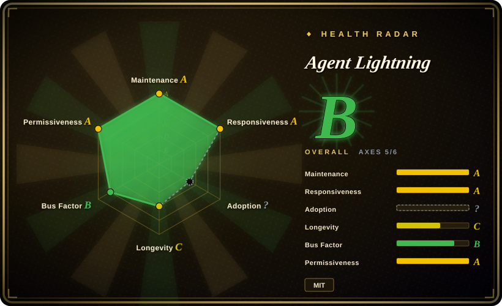

# Agent Lightning

A Microsoft framework for *harnessed* agentic RL: it trains the policy behind an existing agent — tools, context, control flow and environment kept in the loop — through an OpenAI-compatible proxy, so the agent's own code needs no changes.

## When to use

You're an engineer who already shipped a multi-step agent — a coding agent, a search/retrieval loop, an AutoGen or LangChain pipeline that calls tools and reasons over several turns. It works, but it's *static*: the underlying model never improves from the trajectories your agent actually produces in your domain. You want RL on real rollouts, but the RL stacks you've looked at assume you'll rewrite the agent as a monolithic generation loop, and yours has branching, tool calls and multiple LLM steps.

v1.0 is built exactly for this, and it is deliberately small (~3,500 LOC). Three components do the work: an **API Gateway** that fronts your model endpoint as an OpenAI-compatible proxy and records each call's prompt/response token IDs and log-probs, a **Rollout Controller** that launches agent executions as local subprocesses or Kubernetes Jobs, and a **Trainer** that runs verl + vLLM and turns the captured rollouts into policy updates (GRPO with rollout-level advantage aggregation). Because the rollout ID is baked into the proxy URL, every model call is attributed to the right execution — so an existing agent becomes trainable by *pointing its base URL at the Gateway*, nothing else. Training and agent execution can also live on separate machines or clusters and scale independently. [推断] If your agent is already an OpenAI-compatible client, integration cost is close to zero.

## When NOT to use

- **You just want to fine-tune a single model on a dataset.** If there's no multi-step agent/tool-use loop, a plain SFT/LoRA trainer ([LLaMA-Factory](llamafactory.md), [Unsloth](unsloth.md), HF TRL) is simpler and lighter.
- **No GPU / no RL infra.** The framework itself is light, but policy inference and GRPO updates still need the verl + vLLM GPU stack — the quick start asks for one A100. That is heavyweight next to single-GPU LoRA SFT; exact VRAM minimums vary by model.
- **You want a managed, hosted RL training service.** This is self-hosted, not SaaS; [ART](art.md) offers a more batteries-included single-loop experience for the same job.
- **You depend on v0.x-era integrations.** v1.0 is a full rewrite, with the pre-1.0 code parked on the `v0.x` branch; the older Tinker backend, AgentOps/Weave tracers, MongoDB rollout store and automatic prompt optimization do not appear in the v1.0 package, docs or dependency list. Porting a v0.x setup means reading the v1.0 architecture fresh. [推断]
- **You need a single-vendor, fully-integrated path.** You still assemble pieces yourself (Gateway + Controller + verl trainer) rather than getting one opaque product.

## Comparison

| Alternative | In index | Our verdict | Tradeoff |
|---|---|---|---|
| [LLaMA-Factory](llamafactory.md) | ✅ | Choose LLaMA-Factory when you need broad SFT/DPO/PPO fine-tuning over datasets with a unified config/UI. | Broad dataset fine-tuning, not live multi-step agent rollouts. |
| [Unsloth](unsloth.md) | ✅ | Choose Unsloth when fast, memory-efficient single-GPU SFT/LoRA is the bottleneck. | An optimization *kernel/trainer*, not an agent-rollout RL orchestrator. |
| [ART](art.md) | ✅ | Choose ART when you want an agent-RL loop that is opinionated and batteries-included; choose Agent Lightning when you must keep a production agent harness byte-for-byte and train it behind an OpenAI-compatible proxy. | ART buys ergonomics; Agent Lightning buys framework-agnostic decoupling and horizontal separation of training and agent execution (local or Kubernetes). |
| [verl](verl.md) | ✅ | Choose verl when you need the distributed RL engine itself and are willing to express training as its generation loop; Agent Lightning is the layer that lets a native agent harness feed that engine unmodified. | Building on verl gives you GRPO/PPO scale, but you own the agent-to-training plumbing unless you take this wrapper. |
| [HF TRL](trl.md) | ✅ | Choose HF TRL when you need a mature PPO/GRPO/DPO library for dataset- or loop-centric training. | No agent-execution decoupling or multi-step credit assignment out of the box. |
| OpenAI Agents SDK / [LangChain](../agent-frameworks/workflow-builders/langchain.md) (alone) | 部分已收录 | Choose agent frameworks alone when you only need to build and run agents, not train the underlying model from rollouts. | Agent Lightning sits on top of agent execution to make rollouts trainable; plain frameworks stop at orchestration. OpenAI Agents SDK is not indexed separately. |

## Tech stack

- **Language:** Python 3.12+; v1.0 core is ~3,500 LOC.
- **Three components:** API Gateway (FastAPI/uvicorn — OpenAI-compatible model proxy plus rollout/event store), Rollout Controller (local process pool or Kubernetes Jobs via `kr8s`), Trainer (wraps `verl`'s `ppo_trainer`).
- **Serving/training:** vLLM through verl; GPU stack with Ray and torch.
- **Algorithms:** RL via verl (GRPO), with rollout/trajectory-level advantage aggregation (`algorithm.enable_rollout_level_advantage`); trajectory vs transition trace aggregation.
- **Config:** Hydra + OmegaConf, structured logging via structlog.
- **Agent integrations:** any OpenAI-compatible client — the examples cover AutoGen, coding-agent harnesses, Search-R1, sandboxes, and multimodal QA.
- **Coding-agent optimization:** v1.0.1 also ships an Agent Lightning *Skill* (`gh skill install microsoft/agent-lightning agent-lightning`) that lets Claude Code / Codex / GitHub Copilot iterate on another agent's prompts, tools and workflows.

## Dependencies

- `pip install agentlightning`; requires Python >= 3.12.
- Core deps are deliberately small: fastapi, uvicorn, pydantic, httpx, hydra-core, omegaconf, structlog, jinja2, kr8s, pyyaml.
- Training needs the `verl` GPU stack (`verl>=0.7.1,<0.9.0` — the upper bound is deliberate), plus vLLM, Ray, torch and CUDA; the repo bootstraps it with `uv sync` + `scripts/setup_verl.sh`.
- Kubernetes is optional (k8s runner); the local runner is the lighter path.
- Your agent only needs to point at an OpenAI-compatible base URL, so heavy training deps stay server-side.

## Ops difficulty

**High for a full RL run, medium for a single-node quick start.** v1.0 shrank the framework surface to three components, but you still stand up the verl/vLLM GPU stack, orchestrate rollouts (local processes or Kubernetes Jobs), and tune the gateway/controller/trainer configuration. The decoupling keeps *agent code* untouched while pushing complexity into *infra assembly*. [推断]

## Health & viability

- **Maintenance**: Grade A — 9/13 active weeks in trailing 13; last commit 5 days ago.
- **Responsiveness**: Grade A — median first-response time 28.0 hours across 14 qualifying issues/PRs.
- **Adoption**: Cannot be scored — ambiguous.
- **Longevity**: Grade C — 461 days old.
- **Governance**: Grade B — top-3 contributor share 84.7% (45 active maintainers in the trailing 12 months).
- **Risk / License**: Grade A — MIT license.

## Caveats (unverified)

- [未验证] Star count: ~18.4k GitHub stars (2026-09-19); star figures in this ecosystem are unreliable and should not drive selection.
- [推断] The v1.0 rewrite drops v0.x-era features (Tinker backend, AgentOps/Weave tracers, MongoDB store, automatic prompt optimization): they are absent from the v1.0 package, docs and dependency list, and the README points to a `v0.x` branch for "legacy releases". If you need one of them, verify on that branch before assuming it is gone.
- [未验证] The coding-agent benchmark claim (Qwen3.5-9B improving SWE-bench Verified from 41.8% to 56.4% on 6K samples) is Microsoft's own reported figure and has not been independently reproduced here.
- [未验证] Minimum GPU/VRAM, supported model families, and exact dependency versions vary by model and backend; the docs' quick start states one A100 for the Calc-X example.
- [未验证] The `adoption` health axis remains unscored (`ambiguous`); the B overall grade reflects five axes, not adoption breadth.
- [推断] v1.0.x is a fresh, light codebase with an explicit semver 1.x signal, but a full rewrite still means integration details (gateway/controller/verl config) may shift between minor releases.
