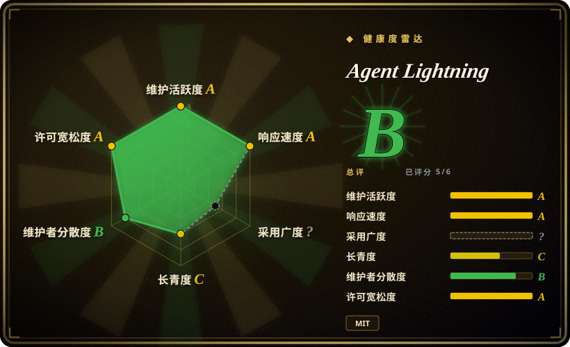

# Agent Lightning

微软出品的*带 harness* 的 agentic RL 框架：让现有 agent 的工具、上下文、控制流与环境原样留在训练回路里，只通过一个 OpenAI 兼容代理训练其背后的策略模型，agent 自身代码无需改动。

## 何时使用

你是一名工程师，已经上线了一个多步 agent——一个 coding agent、一条检索循环，或者一条 AutoGen / LangChain 流水线，会调工具、跨多轮推理。它能跑，但它是*静态*的：底层模型从来没有从你的 agent 在真实业务里实际产出的轨迹中变强过。你想在真实 rollout 上做 RL，但你查过的 RL 框架都假设你会把 agent 重写成单体生成循环——而你的 agent 有分支、有工具调用、有多个 LLM 步骤。

v1.0 正是为此而生，而且刻意做得很小（约 3,500 行代码）。三个部件承担全部工作：**API Gateway** 把模型端点包装成一个 OpenAI 兼容代理，记录每次调用的 prompt / response token ID 与 log-prob；**Rollout Controller** 把 agent 执行作为本地子进程或 Kubernetes Job 拉起；**Trainer** 运行 verl + vLLM，把捕获到的 rollout 变成策略更新（GRPO，配合 rollout 级 advantage 聚合）。由于 rollout ID 被编进代理 URL，每次模型调用都能归属到正确的执行——于是一个现成 agent 只需*把 base URL 指到 Gateway* 就变得可训练，别的什么都不用改。训练与 agent 执行也可以分处不同机器或集群、各自独立扩容。如果你的 agent 本来就是 OpenAI 兼容客户端，接入成本接近于零。[推断]

## 何时不用

- **你只是想在一个数据集上微调单个模型。** 如果没有多步 agent / 工具调用循环，用普通的 SFT/LoRA 训练器（[LLaMA-Factory](llamafactory.zh.md)、[Unsloth](unsloth.zh.md)、HF TRL）更简单更轻。
- **没有 GPU / 没有 RL 基础设施。** 框架本身很轻，但策略推理与 GRPO 更新仍需要 verl + vLLM 的 GPU 栈——快速上手文档要求一台 A100。相比单卡 LoRA SFT 这是重型方案；具体显存下限随模型而变。
- **你想要托管的、云端 RL 训练服务。** 这是自托管框架，不是 SaaS；同样面向 agent RL 时，[ART](art.zh.md) 提供更开箱即用的单循环体验。
- **你依赖 v0.x 时代的集成。** v1.0 是完全重写，1.0 之前的代码放在 `v0.x` 分支；旧的 Tinker 后端、AgentOps/Weave tracer、MongoDB rollout store 和自动提示优化在 v1.0 的包、文档与依赖列表里都不再出现。把 v0.x 的配置迁过来意味着要重新读一遍 v1.0 的架构。[推断]
- **你需要单一厂商、完全集成的一条龙路径。** 你仍然要自己拼装各部件（Gateway + Controller + verl trainer），而不是拿到一个不透明的成品。

## 横向对比

| 替代品 | 是否收录 | 我们的评价 | 取舍 |
|---|---|---|---|
| [LLaMA-Factory](llamafactory.zh.md) | ✅ | 需要在数据集上做广覆盖 SFT/DPO/PPO 微调，并使用统一配置/UI 时，选 LLaMA-Factory。 | 它擅长数据集微调，不是为在线多步 agent rollout 设计。 |
| [Unsloth](unsloth.zh.md) | ✅ | 快速、省显存的单卡 SFT/LoRA 是瓶颈时，选 Unsloth。 | 它是优化*内核/训练器*，不是 agent rollout 的 RL 编排器。 |
| [ART](art.zh.md) | ✅ | 想要有主张、开箱即用的 agent RL 循环时选 ART；必须把一个生产 agent harness 原封不动保留、并在 OpenAI 兼容代理后面训练它时，选 Agent Lightning。 | ART 买到的是易用性；Agent Lightning 买到的是框架无关的解耦，以及训练与 agent 执行的水平分离（本地或 Kubernetes）。 |
| [verl](verl.zh.md) | ✅ | 需要分布式 RL 引擎本身、并愿意把训练表达成它的生成循环时，选 verl；Agent Lightning 是让原生 agent harness 无需修改就喂给这个引擎的那一层。 | 直接基于 verl 能拿到 GRPO/PPO 的规模，但 agent 与训练之间的管道要你自己接——除非用这层封装。 |
| [HF TRL](trl.zh.md) | ✅ | 需要成熟的 PPO/GRPO/DPO 库做数据集或循环中心训练时，选 HF TRL。 | 开箱没有 agent 执行解耦或多步信用分配。 |
| OpenAI Agents SDK / [LangChain](../agent-frameworks/workflow-builders/langchain.zh.md)（单用） | 部分已收录 | 只需要构建和运行 agent，而不是从 rollout 训练底层模型时，选单独的 agent 框架。 | Agent Lightning 叠在 agent 执行之上，让 rollout 可训练；普通框架止步于编排。OpenAI Agents SDK 未单独收录。 |

## 技术栈

- **语言：** Python 3.12+；v1.0 核心约 3,500 行代码。
- **三个部件：** API Gateway（FastAPI/uvicorn——OpenAI 兼容的模型代理 + rollout/event 存储）、Rollout Controller（本地进程池，或经 `kr8s` 作为 Kubernetes Job）、Trainer（封装 `verl` 的 `ppo_trainer`）。
- **Serving/训练：** 经 verl 使用 vLLM；GPU 栈含 Ray 与 torch。
- **算法：** 经 verl 做 RL（GRPO），配合 rollout / 轨迹级 advantage 聚合（`algorithm.enable_rollout_level_advantage`）；trace 聚合可在 trajectory 与 transition 之间选择。
- **配置：** Hydra + OmegaConf，structlog 结构化日志。
- **agent 集成：** 任何 OpenAI 兼容客户端——示例覆盖 AutoGen、coding agent harness、Search-R1、sandbox、多模态 QA。
- **coding agent 优化：** v1.0.1 还附带一个 Agent Lightning *Skill*（`gh skill install microsoft/agent-lightning agent-lightning`），让 Claude Code / Codex / GitHub Copilot 去迭代另一个 agent 的提示词、工具与工作流。

## 依赖

- `pip install agentlightning`；要求 Python >= 3.12。
- 核心依赖刻意保持很少：fastapi、uvicorn、pydantic、httpx、hydra-core、omegaconf、structlog、jinja2、kr8s、pyyaml。
- 训练需要 `verl` GPU 栈（`verl>=0.7.1,<0.9.0`，上限是刻意设的），外加 vLLM、Ray、torch 与 CUDA；仓库用 `uv sync` + `scripts/setup_verl.sh` 引导安装。
- Kubernetes 是可选项（k8s runner）；本地 runner 是更轻的路径。
- 你的 agent 只需指向一个 OpenAI 兼容 base URL，因此重型训练依赖都留在服务端。

## 运维难度

**完整 RL 训练为高，单机快速上手为中。** v1.0 把框架面收敛到三个部件，但你仍要拉起 verl/vLLM 的 GPU 栈、编排 rollout（本地进程或 Kubernetes Job），并调好 gateway / controller / trainer 的配置。解耦让 *agent 代码* 保持不动，把复杂度推到了*基础设施拼装*上。[推断]

## 健康度与可持续性

- **维护活跃度**：Grade A——最近 13 周中 9 周有提交；最后提交距今 5 天。
- **响应速度**：Grade A——中位首次响应时间 28.0 小时，基于 14 个 qualifying issues/PRs。
- **采用广度**：无法计算——ambiguous。
- **长青度**：Grade C——仓库已创建 461 天。
- **治理集中度**：Grade B——前三贡献者占比 84.7%（过去 12 个月内 45 位活跃维护者）。
- **许可风险**：Grade A——MIT 许可证。

## 存疑（未验证）

- [未验证] Star 数：约 1.84 万 GitHub stars（2026-09-19）；本生态的 star 数字不可靠，不应作为选型依据。
- [推断] v1.0 重写移除了 v0.x 时代的功能（Tinker 后端、AgentOps/Weave tracer、MongoDB store、自动提示优化）：它们在 v1.0 的包、文档与依赖列表里都不再出现，README 指向 `v0.x` 分支存放「legacy releases」。若你依赖其中某项，请先到该分支核实再断定其已消失。
- [未验证] coding agent 的基准数字（Qwen3.5-9B 用 6K 样本把 SWE-bench Verified 从 41.8% 提到 56.4%）是微软自报结果，本文未做独立复现。
- [未验证] 最低 GPU/显存、受支持的模型家族、确切依赖版本随模型与后端而变；文档的快速上手示例说明需要一台 A100。
- [未验证] 健康度雷达中的 `adoption`（采用广度）仍未计分（ambiguous）；总体 B 来自五个轴，不代表采用广度。
- [推断] v1.0.x 是全新且轻量的代码库，并带有明确的 semver 1.x 信号，但完整重写仍意味着接入细节（gateway/controller/verl 配置）可能在 minor 版本之间有变动。
